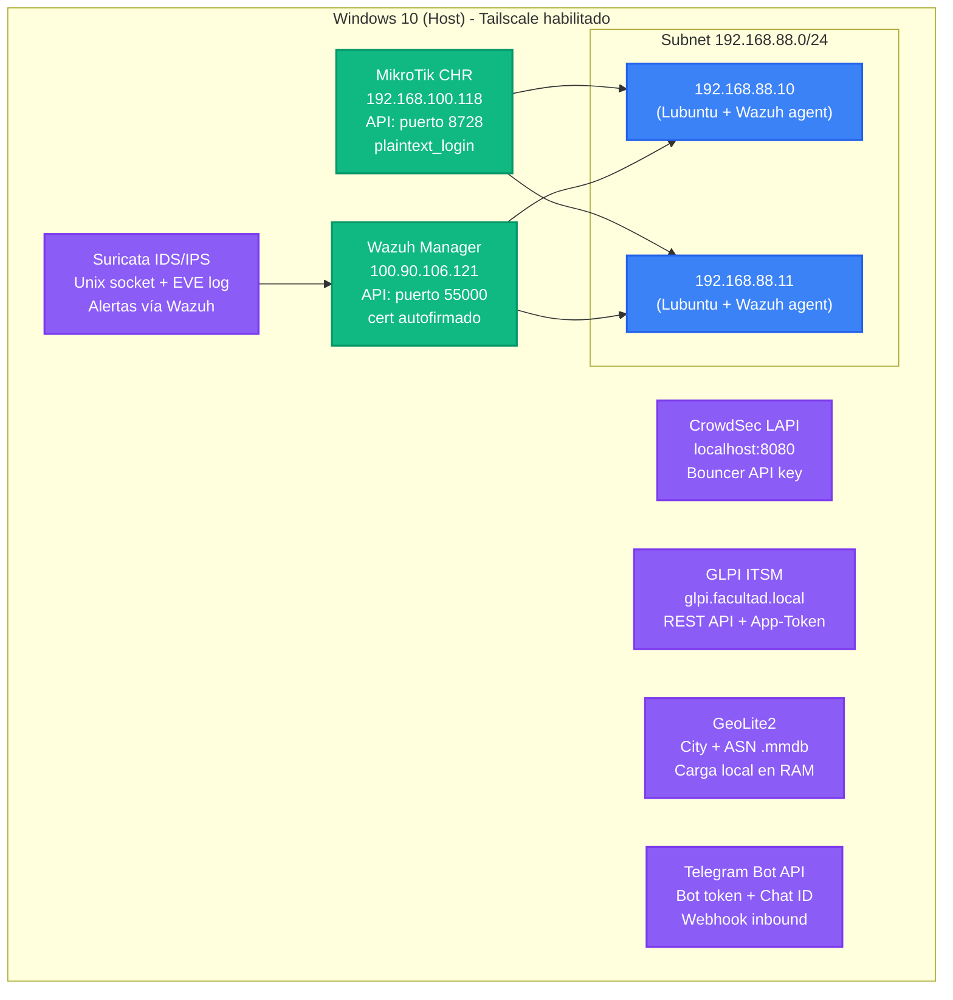
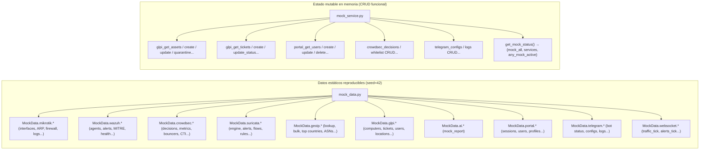

# NetShield Dashboard

## ¿Qué es este proyecto?

NetShield Dashboard es una plataforma web de monitoreo y control de seguridad de red. Integra un router MikroTik CHR (vía API RouterOS), un SIEM Wazuh (vía API REST), un IDS/IPS Suricata, un motor de reputación CrowdSec, un ITSM GLPI, inteligencia GeoIP (MaxMind GeoLite2), notificaciones via Telegram Bot, y generación de reportes con IA (Claude de Anthropic) — todo en un único panel de control con vistas personalizadas y 24+ widgets configurables.

**Fase actual:** Laboratorio de pruebas.
**Objetivo futuro:** Escalar a entornos reales soportando picos de 1000 usuarios concurrentes sin reescribir la arquitectura.

---

## Stack técnico

### Backend (Python 3.12+)
| Paquete | Versión | Propósito |
|---------|---------|-----------|
| FastAPI | 0.115.6 | Framework web async |
| Uvicorn | 0.34.0 | Servidor ASGI |
| Pydantic | 2.10.4 | Validación de datos |
| pydantic-settings | 2.7.1 | Configuración desde `.env` |
| SQLAlchemy | 2.0.36 | ORM async |
| aiosqlite | 0.20.0 | Driver async para SQLite |
| routeros-api | 0.17.0 | Cliente API MikroTik |
| httpx | 0.28.1 | Cliente HTTP async para Wazuh, CrowdSec, GLPI |
| anthropic | 0.42.0 | SDK de Claude para reportes con IA |
| weasyprint | 63.1 | Generación de PDF |
| Jinja2 | 3.1.5 | Plantillas HTML para PDF |
| structlog | 24.4.0 | Logging estructurado |
| tenacity | 9.0.0 | Reintentos con backoff exponencial |
| geoip2 | 4.8.1 | Lectura de bases de datos MaxMind GeoLite2 (.mmdb) |
| cachetools | 5.5.0 | TTLCache para GeoIP lookups |
| python-telegram-bot | 21.9 | Bot de Telegram bidireccional |
| apscheduler | 3.10.4 | Scheduler para reportes automáticos vía Telegram |
| redis | 5.2.1 | Cache (opcional, no implementado aún) |

### Frontend
| Paquete | Versión | Propósito |
|---------|---------|-----------|
| React | 19.2.4 | UI framework |
| Vite | 8.0.1 | Bundler y dev server |
| TypeScript | 5.9.3 | Tipado estático |
| TailwindCSS | 4.2.2 | Estilos (vía plugin Vite `@tailwindcss/vite`) |
| TanStack Query | 5.96.0 | Fetching, cache y sincronización de datos |
| Recharts | 3.8.1 | Gráficos de tráfico |
| TipTap | 3.22.0 | Editor de texto enriquecido para reportes |
| React Router DOM | 7.13.2 | Enrutamiento SPA |
| Axios | 1.14.0 | Cliente HTTP |
| Lucide React | 1.7.0 | Iconografía |

---

## Infraestructura del laboratorio



- **Acceso remoto:** Tailscale (red 100.x.x.x con subnet routing)
- **MikroTik API:** Puerto 8728, login plaintext (solo lab)
- **Wazuh API:** Puerto 55000, HTTPS con `verify=False` (cert autofirmado, solo lab)
- **CrowdSec LAPI:** Puerto 8080, API key de bouncer
- **Suricata:** Unix socket para control del motor, alertas indexadas en Wazuh
- **GLPI:** REST API con doble token (App-Token + Session-Token)
- **GeoIP:** Bases de datos MaxMind cargadas localmente, sin conexión externa
- **Telegram:** Webhook inbound + Bot API para outbound

---

## Cómo correr el proyecto

### Backend
```bash
cd backend

# Crear entorno virtual (usando uv, ya instalado en el sistema)
~/.local/bin/uv venv
source .venv/bin/activate
~/.local/bin/uv pip install -r requirements.txt

# Configurar variables (editar .env con credenciales reales)
cp .env.example .env
nano .env

# Ejecutar
python main.py
# → http://localhost:8000
# → Swagger UI: http://localhost:8000/docs (solo en development)
```

### Frontend
```bash
cd frontend
npm install
npm run dev
# → http://localhost:5173 (proxy automático a backend en :8000)
```

### Nota sobre proxy
El proxy de Vite (`vite.config.ts`) redirige automáticamente:
- `/api/*` → `http://localhost:8000`
- `/ws/*` → `ws://localhost:8000`

No se necesita configurar CORS manualmente para desarrollo local.

---

## Convenciones de código

### Backend
- **Respuesta consistente:** Todo endpoint devuelve `{"success": bool, "data": ..., "error": null | "mensaje"}`
- **Un router por dominio:** `routers/mikrotik.py`, `routers/wazuh.py`, `routers/crowdsec.py`, `routers/suricata.py`, `routers/geoip.py`, `routers/glpi.py`, `routers/portal.py`, `routers/reports.py`, `routers/network.py`, `routers/security.py`, `routers/phishing.py`, `routers/views.py`, `routers/widgets.py`, `routers/vlans.py`, `routers/cli.py`
- **Servicios como singletons:** Todos los servicios de conexión externa usan patrón singleton vía variable de módulo + `get_X_service()`
- **Async everywhere:** Todo es async. Las librerías síncronas (routeros-api, WeasyPrint) se ejecutan en `run_in_executor`
- **Logging:** `structlog` con formato console en dev, JSON en producción
- **Errores:** Try/except en cada endpoint, nunca propagar excepciones sin envolver en `APIResponse.fail()`
- **Nombres de archivos:** snake_case para todo
- **Credenciales:** Jamás hardcodeadas. Todo vía `config.py` → `.env`

### Frontend
- **Componentes:** PascalCase, un archivo por componente, agrupados por dominio (`dashboard/`, `firewall/`, `crowdsec/`, `suricata/`, `security/`, `inventory/`, `portal/`, `reports/`, `views/`, `widgets/`, etc.)
- **Hooks:** Prefijo `use`, un hook por fuente de datos, en `src/hooks/`
- **Widget hooks:** Organizados en subcarpetas `src/hooks/widgets/visual/`, `technical/`, `hybrid/`
- **Servicios API:** Centralizados en `src/services/api.ts` — nunca hacer fetch directo en componentes ni hooks
- **Tipos:** Todos en `src/types.ts`, espejo de los schemas Pydantic del backend
- **Estilos:** TailwindCSS v4 con tokens personalizados (colores `brand-*`, `surface-*`, `severity-*`) definidos en `index.css` vía `@theme`
- **Clases CSS reutilizables:** `glass-card`, `stat-card`, `badge-*`, `btn-*`, `data-table`, `input` definidas en `index.css`
- **Data fetching:** TanStack Query con `queryKey` descriptivos y `refetchInterval` para polling

---

## Estado actual

### Backend
- [x] `config.py` — Configuración con pydantic-settings, 8 flags mock granulares + `MOCK_ALL`
- [x] `database.py` — SQLAlchemy async con SQLite (PostgreSQL-ready)
- [x] Modelos: `IPLabel`, `IPGroup`, `IPGroupMember`, `ActionLog`, `SinkholeEntry`, `PortalUserRegistry`, `QuarantineLog`, `TelegramReportConfig`, `TelegramMessageLog`, `TelegramPendingMessage`, `CustomView`
- [x] Schemas Pydantic v2 para todos los endpoints (16 archivos de schemas)
- [x] `mikrotik_service.py` — Singleton, reconexión, tráfico en tiempo real, VLANs, Hotspot API
- [x] `wazuh_service.py` — JWT auth, refresh automático, alertas con enriquecimiento GeoIP
- [x] `crowdsec_service.py` — Bouncer LAPI, decisiones, CTI lookup, sincronización a MikroTik
- [x] `suricata_service.py` — Dual canal (Unix socket + Wazuh), IDS/IPS/NSM, auto-response coordinado
- [x] `geoip_service.py` — MaxMind GeoLite2, TTLCache 10K entradas, lookup + bulk + top countries
- [x] `glpi_service.py` — Inventario GLPI, tickets, cuarentena, correlación Wazuh
- [x] `portal_service.py` — Portal Cautivo MikroTik Hotspot, sesiones, perfiles, horarios
- [x] `ai_service.py` — Claude function calling con 8 tools para datos en vivo
- [x] `pdf_service.py` — WeasyPrint + Jinja2 con plantilla profesional
- [x] `telegram_service.py` — Bot bidireccional (outbound notificaciones + inbound consultas IA)
- [x] `telegram_scheduler.py` — APScheduler para reportes automáticos según cron
- [x] `auth_provider.py` — Autenticación de usuarios hotspot contra MikroTik
- [x] `mock_data.py` — Repositorio centralizado de datos simulados (MikroTik, Wazuh, CrowdSec, Suricata, GeoIP, GLPI, Portal, Telegram, IA)
- [x] `mock_service.py` — Facade con estado en memoria para CRUD en modo mock
- [x] **Mock guards** en todos los servicios (8 servicios: mikrotik, wazuh, crowdsec, suricata, geoip, glpi, anthropic, telegram)
- [x] Router MikroTik (12 endpoints)
- [x] Router Wazuh (9 endpoints)
- [x] Router CrowdSec (16 endpoints: decisions, CTI, sync, whitelist, remediación)
- [x] Router Suricata (21 endpoints: motor, alertas, flujos NSM, reglas, auto-response)
- [x] Router GeoIP (8 endpoints: lookup, bulk, top countries, sugerencias geo-block)
- [x] Router GLPI (20 endpoints: assets CRUD, tickets, users, locations, cuarentena)
- [x] Router Portal Cautivo (18 endpoints: setup, sessions, users CRUD, profiles, config)
- [x] Router Reports + Telegram (3 endpoints reportes + 14 endpoints Telegram)
- [x] Router Network (8 endpoints: labels CRUD, groups CRUD, búsqueda global)
- [x] Router Security (4 endpoints: block-ip, auto-block, quarantine, geo-block)
- [x] Router VLANs (5 endpoints: CRUD + tráfico)
- [x] Router Views (6 endpoints: CRUD vistas + catálogo widgets)
- [x] Router Widgets (8 endpoints: threat-level, heatmap, correlation, threats, lifecycle, world-map, report)
- [x] Router CLI (2 endpoints: mikrotik, wazuh-agent)
- [x] Router Phishing (10 endpoints: sinkhole, alertas, víctimas)
- [x] WebSocket `/ws/traffic`, `/ws/alerts`, `/ws/vlans/traffic`, `/ws/security/alerts`, `/ws/portal/sessions`, `/ws/crowdsec/decisions`, `/ws/suricata/alerts`
- [x] `GET /api/system/mock-status` — Estado actual de mocks por servicio
- [x] Endpoint `/api/health` y `/api/actions/history`
- [x] Plantilla PDF (`templates/report_base.html`)
- [x] Scripts: `download_geoip.py`, `setup_hotspot.py`
- [ ] Cache Redis para métricas de tiempo real
- [ ] Tests unitarios y de integración
- [ ] Autenticación de usuarios (JWT/sesiones)
- [ ] Rate limiting en endpoints
- [ ] Validación de permisos por rol

### Frontend
- [x] Layout con sidebar glassmorphic 7 grupos, topbar con status dots, notificaciones
- [x] **Seguridad (QuickView):** Vista principal unificada — stat cards, tráfico, alertas, conexiones
- [x] **Seguridad (ConfigView):** Blacklist CRUD, sliders umbrales, geo-block, sinkhole
- [x] **Panel Notificaciones:** Alertas en tiempo real multi-fuente via WebSocket
- [x] Panel Firewall: formulario de bloqueo, tabla de reglas, historial de acciones
- [x] Panel Red & IPs: tabla ARP, etiquetas CRUD, grupos CRUD, búsqueda global, VLANs integradas
- [x] Panel VLANs: CRUD de VLANs, tráfico por VLAN en tiempo real
- [x] Panel Reportes + Telegram: generador IA con TipTap, PDF; bot status, configs automáticas, historial, chat
- [x] **Panel CrowdSec:** CommandCenter, IntelligenceView, ConfigView (decisiones, CTI, sync, whitelist, top attackers)
- [x] **Panel Suricata:** Motor, Alertas, NSM (flows/DNS/HTTP/TLS), Reglas, Auto-Response
- [x] **Panel GeoIP:** CountryFlag, NetworkTypeBadge, TopCountriesWidget, GeoBlockSuggestions
- [x] **Panel Inventory (GLPI):** Assets CRUD, tickets kanban, health, users, locations, QR scanner
- [x] **Panel Portal Cautivo:** Sesiones en tiempo real, usuarios CRUD, perfiles, horarios, heatmap
- [x] Panel Phishing: alertas, víctimas, sinkhole de dominios
- [x] **Panel System Health:** MikroTik + Wazuh + CrowdSec sync + GeoIP DB status + Remote CLI
- [x] **Vistas Personalizadas:** ViewsList, ViewBuilder (grid + catálogo tabulado), ViewDetail, WidgetRenderer
- [x] **24+ Widgets:** 7 visuales, 8 técnicos, 9 híbridos — con hooks dedicados en `hooks/widgets/`
- [x] **Sistema de temas:** 6+ temas con tokens CSS, toggle en SettingsDrawer
- [x] **GlobalSearch:** Búsqueda global de IPs en ARP + etiquetas + grupos
- [x] **MockModeBadge** — Badge amarillo en topbar cuando servicios están en mock
- [x] WebSocket hooks con reconexión automática y backoff exponencial
- [x] Diseño dark mode premium con animaciones y glassmorphism
- [x] `ConfirmModal` reutilizable para acciones destructivas
- [ ] Responsive optimizado para móviles (funcional pero no refinado)
- [ ] Autenticación de usuario en frontend

### Testing / Colección Postman
- [x] **`postman/NetShield.postman_collection.json`** — 104 requests, 11 módulos
- [x] **`postman/env_local_mock.postman_environment.json`** — `localhost:8000`, `MOCK_ALL=true`
- [x] **`postman/env_local_real.postman_environment.json`** — `localhost:8000`, servicios reales
- [x] **`postman/env_lab.postman_environment.json`** — `192.168.100.115:8000`, lab remoto

---

## Sistema de Mock Data

> Permite correr el backend **sin infraestructura externa** (MikroTik, Wazuh, CrowdSec, Suricata, GeoIP, GLPI, Anthropic, Telegram).

### Variables de entorno

| Variable | Efecto |
|----------|--------|
| `MOCK_ALL=true` | Activa mock en todos los servicios |
| `MOCK_MIKROTIK=true` | Solo MikroTik en mock |
| `MOCK_WAZUH=true` | Solo Wazuh en mock |
| `MOCK_GLPI=true` | Solo GLPI en mock |
| `MOCK_ANTHROPIC=true` | Solo Anthropic/IA en mock |
| `MOCK_CROWDSEC=true` | Solo CrowdSec en mock |
| `MOCK_GEOIP=true` | Solo GeoIP en mock (default: `true`) |
| `MOCK_SURICATA=true` | Solo Suricata en mock (default: `true`) |
| `MOCK_TELEGRAM=true` | Solo Telegram en mock (default: `true`) |

> **Retrocompatibilidad:** `APP_ENV=lab` sigue funcionando como alias de `MOCK_ALL=true`.

### Iniciar en modo mock completo
```bash
cd backend
MOCK_ALL=true uvicorn main:app --reload
# → http://localhost:8000
# → GET /api/system/mock-status para ver estado de mocks
```

### Modo híbrido (ejemplo: MikroTik real, resto mock)
```bash
MOCK_WAZUH=true MOCK_GLPI=true MOCK_ANTHROPIC=true MOCK_CROWDSEC=true MOCK_SURICATA=true MOCK_GEOIP=true MOCK_TELEGRAM=true uvicorn main:app --reload
```

### Arquitectura del sistema de mock



### Entidades coherentes entre servicios

Las entidades mock son consistentes entre MikroTik, Wazuh y GLPI:

| IP | MikroTik ARP | Wazuh Agent | GLPI Asset |
|----|-------------|-------------|-----------|
| `192.168.88.10` | `lubuntu_desk_1` | agente `004` | `PC-Lab-01` |
| `192.168.88.11` | `lubuntu_desk_2` | agente `005` | `PC-Lab-02` |
| `192.168.88.50` | `wazuh-server` | agente `000` | `Server-Wazuh` |
| `203.0.113.45` | — | Atacante brute-force | — |

### Frontend: MockModeBadge

Cuando `any_mock_active = true`, aparece un badge amarillo en el topbar:
- **`MOCK ALL`** si todos los servicios están simulados
- **`MOCK: MIKROTIK · WAZUH`** si solo algunos están simulados
- Polling cada 30 s a `GET /api/system/mock-status`

---

## Decisiones de arquitectura

### ¿Por qué singleton para MikroTik?
RouterOS tiene un límite bajo de sesiones API concurrentes. Un singleton con `asyncio.Lock` garantiza una sola conexión persistente compartida entre todos los requests. La reconexión es automática si la conexión se cae.

### ¿Por qué `run_in_executor` para routeros-api?
La librería `routeros-api` es 100% síncrona y bloquea el event loop. Se ejecuta en el thread pool default del executor para no bloquear el servidor async.

### ¿Por qué httpx en vez de requests para Wazuh?
`httpx` soporta async nativo, lo que es consistente con la arquitectura async de FastAPI. Además soporta HTTP/2 si se necesita en el futuro.

### ¿Por qué SQLite y no PostgreSQL?
Para el laboratorio, SQLite elimina la dependencia de un servidor de base de datos adicional. La arquitectura está preparada para migrar: solo se cambia `DATABASE_URL` en `.env` a un string de PostgreSQL (`postgresql+asyncpg://...`) y se instala `asyncpg`.

### ¿Por qué function calling en la IA?
Claude puede decidir qué datos necesita fetch en runtime según lo que el usuario pidió en su prompt. Esto evita enviar datos innecesarios y permite reportes más inteligentes que correlacionan múltiples fuentes. Actualmente hay 8 tools disponibles (Wazuh, MikroTik, CrowdSec, Suricata, GLPI, GeoIP).

### ¿Por qué TailwindCSS v4 con `@theme` en vez de tailwind.config.js?
TailwindCSS v4 usa CSS nativo para configuración de tokens. No hay archivo `tailwind.config.js`. Los tokens se definen con `@theme` en `index.css` y se integra via el plugin Vite `@tailwindcss/vite`.

### ¿Por qué TipTap y no otro editor?
TipTap es el editor más flexible para React, permite extensiones custom, y genera HTML limpio que WeasyPrint puede renderizar directamente a PDF sin conversiones intermedias.

### ¿Por qué mock guards en cada servicio y no en los routers?
Los guards en los servicios permiten reusar la misma lógica de mock desde los WebSockets (que no pasan por los routers). Si estuvieran solo en los routers, los WS seguirían intentando conectarse a sistemas externos incluso en modo mock.

### ¿Por qué CrowdSec se sincroniza a MikroTik?
CrowdSec detecta amenazas y toma decisiones de bloqueo en su LAPI. La sincronización traduce esas decisiones a reglas drop en el firewall MikroTik, cerrando el ciclo detección → bloqueo en la capa de red.

### ¿Por qué Suricata usa Wazuh como intermediario de alertas?
Suricata escribe alertas en `eve.json` (log local). Wazuh tiene un decoder nativo para Suricata y las indexa como alertas con metadata enriquecida. El backend consulta alertas Suricata vía la API de Wazuh en lugar de parsear el JSON directamente, reutilizando la infraestructura existente.

### ¿Por qué GeoIP local y no una API externa?
Una API externa agregaría latencia a cada lookup y dependencia de conectividad. MaxMind GeoLite2 permite hacer lookups en microsegundos contra bases de datos locales (.mmdb) cargadas en RAM con TTLCache.

### ¿Por qué vistas personalizadas con widgets?
El dashboard estático no cubre todos los perfiles de usuario. Las vistas personalizadas permiten al usuario crear dashboards a medida arrastrando widgets de un catálogo tabulado (Standard/Visual/Technical/Hybrid), guardando la configuración en SQLite.

### ¿Por qué Telegram bidireccional?
Outbound (notificaciones) cubre el caso de alertas proactivas. Inbound (consultas al bot) permite que operadores hagan preguntas en lenguaje natural desde el móvil, respondidas por Claude con datos en vivo del sistema.
