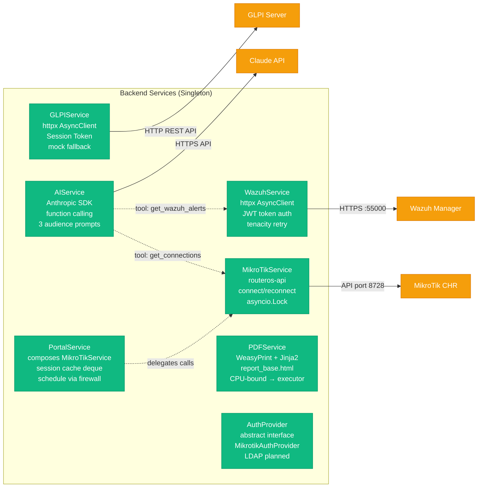
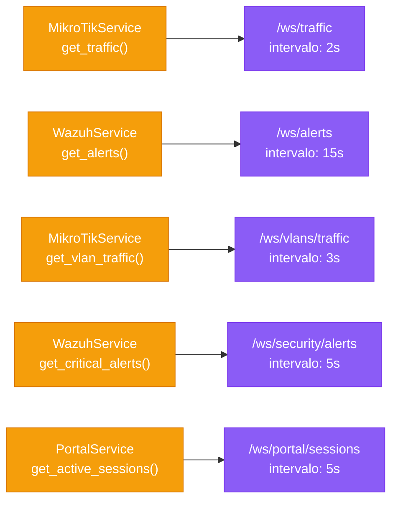
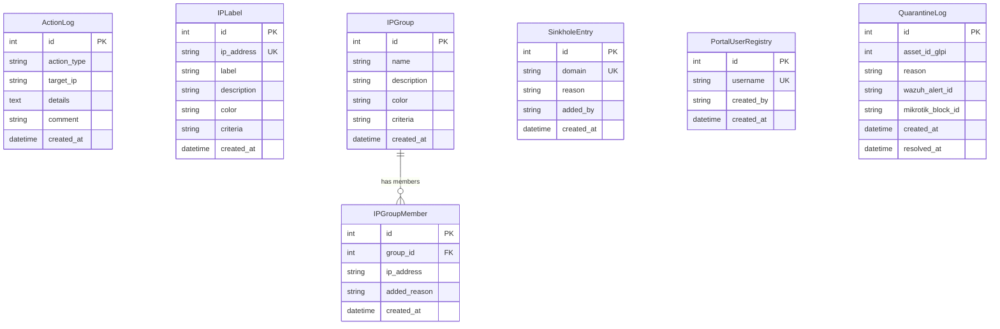

# NetShield Dashboard — Arquitectura Detallada

> Diagrama de componentes interno: cada servicio, router, modelo, hook y componente.

## 1. Backend — Servicios y conexiones externas

## 2. Backend — Routers y sus dependencias

```mermaid
graph TB
  classDef router fill:#3B82F6,color:#fff,stroke:#2563EB
  classDef service fill:#10B981,color:#fff,stroke:#059669
  classDef model fill:#EF4444,color:#fff,stroke:#DC2626

  subgraph Routers ["10 API Routers (prefix)"]
    R_MT["/api/mikrotik<br/>10 endpoints"]:::router
    R_WZ["/api/wazuh<br/>8 endpoints"]:::router
    R_NET["/api/network<br/>8 endpoints"]:::router
    R_SEC["/api/security<br/>4 endpoints"]:::router
    R_PH["/api/phishing<br/>9 endpoints"]:::router
    R_VLAN["/api/mikrotik/vlans<br/>7 endpoints"]:::router
    R_RPT["/api/reports<br/>3 endpoints"]:::router
    R_CLI["/api/cli<br/>2 endpoints"]:::router
    R_POR["/api/portal<br/>17 endpoints"]:::router
    R_GLPI["/api/glpi<br/>18 endpoints"]:::router
  end

  subgraph Services
    S_MT["MikroTikService"]:::service
    S_WZ["WazuhService"]:::service
    S_GL["GLPIService"]:::service
    S_AI["AIService<br/>+ PDFService"]:::service
    S_PT["PortalService"]:::service
  end

  subgraph Models ["DB Models (SQLite)"]
    M_AL["ActionLog"]:::model
    M_IL["IPLabel"]:::model
    M_IG["IPGroup<br/>IPGroupMember"]:::model
    M_SH["SinkholeEntry"]:::model
    M_PR["PortalUserRegistry"]:::model
    M_QL["QuarantineLog"]:::model
  end

  R_MT --> S_MT
  R_MT --> M_AL
  R_WZ --> S_WZ
  R_WZ --> M_AL
  R_NET --> M_IL
  R_NET --> M_IG
  R_NET --> S_MT
  R_NET --> S_WZ
  R_NET --> S_GL
  R_SEC --> S_MT
  R_SEC --> S_WZ
  R_SEC --> M_AL
  R_PH --> S_MT
  R_PH --> S_WZ
  R_PH --> M_AL
  R_PH --> M_SH
  R_VLAN --> S_MT
  R_VLAN --> S_WZ
  R_RPT --> S_AI
  R_RPT --> M_AL
  R_CLI --> S_MT
  R_CLI --> S_WZ
  R_POR --> S_PT
  R_POR --> M_AL
  R_GLPI --> S_GL
  R_GLPI --> S_MT
  R_GLPI --> S_WZ
  R_GLPI --> M_AL
  R_GLPI --> M_QL
```

## 3. Backend — WebSocket channels

## 4. Frontend — Componentes por ruta

```mermaid
graph TB
  classDef page fill:#3B82F6,color:#fff,stroke:#2563EB
  classDef component fill:#06B6D4,color:#fff,stroke:#0891B2
  classDef hook fill:#EC4899,color:#fff,stroke:#DB2777

  subgraph Security ["/ Seguridad"]
    QV["QuickView /"]:::page
    CV["ConfigView /security/config"]:::page
    QV_C1["LastIncidentCard"]:::component
    QV_C2["NotificationPanel"]:::component
  end

  subgraph Infra ["Infraestructura"]
    NP["NetworkPage /network"]:::page
    FP["FirewallPage /firewall"]:::page
    PP["PortalPage /portal"]:::page
    PP_MON["MonitorView"]:::component
    PP_USR["UsersView + UserTable"]:::component
    PP_STAT["StatsView + UsageHeatmap"]:::component
    PP_CFG["ConfigView + ScheduleConfig"]:::component
    PP_SP["SpeedProfiles"]:::component
  end

  subgraph Tools ["Herramientas"]
    PH["PhishingPanel /phishing"]:::page
    SH["SystemHealth /system"]:::page
    RP["ReportsPage /reports"]:::page
    SH_CLI["RemoteCLI"]:::component
  end

  subgraph Inventory ["Inventario GLPI"]
    INV["InventoryPage /inventory"]:::page
    INV_HV["HealthView"]:::component
    INV_AV["AssetsView + AssetDetail"]:::component
    INV_TV["TicketsView + TicketKanban"]:::component
    INV_UV["UsersView"]:::component
    INV_QR["QrScanner"]:::component
  end

  subgraph Common ["Compartidos"]
    LAYOUT["Layout (sidebar + nav)"]:::component
    SEARCH["GlobalSearch"]:::component
    MODAL["ConfirmModal"]:::component
  end

  subgraph Hooks ["Custom Hooks (18)"]
    H_SEC["useSecurityAlerts<br/>useSecurityActions"]:::hook
    H_WZ["useWazuhSummary"]:::hook
    H_MT["useMikrotikHealth"]:::hook
    H_NET["useNetworkSearch"]:::hook
    H_PH["usePhishing"]:::hook
    H_VLAN["useVlans · useVlanTraffic"]:::hook
    H_WS["useWebSocket"]:::hook
    H_PORT["usePortalSessions<br/>usePortalUsers<br/>usePortalStats<br/>usePortalConfig"]:::hook
    H_GLPI["useGlpiAssets<br/>useGlpiHealth<br/>useGlpiTickets<br/>useGlpiUsers<br/>useQrScanner"]:::hook
  end

  QV --> H_SEC
  QV --> H_WZ
  QV --> H_MT
  CV --> H_SEC
  NP --> H_NET
  NP --> H_VLAN
  NP --> H_WS
  PH --> H_PH
  SH --> H_MT
  SH --> H_WZ
  PP --> H_PORT
  INV --> H_GLPI
```

## 5. Base de datos — Modelos SQLAlchemy

## 6. Stack tecnológico

### Backend
| Componente | Tecnología | Versión / Nota |
|------------|-----------|----------------|
| Framework | FastAPI | async |
| ORM | SQLAlchemy | async + aiosqlite |
| DB | SQLite | `netshield.db` |
| Logging | structlog | JSON structured |
| Retry | tenacity | exponential backoff |
| MikroTik conn | routeros-api | sync → `run_in_executor` |
| Wazuh conn | httpx | async, JWT, `verify=False` |
| GLPI conn | httpx | async, Session Token |
| AI | anthropic | Claude claude-sonnet-4, tool_use |
| PDF | WeasyPrint + Jinja2 | CPU-bound → executor |
| Validation | Pydantic v2 | pydantic-settings |

### Frontend
| Componente | Tecnología |
|------------|-----------|
| Framework | React 19 + TypeScript |
| Bundler | Vite |
| State / Fetch | TanStack Query v5 |
| Routing | react-router-dom v6 |
| Charts | Recharts |
| HTTP Client | Axios |
| CSS | TailwindCSS v4 + custom design system |
| QR Scanning | html5-qrcode |
| Rich text editor | TipTap |
| Icons | lucide-react |

---

Generado el: 2026-04-04T18:25:00-03:00
