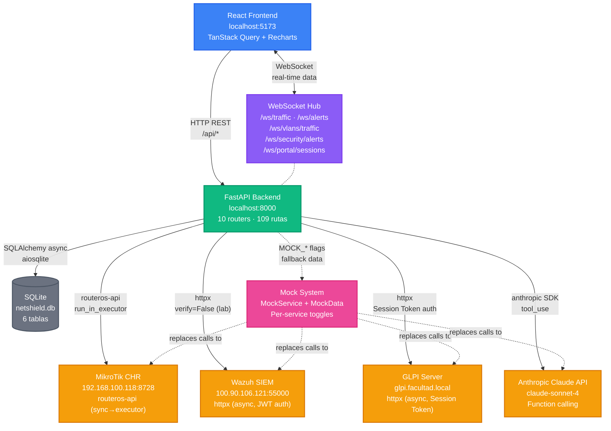

# NetShield Dashboard — Arquitectura General (v2)

> Vista de alto nivel del sistema. Objetivo: entender el flujo completo en 30 segundos.

## Cambios respecto a v1
- Nuevos endpoints agregados: `GET /api/system/mock-status`, `GET /api/actions/history`
- Nuevos componentes agregados: `MockModeBadge` (topbar), `utils/time.ts` (utilidades compartidas)
- Nuevos servicios agregados: `MockService` (facade CRUD en memoria), `MockData` (repositorio central de datos de prueba)
- Endpoints eliminados o modificados: Sin cambios
- Cambios de arquitectura relevantes:
  - Sistema de mock environment-aware con toggles por servicio (`MOCK_ALL`, `MOCK_MIKROTIK`, `MOCK_WAZUH`, `MOCK_GLPI`, `MOCK_ANTHROPIC`)
  - Mock guards en todos los WebSocket channels (traffic, alerts, vlan_traffic, security_alerts, portal_sessions)
  - Mock guards en todos los servicios (MikroTikService, WazuhService, GLPIService, AIService, PortalService)
  - Retrocompatibilidad: `APP_ENV=lab` sin variables `MOCK_*` explícitas activa `MOCK_ALL` automáticamente
  - Variables GLPI (`GLPI_URL`, `GLPI_APP_TOKEN`, `GLPI_USER_TOKEN`, `GLPI_VERIFY_SSL`) y mock mode agregadas a `backend/.env.example`
  - Total de endpoints subió de 86 a 88 (+2 endpoints en `main.py`)
  - Total de servicios subió de 7 a 9 (+MockService, +MockData)
  - Total de componentes TSX subió de 48 a 49 (+MockModeBadge)

## Flujo de datos principal

| Flujo | Descripción |
|-------|-------------|
| `FE → BE → MT` | Gestión de firewall, VLANs, ARP, tráfico, portal cautivo |
| `FE → BE → WZ` | Alertas de seguridad, agentes, MITRE ATT&CK |
| `FE → BE → GL` | Inventario de activos, tickets, ubicaciones |
| `FE → BE → AI → (WZ+MT)` | Reportes IA con function calling (Claude obtiene datos live) |
| `FE ↔ WS ← MT` | Tráfico en tiempo real cada 2s |
| `FE ↔ WS ← WZ` | Alertas de seguridad en tiempo real cada 5-15s |
| `FE ↔ WS ← MT` | Sesiones de portal cautivo cada 5s |
| `BE → DB` | Auditoría (ActionLog), labels, grupos, sinkhole, cuarentena |
| `BE → MOCK` | Datos simulados cuando `MOCK_*` flags están activos (reemplaza MT/WZ/GL/AI) |
| `FE → BE → /api/system/mock-status` | Frontend consulta qué servicios están en mock (MockModeBadge) |
| `FE → BE → /api/actions/history` | Trail de auditoría global de todas las acciones |

---

Generado el: 2026-04-05T10:59:00-03:00
Versión anterior: docs/architecture-overview.md
Archivos analizados: `backend/main.py`, `backend/routers/*.py` (10), `backend/services/*.py` (9), `backend/models/*.py` (6), `backend/config.py`, `frontend/src/App.tsx`, `frontend/src/components/**/*.tsx` (49), `frontend/src/hooks/*.ts` (18), `frontend/src/services/api.ts`, `frontend/src/types.ts`, `frontend/src/components/utils/time.ts`, `backend/.env.example`, `.env.example`
