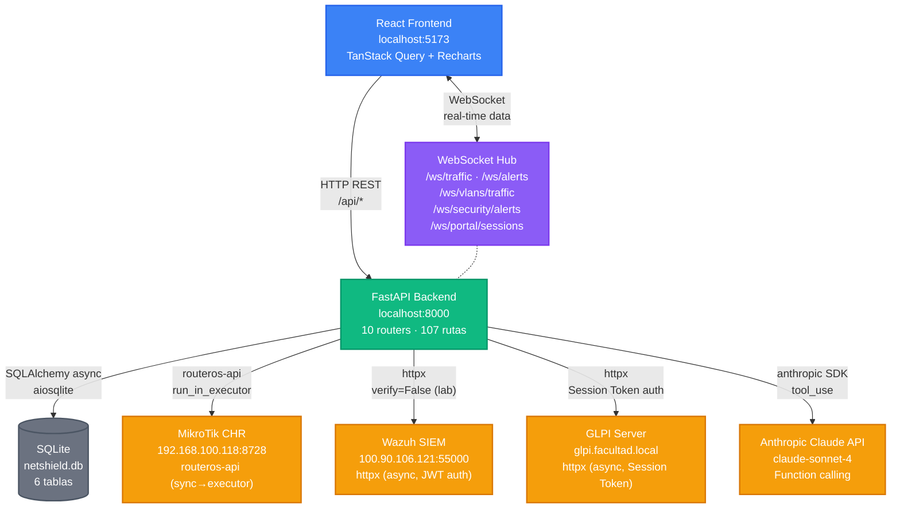

# NetShield Dashboard — Arquitectura General

> Vista de alto nivel del sistema. Objetivo: entender el flujo completo en 30 segundos.

## Flujo de datos principal

| Flujo | Descripción |
|-------|-------------|
| `FE → BE → MT` | Gestión de firewall, VLANs, ARP, tráfico, portal cautivo |
| `FE → BE → WZ` | Alertas de seguridad, agentes, MITRE ATT&CK |
| `FE → BE → GL` | Inventario de activos, tickets, ubicaciones |
| `FE → BE → AI → (WZ+MT)` | Reportes IA con function calling (Claude obtiene datos live) |
| `FE ↔ WS ← MT` | Tráfico en tiempo real cada 2s |
| `FE ↔ WS ← WZ` | Alertas de seguridad en tiempo real cada 5-15s |
| `FE ↔ WS ← MT` | Sesiones de portal cautivo cada 5s |
| `BE → DB` | Auditoría (ActionLog), labels, grupos, sinkhole, cuarentena |

---

Generado el: 2026-04-04T18:24:00-03:00
Basado en el análisis de: `backend/main.py`, `backend/routers/*.py` (10), `backend/services/*.py` (7), `backend/models/*.py` (6), `backend/config.py`, `frontend/src/App.tsx`, `frontend/src/components/**/*.tsx` (48), `frontend/src/hooks/*.ts` (18), `frontend/src/services/api.ts`, `backend/.env.example`
Versión del proyecto: frontend 0.0.0 / backend 1.0.0
