```mermaid
graph TD
    %% Entry Point
    main["main.py<br/>(FastAPI App + WebSockets)"]

    %% Config y DB (usados por casi todos)
    config["config.py<br/>get_settings()"]
    db["database.py<br/>get_db() · Base · engine"]

    %% Routers
    r_mt["routers/mikrotik.py"]
    r_wz["routers/wazuh.py"]
    r_cs["routers/crowdsec.py"]
    r_sur["routers/suricata.py"]
    r_geo["routers/geoip.py"]
    r_glpi["routers/glpi.py"]
    r_rep["routers/reports.py"]
    r_port["routers/portal.py"]
    r_net["routers/network.py"]
    r_sec["routers/security.py"]
    r_phi["routers/phishing.py"]
    r_view["routers/views.py"]
    r_wgt["routers/widgets.py"]
    r_vlan["routers/vlans.py"]
    r_cli["routers/cli.py"]

    %% Services
    s_mt["services/mikrotik_service.py<br/>MikroTikService"]
    s_wz["services/wazuh_service.py<br/>WazuhService"]
    s_cs["services/crowdsec_service.py<br/>CrowdSecService"]
    s_sur["services/suricata_service.py<br/>SuricataService"]
    s_geo["services/geoip_service.py<br/>GeoIPService"]
    s_glpi["services/glpi_service.py<br/>GLPIService"]
    s_ai["services/ai_service.py<br/>AIService"]
    s_pdf["services/pdf_service.py<br/>PDFService"]
    s_tg["services/telegram_service.py<br/>TelegramService"]
    s_tgsched["services/telegram_scheduler.py<br/>TelegramScheduler"]
    s_port["services/portal_service.py<br/>PortalService"]
    s_mock["services/mock_data.py<br/>MockData"]
    s_mocks["services/mock_service.py<br/>MockService"]
    s_auth["services/auth_provider.py<br/>AuthProvider"]

    %% Models
    m_alog["models/action_log.py<br/>ActionLog"]
    m_view["models/custom_view.py<br/>CustomView"]
    m_tg["models/telegram.py<br/>TelegramReportConfig · TelegramMessageLog"]
    m_qlog["models/quarantine_log.py<br/>QuarantineLog"]
    m_sink["models/sinkhole_entry.py<br/>SinkholeEntry"]
    m_label["models/ip_label.py<br/>IPLabel"]
    m_group["models/ip_group.py<br/>IPGroup · IPGroupMember"]
    m_puser["models/portal_user.py<br/>PortalUserRegistry"]

    %% main.py → routers
    main --> r_mt
    main --> r_wz
    main --> r_cs
    main --> r_sur
    main --> r_geo
    main --> r_glpi
    main --> r_rep
    main --> r_port
    main --> r_net
    main --> r_sec
    main --> r_phi
    main --> r_view
    main --> r_wgt
    main --> r_vlan
    main --> r_cli

    %% main.py → services (WebSockets + lifespan)
    main --> s_mt
    main --> s_wz
    main --> s_cs
    main --> s_sur
    main --> s_geo
    main --> s_tg
    main --> s_tgsched

    %% Config usado por todo
    main --> config
    s_mt --> config
    s_wz --> config
    s_cs --> config
    s_sur --> config
    s_geo --> config
    s_glpi --> config
    s_tg --> config
    s_tgsched --> config
    s_port --> config
    s_mocks --> config

    %% DB usado por routers que persisten datos
    r_mt --> db
    r_wz --> db
    r_cs --> db
    r_sur --> db
    r_geo --> db
    r_glpi --> db
    r_rep --> db
    r_port --> db
    r_net --> db
    r_sec --> db
    r_phi --> db
    r_view --> db
    r_vlan --> db

    %% Routers → Services
    r_mt --> s_mt
    r_wz --> s_wz
    r_cs --> s_cs
    r_cs --> s_mt
    r_cs --> s_wz
    r_sur --> s_sur
    r_geo --> s_geo
    r_glpi --> s_glpi
    r_glpi --> s_mt
    r_glpi --> s_wz
    r_rep --> s_ai
    r_rep --> s_pdf
    r_port --> s_port
    r_sec --> s_mt
    r_sec --> s_wz
    r_phi --> s_mt
    r_phi --> s_wz
    r_view --> db
    r_vlan --> s_mt
    r_vlan --> s_wz
    r_cli --> s_mt
    r_cli --> s_wz

    %% widgets.py → múltiples services (lazy)
    r_wgt --> s_wz
    r_wgt --> s_cs
    r_wgt --> s_sur
    r_wgt --> s_mt
    r_wgt --> s_glpi
    r_wgt --> s_geo
    r_wgt --> s_ai
    r_wgt --> s_pdf
    r_wgt --> s_tg

    %% Routers → Models
    r_mt --> m_alog
    r_wz --> m_alog
    r_cs --> m_alog
    r_sur --> m_alog
    r_geo --> m_alog
    r_glpi --> m_alog
    r_glpi --> m_qlog
    r_rep --> m_alog
    r_rep --> m_tg
    r_port --> m_alog
    r_sec --> m_alog
    r_phi --> m_alog
    r_phi --> m_sink
    r_net --> m_label
    r_net --> m_group
    r_view --> m_view

    %% Cross-service dependencies
    s_wz --> s_geo
    s_cs --> s_geo
    s_cs --> s_mocks
    s_sur --> s_wz
    s_sur --> s_cs
    s_sur --> s_mt
    s_sur --> s_mocks
    s_glpi --> s_mt
    s_glpi --> s_mocks
    s_glpi --> s_mock
    s_ai --> s_mt
    s_ai --> s_wz
    s_ai --> s_cs
    s_ai --> s_sur
    s_tg --> s_mt
    s_tg --> s_wz
    s_tg --> s_cs
    s_tg --> s_sur
    s_tg --> s_ai
    s_tgsched --> s_tg
    s_port --> s_mt
    s_auth --> s_mt

    %% Mock data
    s_mt --> s_mock
    s_wz --> s_mock
    s_cs --> s_mock
    s_sur --> s_mock
    s_geo --> s_mock
    s_glpi --> s_mock
    s_tg --> s_mock
    s_port --> s_mock
    s_ai --> s_mock
    s_mocks --> s_mock
```

```mermaid
graph TD
    %% Entry
    Main["main.tsx"]
    App["App.tsx"]
    Types["types.ts<br/>(source of truth)"]
    API["services/api.ts<br/>(único punto HTTP)"]
    CSS["index.css<br/>(design tokens)"]
    CountryMap["lib/countryCodeMap.ts"]
    Themes["config/themes.ts"]

    %% SPA Shell
    Layout["components/Layout.tsx"]

    %% Pages (un ejemplo por dominio)
    QuickView["components/security/QuickView.tsx"]
    CrowdSec["components/crowdsec/CommandCenter.tsx"]
    Suricata["components/suricata/MotorPage.tsx"]
    Portal["components/portal/PortalPage.tsx"]
    Reports["components/reports/ReportsPage.tsx"]
    Views["components/views/ViewDetailPage.tsx"]

    %% Domain hooks
    useWazuh["hooks/useWazuhSummary.ts"]
    useCS["hooks/useCrowdSecDecisions.ts"]
    useSur["hooks/useSuricataEngine.ts"]
    usePort["hooks/usePortalSessions.ts"]
    useTG["hooks/useTelegramStatus.ts"]
    useView["hooks/useCustomViews.ts"]
    useWS["hooks/useWebSocket.ts"]

    %% Widget hooks
    useActivity["hooks/widgets/visual/index.ts"]
    useTechnical["hooks/widgets/technical/index.ts"]
    useHybrid["hooks/widgets/hybrid/index.ts"]

    %% Widget components
    WidgetRenderer["components/views/WidgetRenderer.tsx"]
    VisualWidgets["components/widgets/visual/*"]
    TechWidgets["components/widgets/technical/*"]
    HybridWidgets["components/widgets/hybrid/*"]
    CommonWidgets["components/widgets/common/index.tsx"]

    %% Shared common components
    ConfirmModal["components/common/ConfirmModal.tsx"]
    GlobalSearch["components/common/GlobalSearch.tsx"]
    MockBadge["components/common/MockModeBadge.tsx"]
    Settings["components/common/SettingsDrawer.tsx"]

    %% GeoIP components
    CountryFlag["components/geoip/CountryFlag.tsx"]
    NetworkBadge["components/geoip/NetworkTypeBadge.tsx"]

    Main --> App
    App --> Layout
    App --> QuickView
    App --> CrowdSec
    App --> Suricata
    App --> Portal
    App --> Reports
    App --> Views

    Layout --> GlobalSearch
    Layout --> MockBadge
    Layout --> Settings
    Settings --> Themes
    GlobalSearch --> useWazuh

    QuickView --> useWazuh
    QuickView --> useCS
    QuickView --> useWS
    QuickView --> ConfirmModal

    CrowdSec --> useCS
    CrowdSec --> CountryFlag
    CrowdSec --> NetworkBadge

    Suricata --> useSur
    Portal --> usePort
    Reports --> useTG
    Views --> useView
    Views --> WidgetRenderer

    WidgetRenderer --> VisualWidgets
    WidgetRenderer --> TechWidgets
    WidgetRenderer --> HybridWidgets

    VisualWidgets --> useActivity
    TechWidgets --> useTechnical
    HybridWidgets --> useHybrid

    VisualWidgets --> CommonWidgets
    TechWidgets --> CommonWidgets
    HybridWidgets --> CommonWidgets

    CountryFlag --> CountryMap

    useWazuh --> API
    useCS --> API
    useSur --> API
    usePort --> API
    useTG --> API
    useView --> API
    useActivity --> API
    useTechnical --> API
    useHybrid --> API

    usePort --> useWS
    useCS --> useWS

    API --> Types
```

# Grafo de Dependencias — Quién llama a quién

> Este documento registra las dependencias entre archivos a nivel de función, clase e import.
> Incluye: backend (routers → services → models/schemas), integraciones cruzadas entre servicios, y la cadena frontend (componentes → hooks → api.ts → types.ts).

---

## Backend — Mapa de dependencias

### Diagrama general (Mermaid)



---

## Backend — Dependencias cruzadas entre servicios

Esta es la sección más crítica: servicios que llaman a otros servicios (no solo a config o mock_data).

### Tabla de dependencias cruzadas

| Servicio (origen) | Llama a | Función/Método | Motivo |
|-------------------|---------|----------------|--------|
| `wazuh_service.py` | `geoip_service.GeoIPService` | `.lookup(ip)` | Enriquece alertas con datos geográficos de `src_ip` |
| `crowdsec_service.py` | `geoip_service.GeoIPService` | `.lookup(ip)` | Enriquece decisions con país/ciudad/tipo de red |
| `crowdsec_service.py` | `mock_service.MockService` | CRUD en memoria | Operaciones de escritura en modo mock (whitelist, decisions manuales) |
| `suricata_service.py` | `wazuh_service.WazuhService` | `.get_alerts(...)` | Obtiene alertas Suricata vía Wazuh (intermediario de datos) |
| `suricata_service.py` | `crowdsec_service.CrowdSecService` | `.get_decisions()` | Correlación: qué IPs de Suricata están baneadas en CrowdSec |
| `suricata_service.py` | `mikrotik_service.MikrotikService` | `.block_ip(ip)` | Auto-response: bloqueo en firewall cuando se dispara el circuito |
| `suricata_service.py` | `mock_service.MockService` | CRUD en memoria | Config y historial de auto-response en mock |
| `glpi_service.py` | `mikrotik_service.MikroTikService` | `.block_ip(ip)` | Cuarentena de activos: bloquea la IP en el firewall |
| `glpi_service.py` | `mock_service.MockService` | CRUD en memoria | CRUD de activos/tickets/usuarios en mock |
| `glpi_service.py` | `mock_data.MockData` | `.glpi.*` | Datos de lectura en mock |
| `portal_service.py` | `mikrotik_service.MikroTikService` | Múltiples métodos | El portal cautivo opera directamente sobre MikroTik Hotspot API |
| `ai_service.py` | `mikrotik_service.MikroTikService` | `.get_interfaces()`, `.get_traffic()` | Tool calling: Claude solicita datos de MikroTik |
| `ai_service.py` | `wazuh_service.WazuhService` | `.get_alerts()`, `.get_agents()` | Tool calling: Claude solicita datos de Wazuh |
| `ai_service.py` | `crowdsec_service.CrowdSecService` | `.get_decisions()` | Tool calling: Claude solicita datos de CrowdSec |
| `ai_service.py` | `suricata_service.SuricataService` | `.get_engine_status()`, `.get_alerts()` | Tool calling: Claude solicita datos de Suricata |
| `telegram_service.py` | `mikrotik_service.MikroTikService` | `.get_health()` | `send_status_summary()` incluye estado de MikroTik |
| `telegram_service.py` | `wazuh_service.WazuhService` | `.get_alerts()`, `.get_agents_summary()` | `send_status_summary()` incluye alertas y estado de agentes |
| `telegram_service.py` | `crowdsec_service.CrowdSecService` | `.get_decisions()` | `send_status_summary()` incluye decisiones activas |
| `telegram_service.py` | `suricata_service.SuricataService` | `.get_engine_status()` | `send_status_summary()` incluye estado del motor |
| `telegram_service.py` | `ai_service.AIService` | `.answer_telegram_query(msg)` | Mensajes inbound del bot se responden via Claude |
| `telegram_scheduler.py` | `telegram_service.TelegramService` | `.send_message()` | Envía reportes según el cron configurado |
| `auth_provider.py` | `mikrotik_service.MikroTikService` | `.verify_credentials()` | Autenticación de usuarios del portal hotspot |

---

## Backend — Dependencias routers → services (detalle)

### `routers/mikrotik.py`
```
→ services.mikrotik_service.MikroTikService  (get_interfaces, block_ip, unblock_ip, etc.)
→ models.action_log.ActionLog                (persiste bloqueos/desbloqueos)
→ schemas.mikrotik.BlockIPRequest            (validación body POST /block)
→ schemas.mikrotik.UnblockIPRequest          (validación body POST /unblock)
→ schemas.common.APIResponse                 (wrapper de todas las respuestas)
→ database.get_db                            (sesión SQLAlchemy)
```

### `routers/wazuh.py`
```
→ services.wazuh_service.WazuhService        (get_alerts, get_agents, get_health, etc.)
→ models.action_log.ActionLog                (persiste active responses)
→ schemas.wazuh.ActiveResponseRequest
→ schemas.common.APIResponse
→ database.get_db
```

### `routers/crowdsec.py`
```
→ services.crowdsec_service.CrowdSecService  (get_decisions, cti_lookup, sync, etc.)
→ services.mikrotik_service.MikroTikService  (sync → block_ip en MikroTik)
→ services.wazuh_service.WazuhService        (correlación en algunos endpoints)
→ models.action_log.ActionLog
→ schemas.crowdsec.ManualDecisionRequest
→ schemas.crowdsec.SyncApplyRequest
→ schemas.common.APIResponse
→ database.get_db
```

### `routers/suricata.py`
```
→ services.suricata_service.SuricataService  (todos los endpoints NSM/IDS/IPS)
→ models.action_log.ActionLog               (persiste triggers de auto-response)
→ schemas.suricata.AutoResponseTriggerRequest
→ schemas.suricata.AlertFilterParams
→ schemas.common.APIResponse
→ database.get_db
```

### `routers/geoip.py`
```
→ services.geoip_service.GeoIPService        (lookup, bulk, top_countries, suggestions)
→ models.action_log.ActionLog               (persiste aplicación de sugerencias)
→ schemas.geoip.*
→ schemas.common.APIResponse
→ config.get_settings                        (para leer settings.should_mock_geoip)
→ database.get_db
```

### `routers/glpi.py`
```
→ services.glpi_service.GLPIService          (assets, tickets, users, quarantine)
→ services.mikrotik_service.MikroTikService  (cuarentena → block_ip)
→ services.wazuh_service.WazuhService        (health → correlación con agentes)
→ models.action_log.ActionLog
→ models.quarantine_log.QuarantineLog
→ schemas.glpi.*
→ schemas.common.APIResponse
→ database.get_db
```

### `routers/reports.py`
```
→ services.ai_service.AIService              (generate_report + answer_telegram_query)
→ services.pdf_service.PDFService            (export_pdf)
→ services.telegram_service.TelegramService  (todos los endpoints /telegram/*)
→ services.telegram_scheduler.TelegramScheduler (sync_jobs, trigger_now)
→ models.action_log.ActionLog
→ models.telegram.TelegramReportConfig
→ models.telegram.TelegramMessageLog
→ schemas.reports.ReportGenerateRequest
→ schemas.telegram.*
→ schemas.common.APIResponse
→ database.get_db
```

### `routers/portal.py`
```
→ services.portal_service.PortalService      (toda la lógica del hotspot)
→ services.portal_service.HotspotNotInitializedError (manejo especial de error)
→ models.action_log.ActionLog
→ schemas.portal.*
→ schemas.common.APIResponse
→ database.get_db
```

### `routers/security.py`
```
→ services.mikrotik_service.MikroTikService  (block_ip, geo_block)
→ services.wazuh_service.WazuhService        (quarantine via active response)
→ models.action_log.ActionLog
→ schemas.security.SecurityBlockIPRequest
→ schemas.security.QuarantineRequest
→ schemas.security.GeoBlockRequest
→ schemas.common.APIResponse
→ database.get_db
```

### `routers/phishing.py`
```
→ services.mikrotik_service.MikroTikService  (sinkhole via static DNS + block_ip)
→ services.wazuh_service.WazuhService        (get_alerts para phishing)
→ models.action_log.ActionLog
→ models.sinkhole_entry.SinkholeEntry
→ schemas.phishing.*
→ schemas.common.APIResponse
→ config.get_settings
→ database.get_db
```

### `routers/network.py`
```
→ models.ip_label.IPLabel
→ models.ip_group.IPGroup
→ models.ip_group.IPGroupMember
→ schemas.network.*
→ schemas.common.APIResponse
→ database.get_db
```
*(router puro de SQLite — no llama a ningún servicio externo)*

### `routers/vlans.py`
```
→ services.mikrotik_service.MikroTikService  (get_vlan_traffic, create_vlan, etc.)
→ services.wazuh_service.WazuhService        (correlación de alertas con subredes VLAN)
→ schemas.vlan.VlanCreate
→ schemas.vlan.VlanUpdate
→ schemas.common.APIResponse
```

### `routers/cli.py`
```
→ services.mikrotik_service.MikroTikService  (run_command)
→ services.wazuh_service.WazuhService        (run_active_response)
→ schemas.security.CLIMikrotikRequest
→ schemas.security.CLIWazuhAgentRequest
→ schemas.common.APIResponse
```

### `routers/views.py`
```
→ models.custom_view.CustomView
→ schemas.views.CustomViewCreate
→ schemas.views.CustomViewUpdate
→ schemas.common.APIResponse
→ database.get_db
```
*(router puro de SQLite)*

### `routers/widgets.py`
```
Lazy imports dentro de cada handler:
→ services.wazuh_service.get_wazuh_service()
→ services.crowdsec_service.get_crowdsec_service()
→ services.suricata_service.get_suricata_service()
→ services.mikrotik_service.get_mikrotik_service()
→ services.glpi_service.GLPIService
→ services.geoip_service.GeoIPService
→ services.ai_service.AIService / collect_view_context
→ services.pdf_service.PDFService
→ services.telegram_service.get_telegram_service()
→ services.mock_data.MockData (en mock mode)
→ schemas.common.APIResponse
```

---

## Backend — Dependencias de servicios sobre `config.py`

Todos los servicios llaman a `get_settings()` para determinar su modo (mock/real) y leer sus credenciales:

```
config.get_settings() → Settings
    ├── .mikrotik_host, .mikrotik_port, .mikrotik_user, .mikrotik_password
    │       → usado por: mikrotik_service, portal_service, auth_provider
    ├── .wazuh_base_url, .wazuh_user, .wazuh_password
    │       → usado por: wazuh_service
    ├── .crowdsec_url, .crowdsec_api_key
    │       → usado por: crowdsec_service
    ├── .glpi_base_url, .glpi_app_token, .glpi_user_token
    │       → usado por: glpi_service
    ├── .anthropic_api_key
    │       → usado por: ai_service
    ├── .telegram_bot_token, .telegram_chat_id, .telegram_admin_ids_list
    │       → usado por: telegram_service, telegram_scheduler
    ├── .geoip_city_db, .geoip_asn_db
    │       → usado por: geoip_service
    ├── .suricata_socket, .suricata_eve_log
    │       → usado por: suricata_service
    └── .should_mock_X (8 propiedades)
            → usado por: todos los servicios + WebSockets de main.py
```

---

## Frontend — Cadena de dependencias

### Diagrama general (Mermaid)



---

## Frontend — Dependencias componente → hook → api.ts (tabla)

### Páginas y sus hooks principales

| Componente (página) | Hooks consumidos | Endpoints API involucrados |
|---------------------|-----------------|---------------------------|
| `security/QuickView.tsx` | `useWazuhSummary`, `useCrowdSecDecisions`, `useWebSocket(/ws/traffic)`, `useWebSocket(/ws/alerts)`, `useSecurityAlerts` | Wazuh alerts+agents, CrowdSec decisions, WebSocket traffic+alerts |
| `security/ConfigView.tsx` | `useSecurityActions`, `useCrowdSecDecisions` | `securityApi.*`, `crowdsecApi.getDecisions()` |
| `security/NotificationPanel.tsx` | `useSecurityAlerts` | WebSocket `/ws/security/alerts` |
| `firewall/FirewallPage.tsx` | `useMikrotikHealth` (indirecto) | `mikrotikApi.getFirewallRules()`, `getBlacklist()`, `blockIp()`, `unblockIp()` |
| `network/NetworkPage.tsx` | `useVlans`, `useVlanTraffic`, `useNetworkSearch` | `vlanApi.*`, `/ws/vlans/traffic`, `networkApi.search()` |
| `portal/PortalPage.tsx` | `usePortalSessions`, `usePortalUsers`, `usePortalConfig`, `usePortalStats` | `portalApi.*`, `/ws/portal/sessions` |
| `phishing/PhishingPanel.tsx` | `usePhishing` | `phishingApi.*` |
| `system/SystemHealth.tsx` | `useMikrotikHealth`, `useWazuhSummary`, `useSyncStatus` | `mikrotikApi.getHealth()`, `wazuhApi.getHealth()`, `crowdsecApi.getSyncStatus()`, `geoipApi.getDbStatus()` |
| `reports/ReportsPage.tsx` | `useTelegramStatus`, `useTelegramConfigs`, `useTelegramLogs` | `reportsApi.*`, `telegramApi.*` |
| `inventory/InventoryPage.tsx` | `useGlpiAssets`, `useGlpiTickets`, `useGlpiUsers`, `useGlpiHealth` | `glpiApi.*` |
| `crowdsec/CommandCenter.tsx` | `useCrowdSecDecisions`, `useCrowdSecMetrics`, `useSyncStatus`, `useWebSocket(/ws/crowdsec/decisions)` | `crowdsecApi.*` |
| `crowdsec/IntelligenceView.tsx` | `useTopCountries`, `useGeoBlockSuggestions` | `geoipApi.getTopCountries()`, `geoipApi.getGeoBlockSuggestions()` |
| `suricata/MotorPage.tsx` | `useSuricataEngine`, `useSuricataAutoResponse` | `suricataApi.getEngineStatus()`, `getEngineStats()`, `getAutoResponse*()` |
| `suricata/AlertsPage.tsx` | `useSuricataAlerts`, `useWebSocket(/ws/suricata/alerts)` | `suricataApi.getAlerts()`, `getAlertsTimeline()`, `getTopSignatures()` |
| `suricata/NSMPage.tsx` | `useSuricataFlows` | `suricataApi.getFlows()`, `getDnsQueries()`, `getHttpTransactions()`, `getTlsHandshakes()` |
| `suricata/RulesPage.tsx` | `useSuricataRules` | `suricataApi.getRules()`, `toggleRule()`, `updateRules()` |
| `views/ViewDetailPage.tsx` | `useCustomViews` + todos los hooks de widgets | `viewsApi.getView(id)` + todos los endpoints de widgets |
| `views/ViewBuilderPage.tsx` | `useCustomViews`, `useWidgetCatalog` | `viewsApi.*`, `viewsApi.getWidgetCatalog()` |

---

## Frontend — Dependencias de hooks sobre `api.ts` (namespaces)

| Hook | Namespace de api.ts | Métodos |
|------|---------------------|---------|
| `useWazuhSummary` | `wazuhApi` | `getAlerts`, `getAgentsSummary`, `getMitreSummary` |
| `useMikrotikHealth` | `mikrotikApi` | `getHealth` |
| `useCrowdSecDecisions` | `crowdsecApi` | `getDecisions`, `deleteDecision`, `addDecision` |
| `useCrowdSecMetrics` | `crowdsecApi` | `getMetrics` |
| `useCrowdSecAlerts` | `crowdsecApi` | `getAlerts` |
| `useGeoIP` | `geoipApi` | `lookup` |
| `useTopCountries` | `geoipApi` | `getTopCountries` |
| `useGeoBlockSuggestions` | `geoipApi` | `getGeoBlockSuggestions`, `applyGeoBlockSuggestion` |
| `useSuricataEngine` | `suricataApi` | `getEngineStatus`, `getEngineStats`, `reloadRules` |
| `useSuricataAlerts` | `suricataApi` | `getAlerts`, `getAlertsTimeline`, `getTopSignatures`, `getAlertCategories` |
| `useSuricataFlows` | `suricataApi` | `getFlows`, `getFlowsStats`, `getDnsQueries`, `getHttpTransactions`, `getTlsHandshakes` |
| `useSuricataRules` | `suricataApi` | `getRules`, `toggleRule`, `updateRules` |
| `useSuricataAutoResponse` | `suricataApi` | `getAutoResponseConfig`, `updateAutoResponseConfig`, `triggerAutoResponse`, `getAutoResponseHistory` |
| `useSuricataCorrelation` | `suricataApi` | `getCrowdsecCorrelation`, `getWazuhCorrelation` |
| `useGlpiAssets` | `glpiApi` | `getAssets`, `getStats`, `getHealth`, `createAsset`, `updateAsset`, `quarantine`, `unquarantine` |
| `useGlpiTickets` | `glpiApi` | `getTickets`, `createTicket`, `updateTicketStatus` |
| `useGlpiUsers` | `glpiApi` | `getUsers` |
| `useGlpiHealth` | `glpiApi` | `getHealth` |
| `usePortalSessions` | `portalApi` | `getSessions`, `getHistory` |
| `usePortalUsers` | `portalApi` | `getUsers`, `createUser`, `updateUser`, `deleteUser`, `bulkImport` |
| `usePortalConfig` | `portalApi` | `getConfig`, `getSchedule`, `getStatus`, `updateConfig`, `updateSchedule`, `setupHotspot` |
| `usePortalStats` | `portalApi` | `getHistory` |
| `usePhishing` | `phishingApi` | `getAlerts`, `getDomains`, `getVictims`, `getStats`, `getSinkhole`, `addSinkhole`, `removeSinkhole`, `simulate` |
| `useSecurityActions` | `securityApi` | `blockIp`, `quarantine`, `geoBlock` |
| `useVlans` | `vlanApi` | `getVlans`, `createVlan`, `updateVlan`, `deleteVlan` |
| `useVlanTraffic` | — | WebSocket `/ws/vlans/traffic` via `useWebSocket` |
| `useIpContext` | `crowdsecApi`, `geoipApi` | `ctiLookup`, `lookup` |
| `useNetworkSearch` | `networkApi` | `search` |
| `useSyncStatus` | `crowdsecApi` | `getSyncStatus` |
| `useCustomViews` | `viewsApi` | `getViews`, `getView`, `createView`, `updateView`, `deleteView` |
| `useWidgetCatalog` | `viewsApi` | `getWidgetCatalog` |
| `useTelegramStatus` | `telegramApi` | `getStatus` |
| `useTelegramConfigs` | `telegramApi` | `getConfigs`, `createConfig`, `updateConfig`, `deleteConfig`, `triggerNow`, `sendTest`, `sendStatusSummary` |
| `useTelegramLogs` | `telegramApi` | `getLogs` |
| `useQrScanner` | — | Estado local, sin API |
| `useTheme` | — | `localStorage` + CSS vars, sin API |
| `widgets/visual/index.ts` | `widgetsApi`, `wazuhApi`, `crowdsecApi`, `suricataApi` | `getThreatLevel`, `getActivityHeatmap`, `getAgentsSummary`, `getMetrics`, `getFlowsStats` |
| `widgets/technical/index.ts` | `suricataApi`, `mikrotikApi`, `crowdsecApi`, `widgetsApi` | `getAlerts`, `getFlows`, `getLogs`, `getFirewallRules`, `getDecisions`, `getCorrelationTimeline`, `/api/actions/history` |
| `widgets/hybrid/index.ts` | `widgetsApi`, `geoipApi`, `crowdsecApi`, `suricataApi`, `glpiApi`, `reportsApi` | `getWorldThreatMap`, `getConfirmedThreats`, `getTopCountries`, `getIncidentLifecycle`, `getSuricataAssetCorrelation`, `generateViewReport` |

---

## Frontend — `types.ts` como nodo hub

Todos los hooks y la mayoría de los componentes importan tipos de `types.ts`. Es el nodo más conectado del grafo:

```
types.ts ← importado por:
    ├── services/api.ts            (tipos de request/response)
    ├── hooks/use*.ts              (todos los hooks tipan sus retornos aquí)
    ├── hooks/widgets/*/index.ts   (tipos de widget data)
    ├── components/**/*.tsx        (props tipadas)
    └── components/views/WidgetRenderer.tsx (WidgetInstance, WidgetCatalogEntry)
```

Grupos de tipos más referenciados:
- `TrafficData` — `api.ts`, `useWebSocket`, `NetworkPulse.tsx`, `TrafficChart.tsx`
- `WazuhAlert` — `api.ts`, `useWazuhSummary`, `AlertsFeed.tsx`, `QuickView.tsx`, `PacketInspector.tsx`
- `CrowdSecDecision` — `api.ts`, `useCrowdSecDecisions`, `DecisionsTable.tsx`, `CrowdSecRaw.tsx`
- `SuricataAlert` — `api.ts`, `useSuricataAlerts`, `AlertsPage.tsx`, `PacketInspector.tsx`
- `GeoIPResult` — `api.ts`, `useGeoIP`, `useIpContext`, `IpProfiler.tsx`, `CountryRadar.tsx`
- `WidgetInstance`, `WidgetCatalogEntry` — `useCustomViews`, `useWidgetCatalog`, `WidgetRenderer.tsx`, `ViewBuilderPage.tsx`

---

## Rutas de datos críticas (end-to-end)

### 🔴 Bloqueo de IP desde QuickView

```
Usuario click "Bloquear" en QuickView
    → ConfirmModal.onConfirm()
    → useSecurityActions.blockIp(ip)
    → securityApi.blockIp({ ip, comment })
    → POST /api/security/block
    → routers/security.py: block()
    → services.mikrotik_service.MikroTikService.block_ip(ip)
        ↳ routeros-api (TCP 8728) [ejecutado en run_in_executor]
    → models.action_log.ActionLog.create()  [SQLite]
    → APIResponse.ok({ result })
    → Frontend invalida query de firewall/blacklist
```

### 🟡 Auto-Response Suricata → CrowdSec + MikroTik

```
POST /api/suricata/autoresponse/trigger
    → routers/suricata.py: trigger_auto_response()
    → services.suricata_service.SuricataService.trigger_auto_response(ip, ...)
        ├── models.action_log.ActionLog.create()  [SQLite]
        ├── if config.actions.crowdsec_ban:
        │       → services.crowdsec_service.CrowdSecService.add_decision(ip, duration)
        │           → POST /v1/decisions (LAPI CrowdSec)
        ├── if config.actions.mikrotik_block:
        │       → services.mikrotik_service.MikroTikService.block_ip(ip)
        │           → routeros-api (TCP 8728)
        └── if telegram_notify:
                → services.telegram_service.TelegramService.send_alert(data)
                    → Bot API send_message
```

### 🟢 Reporte Claude AI vía function calling

```
POST /api/reports/generate { prompt, audience, sources }
    → routers/reports.py: generate_report()
    → services.ai_service.AIService.generate_report(prompt, audience, sources)
        → anthropic.messages.create(model=claude-3-5-sonnet, tools=TOOLS, ...)
        → Claude decide: tool_use("get_wazuh_alerts", {level_min: 10})
        → _execute_tool("get_wazuh_alerts", params)
            → services.wazuh_service.WazuhService.get_alerts(...)
                → GET https://wazuh:55000/alerts + JWT auth
        → Claude decide: tool_use("get_crowdsec_decisions")
        → _execute_tool("get_crowdsec_decisions", {})
            → services.crowdsec_service.CrowdSecService.get_decisions()
                → GET http://crowdsec:8080/v1/decisions + GeoIPService.lookup()
        → Claude genera texto final del reporte
    → APIResponse.ok({ report_html })
    → Frontend muestra en TipTap editor
```

### 🔵 Mensaje inbound Telegram → Claude → respuesta

```
POST /api/reports/telegram/webhook   { update: {message: {text: "¿cuántas alertas hay?"}} }
    → routers/reports.py: webhook() → 200 OK inmediato
    → asyncio.create_task(process_in_background(update))
        → services.telegram_service.TelegramService.process_incoming_message(update)
            → services.ai_service.AIService.answer_telegram_query(message, chat_id)
                → anthropic.messages.create(system=TELEGRAM_SYSTEM_PROMPT, tools=TOOLS)
                → Claude llama tools, obtiene datos en vivo
                → Devuelve respuesta en texto plano
            → telegram_service.send_message(chat_id, respuesta)
                → Bot API sendMessage (con retry ×3 via tenacity)
```

### 🟣 Dato en vivo por WebSocket (tráfico)

```
Browser conecta a ws://localhost:5173/ws/traffic
    (Vite proxy → ws://localhost:8000/ws/traffic)
    → main.py: websocket_traffic()
        → ConnectionManager.connect(websocket)
        → loop cada 2s:
            if should_mock_mikrotik:
                → MockData.websocket.traffic_tick(tick)
            else:
                → MikroTikService.get_traffic()  [run_in_executor]
                → MikroTikService.get_connections()
            → websocket.send_json({"type": "traffic", "data": ...})
    → Frontend (useWebSocket hook):
        → onMessage(data) → setState
        → TrafficChart.tsx re-render con nuevos datos
```
