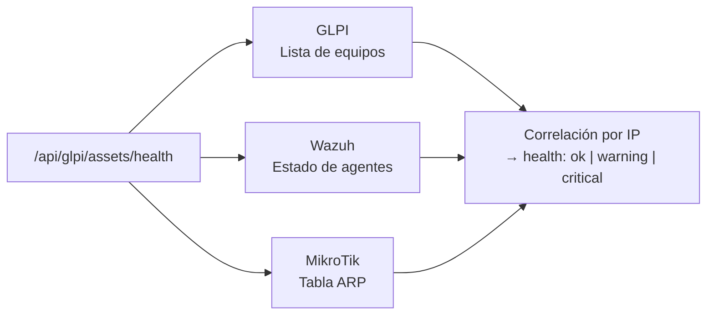
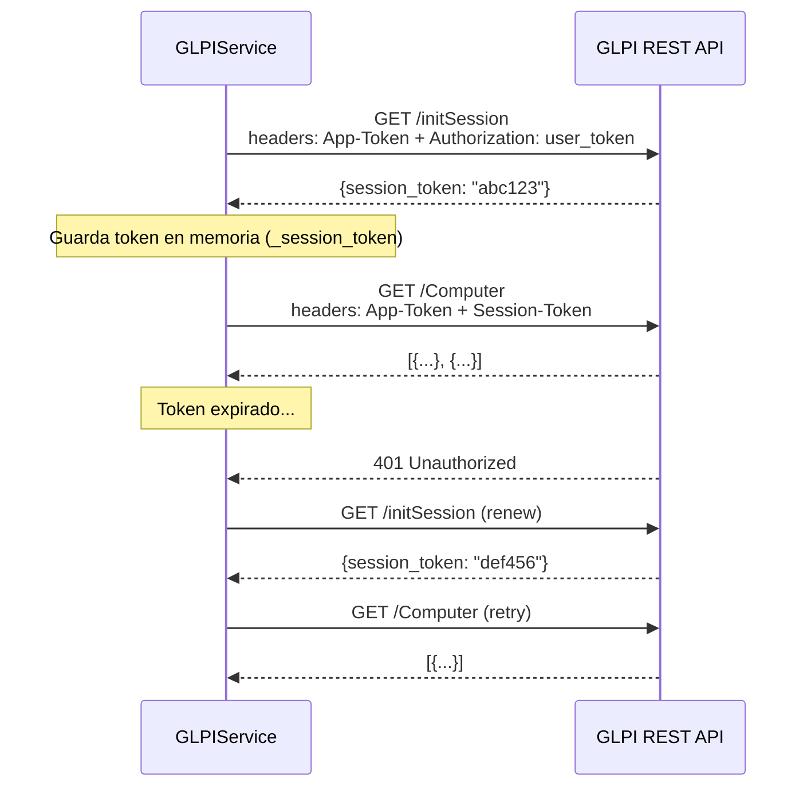
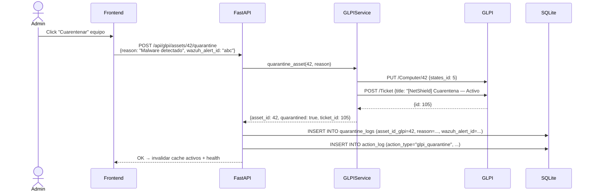
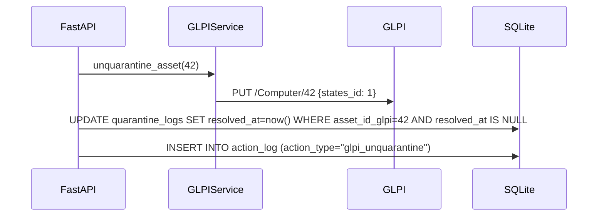
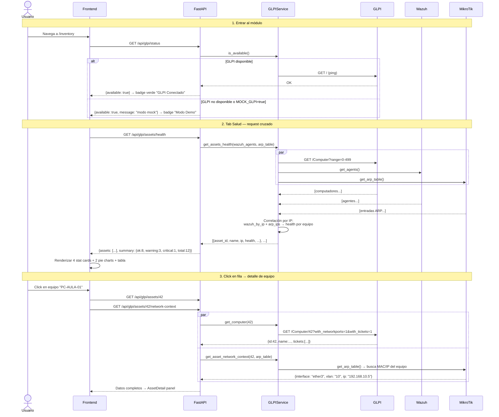
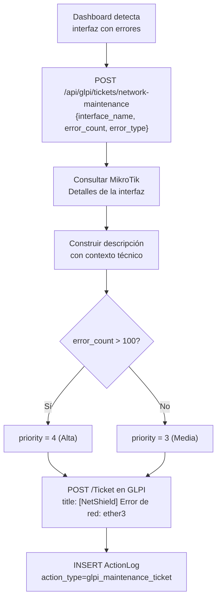

# GLPI — Inventario y Gestión de Activos

## Descripción General

El módulo **GLPI** integra NetShield con el sistema de inventario **GLPI** (Gestionnaire Libre de Parc Informatique) a través de su REST API. Desde la barra lateral del dashboard (ítem "Inventario"), el administrador puede gestionar el parque de equipos, crear tickets de soporte, y ver el estado de salud combinado que cruza datos de GLPI, Wazuh y MikroTik — todo sin salir del dashboard.

> [!IMPORTANT]
> GLPI es un sistema externo. NetShield actúa como **cliente REST** de la API de GLPI (`/apirest.php`). La autenticación usa **Session Token** (App-Token + user_token). Si GLPI no está disponible, el sistema activa automáticamente el **Modo Demo** con datos mock.

---

## Arquitectura General

```mermaid
graph TB
    subgraph Frontend["Frontend (React + TypeScript)"]
        IP["InventoryPage.tsx<br/>4 tabs"]
        HV["HealthView<br/>Salud combinada"]
        AV["AssetsView<br/>Inventario + QR"]
        TV["TicketsView<br/>Kanban + Lista"]
        UV["UsersView<br/>Usuarios y equipos"]
        Hooks["Hooks (5 archivos)<br/>useGlpiAssets<br/>useGlpiTickets<br/>useGlpiHealth<br/>useGlpiUsers"]
        API["api.ts → glpiApi<br/>20 funciones HTTP"]
    end

    subgraph Backend["Backend (FastAPI)"]
        R["routers/glpi.py<br/>20 endpoints"]
        GS["services/glpi_service.py<br/>GLPIService Singleton — 990 líneas"]
        Schemas["schemas/glpi.py<br/>12 schemas Pydantic"]
        QLog["models/quarantine_log.py<br/>QuarantineLog (SQLite)"]
        ALog["models/action_log.py<br/>ActionLog (SQLite)"]
        Wazuh["services/wazuh_service.py"]
        Mikrotik["services/mikrotik_service.py"]
    end

    subgraph External["Sistemas Externos"]
        GLPI["GLPI Server<br/>/apirest.php"]
        WazuhAPI["Wazuh API"]
        MikrotikAPI["MikroTik RouterOS API"]
    end

    IP --> HV & AV & TV & UV
    HV & AV & TV & UV --> Hooks
    Hooks --> API
    API -->|"HTTP REST"| R
    R --> GS
    R --> QLog & ALog
    GS -->|"httpx + Session Token"| GLPI
    GS --> Wazuh & Mikrotik
    Wazuh --> WazuhAPI
    Mikrotik --> MikrotikAPI

    style External fill:#1e293b,stroke:#475569
```



**Integración cruzada** — el endpoint `/assets/health` es el único que consulta las **3 fuentes simultáneamente**:



---

## Backend

### Endpoints REST

Prefijo: `/api/glpi`

| Método | Ruta | Descripción | API GLPI |
|---|---|---|---|
| **Estado** | | | |
| `GET` | `/status` | Verificar disponibilidad de GLPI | `/initSession` ping |
| **Activos** | | | |
| `GET` | `/assets` | Listar equipos (search, status, location) | `GET /Computer` |
| `GET` | `/assets/stats` | Conteo por estado (para pie chart) | `GET /Computer` ×500 |
| `GET` | `/assets/search` | Búsqueda full-text (nombre, serial, IP) | `GET /search/Computer` |
| `GET` | `/assets/health` | Salud combinada GLPI+Wazuh+MikroTik | Multi-source |
| `GET` | `/assets/by-location/{id}` | Equipos de una ubicación física | `GET /Computer` filtrado |
| `GET` | `/assets/{id}` | Detalle completo de un equipo | `GET /Computer/{id}` |
| `GET` | `/assets/{id}/network-context` | Interfaz, VLAN, IP en tiempo real | ARP + GLPI |
| `POST` | `/assets` | Registrar nuevo equipo | `POST /Computer` |
| `PUT` | `/assets/{id}` | Actualizar datos del equipo | `PUT /Computer/{id}` |
| `POST` | `/assets/{id}/quarantine` | Cuarentenar equipo | `PUT` state + `POST /Ticket` |
| `POST` | `/assets/{id}/unquarantine` | Levantar cuarentena | `PUT` state → activo |
| **Tickets** | | | |
| `GET` | `/tickets` | Listar tickets (+ kanban agrupado) | `GET /Ticket` |
| `POST` | `/tickets` | Crear ticket de incidencia | `POST /Ticket` |
| `PUT` | `/tickets/{id}/status` | Actualizar estado (Kanban drag) | `PUT /Ticket/{id}` |
| `POST` | `/tickets/network-maintenance` | Ticket automático de mantenimiento | `POST /Ticket` + MikroTik |
| **Usuarios** | | | |
| `GET` | `/users` | Listar usuarios GLPI | `GET /User` |
| `GET` | `/users/{id}/assets` | Equipos asignados a un usuario | `GET /Computer` filtrado |
| **Ubicaciones** | | | |
| `GET` | `/locations` | Ubicaciones físicas (aulas, labs) | `GET /Location` |

> [!NOTE]
> Todas las acciones de escritura (`POST /assets`, `PUT`, `quarantine`, `unquarantine`, `POST /tickets`) generan entradas en `ActionLog`. Las cuarentenas además crean un registro en `QuarantineLog` con los IDs de alerta Wazuh y bloqueo MikroTik asociados.

### Schemas Pydantic

Archivo: `schemas/glpi.py` (189 líneas, 12 modelos)

**Activos:**

```python
class GlpiAsset:
    id: int
    name: str
    serial: str        # S/N del equipo
    ip: str            # extraído de network ports
    mac: str           # de network ports
    os: str            # sistema operativo
    cpu: str
    ram: str
    location: str      # nombre de ubicación
    location_id: int
    assigned_user: str # técnico responsable
    status: str        # activo | reparacion | retirado | pendiente | bajo_investigacion
    comment: str
    last_update: str

class GlpiAssetCreate:
    name: str           # requerido, max 255
    serial: str | None
    ip: str | None
    mac: str | None
    os: str | None
    location_id: int | None
    assigned_user_id: int | None
    status: str = "activo"
    comment: str | None

class GlpiAssetHealth:
    asset_id: int
    name: str
    ip: str
    glpi_status: str        # estado GLPI
    wazuh_agent: str        # active | disconnected | not_installed
    network_visible: bool   # visible en tabla ARP de MikroTik
    health: str             # ok | warning | critical
    health_reason: str      # descripción del problema
```

**Tickets:**

```python
class GlpiTicket:
    id: int
    title: str
    priority: int          # 1-5
    priority_label: str    # "Muy baja" … "Muy alta"
    status: str            # pendiente | en_progreso | resuelto
    status_id: int         # 1-6 según GLPI
    assigned_user: str
    asset_name: str
    is_netshield: bool     # True si fue creado automáticamente por NetShield

class GlpiTicketCreate:
    title: str             # max 255
    description: str
    priority: int = 3      # 1-5
    asset_id: int | None   # equipo vinculado
    category: str | None   # red | hardware | so | seguridad

class GlpiTicketStatusUpdate:
    status: int            # 1=Nuevo, 2=Asignado, 3=Planif., 4=Pendiente, 5=Resuelto, 6=Cerrado
```

**Cuarentena:**

```python
class GlpiQuarantineRequest:
    reason: str             # max 500 chars, requerido
    wazuh_alert_id: str | None   # ID de la alerta Wazuh origen
    mikrotik_block_id: str | None # ID del bloqueo MikroTik asociado
```

**Otros:** `GlpiLocation`, `GlpiUser`, `GlpiNetworkContext`, `GlpiAvailability`, `NetworkMaintenanceRequest`.

### Servicio — `GLPIService`

Archivo: `services/glpi_service.py` (990 líneas). **Patrón Singleton** — una sola instancia compartida en toda la app.

#### Autenticación por Session Token



- **Retry**: 3 intentos con backoff exponencial para `ConnectError` y `TimeoutException` (via `tenacity`)
- **SSL**: `verify=False` en entorno de laboratorio (configurable via `GLPI_VERIFY_SSL`)
- **Timeout**: 30s general, 10s para conexión inicial

#### Correlación de Salud (3 fuentes)

```python
# get_assets_health() correlates by IP address:

wazuh_by_ip = {agent["ip"]: agent for agent in wazuh_agents}
arp_ips = {entry["ip_address"] for entry in arp_table}

for computer in computers:
    ip = computer["ip"]
    wazuh_agent = "active" | "disconnected" | "not_installed"  # via wazuh_by_ip
    network_visible = ip in arp_ips                            # via MikroTik ARP

    if glpi_status == "activo" and wazuh_agent == "active" and network_visible:
        health = "ok"
    elif wazuh_agent == "disconnected" and not network_visible:
        health = "critical"
    else:
        health = "warning"  # cualquier combinación parcial
```

#### Normalización de Datos GLPI

GLPI retorna estructuras variables (IDs simples o dicts expandidos). `_normalize_computer()` los unifica:

| Campo GLPI | Campo normalizado | Nota |
|---|---|---|
| `states_id` (int o dict) | `status` | Mapeado via `GLPI_STATES` |
| `locations_id` (int o dict) | `location` (str) | Expandido si `expand_dropdowns=1` |
| `users_id_tech` | `assigned_user` | Nombre del técnico |
| `_networkports[*][*].NetworkName.IPAddress[0]` | `ip` | Extrae primera IP de puertos de red |
| `_networkports[*][*].mac` | `mac` | Extrae primera MAC |
| `date_mod` | `last_update` | Última modificación GLPI |

#### Mapeo de Estados GLPI

| ID GLPI | Estado interno | Visualización UI |
|---|---|---|
| 1 | `activo` | 🟢 Activo |
| 2 | `reparacion` | 🟡 Reparación |
| 3 | `retirado` | ⚫ Retirado |
| 4 | `pendiente` | 🔵 Pendiente |
| 5 | `bajo_investigacion` | 🔴 Cuarentena |

### Flujo de Cuarentena



**Levantar cuarentena:**


### Modelos SQLite

**`QuarantineLog`** — Auditoría de cuarentenas

```python
class QuarantineLog(Base):
    __tablename__ = "quarantine_logs"
    id: int                 # PK autoincrement
    asset_id_glpi: int      # ID del equipo en GLPI (indexed)
    reason: str             # Motivo de la cuarentena
    quarantined_at: datetime # Creado automáticamente
    resolved_at: datetime | None  # NULL mientras sigue en cuarentena
    wazuh_alert_id: str | None   # ID de alerta Wazuh origen
    mikrotik_block_id: str | None # ID de bloqueo MikroTik asociado
    created_by: str         # "dashboard_user"
```

---

## Frontend

Ruta: `/inventory` — con 4 tabs internos:

```
/inventory → Tab: Salud | Activos | Tickets | Usuarios
```

### Estructura de Componentes

```
frontend/src/
├── components/inventory/
│   ├── InventoryPage.tsx       ← Página root con 4 tabs + badge conectado/demo
│   ├── HealthView.tsx          ← Tab Salud: stat cards + 2 pie charts + tabla health
│   ├── AssetHealthTable.tsx    ← Tabla per-equipo con health indicators
│   ├── AssetsView.tsx          ← Tab Activos: toolbar + tabla/mapa + panel lateral
│   ├── AssetDetail.tsx         ← Panel lateral: detalle + contexto red + tickets + acciones
│   ├── AssetFormModal.tsx      ← Modal: crear/editar equipo
│   ├── AssetSearch.tsx         ← Input de búsqueda con debounce
│   ├── LocationMap.tsx         ← Vista mapa por ubicación física
│   ├── QrScanner.tsx           ← Escáner QR (cámara) para buscar equipos
│   ├── TicketsView.tsx         ← Tab Tickets: Kanban + Lista + modal crear
│   ├── TicketKanban.tsx        ← Kanban 3 columnas con HTML5 drag-and-drop
│   ├── TicketCard.tsx          ← Card draggable de un ticket
│   ├── TicketFormModal.tsx     ← Modal: crear ticket
│   └── UsersView.tsx           ← Tab Usuarios: lista + panel equipos por usuario
├── hooks/
│   ├── useGlpiAssets.ts        ← 9 queries/mutations de activos
│   ├── useGlpiTickets.ts       ← 3 queries/mutations de tickets
│   ├── useGlpiHealth.ts        ← 1 query health combinada
│   ├── useGlpiUsers.ts         ← 2 queries usuarios y sus activos
│   └── useQrScanner.ts         ← Hook cámara QR
└── services/
    └── api.ts → glpiApi        ← 20 funciones HTTP
```

### Tab 1: Salud (`HealthView`)

Vista de salud combinada que cruza GLPI + Wazuh + MikroTik.

| Elemento | Contenido |
|---|---|
| **4 Stat Cards** | 🟢 Operativos, 🟡 Con Advertencias, 🔴 Críticos, Total Activos |
| **PieChart — Estado de Salud** | Distribución ok/warning/critical (Recharts `PieChart` donut) |
| **PieChart — Estado GLPI** | Distribución activo/reparacion/retirado/pendiente |
| **Tabla por Equipo** | Nombre, IP, Ubicación, Estado GLPI, Agente Wazuh, Visible en Red, Health |

**Indicadores de Health:**

| Condición | Health | Motivo |
|---|---|---|
| GLPI=activo + Wazuh=active + ARP visible | `ok` | — |
| Wazuh=disconnected + no ARP | `critical` | Agente desconectado y sin presencia en red |
| Cualquier otra combinación | `warning` | Muestra los problemas parciales |

### Tab 2: Activos (`AssetsView`)

Inventario completo con búsqueda, filtros, y dos modos de visualización.

| Elemento | Contenido |
|---|---|
| **Búsqueda** | Input live (debounce) — busca por nombre, IP o serial |
| **Filtro de estado** | Selector: Todos / Activo / Reparación / Retirado / Pendiente / Cuarentena |
| **Toggle Vista** | Lista (tabla) ↔ Mapa (por ubicación física) |
| **Botón QR** | Abre `QrScanner` — si detecta un GLPI ID selecciona el equipo, si detecta un serial activa búsqueda |
| **Tabla** | Equipo, Serial, IP, OS, Ubicación, Usuario, Estado (badge de color) |
| **Panel lateral** | Abre `AssetDetail` al hacer click en una fila — co-existe con la tabla |
| **Botón Registrar** | Abre `AssetFormModal` en modo crear |

**`AssetDetail` (panel deslizante):**

| Sección | Contenido |
|---|---|
| **Información General** | Serial, IP, MAC, OS, CPU, RAM, Ubicación, Usuario, Estado GLPI |
| **Contexto de Red** | Interfaz MikroTik, VLAN, IP asignada, Último visto (en vivo vía ARP) |
| **Tickets Vinculados** | Hasta 5 tickets recientes del equipo (badge de estado) |
| **Acciones** | Si `status=bajo_investigacion` → botón "Levantar Cuarentena" + ConfirmModal |

### Tab 3: Tickets (`TicketsView`)

Gestión de tickets con vista Kanban o lista plana.

**Vista Kanban (`TicketKanban`):**
- **3 columnas**: Pendiente | En Progreso | Resuelto
- **Drag-and-drop** nativo HTML5 (`draggable` + `onDrop`)
- Al soltar un card en otra columna → `PUT /tickets/{id}/status` con el ID de estado GLPI correspondiente

| Columna | ID GLPI | Acento |
|---|---|---|
| Pendiente | 1 (Nuevo) | Azul |
| En Progreso | 3 (Planificado) | Naranja |
| Resuelto | 5 | Verde |

**Vista Lista:**
Tabla con: #, Título, Prioridad (dot de color), Estado (badge), Equipo vinculado, Asignado, Fecha creación.

Los tickets creados automáticamente por NetShield se marcan con badge `NS`.

### Tab 4: Usuarios (`UsersView`)

Vista de mapeo **usuario → equipos asignados**.

| Elemento | Contenido |
|---|---|
| **Barra de búsqueda** | Filtra usuarios por nombre (live) |
| **Lista de usuarios** | Avatar con iniciales, nombre, email, departamento |
| **Panel equipos** | Al seleccionar un usuario → aparece tabla con sus equipos asignados (nombre, serial, IP, OS, ubicación, estado) |

### Hooks

#### `useGlpiAssets.ts` — Activos (9 hooks)

```typescript
useGlpiAssets(params?)          // GET /assets, staleTime 30s
useGlpiAsset(id)                // GET /assets/{id}, staleTime 30s
useGlpiAssetSearch(query)       // GET /assets/search, habilitado ≥2 chars
useGlpiAssetStats()             // GET /assets/stats, staleTime 60s
useGlpiAssetNetworkContext(id)  // GET /assets/{id}/network-context, staleTime 20s
useGlpiLocations()              // GET /locations, staleTime 120s
useGlpiAssetsByLocation(locId)  // GET /assets/by-location/{id}, staleTime 30s
useCreateGlpiAsset()            // POST /assets → invalida cache assets
useUpdateGlpiAsset()            // PUT /assets/{id} → invalida cache assets
useQuarantineGlpiAsset()        // POST /assets/{id}/quarantine → invalida assets + health
useUnquarantineGlpiAsset()      // POST /assets/{id}/unquarantine → invalida assets + health
```

#### `useGlpiTickets.ts` — Tickets (3 hooks)

```typescript
useGlpiTickets(params?)             // GET /tickets, staleTime 20s
                                    // select: {tickets[], kanban{}, mock}
useCreateGlpiTicket()               // POST /tickets → invalida tickets
useUpdateTicketStatus()             // PUT /tickets/{id}/status → invalida tickets
useCreateNetworkMaintenance()       // POST /tickets/network-maintenance → invalida tickets
```

#### `useGlpiHealth.ts` — Salud combinada

```typescript
useGlpiHealth()
// GET /assets/health, refetchInterval: 30_000ms (polling activo)
// select: {assets: GlpiAssetHealth[], summary: {ok, warning, critical, total}, mock}
```

#### `useGlpiUsers.ts` — Usuarios

```typescript
useGlpiUsers(params?)       // GET /users, staleTime 60s
useGlpiUserAssets(userId)   // GET /users/{id}/assets, habilitado si userId !== null
```

---

## Flujo de Datos Completo



---

## Ticket de Mantenimiento Automático

El endpoint `POST /tickets/network-maintenance` crea tickets automáticamente cuando NetShield detecta errores en interfaces de MikroTik:



---

## Modo Mock

Cuando `MOCK_GLPI=true` (o GLPI no está disponible y `APP_ENV=lab`), el servicio retorna datos de `MockService` / `MockData`.

| Dato Mock | Descripción |
|---|---|
| `glpi_get_assets()` | 10 equipos: PCs, servidores, notebooks — mix de estados |
| `glpi_get_asset(id)` | Detalle completo con tickets vinculados |
| `glpi_get_tickets()` | 8 tickets distribuidos en las 3 columnas Kanban |
| `glpi_get_ticket(id)` | Detalle de un ticket con prioridad y estado |
| `glpi_create_asset()` | Simula creación con ID asignado en memoria |
| `glpi_update_asset()` | Modifica en memoria, devuelve `{updated: True}` |
| `glpi_quarantine_asset()` | Cambia estado a `bajo_investigacion` + ticket simulado |
| `glpi_unquarantine_asset()` | Restaura a `activo` |
| `glpi_create_ticket()` | Agrega ticket a la lista en memoria |
| `glpi_update_ticket_status()` | Mueve ticket entre columnas |
| `MockData.glpi.locations()` | 5 ubicaciones: Aula 1, Lab Redes, Servidores, Dirección, Piso 2 |
| `MockData.glpi.users()` | 6 usuarios con nombre, email y departamento |

> [!TIP]
> El mock CRUD es **volátil en memoria**. Los datos creados o modificados se pierden al reiniciar el backend. Para persistencia real se requiere GLPI configurado.

El badge de estado en el header de la página indica claramente el modo activo:
- 🟢 `GLPI Conectado` — datos reales
- ⚠️ `Modo Demo — GLPI no disponible` — datos mock

---

## Casos de Uso

### CU-1: Ver salud combinada del parque

**Actor:** Administrador de red

1. Navega a **Inventario** → tab **Salud**
2. Observa las 4 tarjetas: 8 operativos, 3 con advertencias, 1 crítico
3. El equipo en crítico muestra: "Agente Wazuh desconectado y equipo no visible en red"
4. Los pie charts muestran distribución visual de estados

---

### CU-2: Buscar un equipo por serial o IP

**Actor:** Técnico de soporte

1. Tab **Activos** → escribe `192.168.10` en el buscador
2. La tabla filtra en tiempo real mostrando todos los equipos de esa subred
3. Hace click en un equipo → panel lateral muestra serial, MAC, OS, CPU, RAM, interfaz MikroTik y VLAN

---

### CU-3: Registrar un equipo nuevo

**Actor:** Técnico de soporte

1. Tab **Activos** → click **"Registrar equipo"**
2. Completa el formulario: Nombre = `PC-AULA-21`, Serial = `SN0042`, Ubicación = Aula 1, Estado = Activo
3. Click **"Guardar"** → el equipo aparece en la tabla y se registra en GLPI

---

### CU-4: Cuarentenar un equipo comprometido

**Actor:** Administrador de seguridad

1. Dashboard detecta alerta crítica en Wazuh sobre `PC-LAB-05`
2. Tab **Activos** → busca el equipo → click
3. Panel lateral → confirma que Wazuh está desconectado y no hay contexto de red
4. Desde la vista de Seguridad o la `AssetHealthTable`: acción "Cuarentenar"
5. Ingresa motivo: `"Malware detectado - alerta #WZ-4521"`
6. El sistema: cambia estado a "Cuarentena" en GLPI + crea ticket automático de prioridad Alta + registra en `QuarantineLog`

---

### CU-5: Levantar cuarentena

**Actor:** Administrador de seguridad

1. Tab **Activos** → filtra por estado "Cuarentena" → selecciona equipo
2. Panel lateral **(AssetDetail)** → click **"Levantar Cuarentena"** → `ConfirmModal`
3. Confirma → estado vuelve a "Activo" en GLPI + `QuarantineLog.resolved_at` se actualiza

---

### CU-6: Crear ticket de incidencia

**Actor:** Técnico de soporte

1. Tab **Tickets** → vista Kanban → click **"Nuevo Ticket"**
2. Completa: Título = `Pantalla rota en Aula 1`, Prioridad = Media, Equipo = `PC-AULA-01`, Categoría = Hardware
3. El ticket aparece en la columna **Pendiente** del Kanban

---

### CU-7: Mover un ticket en el Kanban

**Actor:** Técnico de soporte

1. Tab **Tickets** → Vista Kanban
2. Arrastra el ticket `"Pantalla rota..."` desde **Pendiente** hacia **En Progreso**
3. Al soltar el card → `PUT /api/glpi/tickets/{id}/status` actualiza en GLPI automáticamente

---

### CU-8: Ver equipos de un usuario

**Actor:** Técnico de soporte

1. Tab **Usuarios** → busca "García"
2. Selecciona `"Prof. García"` → panel derecho muestra 3 equipos asignados con sus IPs y estados
3. Detecta que uno está en estado "Reparación" → crea un ticket vinculado

---

### CU-9: Ticket automático por error de interfaz

**Actor:** Sistema (automático)

1. Dashboard detecta 250 errores en la interfaz `ether3` de MikroTik
2. Invoca `POST /api/glpi/tickets/network-maintenance` con `{interface_name: "ether3", error_count: 250, error_type: "rx_error"}`
3. El sistema consulta MikroTik para datos adicionales de la interfaz (tipo, MAC, estado)
4. Como `error_count > 100` → ticket creado con prioridad **Alta**
5. El ticket aparece en GLPI y en el Kanban con badge `NS`

---

## Archivos Involucrados

### Backend

| Archivo | Rol |
|---|---|
| [glpi.py](file:///home/nivek/Documents/netShield2/backend/routers/glpi.py) | 20 endpoints REST (502 líneas) |
| [glpi_service.py](file:///home/nivek/Documents/netShield2/backend/services/glpi_service.py) | Servicio singleton (990 líneas) |
| [glpi.py](file:///home/nivek/Documents/netShield2/backend/schemas/glpi.py) | 12 schemas Pydantic (189 líneas) |
| [quarantine_log.py](file:///home/nivek/Documents/netShield2/backend/models/quarantine_log.py) | Modelo SQLite `QuarantineLog` |

### Frontend

| Archivo | Rol |
|---|---|
| [InventoryPage.tsx](file:///home/nivek/Documents/netShield2/frontend/src/components/inventory/InventoryPage.tsx) | Página root con 4 tabs + badge de estado GLPI |
| [HealthView.tsx](file:///home/nivek/Documents/netShield2/frontend/src/components/inventory/HealthView.tsx) | Tab Salud: stat cards + 2 pie charts + tabla |
| [AssetHealthTable.tsx](file:///home/nivek/Documents/netShield2/frontend/src/components/inventory/AssetHealthTable.tsx) | Tabla de salud por equipo con indicadores |
| [AssetsView.tsx](file:///home/nivek/Documents/netShield2/frontend/src/components/inventory/AssetsView.tsx) | Tab Activos: toolbar + tabla/mapa + panel panel |
| [AssetDetail.tsx](file:///home/nivek/Documents/netShield2/frontend/src/components/inventory/AssetDetail.tsx) | Panel lateral: detalle + contexto red + tickets + acciones |
| [AssetFormModal.tsx](file:///home/nivek/Documents/netShield2/frontend/src/components/inventory/AssetFormModal.tsx) | Modal crear/editar equipo |
| [AssetSearch.tsx](file:///home/nivek/Documents/netShield2/frontend/src/components/inventory/AssetSearch.tsx) | Input de búsqueda con debounce |
| [LocationMap.tsx](file:///home/nivek/Documents/netShield2/frontend/src/components/inventory/LocationMap.tsx) | Vista mapa de equipos por ubicación |
| [QrScanner.tsx](file:///home/nivek/Documents/netShield2/frontend/src/components/inventory/QrScanner.tsx) | Escáner QR via cámara |
| [TicketsView.tsx](file:///home/nivek/Documents/netShield2/frontend/src/components/inventory/TicketsView.tsx) | Tab Tickets: Kanban + lista + modal |
| [TicketKanban.tsx](file:///home/nivek/Documents/netShield2/frontend/src/components/inventory/TicketKanban.tsx) | Kanban 3 columnas con HTML5 drag-and-drop |
| [TicketCard.tsx](file:///home/nivek/Documents/netShield2/frontend/src/components/inventory/TicketCard.tsx) | Card draggable de un ticket |
| [TicketFormModal.tsx](file:///home/nivek/Documents/netShield2/frontend/src/components/inventory/TicketFormModal.tsx) | Modal crear ticket |
| [UsersView.tsx](file:///home/nivek/Documents/netShield2/frontend/src/components/inventory/UsersView.tsx) | Tab Usuarios: lista + panel equipos |
| [useGlpiAssets.ts](file:///home/nivek/Documents/netShield2/frontend/src/hooks/useGlpiAssets.ts) | 11 hooks de activos (queries + mutations) |
| [useGlpiTickets.ts](file:///home/nivek/Documents/netShield2/frontend/src/hooks/useGlpiTickets.ts) | 4 hooks de tickets + mantenimiento |
| [useGlpiHealth.ts](file:///home/nivek/Documents/netShield2/frontend/src/hooks/useGlpiHealth.ts) | Hook salud combinada (polling 30s) |
| [useGlpiUsers.ts](file:///home/nivek/Documents/netShield2/frontend/src/hooks/useGlpiUsers.ts) | 2 hooks: usuarios + equipos por usuario |
| [api.ts](file:///home/nivek/Documents/netShield2/frontend/src/services/api.ts) → `glpiApi` | 20 funciones HTTP |
