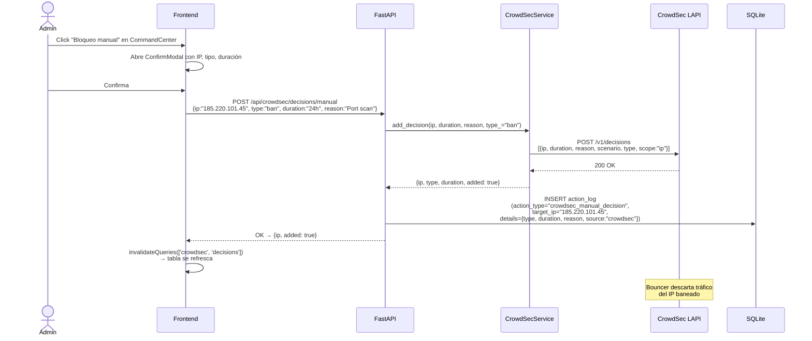
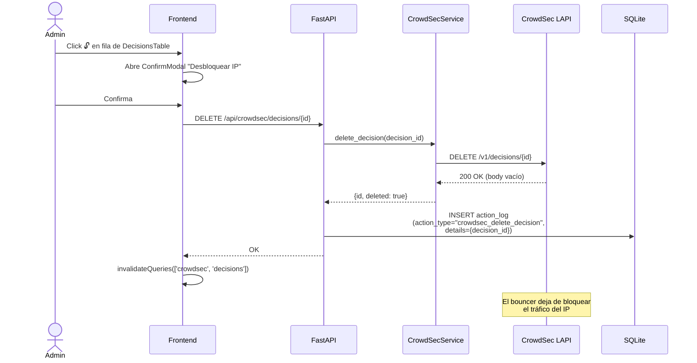
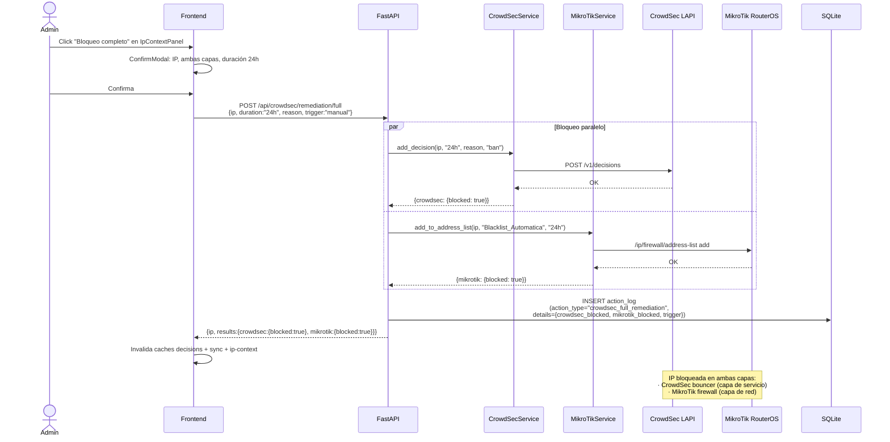
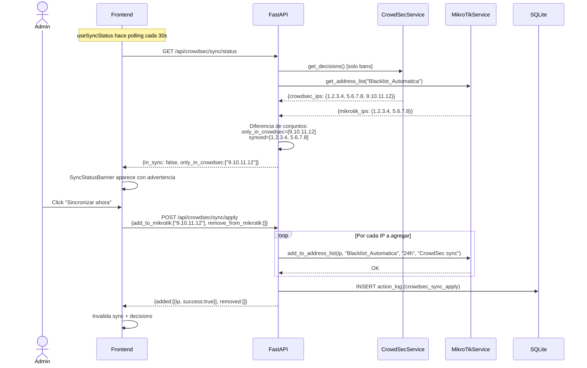
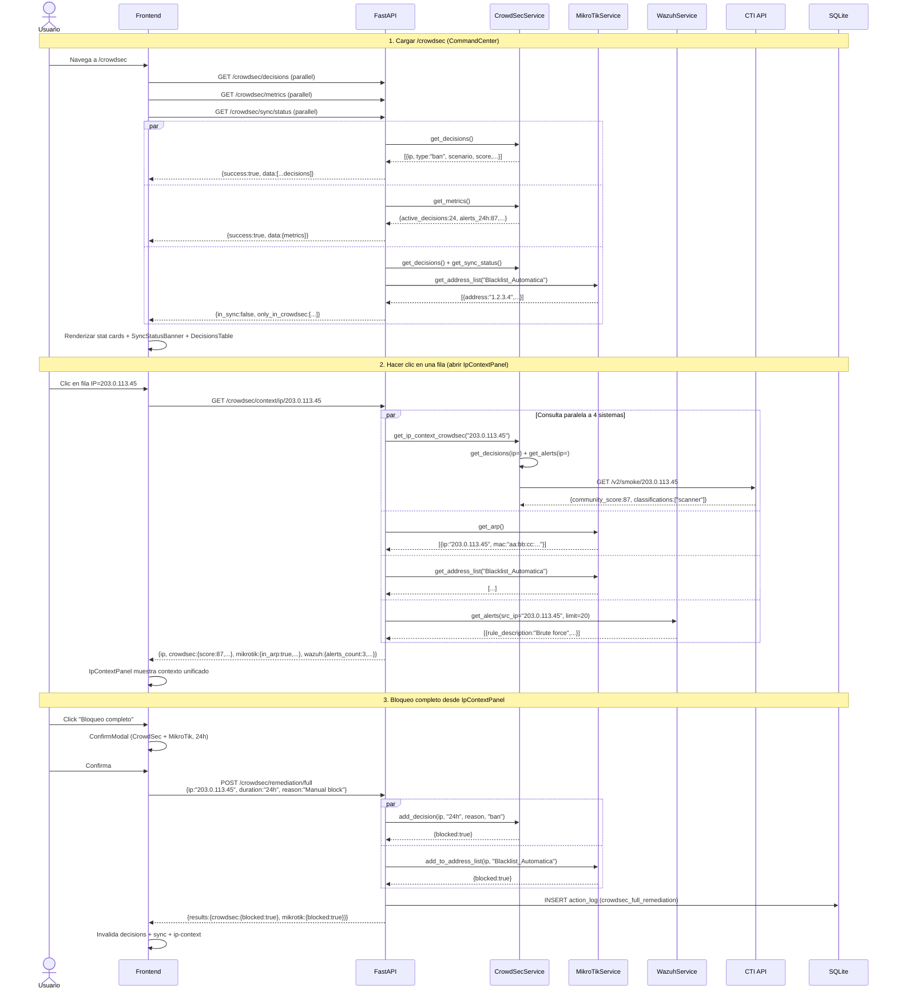

# CrowdSec — Detección Colaborativa y Remediación Multi-Capa

## Descripción General

El módulo **CrowdSec** integra el agente de seguridad colaborativa CrowdSec al dashboard NetShield, permitiendo visualizar y gestionar decisiones de bloqueo (bans/captchas), alertas de ataque, escenarios de detección e inteligencia de amenazas de la comunidad. La integración es **tri-capa**: CrowdSec LAPI como fuente central, MikroTik para enforcement en el router, y Wazuh para correlación de endpoints.

> [!IMPORTANT]
> La comunicación con CrowdSec se realiza contra la **LAPI (Local API)** del agente instalado localmente (por defecto `http://localhost:8080`), autenticada con `X-Api-Key`. En entorno de laboratorio, `verify=False` está documentado como riesgo aceptado.

---

## Arquitectura General

```mermaid
graph TB
    subgraph Frontend["Frontend (React + TypeScript)"]
        CC["CommandCenter.tsx<br/>Centro de Mando<br/>/crowdsec"]
        IV["IntelligenceView.tsx<br/>Inteligencia<br/>/crowdsec/intelligence"]
        CV["ConfigView.tsx<br/>Configuración<br/>/crowdsec/config"]

        subgraph Hooks["Hooks TanStack Query"]
            H1["useCrowdSecDecisions<br/>+ add/delete mutations"]
            H2["useCrowdSecMetrics<br/>useCrowdSecHealth<br/>useCrowdSecBouncers<br/>useCrowdSecScenarios<br/>useCrowdSecHub"]
            H3["useSyncStatus<br/>+ applySync mutation"]
            H4["useIpContext<br/>useWhitelist<br/>+ fullRemediation"]
            H5["useCrowdSecAlerts"]
        end

        subgraph Components["Componentes"]
            C1["DecisionsTable"]
            C2["DecisionsTimeline"]
            C3["IpContextPanel"]
            C4["SyncStatusBanner"]
            C5["TopAttackers"]
            C6["CountryHeatmap"]
            C7["ScenariosTable"]
            C8["BouncerStatus"]
            C9["WhitelistManager"]
            C10["CommunityScoreBadge"]
        end
    end

    subgraph Backend["Backend (FastAPI)"]
        R["routers/crowdsec.py<br/>Prefix: /api/crowdsec<br/>27 endpoints"]
        CS["services/crowdsec_service.py<br/>CrowdSecService Singleton<br/>httpx async + tenacity retry"]
        MT["services/mikrotik_service.py<br/>add_to_address_list()<br/>remove_from_address_list()"]
        WZ["services/wazuh_service.py<br/>get_alerts(src_ip=)"]
        DB["models/action_log.py<br/>ActionLog (SQLite)"]
    end

    subgraph External["Sistemas Externos"]
        LAPI["CrowdSec LAPI<br/>localhost:8080<br/>X-Api-Key auth"]
        CTI["CrowdSec CTI API<br/>cti.api.crowdsec.net<br/>(público, sin auth)"]
        MK["MikroTik RouterOS<br/>Blacklist_Automatica"]
        WAZUH["Wazuh Manager<br/>alertas por IP"]
    end

    CC & IV & CV --> Hooks
    Hooks --> C1 & C2 & C3 & C4 & C5 & C6 & C7 & C8 & C9 & C10
    Hooks -->|"HTTP REST via api.ts"| R
    R --> CS
    R -->|"sync/remediation"| MT
    R -->|"context/ip"| WZ
    R --> DB
    CS -->|"httpx GET/POST/DELETE"| LAPI
    CS -->|"httpx GET"| CTI
    MT -->|"routeros-api"| MK
    WZ -->|"httpx"| WAZUH

    style External fill:#1e293b,stroke:#475569
```



> [!NOTE]
> Los endpoints **hybrid** (`/context/ip/{ip}`, `/remediation/full`, `/sync/*`) consultan múltiples sistemas en paralelo con `asyncio.gather()` y manejan excepciones individuales sin fallar el request completo.

---

## Backend

### Endpoints REST

Todos los endpoints están en `routers/crowdsec.py` bajo el prefijo `/api/crowdsec`.

#### Decisions

| Método | Ruta | Descripción | LAPI Equivalente |
|---|---|---|---|
| `GET` | `/api/crowdsec/decisions` | Listar decisiones activas (ban/captcha) | `GET /v1/decisions` |
| `GET` | `/api/crowdsec/decisions/stream` | Snapshot o delta incremental | `GET /v1/decisions/stream` |
| `POST` | `/api/crowdsec/decisions/manual` | Agregar ban/captcha manual | `POST /v1/decisions` |
| `DELETE` | `/api/crowdsec/decisions/{id}` | Eliminar decisión por ID | `DELETE /v1/decisions/{id}` |
| `DELETE` | `/api/crowdsec/decisions/ip/{ip}` | Eliminar todas las decisiones de una IP | `DELETE /v1/decisions?ip=` |

#### Alerts

| Método | Ruta | Descripción | LAPI Equivalente |
|---|---|---|---|
| `GET` | `/api/crowdsec/alerts` | Listar alertas de ataque detectadas | `GET /v1/alerts` |
| `GET` | `/api/crowdsec/alerts/{id}` | Detalle completo de alerta con eventos | `GET /v1/alerts/{id}` |

#### Infrastructure

| Método | Ruta | Descripción | LAPI Equivalente |
|---|---|---|---|
| `GET` | `/api/crowdsec/bouncers` | Bouncers registrados | `GET /v1/bouncers` |
| `GET` | `/api/crowdsec/machines` | Agentes CrowdSec registrados | `GET /v1/machines` |
| `GET` | `/api/crowdsec/scenarios` | Stats de scenarios (derivado de alerts) | Computado |
| `GET` | `/api/crowdsec/metrics` | Métricas agregadas | Computado |
| `GET` | `/api/crowdsec/hub` | Collections y parsers instalados | cscli |

#### Whitelist (BD Local)

| Método | Ruta | Descripción |
|---|---|---|
| `GET` | `/api/crowdsec/whitelist` | Listar whitelist local |
| `POST` | `/api/crowdsec/whitelist` | Agregar IP/CIDR a whitelist |
| `DELETE` | `/api/crowdsec/whitelist/{id}` | Eliminar entrada de whitelist |

#### Híbridos (CrowdSec + MikroTik + Wazuh)

| Método | Ruta | Descripción |
|---|---|---|
| `GET` | `/api/crowdsec/context/ip/{ip}` | Contexto unificado de IP (3 capas) |
| `POST` | `/api/crowdsec/remediation/full` | Bloquear IP en CrowdSec **y** MikroTik simultáneamente |
| `GET` | `/api/crowdsec/sync/status` | Comparar bans CrowdSec vs Blacklist_Automatica |
| `POST` | `/api/crowdsec/sync/apply` | Aplicar sincronización hacia MikroTik |

### Schemas Pydantic

Archivo: `schemas/crowdsec.py`

```python
class ManualDecisionRequest(BaseModel):
    ip: str          # Validador: ipaddress.ip_address() — solo IPv4/IPv6 válidas
    duration: str    # Validado: regex r"^\d+[mhd]$" → "24h", "7d", "30m"
    reason: str      # min_length=3, max_length=200
    type: Literal["ban", "captcha"] = "ban"

class WhitelistRequest(BaseModel):
    ip: str          # Validador: ip_address() OR ip_network() — acepta CIDRs
    reason: str      # min_length=3, max_length=200

class FullRemediationRequest(BaseModel):
    ip: str          # Validador: ipaddress.ip_address()
    duration: str = "24h"
    reason: str
    trigger: str = "manual"  # "manual" | "auto" | "wazuh" | "phishing"

class SyncApplyRequest(BaseModel):
    add_to_mikrotik: list[str] = []      # IPs a agregar en Blacklist_Automatica
    remove_from_mikrotik: list[str] = [] # IPs a eliminar de Blacklist_Automatica
```

### Lógica del Servicio — `CrowdSecService`

El servicio implementa el **patrón singleton** idéntico a `MikroTikService`:

```python
class CrowdSecService:
    _instance: "CrowdSecService | None" = None

    def __new__(cls):
        if cls._instance is None:
            cls._instance = super().__new__(cls)
            cls._instance._initialized = False
        return cls._instance
```

#### Retry con tenacity

```python
@retry(
    retry=retry_if_exception_type((httpx.ConnectError, httpx.TimeoutException)),
    stop=stop_after_attempt(3),
    wait=wait_exponential(multiplier=1, min=1, max=10),
    after=_log_retry,
)
async def _request(self, method, path, **kwargs): ...
```

#### `get_scenarios()` — Agregación derivada

En modo real, los scenarios se derivan de las alertas (la LAPI no tiene endpoint `/scenarios`):

```python
async def get_scenarios(self) -> list[dict]:
    alerts = await self.get_alerts(limit=500)
    scenario_map = {}
    for alert in alerts:
        name = alert.get("scenario", "unknown")
        if name not in scenario_map:
            scenario_map[name] = {"name": name, "alerts_count": 0, ...}
        scenario_map[name]["alerts_count"] += 1
    return sorted(scenario_map.values(), key=lambda s: s["alerts_count"], reverse=True)
```

#### `get_metrics()` — Computación multi-fuente

```python
async def get_metrics(self) -> dict:
    decisions = await self.get_decisions()
    alerts    = await self.get_alerts(limit=500)
    bouncers  = await self.get_bouncers()
    scenarios = await self.get_scenarios()
    return {
        "active_decisions":    len(decisions),
        "alerts_24h":          len(alerts),
        "scenarios_active":    len(scenarios),
        "bouncers_connected":  sum(1 for b in bouncers if b["status"] == "connected"),
        "top_countries":       [...],  # top 10 por frecuencia en alerts
        "top_scenario":        scenarios[0] if scenarios else {},
        "decisions_per_hour":  [],
    }
```

#### `get_cti_score(ip)` — CTI Público

```python
async def get_cti_score(self, ip: str) -> dict:
    # Llama a https://cti.api.crowdsec.net/v2/smoke/{ip} (sin auth)
    # Retorna: community_score, is_known_attacker, reported_by,
    #          background_noise, classifications
```

#### `get_sync_status(mikrotik_ips)` — Diferencia de conjuntos

```python
async def get_sync_status(self, mikrotik_ips: set[str]) -> dict:
    decisions    = await self.get_decisions()
    crowdsec_ips = {d["ip"] for d in decisions if d["type"] == "ban"}
    return {
        "in_sync":           len(crowdsec_ips - mikrotik_ips) == 0 and ...,
        "only_in_crowdsec":  sorted(crowdsec_ips - mikrotik_ips),
        "only_in_mikrotik":  sorted(mikrotik_ips - crowdsec_ips),
        "synced_ips":        sorted(crowdsec_ips & mikrotik_ips),
    }
```

### Flujo: Bloqueo Manual (Decision)



### Flujo: Desbloqueo (Delete Decision)



### Flujo: Remediación Completa (Full Remediation)



### Flujo: Sincronización CrowdSec ↔ MikroTik



### `ActionLog` — Tipos Registrados por CrowdSec

```python
class ActionLog(Base):
    action_type: str  # Valores posibles del módulo CrowdSec:
    # "crowdsec_manual_decision"  → POST /decisions/manual
    # "crowdsec_delete_decision"  → DELETE /decisions/{id}
    # "crowdsec_unblock_ip"       → DELETE /decisions/ip/{ip}
    # "crowdsec_whitelist_add"    → POST /whitelist
    # "crowdsec_whitelist_remove" → DELETE /whitelist/{id}
    # "crowdsec_full_remediation" → POST /remediation/full
    # "crowdsec_sync_apply"       → POST /sync/apply
```

> [!NOTE]
> El `ActionLog` es **compartido** entre todos los módulos. El endpoint `GET /api/actions/history` devuelve todas las entradas, incluyendo las de Firewall, Phishing, GLPI, Portal Cautivo y CrowdSec, sin filtrar por módulo.

---

## Frontend

### Rutas

| Ruta | Componente | Descripción |
|---|---|---|
| `/crowdsec` | `CrowdSecCommandCenter` | Vista principal: decisiones activas, métricas, sync |
| `/crowdsec/intelligence` | `CrowdSecIntelligence` | Inteligencia de amenazas: geografía, scenarios, atacantes |
| `/crowdsec/config` | `CrowdSecConfig` | Bouncers, hub, whitelist local, estado de conexión |

### Estructura de Archivos

```
frontend/src/
├── components/crowdsec/
│   ├── CommandCenter.tsx      ← Vista /crowdsec (208 líneas)
│   ├── IntelligenceView.tsx   ← Vista /crowdsec/intelligence (103 líneas)
│   ├── ConfigView.tsx         ← Vista /crowdsec/config (143 líneas)
│   ├── DecisionsTable.tsx     ← Tabla de decisiones con filtros y sort (181 líneas)
│   ├── DecisionsTimeline.tsx  ← Gráfico Recharts área 24h (88 líneas)
│   ├── IpContextPanel.tsx     ← Slide-over unificado CrowdSec+MikroTik+Wazuh (250 líneas)
│   ├── SyncStatusBanner.tsx   ← Banner amber de desincronización (100 líneas)
│   ├── CountryHeatmap.tsx     ← Grid de países con intensidad visual (62 líneas)
│   ├── ScenariosTable.tsx     ← Tabla de scenarios con tendencias (59 líneas)
│   ├── TopAttackers.tsx       ← Top 10 IPs con badges cross-system (80 líneas)
│   ├── BouncerStatus.tsx      ← Cards de bouncers conectados (69 líneas)
│   ├── WhitelistManager.tsx   ← CRUD whitelist local (127 líneas)
│   └── CommunityScoreBadge.tsx ← Badge de reputación 0-100 (83 líneas)
├── hooks/
│   ├── useCrowdSecDecisions.ts ← Query + mutations (add/delete/deleteByIp)
│   ├── useCrowdSecMetrics.ts   ← useCrowdSecHealth, useCrowdSecMetrics,
│   │                              useCrowdSecBouncers, useCrowdSecScenarios,
│   │                              useCrowdSecHub
│   ├── useSyncStatus.ts        ← Query sync + mutation applySync
│   ├── useIpContext.ts         ← useIpContext + useWhitelist
│   └── useCrowdSecAlerts.ts   ← useCrowdSecAlerts + useCrowdSecAlertDetail
└── services/
    └── api.ts → crowdsecApi   ← 17 funciones HTTP
```

> [!NOTE]
> A diferencia de `FirewallPage.tsx` que usa queries inline, el módulo CrowdSec **usa hooks dedicados por dominio** (`useCrowdSecDecisions`, `useSyncStatus`, etc.), siguiendo el patrón establecido en `frontend/CLAUDE.md`.

### Vista 1: Centro de Mando (`/crowdsec`)

Layout: stat cards → sync banner → tabla de decisiones + timeline → IP panel

```
┌───────────────────────────────────────────────────────────────────┐
│  🛡️ CrowdSec — Centro de Mando                    [+ Bloqueo manual]│
│  Decisiones activas · Detecciones locales · Sync con MikroTik     │
├────────────────────────────────────────────────────────────────────┤
│ [Decisiones: 24] [Alertas 24h: 87] [Scenarios: 5]                 │
│ [Bouncers: 2 ✓ ] [Sync: 3 desync ⚠]                              │
├────────────────────────────────────────────────────────────────────┤
│ ⚠ Desincronización detectada — 3 IPs fuera de sync [Sincronizar]  │
│   203.0.113.45 (solo CrowdSec) · 198.51.100.22 (solo CrowdSec)   │
├────────────────────────────────────────────┬───────────────────────┤
│ Decisiones activas [24]                    │ Decisiones — 24h      │
│ [Todos los scenarios ▾] [Todos los tipos ▾]│  ╭─────────────────╮ │
│ IP           │Scenario│Tipo│País│Orig│Score│  │  ▁▃▇▅▃▁▅▇       │ │
│ 203.0.113.45 │http-bf │ban │CN  │cs  │•87  │  ╰─────────────────╯ │
│ 185.220.x.y  │ssh-bf  │ban │RU  │cscli│•92 │                      │
│ ...          │        │    │    │    │     │                      │
├────────────────────────────────────────────┴───────────────────────┤
│ [IpContextPanel - slide-over al hacer clic en una fila]            │
└───────────────────────────────────────────────────────────────────┘
```

#### `CommunityScoreBadge` — Semáforo de reputación

| Rango | Color | Etiqueta |
|---|---|---|
| 0–30 | 🟢 verde | Bajo |
| 31–70 | 🟡 ámbar | Medio |
| 71–100 | 🔴 rojo | Alto riesgo |

Modo `compact`: solo un punto de color + número (en tabla). Modo full: barra de progreso + reportes de la comunidad.

#### `DecisionsTable` — Columnas y filtros

| Columna | Contenido |
|---|---|
| **IP** | IP en monospace + badge `conocido` si `is_known_attacker` |
| **Scenario** | Nombre corto (`http-bf` de `crowdsecurity/http-bf`) |
| **Tipo** | Badge: `ban`=rojo, `captcha`=ámbar |
| **País** | Código de país de la decisión |
| **Origen** | `crowdsec`=azul, `cscli`=ámbar, `console`=info |
| **Score** | `CommunityScoreBadge` compact |
| **Expira** | Distancia temporal en tiempo relativo |
| **Acciones** | Botón 🔓 abre `ConfirmModal` |

Filtros disponibles: por scenario + por tipo. Sort clickable: por `community_score` o `expires_at`.

#### `IpContextPanel` — Slide-over unificado

Panel lateral de 480px ancho que agrega información de **3 sistemas** para una IP seleccionada:

**Sección CrowdSec:**
- `CommunityScoreBadge` full con reportes
- Clasificaciones CTI (badges ámbar)
- Badge `background-noise` si aplica
- País y AS Name
- Lista de decisiones activas (hasta 3)
- Alertas recientes (hasta 3)

**Sección MikroTik:**
- ¿Está en tabla ARP? (badge verde/ámbar)
- ¿Está en `Blacklist_Automatica`? (badge danger/success)
- Comentario ARP si existe

**Sección Wazuh:**
- Conteo de alertas relacionadas
- Agentes afectados
- Última alerta (descripción + timestamp)

**Footer de acciones:**
- Botón "Bloqueo completo" → `ConfirmModal` → `POST /remediation/full`
- Botón "Desbloquear todo" → `ConfirmModal` → `DELETE /decisions/ip/{ip}`

> [!TIP]
> El `IpContextPanel` también se abre desde `GlobalSearch` al buscar una IP, y desde `TopAttackers` en la vista de Inteligencia. Es el punto central de análisis de amenazas del sistema.

### Vista 2: Inteligencia (`/crowdsec/intelligence`)

```
┌──────────────────────────────────────────────────────────────┐
│  🌐 CrowdSec — Inteligencia                                  │
│  Geografía de amenazas · Técnicas detectadas · Atacantes     │
├──────────────────────────────────────────────────────────────┤
│ Top países de origen                                         │
│ [🇨🇳 CN 34 alertas 39%] [🇷🇺 RU 28 alertas 32%]           │
│ [🇺🇸 US 12 alertas 14%] [🇧🇷 BR  8 alertas  9%] ...       │
├───────────────────────────────────┬──────────────────────────┤
│ Scenarios activos                 │ Top atacantes            │
│ Scenario      │Desc│Alertas│Tend  │ #1 203.0.113.45 [Wazuh] │
│ crowdsec/      │    │  45  │↑     │    [MikroTik] [CrowdSec] │
│  http-bf       │... │      │      │    Score: •87    🔓      │
│ crowdsec/      │    │  23  │→     │ #2 185.220.101.45        │
│  ssh-bf        │... │      │      │    [CrowdSec]            │
│ ...            │    │      │      │    Score: •92    🔓      │
└───────────────────────────────────┴──────────────────────────┘
```

#### `CountryHeatmap`

Grid responsivo de países con intensidad visual proporcional al conteo. La opacidad del fondo (`rgba(99,102,241, 0.08 + intensity * 0.3)`) varía según `count/max`. El país con más alertas recibe badge `#1`.

#### `ScenariosTable`

Tabla con trend icons: `↑` (TrendingUp rojo), `↓` (TrendingDown verde), `→` (Minus gris). Alertas > 10 se muestran en rojo.

#### `TopAttackers`

Top 10 IPs únicas ordenadas por `community_score`. Cada fila muestra badges de correlación cross-system:
- `[Wazuh]` badge rojo si la IP tiene alertas en Wazuh
- `[MikroTik]` badge verde si está en listas MikroTik
- `[CrowdSec]` badge ámbar siempre

Click en fila → `IpContextPanel`. Botón 🔓 → `ConfirmModal` → bloqueo completo.

### Vista 3: Configuración (`/crowdsec/config`)

```
┌──────────────────────────────────────────────────────────────┐
│  ⚙️ CrowdSec — Configuración        [🟡 MOCK MODE]          │
│  Bouncers · Hub · Whitelist · Estado de conexión             │
├──────────────────────────────────────────────────────────────┤
│ ℹ️ Modo demostración (datos simulados)                       │
│  Para activar CrowdSec real:                                 │
│   1. curl -s https://install.crowdsec.net | sudo sh          │
│   2. sudo cscli bouncers add netshield-bouncer               │
│   3. Copiar API key a CROWDSEC_API_KEY en .env               │
│   4. Cambiar MOCK_CROWDSEC=false                             │
│   5. Reiniciar el backend                                    │
├──────────────────────────────────────────────────────────────┤
│ BOUNCERS REGISTRADOS                                         │
│ 🔥 netshield-firewall · firewall · v1.4.2                   │
│    Último pull: hace 2 min             [✓ Conectado]         │
│ 🌐 netshield-nginx · web · v1.3.0                           │
│    Último pull: hace 5 min             [✓ Conectado]         │
├──────────────────────────────────────────────────────────────┤
│ WHITELIST LOCAL                             [3 entradas]     │
│ IP/CIDR       │Motivo              │Por   │Hace │            │
│ 192.168.1.0/24│Servidores internos │admin │2h   │🗑          │
│ 10.0.0.1      │Router MikroTik     │admin │1d   │🗑          │
│ [IP o CIDR] [Motivo]               [+ Agregar]               │
└──────────────────────────────────────────────────────────────┘
```

### Hooks y Queries

| Hook | QueryKey | RefetchInterval | Funciones |
|---|---|---|---|
| `useCrowdSecHealth` | `['crowdsec','health']` | 30s | Probe de conectividad → dot en header |
| `useCrowdSecMetrics` | `['crowdsec','metrics']` | 60s | Métricas agregadas |
| `useCrowdSecBouncers` | `['crowdsec','bouncers']` | 60s | Lista de bouncers |
| `useCrowdSecScenarios` | `['crowdsec','scenarios']` | 60s | Scenarios con tendencias |
| `useCrowdSecHub` | `['crowdsec','hub']` | 120s | Collections instaladas |
| `useCrowdSecDecisions` | `['crowdsec','decisions',filters]` | 15s | `addDecision`, `deleteDecision`, `deleteByIp` |
| `useSyncStatus` | `['crowdsec','sync']` | 30s | `applySync` · invalida decisions |
| `useIpContext` | `['crowdsec','ip-context',ip]` | — (staleTime 30s) | `fullRemediation` |
| `useWhitelist` | `['crowdsec','whitelist']` | — | `addWhitelist`, `deleteWhitelist` |
| `useCrowdSecAlerts` | `['crowdsec','alerts',filters]` | 30s | Filtros: limit, scenario, ip |

> [!NOTE]
> `useCrowdSecHealth` comparte el endpoint `/crowdsec/metrics` para el probe de conectividad. El dot verde/rojo en el header de `Layout.tsx` usa este hook (`csHealth?.active_decisions`).

---

## Flujo de Datos Completo



---

## Modo Mock

Cuando `MOCK_CROWDSEC=true` (o `MOCK_ALL=true`), el servicio retorna datos simulados sin conectarse a la LAPI real:

| Variable | Default | Comportamiento |
|---|---|---|
| `MOCK_CROWDSEC=true` | `false` | Mock solo CrowdSec; MikroTik/Wazuh pueden ser reales |
| `MOCK_ALL=true` | `false` | Mock todos los servicios (prevalece sobre individuales) |

| Método Mock | Datos Simulados |
|---|---|
| `MockService.crowdsec_get_decisions()` | 8–12 decisiones con bans/captchas, IPs reales de lista negra |
| `MockData.crowdsec.alerts()` | 50 alertas de distintos scenarios (http-bf, ssh-bf, etc.) |
| `MockData.crowdsec.metrics()` | Métricas coherentes con las decisions/alerts |
| `MockData.crowdsec.bouncers()` | 2 bouncers: firewall+web, ambos conectados |
| `MockData.crowdsec.scenarios()` | 5 scenarios con tendencias simuladas |
| `MockData.crowdsec.sync_status()` | Estado de desync con 2-3 IPs out-of-sync |
| `MockData.crowdsec.ip_context(ip)` | Contexto unificado con datos de las 3 capas |
| `MockData.crowdsec.cti_ip(ip)` | Score de comunidad variable por IP |
| `MockService.crowdsec_add_decision(...)` | Agrega a lista en memory, devuelve `{added:true}` |
| `MockService.crowdsec_delete_decision(id)` | Elimina de memoria, devuelve `bool` |
| `MockService.crowdsec_get_whitelist()` | 2-3 entradas de whitelist predefinidas |

> [!TIP]
> En modo mock, el `ActionLog` **sí persiste en SQLite** ya que es independiente de CrowdSec. Las mutations de decisiones no persisten entre reinicios, pero sí las acciones de auditoría.

---

## Casos de Uso

### CU-1: Ver decisiones activas y métricas

**Actor:** Administrador de seguridad

1. Navega a **CrowdSec** desde la barra lateral
2. Ve 5 stat cards con decisiones activas, alertas 24h, scenarios, bouncers y sync status
3. La tabla muestra todas las decisiones con su score de comunidad y tiempo de expiración
4. Identifica una IP con score 92 (alto riesgo) proveniente de RU → phasing out en 2h

---

### CU-2: Investigar una IP sospechosa

**Actor:** Analista de seguridad

1. En `DecisionsTable`, hace clic en la fila de `185.220.101.45`
2. El `IpContextPanel` se abre mostrando:
   - **CrowdSec**: score 92, clasificado como `scanner` + `brute-force`, 1,247 reportes en la comunidad
   - **MikroTik**: en tabla ARP (dispositivo en la red), en `Blacklist_Automatica` (ya bloqueado)
   - **Wazuh**: 3 alertas asociadas, agente `servidor-web` afectado
3. Decide escalar el incidente dado el contexto completo

---

### CU-3: Bloqueo manual de IP (solo CrowdSec)

**Actor:** Administrador de seguridad

1. En Centro de Mando, hace clic en **"+ Bloqueo manual"**
2. `ConfirmModal` muestra campos: IP, tipo (ban/captcha), duración
3. Completa: `10.5.5.100`, `ban`, `24h`, motivo `"Escaneo detectado por IDS"`
4. Confirma → `POST /api/crowdsec/decisions/manual`
5. El bouncer del agente CrowdSec descarta el tráfico de esa IP

---

### CU-4: Bloqueo completo en todas las capas

**Actor:** Administrador de seguridad ante amenaza confirmada

1. Desde `IpContextPanel` de `203.0.113.45` hace clic **"Bloqueo completo"**
2. `ConfirmModal` advierte: _"Esta IP será bloqueada en CrowdSec Y en MikroTik (Blacklist_Automatica)"_
3. Confirma → `POST /api/crowdsec/remediation/full`
4. El sistema bloquea en paralelo en ambas capas
5. El `ActionLog` registra `crowdsec_full_remediation` con resultado de cada capa

---

### CU-5: Sincronizar CrowdSec con MikroTik

**Actor:** Administrador de red

1. El `SyncStatusBanner` ámbar aparece en el Centro de Mando indicando 3 IPs fuera de sync
2. Las IPs están baneadas en CrowdSec pero **no** en `Blacklist_Automatica` de MikroTik
3. Hace clic en **"Sincronizar ahora"**
4. `POST /api/crowdsec/sync/apply` → agrega las 3 IPs a MikroTik en 1 request
5. El banner desaparece; el estado vuelve a `in_sync: true`

---

### CU-6: Analizar geografía de amenazas

**Actor:** Responsable de seguridad

1. Navega a **CrowdSec → Inteligencia**
2. El `CountryHeatmap` muestra CN (39%), RU (32%), US (14%) como principales orígenes
3. La `ScenariosTable` indica que `crowdsecurity/http-bf` tiene tendencia `↑` con 45 alertas
4. Decide reforzar el WAF para HTTP específicamente

---

### CU-7: Gestionar whitelist local

**Actor:** Administrador de red

1. Un servidor de monitoreo `192.168.10.50` es detectado por CrowdSec como escáner (falso positivo)
2. Navega a **CrowdSec → Configuración → Whitelist local**
3. Agrega `192.168.10.50` con motivo `"Servidor de monitoreo Zabbix"`
4. `POST /api/crowdsec/whitelist` → `ActionLog` registra `crowdsec_whitelist_add`
5. El agente CrowdSec deja de generar decisiones para esa IP

---

### CU-8: Verificar estado del bouncer

**Actor:** Administrador de sistemas

1. El dot de estado en el header del dashboard muestra CrowdSec en amber
2. Navega a **CrowdSec → Configuración**
3. La vista muestra `netshield-firewall` como **Desconectado** (último pull: hace 2h)
4. Reinicia el servicio bouncer en el servidor
5. El dot vuelve a verde en el próximo polling (30s)

---

## Archivos Involucrados

### Backend

| Archivo | Rol |
|---|---|
| [crowdsec.py](file:///home/nivek/Documents/netShield2/backend/routers/crowdsec.py) | 27 endpoints REST — Decisions, Alerts, Infrastructure, Whitelist, Hybrid (574 líneas) |
| [crowdsec_service.py](file:///home/nivek/Documents/netShield2/backend/services/crowdsec_service.py) | Singleton httpx async — 12 métodos públicos, retry tenacity (392 líneas) |
| [crowdsec.py](file:///home/nivek/Documents/netShield2/backend/schemas/crowdsec.py) | `ManualDecisionRequest`, `WhitelistRequest`, `FullRemediationRequest`, `SyncApplyRequest` (81 líneas) |
| [config.py](file:///home/nivek/Documents/netShield2/backend/config.py) | `crowdsec_url`, `crowdsec_api_key`, `mock_crowdsec`, `should_mock_crowdsec` |
| [mock_service.py](file:///home/nivek/Documents/netShield2/backend/services/mock_service.py) | `crowdsec_*` — decisions, whitelist en memoria para modo mock |
| [mock_data.py](file:///home/nivek/Documents/netShield2/backend/services/mock_data.py) | `MockData.crowdsec.*` — datos simulados para todos los endpoints |
| [action_log.py](file:///home/nivek/Documents/netShield2/backend/models/action_log.py) | Modelo SQLite `ActionLog` — auditoría de acciones |
| [mikrotik_service.py](file:///home/nivek/Documents/netShield2/backend/services/mikrotik_service.py) | `add_to_address_list()`, `remove_from_address_list()` — usados por sync y remediation |

### Frontend

| Archivo | Rol |
|---|---|
| [CommandCenter.tsx](file:///home/nivek/Documents/netShield2/frontend/src/components/crowdsec/CommandCenter.tsx) | Vista principal: stat cards, sync banner, tabla, timeline (208 líneas) |
| [IntelligenceView.tsx](file:///home/nivek/Documents/netShield2/frontend/src/components/crowdsec/IntelligenceView.tsx) | Vista inteligencia: heatmap, scenarios, top attackers (103 líneas) |
| [ConfigView.tsx](file:///home/nivek/Documents/netShield2/frontend/src/components/crowdsec/ConfigView.tsx) | Vista config: bouncers, hub, whitelist, estado conexión (143 líneas) |
| [DecisionsTable.tsx](file:///home/nivek/Documents/netShield2/frontend/src/components/crowdsec/DecisionsTable.tsx) | Tabla con filtros, sort y `CommunityScoreBadge` (181 líneas) |
| [DecisionsTimeline.tsx](file:///home/nivek/Documents/netShield2/frontend/src/components/crowdsec/DecisionsTimeline.tsx) | Gráfico Recharts AreaChart decisiones/hora (88 líneas) |
| [IpContextPanel.tsx](file:///home/nivek/Documents/netShield2/frontend/src/components/crowdsec/IpContextPanel.tsx) | Slide-over 480px — contexto unificado CrowdSec + MikroTik + Wazuh (250 líneas) |
| [SyncStatusBanner.tsx](file:///home/nivek/Documents/netShield2/frontend/src/components/crowdsec/SyncStatusBanner.tsx) | Banner ámbar de desincronización con acción "Sincronizar" (100 líneas) |
| [CountryHeatmap.tsx](file:///home/nivek/Documents/netShield2/frontend/src/components/crowdsec/CountryHeatmap.tsx) | Grid de países con intensidad visual proporcional (62 líneas) |
| [ScenariosTable.tsx](file:///home/nivek/Documents/netShield2/frontend/src/components/crowdsec/ScenariosTable.tsx) | Tabla de scenarios con íconos de tendencia (59 líneas) |
| [TopAttackers.tsx](file:///home/nivek/Documents/netShield2/frontend/src/components/crowdsec/TopAttackers.tsx) | Top 10 IPs con badges cross-system Wazuh/MikroTik/CrowdSec (80 líneas) |
| [BouncerStatus.tsx](file:///home/nivek/Documents/netShield2/frontend/src/components/crowdsec/BouncerStatus.tsx) | Cards glass con estado de bouncers (69 líneas) |
| [WhitelistManager.tsx](file:///home/nivek/Documents/netShield2/frontend/src/components/crowdsec/WhitelistManager.tsx) | CRUD whitelist local con ConfirmModal (127 líneas) |
| [CommunityScoreBadge.tsx](file:///home/nivek/Documents/netShield2/frontend/src/components/crowdsec/CommunityScoreBadge.tsx) | Badge reputación 0–100, modo compact y full (83 líneas) |
| [useCrowdSecDecisions.ts](file:///home/nivek/Documents/netShield2/frontend/src/hooks/useCrowdSecDecisions.ts) | Query + mutations add/delete/deleteByIp (49 líneas) |
| [useCrowdSecMetrics.ts](file:///home/nivek/Documents/netShield2/frontend/src/hooks/useCrowdSecMetrics.ts) | Health, metrics, bouncers, scenarios, hub (56 líneas) |
| [useSyncStatus.ts](file:///home/nivek/Documents/netShield2/frontend/src/hooks/useSyncStatus.ts) | Query sync + mutation applySync (34 líneas) |
| [useIpContext.ts](file:///home/nivek/Documents/netShield2/frontend/src/hooks/useIpContext.ts) | IP context + whitelist CRUD + fullRemediation (63 líneas) |
| [useCrowdSecAlerts.ts](file:///home/nivek/Documents/netShield2/frontend/src/hooks/useCrowdSecAlerts.ts) | Alerts list + alert detail (36 líneas) |
| [api.ts](file:///home/nivek/Documents/netShield2/frontend/src/services/api.ts) → `crowdsecApi` | 17 funciones HTTP cliente para todos los endpoints |
| [types.ts](file:///home/nivek/Documents/netShield2/frontend/src/types.ts) | 15 interfaces TypeScript: `CrowdSecDecision`, `CrowdSecAlert`, `CrowdSecBouncer`, `CrowdSecMetrics`, `IpContext`, `CrowdSecSyncStatus`, etc. |
| [App.tsx](file:///home/nivek/Documents/netShield2/frontend/src/App.tsx) | Rutas: `/crowdsec`, `/crowdsec/intelligence`, `/crowdsec/config` |
| [Layout.tsx](file:///home/nivek/Documents/netShield2/frontend/src/components/Layout.tsx) | Sidebar con 3 sub-entradas CrowdSec + dot de salud en header |
