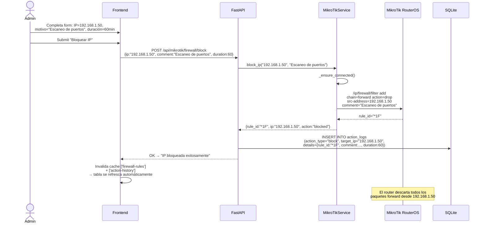
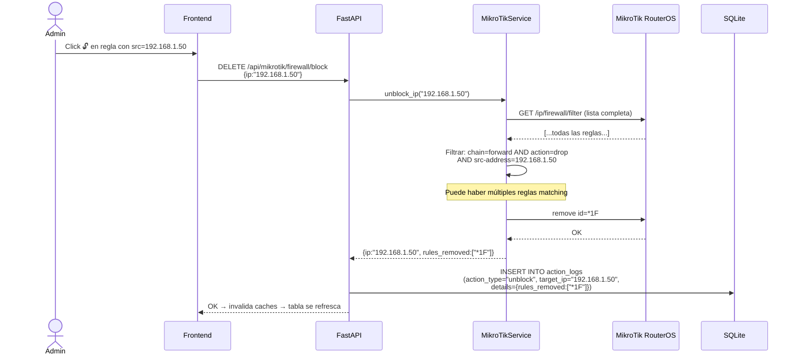
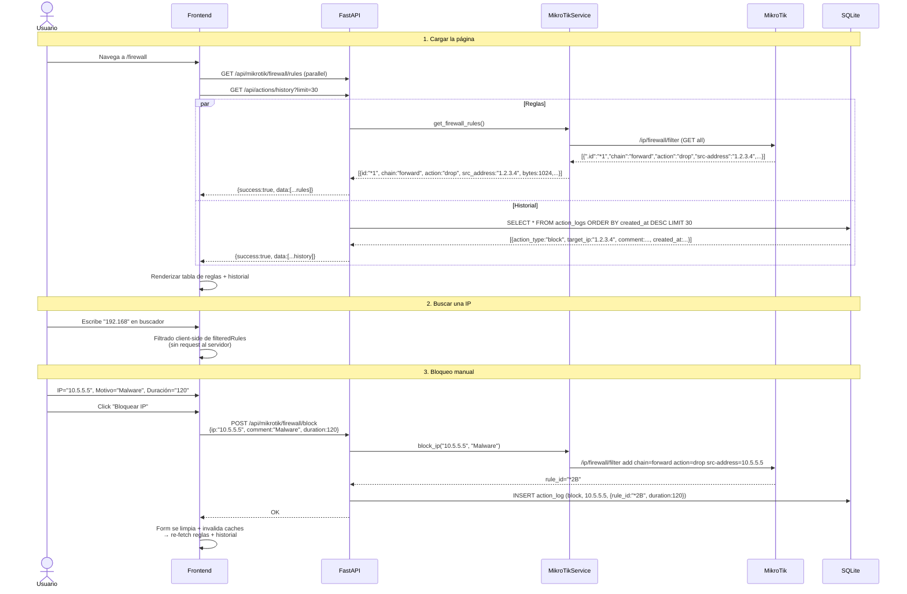

# Firewall — Gestión de Reglas y Bloqueo de IPs

## Descripción General

El módulo **Firewall** permite visualizar, agregar y eliminar reglas del firewall MikroTik directamente desde el dashboard. Las operaciones actúan sobre `/ip/firewall/filter` en RouterOS mediante la API nativa de MikroTik. Toda acción queda registrada en el **Historial de Acciones** (SQLite `action_logs`) para auditoría.

> [!IMPORTANT]
> El módulo opera **exclusivamente** sobre reglas de la chain `forward` con acción `drop` para bloqueos. El botón de desbloqueo solo aparece sobre reglas que cumplen estas condiciones. Reglas manuales de otras chains (input, output) se muestran en la tabla pero no son modificables desde la UI.

---

## Arquitectura General

```mermaid
graph TB
    subgraph Frontend["Frontend (React + TypeScript)"]
        FP["FirewallPage.tsx<br/>1 componente — 314 líneas<br/>(queries inline, sin hooks dedicados)"]
        API["api.ts<br/>mikrotikApi.getFirewallRules()<br/>mikrotikApi.blockIP()<br/>mikrotikApi.unblockIP()<br/>actionsApi.getHistory()"]
    end

    subgraph Backend["Backend (FastAPI)"]
        R1["routers/mikrotik.py<br/>GET /firewall/rules<br/>POST /firewall/block<br/>DELETE /firewall/block"]
        R2["main.py<br/>GET /api/actions/history"]
        MS["services/mikrotik_service.py<br/>MikroTikService Singleton<br/>get_firewall_rules()<br/>block_ip()<br/>unblock_ip()"]
        DB["models/action_log.py<br/>ActionLog (SQLite)"]
    end

    subgraph MikroTik["MikroTik RouterOS"]
        FW["/ip/firewall/filter<br/>Lista de reglas"]
    end

    FP --> API
    API -->|"HTTP REST"| R1 & R2
    R1 --> MS
    R1 --> DB
    R2 -->|"SELECT"| DB
    MS -->|"routeros-api"| FW

    style MikroTik fill:#1e293b,stroke:#475569
```



> [!NOTE]
> `FirewallPage.tsx` **no tiene hooks dedicados** (`useFirewall.ts` no existe). Usa `useQuery` y `useMutation` de TanStack Query directamente dentro del componente, lo que lo diferencia de otros módulos como GLPI o Portal Cautivo.

---

## Backend

### Endpoints REST

Los endpoints de firewall están en `routers/mikrotik.py` (prefijo `/api/mikrotik`). El historial vive en `main.py`.

| Método | Ruta | Descripción | RouterOS |
|---|---|---|---|
| `GET` | `/api/mikrotik/firewall/rules` | Listar todas las reglas de firewall | `/ip/firewall/filter` |
| `POST` | `/api/mikrotik/firewall/block` | Bloquear una IP (agrega regla drop) | `/ip/firewall/filter add` |
| `DELETE` | `/api/mikrotik/firewall/block` | Desbloquear una IP (elimina reglas drop matching) | `/ip/firewall/filter remove` |
| `GET` | `/api/actions/history` | Historial de acciones de auditoría | SQLite `action_logs` |
| `GET` | `/api/mikrotik/logs` | Logs del sistema RouterOS | `/log` |

### Schemas Pydantic

Archivo: `schemas/mikrotik.py`

```python
class FirewallRule(BaseModel):
    id: str             # .id interno de RouterOS (ej: "*1A")
    chain: str          # forward | input | output
    action: str         # drop | accept | reject | log
    src_address: str    # IP origen (puede estar vacío = "any")
    dst_address: str    # IP destino (puede estar vacío = "any")
    protocol: str       # tcp | udp | icmp | "" (any)
    disabled: bool      # si la regla está desactivada
    comment: str        # comentario descriptivo
    bytes: int          # bytes que pasaron por esta regla
    packets: int        # paquetes procesados

class BlockIPRequest(BaseModel):
    ip: str
    comment: str = "Blocked via NetShield Dashboard"
    duration: int | None = None   # minutos, None = permanente

class UnblockIPRequest(BaseModel):
    ip: str
```

**`ActionLogEntry`** (tipo TypeScript en `types.ts`):

```typescript
interface ActionLogEntry {
    id: number;
    action_type: string;     // "block" | "unblock" | "sinkhole_add" | ...
    target_ip: string | null;
    details: Record<string, unknown> | null;  // JSON con rule_id, comment, duration
    performed_by: string;    // "dashboard_user"
    comment: string | null;
    created_at: string;      // ISO 8601
}
```

### Lógica del Servicio — `MikroTikService`

#### `get_firewall_rules()` — Lectura de reglas

```python
# Llama a RouterOS /ip/firewall/filter
rules = await self._api_call("/ip/firewall/filter")

# Normaliza cada regla al schema interno:
{
    "id":          rule.get(".id", ""),
    "chain":       rule.get("chain", ""),
    "action":      rule.get("action", ""),
    "src_address": rule.get("src-address", ""),
    "dst_address": rule.get("dst-address", ""),
    "protocol":    rule.get("protocol", ""),
    "disabled":    rule.get("disabled", "false") == "true",
    "comment":     rule.get("comment", ""),
    "bytes":       int(rule.get("bytes", 0)),
    "packets":     int(rule.get("packets", 0)),
}
```

#### `block_ip(ip, comment)` — Agregar regla drop

```python
# Ejecuta en thread pool (routeros-api es síncrono)
def _add_rule():
    resource = self._api.get_resource("/ip/firewall/filter")
    rule_id = resource.add(
        chain="forward",
        action="drop",
        src_address=ip,
        comment=comment,
    )
    return rule_id

rule_id = await loop.run_in_executor(None, _add_rule)
return {"rule_id": rule_id, "ip": ip, "action": "blocked", "comment": comment}
```

#### `unblock_ip(ip)` — Eliminar reglas drop matching

```python
# 1. Listar todas las reglas
rules = await self._api_call("/ip/firewall/filter")

# 2. Buscar todas que sean: chain=forward + action=drop + src-address=ip
for rule in rules:
    if (rule.get("chain") == "forward"
        and rule.get("action") == "drop"
        and rule.get("src-address") == ip):

        # 3. Eliminar cada una en executor
        await loop.run_in_executor(None, lambda rid=rule_id: resource.remove(id=rid))
        removed.append(rule_id)

return {"ip": ip, "action": "unblocked", "rules_removed": removed}
```

> [!TIP]
> `unblock_ip` puede eliminar **múltiples reglas** si el mismo IP fue bloqueado más de una vez. Retorna todos los IDs eliminados en `rules_removed`.

### Flujo de Bloqueo



### Flujo de Desbloqueo



### `ActionLog` — Modelo de Auditoría

```python
class ActionLog(Base):
    __tablename__ = "action_logs"
    id: int                  # PK autoincrement
    action_type: str         # "block" | "unblock" | "sinkhole_add" | "sinkhole_remove" |
                             # "phishing_block" | "glpi_quarantine" | "active_response"
    target_ip: str | None    # IP objetivo (indexed)
    details: str | None      # JSON payload: rule_id, comment, duration, rules_removed...
    performed_by: str        # "dashboard_user"
    comment: str | None      # texto libre
    created_at: datetime     # timestamp automático (indexed)
```

> [!NOTE]
> `ActionLog` es **compartido** por todos los módulos del sistema (Firewall, Phishing, GLPI, Portal Cautivo). El endpoint `GET /api/actions/history` devuelve todas las entradas sin filtrar por módulo.

---

## Frontend

Ruta: `/firewall` — página única, sin tabs, **layout de 3 secciones**.

### Estructura

```
frontend/src/
├── components/firewall/
│   └── FirewallPage.tsx     ← Componente único (314 líneas)
├── services/
│   └── api.ts               → mikrotikApi + actionsApi
└── types.ts                 → FirewallRule, ActionLogEntry
```

> [!NOTE]
> No existe `hooks/useFirewall.ts`. Las queries (`useQuery`, `useMutation`) están declaradas **directamente dentro del componente**, a diferencia del resto de módulos que usan hooks separados.

### Layout

```
┌─────────────────────────────────────────────────────┐
│   🛡️ Firewall                                       │
│   Administración de reglas de firewall y bloqueo    │
├──────────────────┬──────────────────────────────────┤
│  🚫 Bloquear IP  │  Reglas Activas (N)  [🔍 Buscar]│
│                  │                                  │
│  IP: [_______]   │  Chain│Acción│Origen│Dest│Proto  │
│  Motivo: [____]  │  ──────────────────────────────  │
│  Duración: [__]  │  fwd  │ drop │1.2.3.4│*  │any  🔓│
│  min (vacío=∞)   │  fwd  │ acc  │ *    │*  │tcp    │
│                  │  input│ drop │5.6.7.8│*  │any  🔓│
│  [Bloquear IP]   │  ...                             │
├──────────────────┴──────────────────────────────────┤
│  🕐 Historial de Acciones                           │
│  Acción │ IP          │ Comentario │ Por │ Fecha    │
│  block  │ 192.168.1.50│ Escaneo..  │ usr │ 20:10   │
│  unblock│ 10.0.0.5    │ Desbloqueado│ usr│ 19:45   │
└─────────────────────────────────────────────────────┘
```

### Sección 1: Formulario de Bloqueo

| Campo | Tipo | Descripción |
|---|---|---|
| **Dirección IP** | `input[type=text]` | IP a bloquear (requerido) |
| **Motivo** | `input[type=text]` | Comentario de auditoría (default: "Blocked via NetShield Dashboard") |
| **Duración** | `input[type=number]` | En minutos, mínimo 1. Vacío = permanente |
| **Botón "Bloquear IP"** | `btn btn-danger` | Deshabilitado si `blockIp` está vacío o `isPending` |

Estados del botón:
- `isPending` → muestra `loading-spinner`
- `isError` → muestra mensaje de error en rojo
- `isSuccess` → muestra "IP bloqueada exitosamente" en verde

### Sección 2: Tabla de Reglas Activas

- **Polling**: `refetchInterval: 10_000` (10 segundos)
- **Búsqueda en tiempo real**: filtra client-side por `src_address`, `dst_address`, `comment` o `chain`
- **Reglas opacas**: las reglas con `disabled=true` se muestran con `opacity-40`

| Columna | Contenido |
|---|---|
| **Chain** | `forward` / `input` / `output` (monospace) |
| **Acción** | Badge: `drop`=rojo, `accept`=verde, otros=azul |
| **Origen** | `src_address` o `*` si vacío (monospace) |
| **Destino** | `dst_address` o `*` si vacío (monospace) |
| **Proto** | `tcp` / `udp` / `icmp` / `any` |
| **Comentario** | Truncado a `max-w-32` |
| **Tráfico** | `bytes / 1024` en KB (monospace) |
| **Acción** | Botón 🔓 solo si: `action=drop AND chain=forward AND src_address !== ""` |

**Condición para mostrar el botón desbloquear:**
```typescript
rule.action === 'drop' && rule.chain === 'forward' && rule.src_address
```

### Sección 3: Historial de Acciones

- **Polling**: `refetchInterval: 15_000` (15 segundos)
- Muestra los últimos 30 registros (`actionsApi.getHistory(30)`)
- **No es exclusivo del módulo firewall** — puede incluir acciones de otros módulos (sinkhole, GLPI, etc.)

| Columna | Contenido |
|---|---|
| **Acción** | Badge: `block`=rojo, `unblock`=verde, otros=azul |
| **IP** | `target_ip` o `—` si null (monospace) |
| **Comentario** | Truncado a `max-w-40` |
| **Realizado por** | `performed_by` |
| **Fecha** | `toLocaleString('es-AR')` |

### Queries y Mutations — Inline

```typescript
// Query: reglas activas
useQuery({
    queryKey: ['firewall-rules'],
    queryFn: mikrotikApi.getFirewallRules,
    refetchInterval: 10000,
})

// Query: historial
useQuery({
    queryKey: ['action-history'],
    queryFn: () => actionsApi.getHistory(30),
    refetchInterval: 15000,
})

// Mutation: bloquear IP
useMutation({
    mutationFn: () => mikrotikApi.blockIP(blockIp, blockComment, blockDuration || undefined),
    onSuccess: () => {
        queryClient.invalidateQueries({ queryKey: ['firewall-rules'] });
        queryClient.invalidateQueries({ queryKey: ['action-history'] });
        setBlockIp('');       // limpiar formulario
        setBlockComment('');
        setBlockDuration('');
    },
})

// Mutation: desbloquear IP
useMutation({
    mutationFn: (ip: string) => mikrotikApi.unblockIP(ip),
    onSuccess: () => {
        queryClient.invalidateQueries({ queryKey: ['firewall-rules'] });
        queryClient.invalidateQueries({ queryKey: ['action-history'] });
    },
})
```

---

## Flujo de Datos Completo



---

## Modo Mock

Cuando `MOCK_MIKROTIK=true`, el servicio retorna datos simulados:

| Método Mock | Contenido |
|---|---|
| `MockData.mikrotik.firewall_rules()` | 8-10 reglas de ejemplo: mezcla de drop/accept en chains forward e input, con IPs ficticias |
| `MockService.mikrotik_block_ip(ip, comment)` | Agrega regla a lista en memoria, devuelve `{rule_id: "mock-*XX"}` |
| `MockService.mikrotik_unblock_ip(ip)` | Elimina de memoria todas las reglas matching, devuelve `{rules_removed: [...]}` |

> [!TIP]
> En modo mock, la operación de bloqueo no persiste entre reinicios. El `ActionLog` sí persiste en SQLite ya que es independiente de MikroTik.

---

## Casos de Uso

### CU-1: Ver reglas activas del firewall

**Actor:** Administrador de red

1. Navega a **Firewall** desde la barra lateral
2. La tabla muestra todas las reglas con sus cadenas (forward/input), acciones y tráfico procesado (KB)
3. Identifica una regla de drop con 5 MB de tráfico → IP sospechosa activamente intentando conexiones

---

### CU-2: Bloquear IP sospechosa temporalmente

**Actor:** Administrador de seguridad

1. Wazuh detecta escaneo de puertos desde `10.5.5.100`
2. En el formulario: IP=`10.5.5.100`, Motivo=`"Escaneo de puertos - alerta Wazuh"`, Duración=`60`
3. Click **"Bloquear IP"** → MikroTik agrega regla `drop` en chain `forward`
4. La regla aparece en la tabla con badge rojo y botón 🔓
5. A los 60 minutos, RouterOS elimina automáticamente la regla

---

### CU-3: Bloquear IP permanentemente

**Actor:** Administrador de seguridad

1. Se identifica un atacante externo recurrente: `185.220.101.45`
2. En el formulario: IP=`185.220.101.45`, Motivo=`"Atacante recurrente"`, Duración=`vacío`
3. Click **"Bloquear IP"** → regla permanente sin timeout
4. La regla permanece hasta que se elimine manualmente con el botón 🔓

---

### CU-4: Desbloquear una IP bloqueada

**Actor:** Administrador de red

1. En la tabla ve la regla `drop` sobre `192.168.1.50` (bloqueada por error)
2. Click en el botón 🔓 **Unlock** de esa fila
3. El sistema elimina todas las reglas `chain=forward action=drop` con ese origen
4. La IP vuelve a tener conectividad completa
5. El historial registra `action_type="unblock"` con los IDs de reglas eliminadas

---

### CU-5: Buscar una IP en las reglas

**Actor:** Técnico de soporte

1. Recibe queja: el equipo con IP `10.0.20.5` no tiene acceso a internet
2. En el campo de búsqueda escribe `10.0.20.5`
3. La tabla filtra client-side mostrando solo las reglas que mencionan esa IP
4. Confirma que hay una regla `drop` → la elimina con 🔓

---

### CU-6: Auditar historial de bloqueos

**Actor:** Responsable de seguridad

1. Revisa la sección **Historial de Acciones**
2. Detecta múltiples bloqueos y desbloqueos de la misma IP `10.5.5.100` en 1 hora → patrón sospechoso
3. Decide implementar un bloqueo permanente y escala el incidente

---

## Archivos Involucrados

### Backend

| Archivo | Rol |
|---|---|
| [mikrotik.py](file:///home/nivek/Documents/netShield2/backend/routers/mikrotik.py) | Endpoints firewall: GET rules, POST block, DELETE block (227 líneas) |
| [main.py](file:///home/nivek/Documents/netShield2/backend/main.py) | `GET /api/actions/history` — historial de auditoría |
| [mikrotik_service.py](file:///home/nivek/Documents/netShield2/backend/services/mikrotik_service.py) | `get_firewall_rules()`, `block_ip()`, `unblock_ip()` |
| [mikrotik.py](file:///home/nivek/Documents/netShield2/backend/schemas/mikrotik.py) | `FirewallRule`, `BlockIPRequest`, `UnblockIPRequest` (101 líneas) |
| [action_log.py](file:///home/nivek/Documents/netShield2/backend/models/action_log.py) | Modelo SQLite `ActionLog` — auditoría inmutable |

### Frontend

| Archivo | Rol |
|---|---|
| [FirewallPage.tsx](file:///home/nivek/Documents/netShield2/frontend/src/components/firewall/FirewallPage.tsx) | Página completa: form bloqueo + tabla reglas + historial (314 líneas) |
| [api.ts](file:///home/nivek/Documents/netShield2/frontend/src/services/api.ts) → `mikrotikApi` | `getFirewallRules()`, `blockIP()`, `unblockIP()` |
| [api.ts](file:///home/nivek/Documents/netShield2/frontend/src/services/api.ts) → `actionsApi` | `getHistory(limit)` |
| [types.ts](file:///home/nivek/Documents/netShield2/frontend/src/types.ts) | `FirewallRule`, `ActionLogEntry` |
