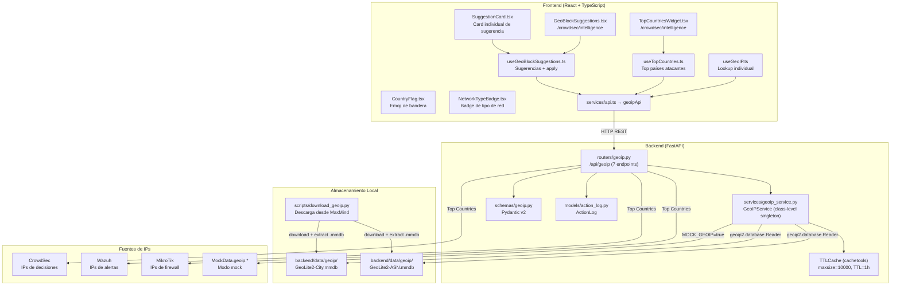
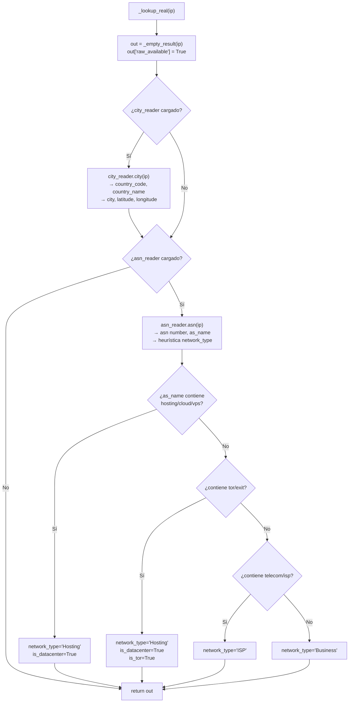
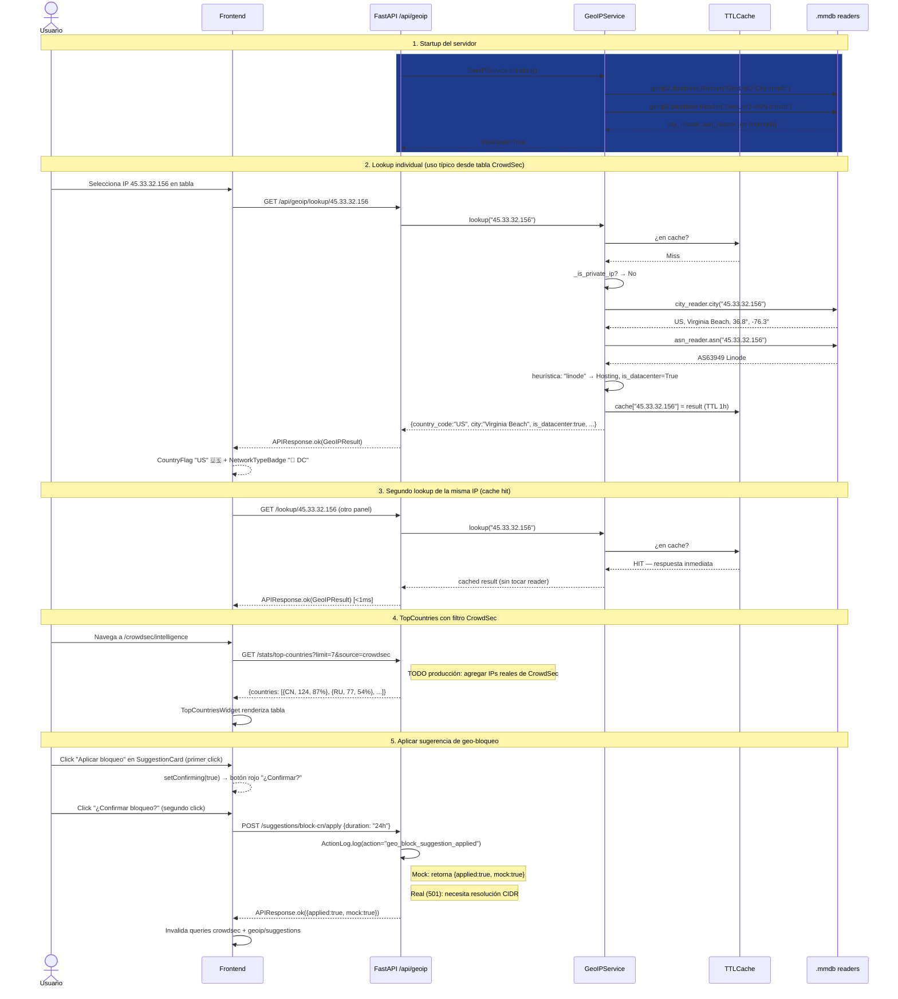

# Módulo GeoLite2 / GeoIP — Documentación Funcional

## Descripción General

El módulo GeoLite2 integra la **geolocalización local de IPs** al dashboard NetShield usando las bases de datos **MaxMind GeoLite2** (gratuitas, descargables con licencia). Permite enriquecer las IPs de todas las fuentes de seguridad (CrowdSec, Wazuh, MikroTik) con información geográfica y de red: país, ciudad, coordenadas, ASN, y clasificación de la red (ISP / Hosting / Datacenter / Tor).

El módulo opera en dos modos:

| Modo | Condición | Comportamiento |
|---|---|---|
| **Mock** (default) | `MOCK_GEOIP=true` o `MOCK_ALL=true` | Retorna datos geográficos simulados sin leer ningún archivo .mmdb |
| **Real** | `MOCK_GEOIP=false` + DBs descargadas | Lee `GeoLite2-City.mmdb` y `GeoLite2-ASN.mmdb` en memoria, consultas via `geoip2` |

> **Nota de privacidad:** Las bases de datos GeoLite2 se ejecutan **100% localmente**. No se realiza ninguna llamada de red para geolocalizair IPs. La única conexión externa es la descarga inicial de las DBs desde MaxMind.

---

## Arquitectura General



---

## Setup — Descarga de las Bases de Datos

Las DBs **no se incluyen** en el repositorio. Deben descargarse manualmente:

### Pasos

1. **Crear una cuenta gratuita** en [maxmind.com/en/geolite2/signup](https://www.maxmind.com/en/geolite2/signup)
2. **Generar una License Key** en "My Account → Manage License Keys"
3. **Configurar el `.env`** del backend:
   ```env
   MAXMIND_LICENSE_KEY=tu_clave_aqui
   MOCK_GEOIP=true   # Mantener true hasta completar la descarga
   ```
4. **Ejecutar el script de descarga**:
   ```bash
   cd netShield2
   python backend/scripts/download_geoip.py
   ```
5. **Cambiar a modo real**:
   ```env
   MOCK_GEOIP=false
   ```
6. **Reiniciar el backend** → GeoIP carga las DBs en el lifespan startup.

### Qué descarga el script

```python
DATABASES = {
    "GeoLite2-City": {
        "edition_id": "GeoLite2-City",
        "filename": "GeoLite2-City.mmdb",
    },
    "GeoLite2-ASN": {
        "edition_id": "GeoLite2-ASN",
        "filename": "GeoLite2-ASN.mmdb",
    },
}
```

El script descarga cada DB como `.tar.gz` desde `https://download.maxmind.com/app/geoip_download`, extrae el `.mmdb` y lo guarda en `backend/data/geoip/`. El `.tar.gz` se elimina tras la extracción.

**Actualización recomendada:** mensual. MaxMind actualiza las bases los martes.

---

## Backend

### 1. Servicio — `GeoIPService`

**Archivo:** `backend/services/geoip_service.py`

#### 1.1 Singleton via Class Variables

A diferencia de otros servicios que usan `__new__`, `GeoIPService` implementa el singleton mediante **variables de clase** compartidas:

```python
class GeoIPService:
    _city_reader = None   # geoip2.database.Reader (GeoLite2-City)
    _asn_reader = None    # geoip2.database.Reader (GeoLite2-ASN)
    _initialized: bool = False
```

Los readers se cargan **una sola vez** en `GeoIPService.initialize()`, y permanecen en memoria durante toda la vida del proceso. Cualquier request que use `GeoIPService.lookup()` accede al mismo reader de clase sin re-abrir el archivo `.mmdb`.

La dependency de FastAPI retorna la **clase** en sí, no una instancia:

```python
def get_geoip_service() -> type[GeoIPService]:
    return GeoIPService   # Retorna la clase (todos los métodos son @classmethod)
```

#### 1.2 Inicialización en el Lifespan

`GeoIPService.initialize()` se llama en el **startup del servidor** (`main.py`):

```python
@asynccontextmanager
async def lifespan(app: FastAPI):
    await init_db()
    await mt_service.connect()

    # GeoIP: carga readers en memoria (síncrono, O(ms))
    GeoIPService.initialize()

    # Suricata...
    await sur_service.connect()
    yield
    # shutdown...
```

**Qué hace `initialize()`:**

```python
@classmethod
def initialize(cls) -> None:
    settings = get_settings()
    if settings.should_mock_geoip:
        logger.info("geoip.mock_mode")
        cls._initialized = True
        return                      # En mock, no se necesiten las DBs

    try:
        import geoip2.database      # Lazy import — solo si no está en mock
        cls._city_reader = geoip2.database.Reader(settings.geoip_city_db)
        cls._asn_reader  = geoip2.database.Reader(settings.geoip_asn_db)
        cls._initialized = True
        logger.info("geoip.initialized")
    except FileNotFoundError as e:
        logger.warning("geoip.db_not_found",
                       hint="Ejecutar: python backend/scripts/download_geoip.py")
        cls._initialized = False    # No rompe el servidor — cae a modo degradado
    except Exception as e:
        logger.error("geoip.init_error", error=str(e))
        cls._initialized = False
```

Si las DBs no existen, el servidor **no falla** — los métodos retornan resultados vacíos (`_empty_result`), permitiendo que el resto del sistema funcione normalmente.

---

#### 1.3 TTLCache — Caché en Memoria

```python
_CACHE: TTLCache = TTLCache(maxsize=10000, ttl=3600)  # 1 hora
```

- **Maxsize:** hasta 10.000 IPs distintas en caché simultáneamente. Cuando se llena, desaloja las entradas más antiguas (LRU).
- **TTL:** 1 hora. Las entradas expiran automáticamente. Sincronizado con `staleTime: 1000 * 60 * 60` en el frontend hook (`useGeoIP`).
- Aplica **a todas las IPs**: privadas, mock y reales.

```python
@classmethod
def lookup(cls, ip: str) -> dict:
    # 1. Cache hit — respuesta inmediata sin tocar la DB
    if ip in _CACHE:
        return _CACHE[ip]

    # 2. IP privada (RFC 1918 / loopback) — sin consultar la DB
    if _is_private_ip(ip):
        result = _local_result(ip)
        _CACHE[ip] = result
        return result

    settings = get_settings()

    # 3. Mock mode
    if settings.should_mock_geoip:
        from services.mock_data import MockData
        result = MockData.geoip.lookup(ip)
        _CACHE[ip] = result
        return result

    # 4. Real DB lookup
    result = cls._lookup_real(ip)
    _CACHE[ip] = result
    return result
```

El orden de resolución es: **caché → privada → mock → real DB**.

---

#### 1.4 Detección de IPs Privadas

```python
def _is_private_ip(ip: str) -> bool:
    parts = ip.split(".")
    if len(parts) != 4:
        return False
    a, b = int(parts[0]), int(parts[1])
    return (
        a == 10                          # 10.0.0.0/8  (RFC 1918)
        or (a == 172 and 16 <= b <= 31)  # 172.16.0.0/12 (RFC 1918)
        or (a == 192 and b == 168)       # 192.168.0.0/16 (RFC 1918)
        or a == 127                      # 127.0.0.0/8 (loopback)
    )
```

Las IPs privadas retornan `country_code="LOCAL"` y `country_name="Red Local"` sin consultar la DB. El frontend muestra el emoji 🏠 vía `CountryFlag`.

> **Nota:** La implementación es manual (sin `ipaddress.ip_address`) para mayor velocidad dado que se llama en el hot path de cada lookup.

---

#### 1.5 Lookup Real — Dos Bases de Datos

**`_lookup_real(ip)`** consulta ambas DBs independientemente y combina el resultado:



**Heurística de clasificación de red** (basada en el nombre del ASN):

| Palabras clave en `as_name` | `network_type` | `is_datacenter` | `is_tor` |
|---|---|---|---|
| `hosting`, `cloud`, `datacenter`, `data center`, `vps`, `server` | `Hosting` | `True` | `False` |
| `tor`, `exit` | `Hosting` | `True` | `True` |
| `telecom`, `telco`, `isp`, `internet` | `ISP` | `False` | `False` |
| Cualquier otro | `Business` | `False` | `False` |

Cada campo se lee en un `try/except` independiente: si la City DB falla para una IP, todavía puede leer el ASN, y viceversa.

---

#### 1.6 Lookup Bulk

```python
@classmethod
def lookup_bulk(cls, ips: list[str]) -> list[dict]:
    settings = get_settings()
    if settings.should_mock_geoip:
        return MockData.geoip.lookup_bulk(ips)

    seen: set[str] = set()
    results = []
    for ip in ips:
        if ip not in seen:
            seen.add(ip)
            results.append(cls.lookup(ip))   # Cada lookup usa el cache
    return results
```

- **Deduplica** IPs repetidas en el input (no genera consultas adicionales).
- Procesa hasta **200 IPs** por request (límite en el schema `BulkLookupRequest`).
- Retorna resultados en el **mismo orden** que el input (sin duplicados).
- Cada `cls.lookup(ip)` individual aprovecha el TTLCache.

---

#### 1.7 Estado de la DB

```python
@classmethod
def get_db_status(cls) -> dict:
    city_info = {"loaded": False, "path": settings.geoip_city_db, ...}
    asn_info  = {"loaded": False, "path": settings.geoip_asn_db,  ...}

    if cls._city_reader is not None:
        meta = cls._city_reader.metadata()
        city_info.update({
            "loaded": True,
            "build_epoch": meta.build_epoch,    # Unix timestamp de la build
            "description": meta.database_type,  # "GeoLite2-City"
        })

    return {
        "city_db":          city_info,
        "asn_db":           asn_info,
        "mock_mode":        False,
        "cache_size":       len(_CACHE),        # IPs actualmente en caché
        "cache_ttl_seconds": 3600,
    }
```

Permite diagnosticar si las DBs están correctamente cargadas, cuándo se construyeron, y cuántas IPs están actualmente en caché.

---

### 2. Resultados estándar

Todos los lookups retornan un dict compatible con `GeoIPResult`:

| Campo | Tipo | Descripción |
|---|---|---|
| `ip` | `str` | IP consultada |
| `country_code` | `str` | ISO 3166-1 alpha-2 (`"CN"`, `"RU"`) o `"LOCAL"` / `""` |
| `country_name` | `str` | Nombre completo (`"China"`) o `"Red Local"` / `""` |
| `city` | `str \| None` | Ciudad (GeoLite2-City DB) |
| `latitude` | `float \| None` | Latitud |
| `longitude` | `float \| None` | Longitud |
| `asn` | `int \| None` | Número de AS (ej: `4134`) |
| `as_name` | `str \| None` | Nombre del AS (ej: `"AS4134 Chinanet"`) |
| `network_type` | `str \| None` | `"ISP"` / `"Hosting"` / `"Business"` / `"Residential"` / `"Local"` |
| `is_datacenter` | `bool` | `True` si el ASN es de hosting/cloud |
| `is_tor` | `bool` | `True` si el ASN es un nodo Tor |
| `raw_available` | `bool` | `False` en mock data, `True` en resultado real |

**IP privada** → `country_code="LOCAL"`, campos geo `None`, `network_type="Local"`, `raw_available=True`.
**Sin DB / error** → todos los campos vacíos/None, `raw_available=False`.

---

### 3. Endpoints REST — `routers/geoip.py`

**Prefijo:** `/api/geoip` | **Total:** 7 endpoints

| Método | Ruta | Descripción |
|---|---|---|
| `GET` | `/lookup/{ip}` | Geolocaliziar una sola IP. Retorna `GeoIPResult`. IPs privadas → `country_code="LOCAL"`. |
| `POST` | `/lookup/bulk` | Batch de hasta 200 IPs. Body: `{"ips": [...]}`. Deduplica y usa TTLCache. |
| `GET` | `/stats/top-countries?limit=10&source=all` | Top países atacantes. Agrega IPs de múltiples fuentes. `source`: `all` \| `crowdsec` \| `wazuh` \| `mikrotik`. |
| `GET` | `/stats/top-asns?limit=10` | Top ASNs atacantes con conteo y flag `is_datacenter`. |
| `GET` | `/suggestions/geo-block` | Sugerencias automáticas de bloqueo regional (por país o ASN). |
| `POST` | `/suggestions/{suggestion_id}/apply` | Aplicar una sugerencia de geo-bloqueo. Body: `{"duration": "24h"}`. **ActionLog** registrada. |
| `GET` | `/db/status` | Estado de las DBs en memoria + tamaño del cache. |

#### Estado de implementación en modo real

| Endpoint | Estado real |
|---|---|
| `/lookup/{ip}` | ✅ Totalmente funcional — consulta las dos DBs |
| `/lookup/bulk` | ✅ Totalmente funcional — deduplica + cache |
| `/stats/top-countries` | ⚠️ Pendiente — actualmente usa mock data en ambos modos |
| `/stats/top-asns` | ⚠️ Pendiente — actualmente usa mock data en ambos modos |
| `/suggestions/geo-block` | ⚠️ Pendiente — actualmente usa mock data en ambos modos |
| `/suggestions/{id}/apply` | ⚠️ Pendiente — en real retorna HTTP 501 (CIDR resolution TODO) |
| `/db/status` | ✅ Totalmente funcional — lee metadata de los readers |

> **TODO producción:** `top-countries` y `top-asns` necesitan agregar IPs reales de CrowdSec + Wazuh + MikroTik y geolocalizarlas con `lookup_bulk`. La lógica está documentada en comentarios del router.

---

#### Endpoint especial: Apply Suggestion

```python
@router.post("/suggestions/{suggestion_id}/apply")
async def apply_geo_block_suggestion(
    suggestion_id: str,
    body: ApplySuggestionRequest,
    db: AsyncSession = Depends(get_db),
) -> APIResponse:
```

Registra siempre en `ActionLog` (acción: `geo_block_suggestion_applied`). En modo real, retorna **HTTP 501** porque la conversión `country_code / ASN → rangos CIDR` aún no está implementada. En mock, retorna éxito simulado con `{"applied": True, "mock": True}`.

Para implementar en producción se requiere una tabla de rangos CIDR pre-calculada (opciones: `ip2location-lite`, `delegated-apnic-latest` de IANA, o tabla propia actualizada mensualmente).

---

### 4. Schemas Pydantic — `schemas/geoip.py`

#### `GeoIPResult`

Schema central de resultado (usado como tipo hint, no en request validation):

```python
class GeoIPResult(BaseModel):
    ip: str
    country_code: str = ""       # ISO 3166-1 alpha-2 | "LOCAL" | "UNKNOWN"
    country_name: str = ""
    city: Optional[str] = None
    latitude: Optional[float] = None
    longitude: Optional[float] = None
    asn: Optional[int] = None
    as_name: Optional[str] = None   # ej: "AS4134 Chinanet"
    network_type: Optional[str] = None
    is_datacenter: bool = False
    is_tor: bool = False
    raw_available: bool = True      # False en mock data
```

#### `BulkLookupRequest`

```python
class BulkLookupRequest(BaseModel):
    ips: list[str] = Field(..., min_length=1, max_length=200)
```

Valida que se envíe al menos 1 IP y máximo 200.

#### `TopCountryItem`

```python
class TopCountryItem(BaseModel):
    country_code: str     # ISO 3166-1 alpha-2
    country_name: str
    count: int            # Total de IPs de ese país
    percentage: float     # 0-100, relativo al total de IPs
    sources: SourceCounts # {crowdsec: N, wazuh: N, mikrotik: N}
    top_asns: list[str]   # Top 3 AS names del país
```

#### `SourceCounts`

```python
class SourceCounts(BaseModel):
    crowdsec: int = 0
    wazuh: int = 0
    mikrotik: int = 0
```

Desglose de la IP count por sistema de origen. Permite filtrar en el `TopCountriesWidget`.

#### `TopASNItem`

```python
class TopASNItem(BaseModel):
    asn: int
    as_name: str
    country_code: str
    count: int
    is_datacenter: bool = False
```

#### `GeoBlockSuggestion`

```python
class GeoBlockSuggestion(BaseModel):
    id: str              # slug como "block-cn" o "block-as4134"
    type: str            # "country" | "asn"
    target: str          # country_code ("CN") o ASN string ("AS4134")
    target_name: str     # "China" o "AS4134 Chinanet"
    reason: str          # Texto explicativo de la sugerencia
    evidence: SuggestionEvidence
    risk_level: str      # "high" | "medium"
    estimated_block_count: int   # ~N IPs que se bloquearían
    suggested_duration: str      # "24h", "7d", etc.
```

#### `SuggestionEvidence`

```python
class SuggestionEvidence(BaseModel):
    crowdsec_ips: list[str]     # IPs de CrowdSec de ese país/ASN
    wazuh_alerts: int           # Número de alertas Wazuh del país/ASN
    affected_agents: list[str]  # Agentes Wazuh afectados
```

#### `ApplySuggestionRequest`

```python
class ApplySuggestionRequest(BaseModel):
    duration: str = "24h"   # Duración del bloqueo
```

#### `GeoIPDBEntry` y `GeoIPDBStatus`

```python
class GeoIPDBEntry(BaseModel):
    loaded: bool = False
    path: str = ""
    build_epoch: Optional[int] = None    # Unix timestamp de la build de MaxMind
    description: str = ""               # "GeoLite2-City" o "GeoLite2-ASN"

class GeoIPDBStatus(BaseModel):
    city_db: GeoIPDBEntry
    asn_db: GeoIPDBEntry
    mock_mode: bool = True
    cache_size: int = 0          # IPs actualmente en TTLCache
    cache_ttl_seconds: int = 3600
```

---

## Frontend

### 5. Estructura de Archivos

```
frontend/src/
├── components/geoip/
│   ├── CountryFlag.tsx          ← Emoji de bandera por código ISO
│   ├── NetworkTypeBadge.tsx     ← Badge visual por tipo de red
│   ├── TopCountriesWidget.tsx   ← Tabla top países con filtro por fuente
│   ├── GeoBlockSuggestions.tsx  ← Panel de sugerencias de geo-bloqueo
│   └── SuggestionCard.tsx       ← Card individual de sugerencia
├── hooks/
│   ├── useGeoIP.ts              ← Lookup individual con staleTime=1h
│   ├── useTopCountries.ts       ← Top países con polling cada 5min
│   └── useGeoBlockSuggestions.ts← Sugerencias con dismiss local + apply mutation
└── services/
    └── api.ts → geoipApi        ← 6 funciones HTTP centralizadas
```

### 6. Navegación

Los componentes GeoIP viven integrados dentro de otras páginas — **no tienen ruta propia**:

| Componente | Dónde se usa |
|---|---|
| `TopCountriesWidget` | `/crowdsec/intelligence` — vista de inteligencia CrowdSec |
| `GeoBlockSuggestions` | `/crowdsec/intelligence` — debajo del widget de países |
| `CountryFlag` | Usado en tablas/cards de CrowdSec, alertas Suricata, etc. |
| `NetworkTypeBadge` | Usado en tablas de alertas y contextos de IP |

---

### 7. Componente: `CountryFlag`

**Propósito:** Convertir un código ISO 3166-1 alpha-2 en un emoji de bandera usando Unicode Regional Indicator Symbols (no requiere fuentes ni CDN externo).

```typescript
function isoToFlagEmoji(code: string): string {
    if (!code || code === 'UNKNOWN') return '🌐';
    if (code === 'LOCAL') return '🏠';
    // Regional Indicator: 0x1F1E6 - 65 + charCode
    return [...code.toUpperCase()]
        .map(c => String.fromCodePoint(0x1F1E6 - 65 + c.charCodeAt(0)))
        .join('');
}
```

**Cómo funciona el emoji:** Cada letra del código ISO se convierte a su Regional Indicator Symbol correspondiente. Los navegadores modernos combinan dos Regional Indicators consecutivos en una bandera emoji. Ejemplo: `"CN"` → `🇨` + `🇳` → 🇨🇳

**Casos especiales:**

| `code` | Emoji |
|---|---|
| ISO válido (ej: `"US"`, `"CN"`) | Bandera del país 🇺🇸 🇨🇳 |
| `"LOCAL"` | 🏠 |
| `"UNKNOWN"` o vacío | 🌐 |

**Sizes:**

| Prop `size` | Clase CSS |
|---|---|
| `sm` | `text-base` |
| `md` (default) | `text-xl` |
| `lg` | `text-3xl` |

Props: `code`, `size` (sm/md/lg), `tooltip` (muestra el código ISO al hover, default `true`), `className`.

---

### 8. Componente: `NetworkTypeBadge`

**Propósito:** Badge visual que indica el tipo de red de una IP. Prioridad de renderizado: Tor > Datacenter > tipo normal.

| Condición | Badge | Estilo |
|---|---|---|
| `isTor=true` | 🧅 Tor | Violeta (`bg-purple-500/20 text-purple-300`) |
| `isDatacenter=true` | 🏢 DC | Ámbar (`bg-amber-500/20 text-amber-300`) |
| `network_type="ISP"` | ISP | Azul |
| `network_type="Hosting"` | Hosting | Ámbar |
| `network_type="Business"` | Business | Cyan |
| `network_type="Residential"` | Residential | Verde |
| `network_type="Local"` | Local | Slate |
| `null` o desconocido | — (nada) | — |

Props: `networkType`, `isDatacenter`, `isTor`, `className`.

---

### 9. Componente: `TopCountriesWidget`

**Propósito:** Tabla de top países atacantes con filtro por fuente y botón de refresco. Ubicado en `/crowdsec/intelligence`.

**Layout:**

```
┌─ Header: 🌐 Top Países Atacantes  [N IPs]  [selector fuente ▾]  [↻] ──┐
├─ Tabla                                                                  ┤
│  País              │ Distribución    │ IPs │ Fuentes        │           │
│  🇨🇳 China  CN     │ ████████░  87%  │ 124 │ [CS 89] [WZ 35]│ Bloquear  │
│  🇷🇺 Russia RU     │ █████░░░░  54%  │  77 │ [CS 60] [MT 17]│ Bloquear  │
│  ...                                                                    │
├─ Footer: "Actualizado 14:30 · polling cada 5 min"  [badge fuente] ──────┘
```

**Selector de fuente:**

```typescript
const SOURCE_OPTIONS = [
    { value: 'all',      label: 'Todas las fuentes' },
    { value: 'crowdsec', label: 'CrowdSec' },
    { value: 'wazuh',    label: 'Wazuh' },
    { value: 'mikrotik', label: 'MikroTik' },
];
```

Cambiar la fuente invalida la query y recarga el top con datos filtrados.

**`CountryRow`** — Fila de tabla:
- Hover muestra botón "Bloquear" (Shield 12px icon, rojo, opacidad 0 → 1).
- `onBlock?.(country.country_code)` → llama al callback del padre para iniciar el geo-bloqueo.
- `ProgressBar`: barra de ancho `percentage`% con gradiente `brand-600 → brand-400`.
- `SourceBadge`: mini-badge `CS / WZ / MT` que solo renderiza si `count > 0`.

**Props:**
- `className?`: clase CSS adicional.
- `onBlockCountry?`: callback `(countryCode: string) => void` para manejo externo del bloqueo.

---

### 10. Componente: `GeoBlockSuggestions`

**Propósito:** Panel que muestra las sugerencias automáticas de geo-bloqueo. Cada sugerencia es un `SuggestionCard`.

**Lógica:**

```
GET /api/geoip/suggestions/geo-block (polling cada 10 min)
│
└─ Lista de GeoBlockSuggestion
   │
   └─ Filtrado client-side: excluye IDs en dismissedIds (Set local)
      │
      └─ Renderiza SuggestionCard por cada sugerencia
```

El **dismiss** es solo client-side (no persiste en backend). Refrescar la página restaura las sugerencias descartadas.

**Footer:** disclaimer indicando que en modo mock los bloqueos son simulados y que en producción se requiere resolución CIDR.

---

### 11. Componente: `SuggestionCard`

**Propósito:** Card individual de sugerencia de geo-bloqueo. Maneja la confirmación de doble clic antes de aplicar.

**Layout:**

```
┌───────────────────────────────────────────────────── [×] ┐  ← borde izq rojo/ámbar
│  🇨🇳 China                    🔴 Alto riesgo  País        │
│  "7 IPs bloqueadas por CrowdSec, 23 alertas Wazuh..."    │
│                                                          │
│  🛡 7 IPs CrowdSec  ⚠ 23 alertas Wazuh  Agentes: WEB01  │
│  [▼ Ver IPs (7)]                                         │
│    192.45.x.x  103.92.x.x  ...                          │
├──────────────────────────────────────────────────────────┤
│  Duración: [24 horas ▾]  ~7 IPs    [Aplicar bloqueo]    │  ← fondo oscuro
└──────────────────────────────────────────────────────────┘
```

**Flujo de confirmación doble:**

```typescript
const handleApply = () => {
    if (!confirming) {
        setConfirming(true);   // Primer click → botón cambia a rojo "¿Confirmar bloqueo?"
        return;
    }
    onApply(suggestion.id, duration);   // Segundo click → ejecuta
    setConfirming(false);
};
```

El botón pasa de `btn-primary` (azul) a `btn-danger` (rojo) en el primer click. Protege contra activaciones accidentales.

**Duración configurable:**

```typescript
const DURATION_OPTIONS = [
    { value: '1h',  label: '1 hora' },
    { value: '6h',  label: '6 horas' },
    { value: '12h', label: '12 horas' },
    { value: '24h', label: '24 horas' },
    { value: '48h', label: '48 horas' },
    { value: '7d',  label: '7 días' },
    { value: '30d', label: '30 días' },
];
```

El selector initializa con `suggestion.suggested_duration` (viene del backend).

**`RiskBadge`:** `high` → 🔴 Alto riesgo, `medium` → 🟡 Riesgo medio.

**IPs colapsables:** lista de `crowdsec_ips` expandible con `[Ver IPs (N)]`, renderizadas como chips `monospace` en fondo oscuro.

---

### 12. Custom Hooks

#### `useGeoIP(ip)`

```typescript
export function useGeoIP(ip: string | null) {
    return useQuery<GeoIPResult | null>({
        queryKey: ['geoip', 'lookup', ip],
        queryFn: async () => {
            if (!ip) return null;
            const res = await geoipApi.lookup(ip);
            return res.success ? res.data : null;
        },
        enabled: !!ip,               // Solo consulta si ip no es null/''
        staleTime: 1000 * 60 * 60,   // 1 hora — sincronizado con el TTLCache del backend
        gcTime: 1000 * 60 * 60 * 2,  // Mantiene en React Query cache 2 horas
    });
}
```

- **`enabled: !!ip`** — no hace fetch si ip es `null` o `""`. Útil cuando el usuario no ha seleccionado ninguna IP.
- **`staleTime=1h`** — coincide con el TTL del backend. Evita refetches innecesarios para la misma IP dentro de una hora.
- No hace polling — la geolocalización de una IP no cambia frecuentemente.

---

#### `useTopCountries({ limit, source, enabled })`

```typescript
export function useTopCountries({
    limit = 7,
    source = 'all',
    enabled = true,
}: UseTopCountriesOptions = {}) {
    return useQuery<TopCountriesResponse | null>({
        queryKey: ['geoip', 'top-countries', limit, source],
        queryFn: async () => {
            const res = await geoipApi.getTopCountries({ limit, source });
            return res.success ? res.data : null;
        },
        enabled,
        staleTime: 1000 * 60 * 5,       // 5 minutos
        refetchInterval: 1000 * 60 * 5, // Polling automático cada 5 min
        gcTime: 1000 * 60 * 15,
    });
}
```

Cambiar `source` cambia la `queryKey`, lo que TanStack Query trata como una nueva query (limpia y refetch). Permite filtrar por CrowdSec, Wazuh o MikroTik.

---

#### `useGeoBlockSuggestions()`

```typescript
export function useGeoBlockSuggestions() {
    const queryClient = useQueryClient();
    const [dismissedIds, setDismissedIds] = useState<Set<string>>(new Set());

    const query = useQuery<GeoBlockSuggestion[]>({
        queryKey: ['geoip', 'suggestions'],
        queryFn: async () => {
            const res = await geoipApi.getSuggestions();
            return (res.success && res.data) ? res.data : [];
        },
        staleTime: 1000 * 60 * 5,
        refetchInterval: 1000 * 60 * 10, // Polling cada 10 minutos
    });

    const applyMutation = useMutation({
        mutationFn: ({ id, duration }) => geoipApi.applySuggestion(id, duration),
        onSuccess: () => {
            queryClient.invalidateQueries({ queryKey: ['geoip', 'suggestions'] });
            queryClient.invalidateQueries({ queryKey: ['crowdsec'] });  // Actualizar decisiones
        },
    });

    const dismiss = (id: string) => {
        setDismissedIds(prev => new Set([...prev, id]));
    };

    const suggestions = (query.data ?? []).filter(s => !dismissedIds.has(s.id));

    return { suggestions, isLoading, apply, isApplying, dismiss, refresh };
}
```

**Puntos clave:**
- `dismissedIds` es **estado local** — al refrescar la página se restauran las sugerencias.
- Tras `apply` exitoso: invalida tanto las sugerencias como las queries de CrowdSec (las decisiones nuevas deben aparecer).
- `suggestions` ya viene **filtrado** — `GeoBlockSuggestions` solo ve las no descartadas.

---

## Enriquecimiento de Datos Existentes

El servicio GeoIP no solo funciona vía endpoints propios — también **enriquece datos de otros módulos** en el backend:

### CrowdSec Decisions

Las decisiones de CrowdSec incluyen un campo `geo` inyectado por el backend:

```typescript
// types.ts
export interface CrowdSecDecision {
    // ...campos propios...
    geo?: {
        city: string | null;
        latitude: number | null;
        longitude: number | null;
        network_type: string | null;
        is_datacenter: boolean;
        is_tor: boolean;
        raw_available: boolean;
    };
}
```

Cuando `crowdsec_service` retorna decisiones, el router llama a `GeoIPService.lookup(decision.ip)` y añade el resultado como `geo` en cada item. Esto permite mostrar banderas y badges de tipo de red directamente en la tabla de decisiones CrowdSec.

### Alertas Suricata

```typescript
export interface SuricataAlert {
    // ...campos propios...
    geo: SuricataGeo | null;   // {country, country_name, as_name}
}
```

En modo real, `suricata_service._normalize_wazuh_suricata_alert()` puede enriquecer con GeoIP. En mock, el campo `geo` viene pre-rellenado en `MockData.suricata.alerts()`.

### IP Context Panel

Cuando el usuario selecciona una IP en cualquier tabla del sistema, `useGeoIP(ip)` se activa automáticamente para mostrar la geolocalización en el panel de contexto lateral.

---

## Flujo de Datos Completo



---

## Modo Mock

Cuando `MOCK_GEOIP=true` (o `MOCK_ALL=true`), todos los endpoints usan `MockData.geoip.*`:

| Método mock | Datos que genera |
|---|---|
| `MockData.geoip.lookup(ip)` | Cicla entre ~10 países comunes (CN, RU, US, BR, IN, DE, etc.) determinísticamente basado en el último octeto de la IP. IPs privadas → `country_code="LOCAL"`. |
| `MockData.geoip.lookup_bulk(ips)` | Llama a `lookup` individualmente para cada IP. |
| `MockData.geoip.top_countries(limit, source)` | 7 países: China, Rusia, EEUU, Brasil, India, Alemania, Países Bajos con conteos y porcentajes realistas. |
| `MockData.geoip.top_asns(limit)` | 8 ASNs: Chinanet, Rostelecom, DigitalOcean, Linode, OVH, Tor Exit Nodes. |
| `MockData.geoip.geo_block_suggestions()` | 3 sugerencias: block-cn (alto riesgo, 7 IPs CrowdSec), block-ru (medio riesgo), block-as4134 (ASN Chinanet). |
| `MockData.geoip.db_status()` | Simula ambas DBs cargadas con `build_epoch` reciente y `cache_size=42`. |

---

## Variables de Entorno

| Variable | Default | Descripción |
|---|---|---|
| `MOCK_GEOIP` | `true` | Habilitar modo mock (sin DBs reales) |
| `GEOIP_CITY_DB` | `backend/data/geoip/GeoLite2-City.mmdb` | Path a la DB de ciudades |
| `GEOIP_ASN_DB` | `backend/data/geoip/GeoLite2-ASN.mmdb` | Path a la DB de ASNs |
| `MAXMIND_LICENSE_KEY` | _(requerida para descarga)_ | License key de MaxMind (solo para `download_geoip.py`) |

La license key **no es necesaria en runtime** — solo para ejecutar `download_geoip.py`. Una vez descargadas las DBs, puede removerse del `.env` si se prefiere.

---

## Configuración en `config.py`

```python
# GeoLite2 databases
geoip_city_db: str = "backend/data/geoip/GeoLite2-City.mmdb"
geoip_asn_db: str  = "backend/data/geoip/GeoLite2-ASN.mmdb"

mock_geoip: bool = True  # True por defecto hasta descargar la DB

@property
def should_mock_geoip(self) -> bool:
    return self._effective_mock_all or self.mock_geoip
```

`should_mock_geoip` es `True` si `MOCK_ALL=true` **o** si `MOCK_GEOIP=true`. Permite mockear GeoIP individualmente.

---

## Casos de Uso

### CU-1: Ver el país de origen de una IP bloqueada por CrowdSec

**Actor:** Administrador de seguridad

1. En la tabla de Decisiones CrowdSec, cada fila muestra `CountryFlag` con la bandera del país.
2. El badge `NetworkTypeBadge` muestra "🏢 DC" si la IP es de un datacenter.
3. Los datos provienen del TTLCache — si la IP nunca fue consultada, se llama a `GeoIPService.lookup()` al renderizar.
4. Si `raw_available=false` (modo mock), los datos son simulados pero la UI se muestra igual.

---

### CU-2: Identificar los países más atacantes

**Actor:** Analista SOC

1. Navega a `/crowdsec/intelligence`.
2. `TopCountriesWidget` muestra el top 7 con barras de progreso.
3. Cambia el selector a "Solo CrowdSec" → la tabla se actualiza mostrando solo IPs de decisiones CrowdSec.
4. Identifica que China tiene 87% del total con 124 IPs.
5. Hace hover sobre la fila → aparece el botón "Bloquear" para iniciar un geo-bloqueo.

---

### CU-3: Actuar sobre una sugerencia de geo-bloqueo

**Actor:** Administrador de seguridad

1. En `/crowdsec/intelligence`, el panel "Sugerencias de Geo-Bloqueo" muestra 2 sugerencias.
2. Primera sugerencia: "🇨🇳 China — Alto riesgo" con evidencia: 7 IPs CrowdSec, 23 alertas Wazuh, agentes WEB01, WEB02.
3. Expande "Ver IPs (7)" para revisar las IPs incluidas.
4. Ajusta la duración a "7 días".
5. Click "Aplicar bloqueo" → botón cambia a rojo "¿Confirmar bloqueo?"
6. Segundo click → se ejecuta `POST /suggestions/block-cn/apply`.
7. En mock: respuesta `{applied: true, mock: true}`. En producción: bloquea los rangos CIDR del país en MikroTik.

---

### CU-4: Verificar que las bases de datos están actualizadas

**Actor:** Administrador de sistema

1. Consulta `GET /api/geoip/db/status`.
2. Respuesta:
```json
{
    "city_db": {
        "loaded": true,
        "path": "backend/data/geoip/GeoLite2-City.mmdb",
        "build_epoch": 1713225600,
        "description": "GeoLite2-City"
    },
    "asn_db": { "loaded": true, ... },
    "mock_mode": false,
    "cache_size": 847,
    "cache_ttl_seconds": 3600
}
```
3. Convierte `build_epoch` a fecha: 2024-04-15. Si tiene más de 30 días, ejecuta el script de actualización.

---

### CU-5: Diagnosticar una IP con actividad sospechosa

**Actor:** Analista SOC

1. La IP `45.33.32.156` aparece en una alerta Wazuh de escaneo de puertos.
2. El analista hace click en la IP → panel lateral activa `useGeoIP("45.33.32.156")`.
3. Resultado: 🇺🇸 Virginia Beach, AS63949 Linode, Hosting, 🏢 DC.
4. Combinando con CrowdSec CTI: la IP tiene `community_score=85`, `reported_by=1200`.
5. Decisión: bloquear via auto-response (la IP es de un datacenter con alto score de CrowdSec).

---

### CU-6: Descarga inicial de las bases de datos

**Actor:** Administrador de sistema (setup inicial)

1. Crea cuenta gratuita en MaxMind.
2. Genera license key en "My Account → Manage License Keys".
3. Agrega al `backend/.env`: `MAXMIND_LICENSE_KEY=AbCd1234567890`.
4. Ejecuta: `python backend/scripts/download_geoip.py`
5. Output:
```
NetShield — Descarga de bases de datos GeoLite2
[GeoLite2-City] Descargando...
[GeoLite2-City] Guardado en: backend/data/geoip/GeoLite2-City.mmdb
[GeoLite2-ASN] Descargando...
[GeoLite2-ASN] Guardado en: backend/data/geoip/GeoLite2-ASN.mmdb

Próximos pasos:
  1. Editar backend/.env
  2. Cambiar: MOCK_GEOIP=false
  3. Reiniciar el backend
```
6. Cambia `MOCK_GEOIP=false` → reinicia el servidor → GeoIP inicializa con datos reales.

---

## Archivos Involucrados

### Backend

| Archivo | Rol |
|---|---|
| `routers/geoip.py` | 7 endpoints REST — lookup, bulk, stats, suggestions, db/status |
| `services/geoip_service.py` | GeoIPService class-singleton — readers, TTLCache, lookup real, lookup_bulk, get_db_status |
| `schemas/geoip.py` | 8 schemas Pydantic v2 — GeoIPResult, BulkLookupRequest, TopCountry*, GeoBlockSuggestion, ApplySuggestionRequest, GeoIPDBStatus |
| `scripts/download_geoip.py` | Script de descarga de DBs desde MaxMind API — autentica con license key, extrae .mmdb de tar.gz |
| `services/mock_data.py` | `MockData.geoip.*` — lookup, bulk, top_countries, top_asns, geo_block_suggestions, db_status |
| `models/action_log.py` | Registro de la acción `geo_block_suggestion_applied` |
| `config.py` | `geoip_city_db`, `geoip_asn_db`, `mock_geoip`, `should_mock_geoip` |
| `main.py` | Llama a `GeoIPService.initialize()` en el lifespan startup (L85) |

### Frontend

| Archivo | Rol |
|---|---|
| `components/geoip/CountryFlag.tsx` | Emoji de bandera por ISO 3166-1 alpha-2 (Unicode Regional Indicators, sin dependencias) |
| `components/geoip/NetworkTypeBadge.tsx` | Badge por tipo de red: Tor > DC > ISP/Hosting/Business/Residential/Local |
| `components/geoip/TopCountriesWidget.tsx` | Tabla top países con filtro por fuente, barra de progreso, botón bloquear |
| `components/geoip/GeoBlockSuggestions.tsx` | Panel de sugerencias con refresh y disclaimer |
| `components/geoip/SuggestionCard.tsx` | Card con evidencia, IPs colapsables, duración configurable, confirmación doble |
| `hooks/useGeoIP.ts` | TanStack Query: lookup individual — `enabled: !!ip`, `staleTime=1h`, `gcTime=2h` |
| `hooks/useTopCountries.ts` | TanStack Query: top países — `staleTime=5min`, `refetchInterval=5min` |
| `hooks/useGeoBlockSuggestions.ts` | TanStack Query: sugerencias — `refetchInterval=10min` + `applyMutation` + dismiss local |
| `services/api.ts → geoipApi` | 6 funciones HTTP: `lookup`, `lookupBulk`, `getTopCountries`, `getTopASNs`, `getSuggestions`, `applySuggestion` |
| `types.ts` | `GeoIPResult`, `GeoIPGeo`, `SourceCounts`, `TopCountryItem`, `TopCountriesResponse`, `TopASNItem`, `SuggestionEvidence`, `GeoBlockSuggestion`, `GeoIPDBEntry`, `GeoIPDBStatus` |
