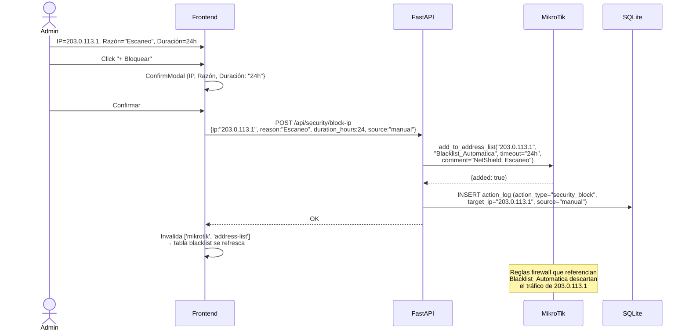
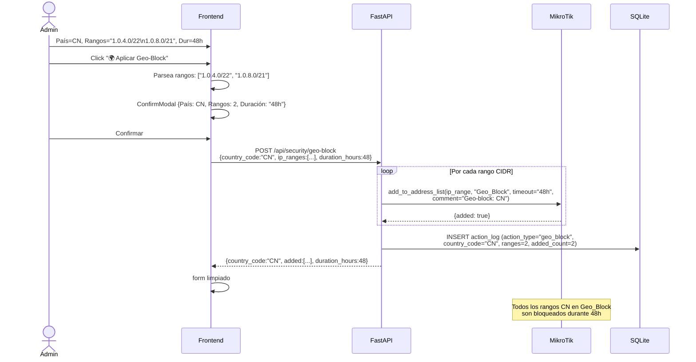
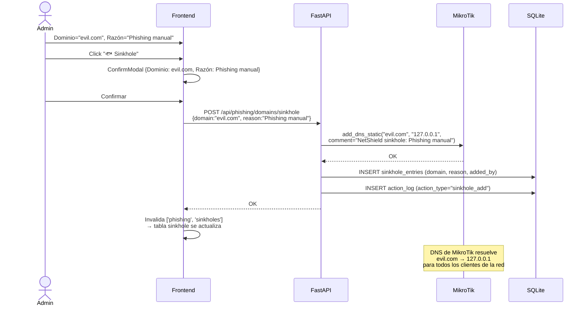

# Configuración — Panel de Seguridad

## Descripción General

El ítem **"Configuración"** en la barra lateral (grupo Seguridad, ruta `/security/config`) es el panel centralizado de control activo de seguridad. Desde aquí el administrador puede bloquear IPs manualmente vía address-list, aplicar geo-bloqueos por país y gestionar el DNS Sinkhole — **sin necesidad de tocar MikroTik directamente**.

> [!IMPORTANT]
> **Todas las acciones son destructivas y requieren confirmación** mediante `ConfirmModal` antes de ejecutarse. Cada acción queda registrada en `ActionLog` (SQLite) para auditoría.

Las 3 secciones de esta página comparten la misma address-list `Blacklist_Automatica` y el DNS static de MikroTik como destino final, pero usan endpoints de backend distintos según el tipo de operación.

---

## Arquitectura General

```mermaid
graph TB
    subgraph Frontend["Frontend (React + TypeScript)"]
        CV["ConfigView.tsx<br/>1 componente — 262 líneas<br/>3 secciones + ConfirmModal"]
        HSA["useSecurityActions.ts<br/>useBlockIP()<br/>useGeoBlock()"]
        HP["usePhishing.ts<br/>useSinkholeDomain()<br/>useRemoveSinkhole()<br/>useSinkholes()"]
        API1["securityApi<br/>blockIP()<br/>geoBlock()"]
        API2["mikrotikApi<br/>getAddressList()"]
        API3["phishingApi<br/>sinkholeDomain()<br/>removeSinkhole()<br/>getSinkholes()"]
    end

    subgraph Backend["Backend (FastAPI)"]
        SEC["routers/security.py<br/>POST /security/block-ip<br/>POST /security/geo-block"]
        PHI["routers/phishing.py<br/>GET /domains/sinkhole<br/>POST /domains/sinkhole<br/>DELETE /domains/sinkhole/{domain}"]
        MT_R["routers/mikrotik.py<br/>GET /mikrotik/address-list"]
        DB["models/action_log.py<br/>models/sinkhole_entry.py<br/>SQLite"]
    end

    subgraph External["MikroTik RouterOS"]
        AL1["/ip/firewall/address-list<br/>Blacklist_Automatica (bloqueo manual)<br/>Geo_Block (geo-bloqueo)"]
        DNS["/ip/dns/static<br/>domain → 127.0.0.1"]
    end

    CV --> HSA & HP
    HSA --> API1
    CV --> API2
    HP --> API3
    API1 --> SEC
    API2 --> MT_R
    API3 --> PHI
    SEC --> AL1
    SEC --> DB
    PHI --> DNS
    PHI --> DB
    MT_R --> AL1

    style External fill:#1e293b,stroke:#475569
```



**Diferencia clave entre las 3 secciones:**

| Sección | Endpoint Backend | Lista MikroTik | Persistencia SQLite |
|---|---|---|---|
| Blacklist Manual | `POST /security/block-ip` | `Blacklist_Automatica` | `ActionLog` |
| Geo-Block | `POST /security/geo-block` | `Geo_Block` | `ActionLog` |
| DNS Sinkhole | `POST /phishing/domains/sinkhole` | `/ip/dns/static` | `SinkholeEntry` + `ActionLog` |

---

## Backend

### Endpoints Usados por Esta Página

Prefijo seguridad: `/api/security` | Prefijo phishing: `/api/phishing`

| Método | Ruta | Descripción | MikroTik |
|---|---|---|---|
| `POST` | `/security/block-ip` | Bloquear IP manualmente | `add_to_address_list("Blacklist_Automatica")` |
| `POST` | `/security/geo-block` | Bloquear rangos CIDR por país | `add_to_address_list("Geo_Block")` ×N |
| `GET` | `/mikrotik/address-list` | Leer Blacklist_Automatica (tabla UI) | `get_address_list("Blacklist_Automatica")` |
| `GET` | `/phishing/domains/sinkhole` | Listar sinkholes activos | `get_dns_static()` + `SELECT SinkholeEntry` |
| `POST` | `/phishing/domains/sinkhole` | Agregar dominio a sinkhole | `add_dns_static(domain, "127.0.0.1")` |
| `DELETE` | `/phishing/domains/sinkhole/{domain}` | Eliminar dominio del sinkhole | `remove_dns_static(domain)` |

> [!NOTE]
> Los endpoints de sinkhole son los **mismos** utilizados por el módulo de Phishing (`/phishing`). `ConfigView` los reutiliza a través de los mismos hooks `useSinkholeDomain()` / `useRemoveSinkhole()` de `usePhishing.ts`. No existe duplicación de lógica.

### Schemas Pydantic

Archivo: `schemas/security.py`

```python
class SecurityBlockIPRequest(BaseModel):
    ip: str
    reason: str = "Blocked via NetShield"
    duration_hours: int = 24            # Opciones: 1, 6, 12, 24, 48, 168h
    source: str = "manual"              # "manual" | "auto"

class GeoBlockRequest(BaseModel):
    country_code: str = Field(..., min_length=2, max_length=2)  # ej: "CN", "RU"
    ip_ranges: list[str]                # Rangos CIDR, ej: ["1.2.3.0/24", "5.6.7.0/24"]
    duration_hours: int = 24

# SinkholeRequest vive en schemas/phishing.py (visto en doc de phishing)
class SinkholeRequest(BaseModel):
    domain: str = Field(..., min_length=3)
    reason: str = "Phishing detected via NetShield"
```

### `POST /api/security/block-ip` — Bloqueo Manual

```python
# Agrega IP a address-list con timeout
result = await mikrotik.add_to_address_list(
    ip=request.ip,
    list_name="Blacklist_Automatica",
    timeout=f"{request.duration_hours}h",
    comment=f"NetShield: {request.reason}",
)

# Registra en ActionLog
log_entry = ActionLog(
    action_type="security_block",    # distinto de "block" del firewall directo
    target_ip=request.ip,
    details={"reason": ..., "duration_hours": ..., "source": "manual",
             "list": "Blacklist_Automatica"},
)
```

> [!TIP]
> La diferencia entre **Blacklist_Automatica** (este módulo) y las reglas `drop` de `chain=forward` (módulo Firewall) es que la address-list funciona como una blacklist referenciada por reglas de firewall existentes en MikroTik. Un router bien configurado tendrá una regla: `DROP src-address-list=Blacklist_Automatica`. Esto permite agregar/quitar IPs sin modificar las reglas de firewall directamente.

### `POST /api/security/geo-block` — Geo-Bloqueo

```python
# Itera sobre cada rango CIDR y los agrega a "Geo_Block"
for ip_range in request.ip_ranges:
    await mikrotik.add_to_address_list(
        ip=ip_range,
        list_name="Geo_Block",
        timeout=f"{request.duration_hours}h",
        comment=f"Geo-block: {request.country_code}",
    )

# Una sola entrada en ActionLog con todos los rangos
ActionLog(
    action_type="geo_block",
    details={"country_code": "CN", "ip_ranges": [...], "duration_hours": 24,
             "added_count": N}
)
```

**Limitación lab vs producción:**

| Modo | Comportamiento |
|---|---|
| **Lab** | El administrador ingresa los rangos CIDR manualmente en el textarea |
| **Producción (TODO)** | Integrar GeoIP (ip2location-lite / MaxMind GeoLite2) para resolución automática `country_code → ip_ranges` |

### `POST /api/security/auto-block` (endpoint adicional, no usado por ConfigView)

Expuesto en `security.py` para ser invocado por el **NotificationPanel** al recibir alertas críticas via WebSocket. Agrega a `Blacklist_Automatica` con `action_type="auto_block"`. Confirma acción antes de ejecutar.

### `POST /api/security/quarantine` (endpoint adicional, no usado por ConfigView)

Mueve el puerto switch de un agente Wazuh a una VLAN de cuarentena. Requiere bridge físico por puerto — actualmente **placeholder** en entorno de laboratorio virtual (VirtualBox).

---

## Frontend

Ruta: `/security/config` — página única, **3 secciones verticales**, sin tabs.

### Estructura

```
frontend/src/
├── components/security/
│   └── ConfigView.tsx          ← Componente único (262 líneas)
├── hooks/
│   ├── useSecurityActions.ts   ← useBlockIP(), useGeoBlock()
│   └── usePhishing.ts          ← useSinkholeDomain(), useRemoveSinkhole(), useSinkholes()
└── services/
    └── api.ts                  → securityApi + mikrotikApi + phishingApi
```

### Layout

```
┌─────────────────────────────────────────────────────────────┐
│  ⚙️ Configuración de Seguridad                              │
├─────────────────────────────────────────────────────────────┤
│  🛡️ Bloqueo Manual de IP                    [badge: N IPs] │
│  ┌────────┬──────────────────────┬────────┬──────────────┐ │
│  │ IP     │ Razón                │ Dur. ▼ │ [+ Bloquear] │ │
│  └────────┴──────────────────────┴────────┴──────────────┘ │
│  ┌──────────────────────────────────────────────────────┐  │
│  │ Tabla Blacklist_Automatica: IP | Lista | Timeout | … │  │
│  └──────────────────────────────────────────────────────┘  │
├─────────────────────────────────────────────────────────────┤
│  🌍 Geo-Blocking                                           │
│  [nota lab mode — rangos manuales en producción usar GeoIP] │
│  ┌──────┬──────────────────────────────┬─────────────────┐ │
│  │ País │ Rangos CIDR (uno por línea)  │ Dur. ▼          │ │
│  │  CN  │ 1.0.4.0/22                   │                 │ │
│  │      │ 1.0.8.0/21                   │ [🌍 Aplicar]    │ │
│  └──────┴──────────────────────────────┴─────────────────┘ │
├─────────────────────────────────────────────────────────────┤
│  🐟 DNS Sinkhole                            [badge: N dom.] │
│  ┌────────────────────┬──────────────────┬───────────────┐ │
│  │ Dominio            │ Razón            │ [🐟 Sinkhole] │ │
│  └────────────────────┴──────────────────┴───────────────┘ │
│  ┌──────────────────────────────────────────────────────┐  │
│  │ Tabla sinkholes: Dominio | Resuelve a | Razón | 🗑️   │  │
│  └──────────────────────────────────────────────────────┘  │
└─────────────────────────────────────────────────────────────┘
```

### Sección 1: Bloqueo Manual de IP

| Elemento | Comportamiento |
|---|---|
| **Input IP** | Texto libre, ej: `203.0.113.1` |
| **Input Razón** | Texto libre — se convierte en comment en MikroTik |
| **Select Duración** | Opciones: 1h / 6h / 12h / 24h / 48h / 168h (1 semana). Default: 24h |
| **Botón "+ Bloquear"** | Deshabilitado si `blockIP.trim()` está vacío → abre ConfirmModal |
| **Tabla Blacklist_Automatica** | `refetchInterval: 30_000` — muestra IP, lista, timeout ("Permanente" si vacío), comentario |

La tabla se obtiene a través de la query:
```typescript
useQuery({
    queryKey: ['mikrotik', 'address-list', 'Blacklist_Automatica'],
    queryFn: () => mikrotikApi.getAddressList('Blacklist_Automatica'),
    select: r => r.data ?? [],
    refetchInterval: 30_000,
})
```

### Sección 2: Geo-Blocking

| Elemento | Comportamiento |
|---|---|
| **Input País** | Máximo 2 caracteres, autoUpperCase — ej: `CN`, `RU`, `KP` |
| **Textarea Rangos CIDR** | Un rango por línea — el frontend parsea con `.split('\n').map(r => r.trim()).filter(Boolean)` |
| **Select Duración** | Opciones: 6h / 12h / 24h / 48h / 168h. Default: 24h |
| **Botón "🌍 Aplicar Geo-Block"** | Deshabilitado si `geoCountry` o `geoRanges` están vacíos → abre ConfirmModal |
| **Nota informativa** | Card con borde izquierdo explicando la limitación de lab y qué hacer en producción |

### Sección 3: DNS Sinkhole

| Elemento | Comportamiento |
|---|---|
| **Input Dominio** | Texto libre, min 3 chars — ej: `evil.com` |
| **Input Razón** | Texto libre (default: "Manual" si vacío) |
| **Botón "🐟 Sinkhole"** | Deshabilitado si `sinkholeInput.trim()` vacío → ConfirmModal |
| **Tabla Sinkholes** | `refetchInterval: 60_000` — columnas: Dominio, Resuelve a (127.0.0.1), Razón, Fecha, 🗑️ Eliminar |
| **Botón 🗑️** | Abre ConfirmModal `variant="warning"` antes de eliminar |

### ConfirmModal — 4 Variantes

| Tipo | Título | Descripción | Variant |
|---|---|---|---|
| `block` | "Bloquear IP" | "Esta IP será bloqueada en MikroTik vía address-list." | `danger` |
| `geo` | "Aplicar Geo-Block" | "Los rangos IP serán añadidos a la lista Geo_Block en MikroTik." | `danger` |
| `sinkhole` | "Agregar DNS Sinkhole" | "Este dominio será redirigido a 127.0.0.1 en el DNS de MikroTik." | `danger` |
| `removeSinkhole` | "Eliminar Sinkhole" | "Este dominio será eliminado del DNS sinkhole. El tráfico hacia él se restaurará." | `warning` |

La función `handleConfirmAction` despacha a la mutation correcta según `confirm.type`:

```typescript
if (confirm.type === 'block') {
    await blockIPMutation.mutateAsync(confirm.payload as SecurityBlockIPRequest);
    setBlockIP(''); setBlockReason();       // limpiar form
    refetchBlacklist();                      // refetch manual de tabla
} else if (confirm.type === 'geo') {
    await geoBlockMutation.mutateAsync(confirm.payload as GeoBlockRequest);
    setGeoCountry(''); setGeoRanges('');
} else if (confirm.type === 'sinkhole') {
    await sinkholeMutation.mutateAsync({ domain, reason });
    setSinkholeInput(''); setSinkholeReason('');
} else if (confirm.type === 'removeSinkhole') {
    await removeSinkholeMutation.mutateAsync(confirm.payload as string);
}
```

### Hooks

```typescript
// useSecurityActions.ts
useBlockIP()
// POST /api/security/block-ip (SecurityBlockIPRequest)
// onSuccess → invalida ['mikrotik', 'address-list']

useGeoBlock()
// POST /api/security/geo-block (GeoBlockRequest)
// onSuccess → invalida ['mikrotik', 'address-list']

// usePhishing.ts (compartido con módulo Phishing)
useSinkholeDomain()
// POST /api/phishing/domains/sinkhole
// onSuccess → invalida ['phishing', 'sinkholes'] + ['phishing', 'domains']

useRemoveSinkhole()
// DELETE /api/phishing/domains/sinkhole/{domain}
// onSuccess → invalida ['phishing', 'sinkholes']

useSinkholes()
// GET /api/phishing/domains/sinkhole,  refetchInterval: 60_000
```

---

## Flujos de Datos

### Flujo 1: Bloqueo Manual de IP



### Flujo 2: Geo-Bloqueo por País



### Flujo 3: Agregar DNS Sinkhole



---

## Relación con Otros Módulos

```mermaid
graph LR
    CONFIG["/security/config<br/>ConfigView"] -->|"reutiliza hooks"| PHISHING["/phishing<br/>PhishingPanel"]
    CONFIG -->|"address-list<br/>Blacklist_Automatica"| FIREWALL["/firewall<br/>FirewallPage"]

    LAYOUT["Layout.tsx<br/>NotificationPanel"] -->|"useBlockIP<br/>desde GlobalSearch"| CONFIG
    LAYOUT -->|"ConfirmModal global<br/>blockIPTarget"| LAYOUT

    style CONFIG fill:#1e1b4b,stroke:#6366f1
```



| Módulo | Relación con Configuración |
|---|---|
| **Phishing** | Comparte endpoints de sinkhole y hooks `useSinkholeDomain()` / `useRemoveSinkhole()` |
| **Firewall** | Ambos bloquean IPs pero en mecanismos distintos: Firewall usa reglas `drop chain=forward`; Configuración usa address-list `Blacklist_Automatica` |
| **Layout (NotificationPanel)** | El bloqueo global desde GlobalSearch y NotificationPanel usa `useBlockIP()` del mismo hook, pero con `source:"auto"` y duración de 24h fija |

---

## Modo Mock

| Operación | Comportamiento Mock |
|---|---|
| `getAddressList("Blacklist_Automatica")` | `MockData.mikrotik.address_lists()` — retorna 3-5 IPs ficticias con timeouts |
| `blockIP()` | `MockService.add_to_address_list()` — agrega en memoria, `{added: true}` |
| `geoBlock()` | Loop sobre rangos CIDR → `MockService.add_to_address_list()` para cada uno |
| `getSinkholes()` | `MockData.mikrotik.dns_static()` enriquecido con SQLite real |
| `sinkholeDomain()` | `MockService.add_dns_static()` — agrega en memoria |
| `removeSinkhole()` | `MockService.remove_dns_static()` — elimina de memoria |

> [!TIP]
> El mock de address-list es volátil. La tabla Blacklist_Automatica se limpia al reiniciar el backend. Los sinkholes tienen doble persistencia: MikroTik (mock volátil) + SQLite (real per-restart).

---

## Casos de Uso

### CU-1: Bloquear IP manualmente tras incidente

**Actor:** Administrador de seguridad

1. Identifica IP `45.142.122.50` realizando ataques de fuerza bruta
2. En la sección **Bloqueo Manual de IP**: ingresa la IP, razón `"Fuerza bruta SSH"`, duración `168h` (1 semana)
3. Click **"+ Bloquear"** → `ConfirmModal` → confirma
4. La IP aparece en la tabla con timeout `168h`
5. MikroTik agrega la IP a `Blacklist_Automatica` — las reglas de firewall referenciando esta lista descartan su tráfico automáticamente

---

### CU-2: Ver IPs actualmente bloqueadas

**Actor:** Administrador de red

1. Navega a **Configuración** → sección Bloqueo Manual de IP
2. La tabla muestra todas las IPs en `Blacklist_Automatica` con su timeout restante
3. Las IPs con `timeout: "Permanente"` (vacío) son bloqueos sin expiración
4. Identifica bloqueos que ya no son necesarios y los gestiona desde el módulo Firewall

---

### CU-3: Geo-bloquear un país con actividad sospechosa

**Actor:** Administrador de seguridad

1. Wazuh muestra múltiples alertas desde rangos de China
2. En la sección **Geo-Blocking**: código país `CN`, rangos CIDR (pegados desde un listado GeoIP externo), duración `48h`
3. Click **"🌍 Aplicar Geo-Block"** → `ConfirmModal` muestra: País=CN, Rangos=15, Duración=48h
4. Confirma → cada rango se agrega a `Geo_Block` en MikroTik
5. Transcurridas 48h, MikroTik elimina automáticamente todos los rangos

---

### CU-4: Agregar dominio malicioso a DNS Sinkhole

**Actor:** Administrador de seguridad

1. Recibe reporte de un dominio de phishing: `fake-banco-sa.com`
2. En la sección **DNS Sinkhole**: dominio `fake-banco-sa.com`, razón `"Phishing bancario reportado"`
3. Click **"🐟 Sinkhole"** → `ConfirmModal` → confirma
4. MikroTik agrega entrada DNS: `fake-banco-sa.com → 127.0.0.1`
5. Cualquier cliente de la red que intente resolver el dominio obtiene `127.0.0.1` → conexión falla silenciosamente

---

### CU-5: Eliminar sinkhole de dominio que fue dado de alta por error

**Actor:** Administrador de red

1. Ve en la tabla de sinkholes que `analytics.company.com` fue sinkholed incorrectamente
2. Click en 🗑️ de esa fila → `ConfirmModal variant="warning"`: "El tráfico DNS hacia este dominio se restaurará"
3. Confirma → MikroTik elimina la entrada DNS estática
4. SQLite actualiza el registro de `sinkhole_entries`
5. El dominio vuelve a resolverse normalmente en la red

---

### CU-6: Bloquear IP temporal para análisis forense

**Actor:** Analista de seguridad

1. Detecta IP `192.168.10.45` con comportamiento anómalo que necesita investigar
2. Selecciona duración `1h` — suficiente para aislar el equipo temporalmente
3. Completa bloqueo con razón `"Análisis forense — comportamiento anómalo detectado Wazuh"`
4. Realiza el análisis con el equipo aislado
5. Transcurrida 1 hora, MikroTik elimina automáticamente la restricción sin intervención manual

---

## Archivos Involucrados

### Backend

| Archivo | Rol |
|---|---|
| [security.py](file:///home/nivek/Documents/netShield2/backend/routers/security.py) | `POST /block-ip`, `POST /geo-block`, `POST /auto-block`, `POST /quarantine` (271 líneas) |
| [security.py](file:///home/nivek/Documents/netShield2/backend/schemas/security.py) | `SecurityBlockIPRequest`, `GeoBlockRequest`, `QuarantineRequest` y schemas de respuesta (166 líneas) |
| [phishing.py](file:///home/nivek/Documents/netShield2/backend/routers/phishing.py) | Endpoints sinkhole reutilizados: `GET/POST /domains/sinkhole`, `DELETE /domains/sinkhole/{domain}` |
| [action_log.py](file:///home/nivek/Documents/netShield2/backend/models/action_log.py) | Auditoría: `security_block`, `geo_block`, `sinkhole_add`, `sinkhole_remove` |
| [mikrotik_service.py](file:///home/nivek/Documents/netShield2/backend/services/mikrotik_service.py) | `add_to_address_list()`, `get_address_list()`, `add_dns_static()`, `remove_dns_static()` |

### Frontend

| Archivo | Rol |
|---|---|
| [ConfigView.tsx](file:///home/nivek/Documents/netShield2/frontend/src/components/security/ConfigView.tsx) | Página completa: 3 secciones + 4 variantes ConfirmModal (262 líneas) |
| [useSecurityActions.ts](file:///home/nivek/Documents/netShield2/frontend/src/hooks/useSecurityActions.ts) | `useBlockIP()`, `useAutoBlock()`, `useGeoBlock()`, `useQuarantine()` |
| [usePhishing.ts](file:///home/nivek/Documents/netShield2/frontend/src/hooks/usePhishing.ts) | `useSinkholes()`, `useSinkholeDomain()`, `useRemoveSinkhole()` (compartido con Phishing) |
| [api.ts](file:///home/nivek/Documents/netShield2/frontend/src/services/api.ts) → `securityApi` | `blockIP()`, `autoBlock()`, `geoBlock()`, `quarantine()` |
| [api.ts](file:///home/nivek/Documents/netShield2/frontend/src/services/api.ts) → `mikrotikApi` | `getAddressList(listName)` |
| [types.ts](file:///home/nivek/Documents/netShield2/frontend/src/types.ts) | `SecurityBlockIPRequest`, `GeoBlockRequest`, `AddressListEntry` |
