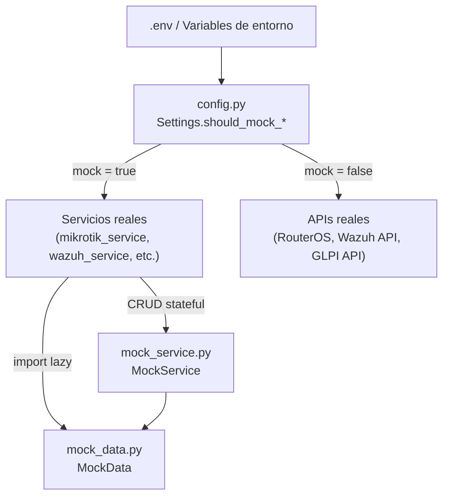

# Sistema de Datos Mock — NetShield Dashboard

## Arquitectura General

El sistema mock se compone de **3 capas**:

| Capa | Archivo | Responsabilidad |
|---|---|---|
| **Configuración** | [config.py](file:///home/nivek/Documents/netShield2/backend/config.py) | Flags `MOCK_*` que activan/desactivan mock por servicio |
| **Datos estáticos** | [mock_data.py](file:///home/nivek/Documents/netShield2/backend/services/mock_data.py) | Clase `MockData` con todos los datos de prueba (813 líneas) |
| **Servicio con estado** | [mock_service.py](file:///home/nivek/Documents/netShield2/backend/services/mock_service.py) | Clase `MockService` — facade con CRUD en memoria sobre los datos mock |

---

## Cómo se activa el modo Mock

Controlado por variables de entorno en `.env`:

| Variable | Efecto |
|---|---|
| `MOCK_ALL=true` | **Todos** los servicios en mock |
| `MOCK_MIKROTIK=true` | Solo MikroTik en mock |
| `MOCK_WAZUH=true` | Solo Wazuh en mock |
| `MOCK_GLPI=true` | Solo GLPI en mock |
| `MOCK_ANTHROPIC=true` | Solo Anthropic (IA) en mock |
| `APP_ENV=lab` (sin MOCK_*) | Retrocompatibilidad: activa `MOCK_ALL` automáticamente |

> [!TIP]
> Cada servicio verifica `settings.should_mock_<servicio>` antes de llamar a la API real. Si es `true`, devuelve datos de `MockData` en lugar de hacer la llamada de red.

---

## Entidades Compartidas (Backbone)

Los datos mock son **coherentes entre servicios**. Las mismas IPs, MACs y nombres aparecen en MikroTik, Wazuh y GLPI:

### Hosts del laboratorio (`_LAB_HOSTS`)

| IP | MAC | Nombre | Interface | En Wazuh | En GLPI |
|---|---|---|---|---|---|
| `192.168.88.1` | `4C:5E:0C:11:22:33` | MikroTik-GW | bridge | — | — |
| `192.168.88.10` | `52:54:00:AA:BB:01` | lubuntu_desk_1 | ether2 | Agente 004 | PC-Lab-01 |
| `192.168.88.11` | `52:54:00:AA:BB:02` | lubuntu_desk_2 | ether2 | Agente 005 | PC-Lab-02 |
| `192.168.88.20` | `52:54:00:CC:DD:01` | PC-Aula3-01 | ether3 | Agente 006 (disconnected) | PC-Aula3-01 |
| `192.168.88.21` | `52:54:00:CC:DD:02` | PC-Aula3-02 | ether3 | — | PC-Aula3-02 |
| `192.168.88.50` | `52:54:00:FF:00:01` | wazuh-server | ether4 | Agente 000 (manager) | Server-Wazuh |
| `192.168.88.100` | `52:54:00:EE:EE:EE` | unknown-guest | hotspot | — | — |
| `192.168.100.115` | `08:00:27:AB:CD:EF` | wazuh-phy | ether1 | Agente 001 | — |

### Atacantes externos (`_ATTACKERS`)

| IP | Rol | Aparece en |
|---|---|---|
| `203.0.113.45` | Brute force | Alertas Wazuh, Firewall rules, Address lists, Conexiones |
| `198.51.100.22` | Port scan | Alertas Wazuh, Firewall rules, Address lists |
| `203.0.113.99` | Phishing C2 | Alertas Wazuh, DNS Sinkhole, Firewall rules |

> [!IMPORTANT]
> Todas las IPs externas usan rangos de documentación RFC (203.0.113.0/24, 198.51.100.0/24) — nunca IPs reales.

---

## Catálogo de Datos por Servicio

### 🟦 MikroTik (`MockData.mikrotik`)

| Método | Cantidad | Descripción |
|---|---|---|
| `interfaces()` | 8 | ether1-4, bridge, vlan10, vlan20, hotspot1 con contadores de bytes |
| `arp_table()` | 8 | Tabla ARP completa derivada de `_LAB_HOSTS` |
| `connections()` | 6 | Conexiones activas (lab↔atacantes, lab↔lab, lab↔internet) |
| `firewall_rules()` | 5 | 3 drops (NetShield auto-block + sinkhole), 1 accept, 1 drop invalid |
| `address_lists()` | 4 | Blacklist_Automatica, Geoblock, Sinkhole |
| `vlans()` | 4 | VLAN 10 (Docentes), 20 (Estudiantes), 30 (Servidores), 99 (Cuarentena) |
| `vlan_traffic()` | 4 | Tráfico por VLAN (bps). VLAN 99 inactiva |
| `vlan_addresses()` | 4 | Subredes 10.10.X.0/24 y 10.99.99.0/24 |
| `traffic()` | 6 | Snapshot base de tráfico por interface (bps) |
| `logs()` | 10 | Logs de firewall, DHCP, hotspot, system, interface |
| `system_health()` | 1 | RouterOS 7.14.2, CPU 12%, 1GB RAM, CHR x86_64 |
| `dns_static()` | 2 | Sinkholes: evil-phishing.com, malware-c2.net → 127.0.0.1 |

---

### 🟧 Wazuh (`MockData.wazuh`)

| Método | Cantidad | Descripción |
|---|---|---|
| `agents()` | 5 | 4 activos + 1 disconnected (PC-Aula3-01). Ubuntu, Lubuntu, Windows |
| `agents_summary()` | 1 | Resumen: 4 active, 1 disconnected, 5 total |
| `alerts()` | Hasta 50 | 10 templates rotativos con niveles 3-14. Filtrable por `level_min` y `agent_id` |
| `critical_alerts()` | Variable | Alertas con nivel ≥ 10 (auth failure, rootkit, brute force) |
| `alerts_timeline()` | 60 min | Conteo por minuto con picos en minutos 15 y 45 |
| `top_agents()` | 5 | Agentes rankeados por cantidad de alertas |
| `mitre_summary()` | 7 | Técnicas MITRE: T1110, T1566, T1046, T1014, T1548, T1059, T1071 |
| `health()` | 1 | 7 servicios Wazuh running, versión 4.7.1, cluster deshabilitado |
| `phishing_alerts()` | Variable | Subconjunto de alertas con "phishing" o `dst_url` |

**Templates de alertas (10 tipos):**

| Nivel | Descripción | MITRE | IP Fuente |
|---|---|---|---|
| 12 | Authentication failure | T1110 Brute Force | 203.0.113.45 |
| 14 | Multiple auth failures | T1110 Brute Force | 203.0.113.45 |
| 7 | Port scan detected | T1046 Network Service Discovery | 198.51.100.22 |
| 10 | Rootkit: hidden file | T1014 Rootkit | — |
| 5 | System audit: command | T1059 Command/Scripting | — |
| 8 | Phishing site access | T1566 Phishing | 203.0.113.99 |
| 6 | Unexpected outbound conn. | T1071 App Layer Protocol | 203.0.113.45 |
| 9 | Privilege escalation (sudo) | T1548 Abuse Elevation | — |
| 3 | Log rotation executed | — | — |
| 4 | Successful SSH login | — | — |

---

### 🟩 GLPI (`MockData.glpi`)

| Método | Cantidad | Descripción |
|---|---|---|
| `computers()` | 8 | Inventario de PCs: 5 activos, 1 reparación, 1 retirado, 1 sin IP |
| `stats()` | 1 | Conteo por estado |
| `tickets()` | 5 | Tickets de soporte — 2 creados por NetShield (auto-cuarentena, alertas) |
| `users()` | 5 | Usuarios GLPI: docentes, técnicos, admin |
| `locations()` | 5 | Aulas 101-102, Lab Redes, Lab Sistemas, Sala Servidores |

**Equipos notables:**
- **PC-Lab-01** (`192.168.88.10`) — el más atacado, con ticket de alerta crítica
- **PC-Aula2-01** (`192.168.88.30`) — en reparación, disco dañado
- **PC-Retirado-01** — Windows 7 EOL, sin IP (dado de baja)

---

### 🟪 Portal Cautivo (`MockData.portal`)

| Método | Cantidad | Descripción |
|---|---|---|
| `profiles()` | 5 | default, docentes (50M), estudiantes (5M), unregistered (1M), admin (100M) |
| `users()` | 5 | Usuarios del hotspot con perfiles asignados |
| `active_sessions()` | 4 | 3 registrados + 1 guest sin usuario |
| `session_history()` | 6 | Historial de sesiones pasadas |
| `realtime_stats()` | 1 | 4 sesiones activas, 3 registradas, 1 sin registro, pico=12 |
| `summary_stats()` | 1 | 23 usuarios únicos, heatmap 24h×7d |
| `hotspot_config()` | 1 | Config del servidor hotspot1 |
| `schedule()` | 1 | Horario disabled, 7-22h, bloqueado sáb-dom |
| `setup_result()` | 1 | Resultado de inicialización (4 pasos ok) |
| `session_chart()` | 30 | Gráfica de sesiones activas (últimos 60 min) |

---

### 🟥 WebSocket dinámico (`MockData.websocket`)

Estos generadores reciben un `tick` incremental y producen datos con variación:

| Método | Frecuencia | Comportamiento |
|---|---|---|
| `traffic_tick(tick)` | Cada tick (~5s) | ±10% jitter. Spike ×2.5 cada 30 ticks |
| `vlan_traffic_tick(tick)` | Cada tick | ±12% jitter por VLAN. VLAN 99 siempre 0 |
| `alerts_tick(tick)` | Cada 5 ticks (~25s) | Emite 1 alerta rotativa del pool de 20 |
| `security_alert(tick)` | Cada 9 ticks (~45s) | Notificación: new_block, alert_spike, o phishing |
| `portal_session(tick)` | Cada tick | ±1 sesión cada 15 ticks para simular entrada/salida |

> [!NOTE]
> Todos usan `Random(seed=tick)` para que los datos sean **reproducibles** pero **dinámicos** entre ticks.

---

### 🟫 Anthropic / IA (`MockData.anthropic` + `MockData.ai`)

| Método | Descripción |
|---|---|
| `report_html()` | HTML pre-generado de un informe de seguridad (alertas, MITRE, recomendaciones) |
| `mock_report()` | Wrapper que devuelve el HTML + metadata sin llamar a la API de Claude |

---

## MockService — Estado Mutable en Memoria

`MockService` agrega **CRUD con estado** encima de los datos estáticos de `MockData`. Los cambios persisten en memoria durante la sesión pero se pierden al reiniciar el backend.

### Operaciones soportadas:

| Dominio | Operación | Método |
|---|---|---|
| **GLPI Assets** | Listar / Buscar / Filtrar | `glpi_get_assets()` |
| | Obtener por ID | `glpi_get_asset()` |
| | Crear | `glpi_create_asset()` |
| | Actualizar | `glpi_update_asset()` |
| | Cuarentena | `glpi_quarantine_asset()` → cambia status + crea ticket |
| | Des-cuarentena | `glpi_unquarantine_asset()` |
| **GLPI Tickets** | Listar / Filtrar | `glpi_get_tickets()` |
| | Obtener por ID | `glpi_get_ticket()` |
| | Crear | `glpi_create_ticket()` |
| | Cambiar estado | `glpi_update_ticket_status()` |
| **Portal Users** | Listar / Buscar / Filtrar | `portal_get_users()` |
| | Crear | `portal_create_user()` |
| | Actualizar | `portal_update_user()` |
| | Eliminar | `portal_delete_user()` |
| | Desconectar sesión | `portal_disconnect_user()` |
| | Crear masivo | `portal_bulk_create_users()` |
| **MikroTik** | Bloquear IP | `mikrotik_block_ip()` |
| | Desbloquear IP | `mikrotik_unblock_ip()` |

> [!TIP]
> `MockService.reset()` reinicia todo el estado en memoria al estado inicial. Útil para tests.

---

## Reproducibilidad

Todos los datos usan `random.Random(42)` como semilla fija. Esto garantiza que:
- Las mismas alertas se generan en el mismo orden cada vez
- Los bytes de tráfico y conexiones son idénticos entre reinicios
- Solo los datos de WebSocket varían (usan `Random(tick)`) para simular dinamismo

---

## Escenario de Seguridad Simulado (Narrativa)

Los datos mock cuentan una **historia coherente**:

1. **Ataque brute-force** desde `203.0.113.45` contra `PC-Lab-01` → genera alertas nivel 12-14 en Wazuh → NetShield lo bloquea en firewall MikroTik → se crea ticket de seguridad en GLPI
2. **Port scan** desde `198.51.100.22` → detectado por Wazuh → bloqueado en `Blacklist_Automatica`
3. **Phishing** → `PC-Aula3-01` accede a `evil-phishing.com` → DNS sinkhole activo → alerta Wazuh + regla firewall
4. **Host problemático** → `PC-Aula3-01` con agente Wazuh disconnected, Windows desactualizado, ticket de actualización pendiente
5. **Infraestructura** → `ether3` con errores de RX, VLAN 99 (cuarentena) inactiva, hotspot con 4 sesiones activas
