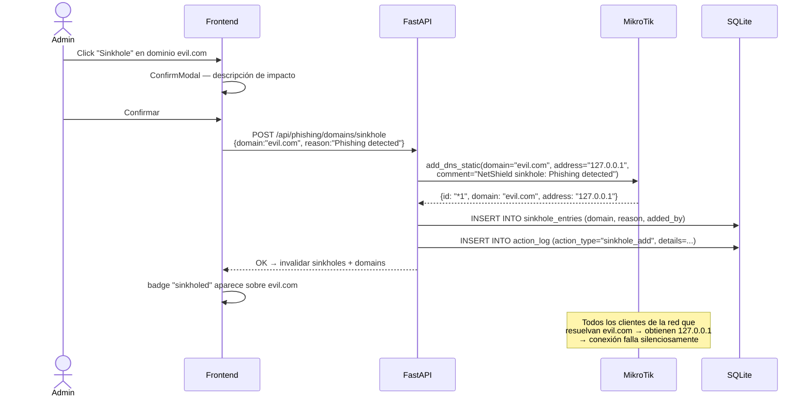
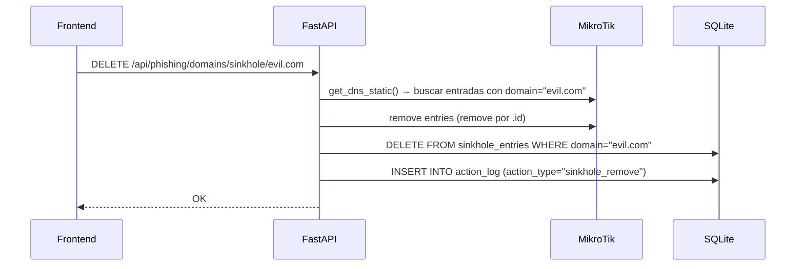
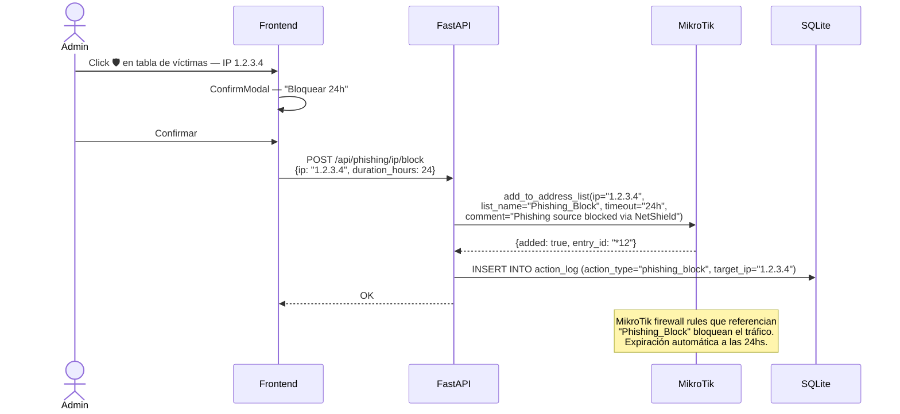
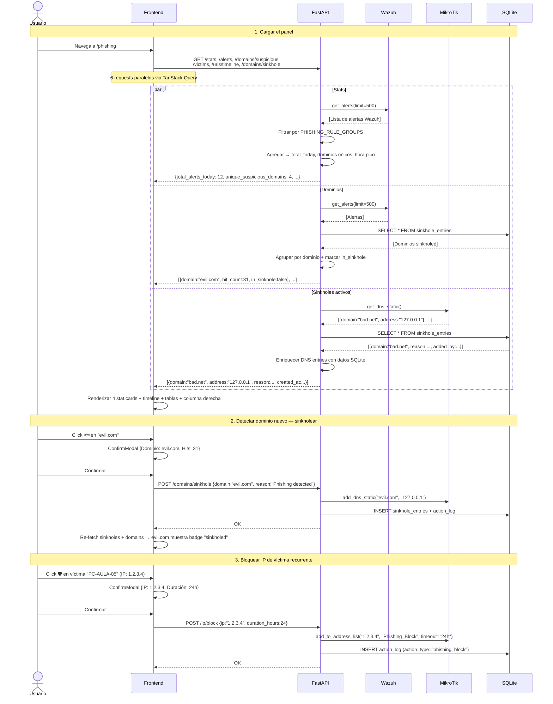

# Phishing — Detección y Respuesta Anti-Phishing

## Descripción General

El módulo **Anti-Phishing** detecta ataques de phishing y permite responder activamente desde el dashboard. Los datos de detección provienen de **alertas de Wazuh** filtradas por grupos de reglas de phishing. La respuesta activa se ejecuta directamente sobre **MikroTik**: DNS Sinkhole para bloquear dominios maliciosos y listas de bloqueo de IPs de origen.

> [!IMPORTANT]
> Este módulo **no tiene un servicio propio**. Toda la lógica de negocio vive en el router (`routers/phishing.py`). Combina datos de dos fuentes externas: Wazuh (detección) y MikroTik (respuesta), más SQLite para auditoría.

---

## Arquitectura General

```mermaid
graph TB
    subgraph Frontend["Frontend (React + TypeScript)"]
        PP["PhishingPanel.tsx<br/>1 componente — 300 líneas<br/>(página única sin tabs)"]
        UP["usePhishing.ts<br/>10 hooks (6 queries + 4 mutations)"]
        API["api.ts → phishingApi<br/>11 funciones HTTP"]
    end

    subgraph Backend["Backend (FastAPI)"]
        R["routers/phishing.py<br/>10 endpoints — 500 líneas"]
        SCH["schemas/phishing.py<br/>7 schemas Pydantic"]
        DB1["models/sinkhole_entry.py<br/>SinkholeEntry (SQLite)"]
        DB2["models/action_log.py<br/>ActionLog (SQLite)"]
    end

    subgraph Sources["Fuentes de Datos"]
        W["WazuhService<br/>get_alerts(limit=500)<br/>filtrado por rule_groups"]
        MT["MikroTikService<br/>/ip/dns/static (sinkhole)<br/>/ip/firewall/address-list (bloqueo IP)"]
    end

    PP --> UP --> API
    API -->|"HTTP REST"| R
    R -->|"Lectura"| W
    R -->|"Escritura"| MT
    R --> DB1 & DB2

    style Sources fill:#1e293b,stroke:#475569
```



**Patrón de detección:** el backend busca en los últimos 500 alertas de Wazuh y filtra **client-side** por grupos de reglas que indican phishing:

```python
PHISHING_RULE_GROUPS = {
    "web_attack", "phishing", "malicious_url",
    "suspicious_download", "credential_harvesting",
    "web", "attack", "web-attack",
}
```

Un alert es phishing si alguno de sus `rule_groups` intersecta con este conjunto.

---

## Backend

### Endpoints REST

Prefijo: `/api/phishing`

| Método | Ruta | Descripción | Fuente |
|---|---|---|---|
| **Detección (solo lectura)** | | | |
| `GET` | `/alerts` | Alertas de phishing paginadas | Wazuh |
| `GET` | `/domains/suspicious` | Dominios sospechosos con hits, agentes, estado sinkhole | Wazuh + SQLite |
| `GET` | `/urls/timeline` | Intentos de phishing por minuto (últimos 60 min) | Wazuh |
| `GET` | `/victims` | Agentes que accedieron a URLs maliciosas | Wazuh |
| `GET` | `/stats` | Resumen: alertas hoy, dominios únicos, agentes, hora pico, top URL | Wazuh |
| **Sinkhole (escritura)** | | | |
| `GET` | `/domains/sinkhole` | Listar sinkholes activos (enriquecidos con datos SQLite) | MikroTik + SQLite |
| `POST` | `/domains/sinkhole` | Agregar dominio al DNS sinkhole | MikroTik + SQLite |
| `DELETE` | `/domains/sinkhole/{domain}` | Eliminar dominio del sinkhole | MikroTik + SQLite |
| **Bloqueo IP** | | | |
| `POST` | `/ip/block` | Bloquear IP de origen en MikroTik (address-list) | MikroTik + SQLite |
| **Simulación** | | | |
| `POST` | `/simulate` | Generar evento sintético de phishing (solo lab) | — |

> [!NOTE]
> Todas las acciones destructivas (`sinkhole_add`, `sinkhole_remove`, `phishing_block`) generan entradas en `ActionLog` para auditoría completa.

### Lógica de Agregación de Datos

Todos los endpoints de detección comparten el mismo patrón:

```python
# 1. Obtener hasta 500 alertas de Wazuh
all_alerts = await wazuh.get_alerts(limit=500, offset=0)

# 2. Filtrar las que sean phishing
phishing = [a for a in all_alerts if _is_phishing_alert(a)]

# 3. Agregar según el endpoint:
#    /alerts     → paginación simple
#    /domains    → agrupar por dominio extraído de dst_url
#    /timeline   → contar por minuto (últimos 60 min)
#    /victims    → agrupar por (agent_id, dst_url)
#    /stats      → contadores totales + top URL + hora pico
```

**Extracción de dominio desde URL:**
```python
def _extract_domain(url: str) -> str:
    # Elimina protocolo: http:// https:// ftp://
    # Elimina path, query string y puerto
    # Retorna solo el hostname: "evil.com" de "http://evil.com/login?x=1"
```

**GET `/domains/suspicious`** — enriquece con estado de sinkhole:
```python
sinkholed = {s.domain.lower() for s in SQLite(SinkholeEntry).all()}
# Para cada dominio detectado:
entry["in_sinkhole"] = domain.lower() in sinkholed
```

### Schemas Pydantic

Archivo: `schemas/phishing.py` (95 líneas, 7 modelos)

**Respuestas:**

```python
class PhishingAlert:
    id: str
    agent_name: str
    agent_id: str
    src_ip: str
    dst_url: str
    rule_description: str
    timestamp: str
    rule_level: int     # nivel de severidad Wazuh
    user: str
    rule_groups: list[str]

class SuspiciousDomain:
    domain: str
    hit_count: int       # total de alertas con este dominio
    agents_affected: int # cantidad de agentes únicos
    first_seen: str
    last_seen: str
    in_sinkhole: bool    # si ya está en MikroTik DNS static

class PhishingVictim:
    agent_name: str
    agent_id: str
    ip: str
    url: str             # URL maliciosa a la que accedió
    timestamp: str       # última vez detectado
    times: int           # cantidad de veces que accedió

class PhishingStats:
    total_alerts_today: int
    unique_suspicious_domains: int
    affected_agents: int
    top_url: str         # URL más frecuente
    peak_hour: str       # hora con más actividad (ej: "14:00")

class SinkholeEntryResponse:
    domain: str
    address: str = "127.0.0.1"
    added_by: str
    reason: str
    created_at: str
```

**Requests:**

```python
class SinkholeRequest:
    domain: str   # min_length=3
    reason: str = "Phishing detected via NetShield"

class PhishingBlockIPRequest:
    ip: str
    duration_hours: int = 24   # timeout del bloqueo

class PhishingSimulateRequest:
    target_agent_id: str = ""
    malicious_url: str = "http://evil-phishing-lab.example.com/login"
    description: str
```

### Flujo DNS Sinkhole



**Eliminar sinkhole:**



### Flujo Bloqueo de IP



### Simulación (Solo Lab)

El endpoint `POST /simulate` solo está disponible cuando `APP_ENV=lab`:

```python
# Genera un alert sintético (NO se inyecta en Wazuh):
synthetic_alert = {
    "id": f"sim-{timestamp}",
    "rule_groups": ["web_attack", "phishing"],
    "rule_level": 12,
    "dst_url": request.malicious_url,
    "mitre_id": "T1566",
    "simulated": True,
}
```

> [!WARNING]
> La simulación **no modifica datos reales** en Wazuh ni MikroTik. Solo devuelve la estructura del alert sintético para validar que el frontend y la lógica de filtrado funcionan correctamente.

### Modelo SQLite — Auditoría de Sinkholes

```python
class SinkholeEntry(Base):
    __tablename__ = "sinkhole_entries"
    id: int            # PK autoincrement
    domain: str        # unique, indexed (ej: "evil.com")
    added_by: str      # "dashboard_user"
    reason: str | None # motivo del sinkhole
    created_at: datetime  # timestamp automático, indexed
```

**Fuente de verdad split:**
- **MikroTik** `/ip/dns/static` → fuente de verdad de qué está actualmente en sinkhole
- **SQLite** `sinkhole_entries` → metadatos (quién lo agregó, por qué, cuándo)
- `GET /domains/sinkhole` combina ambas fuentes al enriquecer las entradas DNS con los datos de la DB

---

## Frontend

Ruta: `/phishing` — **página única sin tabs**, layout de 2 columnas.

### Estructura

```
frontend/src/
├── components/phishing/
│   └── PhishingPanel.tsx   ← Única página (300 líneas)
└── hooks/
    └── usePhishing.ts      ← 10 hooks (queries + mutations)
```

### Layout de la Página

```
┌─────────────────────────────────────────────────────────────────┐
│          🐟 Panel Anti-Phishing          [Header]               │
├────────────┬────────────┬────────────┬────────────────────────┤
│ Alertas Hoy│ Dom. Sosp. │ Ag. Afect. │    Hora Pico           │
│   [stat]   │  [stat]    │   [stat]   │      [stat]            │
├────────────────────────────────┬───────────────────────────────┤
│  COLUMNA IZQUIERDA             │  COLUMNA DERECHA (360px)      │
│                                │                               │
│  [AreaChart - Timeline 30min]  │  Dominios Sospechosos         │
│                                │  - evil.com [31 hits] [🐟]   │
│  [Tabla - Víctimas]            │  - bad.net  [12 hits] [🐟]   │
│  Agente | IP | URL | Veces | 🛡│  - x.com   [sinkholed ✓]    │
│                                │                               │
│  [Tabla - Alertas Recientes]   │  DNS Sinkhole Activo [2]     │
│  Nivel | Agente | URL | Hora  │  - evil.com → 127.0.0.1 [🗑] │
│                                │  - bad.net → 127.0.0.1  [🗑] │
│                                │                               │
│                                │  🧪 Simulación (Lab)         │
│                                │  [URL input]                  │
│                                │  [Simular Phishing]           │
└────────────────────────────────┴───────────────────────────────┘
```

### Secciones Detalladas

**4 Stat Cards (header row):**

| Card | Dato | Color |
|---|---|---|
| Alertas Hoy | `stats.total_alerts_today` | Rojo (`--color-danger`) |
| Dominios Sospechosos | `stats.unique_suspicious_domains` | Naranja alto |
| Agentes Afectados | `stats.affected_agents` | Amarillo warning |
| Hora Pico | `stats.peak_hour` (ej: "14:00") | Azul brand |

**Timeline (columna izquierda):**
- Gráfica `AreaChart` (Recharts) con gradiente naranja
- Eje X: minutos (últimos 30 del total de 60) en formato `HH:MM`
- Eje Y: cantidad de intentos por minuto
- Se actualiza cada 60 segundos via polling

**Tabla de Víctimas:**
- Columnas: Agente, IP, URL, Veces (badge color critical/high), Última vez, Acción
- Botón 🛡️ `ShieldOff` por fila → `ConfirmModal` → `POST /ip/block`
- Ordenado por `times` descendente (más golpeados primero)

**Tabla de Alertas Recientes:**
- Solo se muestra si hay `alerts.length > 0`
- Muestra las 10 más recientes
- Nivel = badge crítico (≥12) o alto (<12)

**Dominios Sospechosos (columna derecha):**
- Lista scrollable (max 300px) con tarjetas por dominio
- Cada tarjeta: nombre del dominio (monospace) + hits + agentes afectados
- Si ya está en sinkhole → badge verde `"sinkholed"`, sin botón
- Si NO está → botón 🐟 `"Sinkhole"` → `ConfirmModal` → `POST /domains/sinkhole`

**DNS Sinkhole Activo:**
- Lista scrollable (max 200px) de dominios activos
- Por dominio: nombre + `→ 127.0.0.1`
- Botón 🗑️ `Trash2` → `ConfirmModal variant="warning"` → `DELETE /domains/sinkhole/{domain}`

**Simulación Lab:**
- Card con borde naranja, badge `APP_ENV=lab`
- Input de URL maliciosa (con valor por defecto)
- Botón "Simular Phishing" → `POST /simulate`
- Muestra `✓ Evento simulado generado` al completar

### ConfirmModal — Tres Variantes

| Tipo | Título | Descripción | Variant |
|---|---|---|---|
| `sinkhole` | "Agregar Sinkhole" | "Este dominio será redirigido a 127.0.0.1 en el DNS de MikroTik." | `danger` |
| `removeSinkhole` | "Eliminar Sinkhole" | "El tráfico DNS hacia este dominio se restaurará." | `warning` |
| `blockIP` | "Bloquear IP" | "Esta IP de phishing será bloqueada en MikroTik por 24 horas." | `danger` |

### Hooks — `usePhishing.ts`

**Queries (polling):**

```typescript
usePhishingAlerts(limit = 50)   // GET /alerts,           refetchInterval: 30s
useSuspiciousDomains()          // GET /domains/suspicious, refetchInterval: 30s
usePhishingTimeline()           // GET /urls/timeline,     refetchInterval: 60s
usePhishingVictims()            // GET /victims,           refetchInterval: 30s
usePhishingStats()              // GET /stats,             refetchInterval: 30s
useSinkholes()                  // GET /domains/sinkhole,  refetchInterval: 60s
```

**Mutations:**

```typescript
useSinkholeDomain()
// POST /domains/sinkhole
// onSuccess → invalida ['phishing', 'sinkholes'] + ['phishing', 'domains']

useRemoveSinkhole()
// DELETE /domains/sinkhole/{domain}
// onSuccess → invalida ['phishing', 'sinkholes']

usePhishingBlockIP()
// POST /ip/block
// Sin invalidación (la lista de address-list no se consulta en este módulo)

useSimulatePhishing()
// POST /simulate
// Sin invalidación (alert sintético no persiste)
```

---

## Flujo de Datos Completo



---

## Modo Mock

Cuando `MOCK_WAZUH=true` o Wazuh no está disponible, `WazuhService.get_alerts()` retorna datos mock. El router de phishing filtra esos datos igual que si fueran reales.

Cuando `MOCK_MIKROTIK=true`, `MikroTikService` retorna:

| Método Mock | Contenido |
|---|---|
| `MockData.mikrotik.dns_static()` | 2-3 dominios en sinkhole (ej: `phishing-site.net → 127.0.0.1`) |
| `MockService.add_dns_static()` | Simula adición en memoria, devuelve `{added: True}` |
| `MockService.remove_dns_static()` | Elimina de memoria |
| `MockService.add_to_address_list()` | Simula bloqueo en address-list "Phishing_Block" |

> [!TIP]
> En modo mock, las alertas de Wazuh incluyen algunas con `rule_groups: ["web_attack", "phishing"]` para que el filtro funcione y los componentes muestren datos. El sinkhole SQLite persiste entre requests (pero se limpia al reiniciar el backend).

---

## Casos de Uso

### CU-1: Detectar campaña de phishing activa

**Actor:** Administrador de seguridad

1. Navega a **Phishing** desde la barra lateral
2. Observa la stat card "Alertas Hoy = 45" y "Agentes Afectados = 8"
3. La gráfica de timeline muestra un pico entre las 14:00 y 14:15
4. Confirma que hay una campaña activa coordinada

---

### CU-2: Sinkholear un dominio malicioso

**Actor:** Administrador de seguridad

1. En la columna derecha, ve `evil-bank.com` con **31 hits** y **4 agentes**
2. El dominio no tiene badge "sinkholed" → click 🐟 **"Sinkhole"**
3. `ConfirmModal`: "Este dominio será redirigido a 127.0.0.1 en el DNS de MikroTik"
4. Confirma → MikroTik agrega la entrada DNS estática
5. El dominio ahora muestra badge verde **"sinkholed"** — ningún cliente de la red puede resolver el dominio

---

### CU-3: Eliminar sinkhole de un dominio falso positivo

**Actor:** Administrador de seguridad

1. En "DNS Sinkhole Activo" detecta que `analytics.legitsite.com` fue sinkholed por error
2. Click 🗑️ → `ConfirmModal variant="warning"`: "El tráfico DNS hacia este dominio se restaurará"
3. Confirma → MikroTik elimina la entrada + SQLite borra el registro
4. El dominio vuelve a resolverse normalmente

---

### CU-4: Bloquear IP origen de un ataque

**Actor:** Administrador de seguridad

1. En la tabla **Víctimas Potenciales**, ve a `PC-SALA-03` que accedió 12 veces a `http://steal.io/login`
2. En la columna de IP del servidor externo (src), click 🛡️
3. `ConfirmModal`: "Esta IP de phishing será bloqueada en MikroTik por 24 horas"
4. Confirma → IP `185.220.101.45` se agrega a la address-list `Phishing_Block` con timeout de 24h
5. MikroTik bloquea automáticamente cualquier tráfico desde esa IP por 24 horas

---

### CU-5: Identificar víctimas potenciales para notificar

**Actor:** Administrador de red

1. Navega a la tabla **Víctimas Potenciales**
2. Ve que `NOTEBOOK-RRHH` accedió 8 veces a una URL sospechosa (badge rojo)
3. Anota el agente ID y notifica al área de RRHH para iniciar análisis forense

---

### CU-6: Simular ataque de phishing en laboratorio

**Actor:** Administrador de seguridad (entorno de lab)

1. En la card **Simulación (Lab)** ingresa URL: `http://fake-banco.lab.com/credenciales`
2. Click **"Simular Phishing"**
3. El sistema genera y retorna un alert sintético con `mitre_id: T1566`
4. Verifica que el filtro `_is_phishing_alert()` clasifica correctamente el alert
5. El sistema muestra `✓ Evento simulado generado`

---

### CU-7: Analizar hora pico de ataques

**Actor:** Administrador de seguridad

1. Stat card **"Hora Pico"** muestra `14:00`
2. Revisa la gráfica del timeline para confirmar el patrón
3. Decide implementar restricciones adicionales en ese horario vía el módulo de Portal Cautivo o reglas de firewall
4. Documenta el patrón en un reporte generado por el módulo de IA

---

## Archivos Involucrados

### Backend

| Archivo | Rol |
|---|---|
| [phishing.py](file:///home/nivek/Documents/netShield2/backend/routers/phishing.py) | 10 endpoints REST + toda la lógica de agregación (500 líneas) |
| [phishing.py](file:///home/nivek/Documents/netShield2/backend/schemas/phishing.py) | 7 schemas Pydantic (95 líneas) |
| [sinkhole_entry.py](file:///home/nivek/Documents/netShield2/backend/models/sinkhole_entry.py) | Modelo SQLite `SinkholeEntry` — auditoría de sinkholes |
| [mikrotik_service.py](file:///home/nivek/Documents/netShield2/backend/services/mikrotik_service.py) | `add_dns_static()`, `remove_dns_static()`, `get_dns_static()`, `add_to_address_list()` |
| [wazuh_service.py](file:///home/nivek/Documents/netShield2/backend/services/wazuh_service.py) | `get_alerts(limit=500)` — fuente de todas las alertas |

### Frontend

| Archivo | Rol |
|---|---|
| [PhishingPanel.tsx](file:///home/nivek/Documents/netShield2/frontend/src/components/phishing/PhishingPanel.tsx) | Página completa: stat cards + timeline + víctimas + alertas + dominios + sinkhole + simulación |
| [usePhishing.ts](file:///home/nivek/Documents/netShield2/frontend/src/hooks/usePhishing.ts) | 10 hooks: 6 queries (polling 30-60s) + 4 mutations |
| [api.ts](file:///home/nivek/Documents/netShield2/frontend/src/services/api.ts) → `phishingApi` | 11 funciones HTTP |
