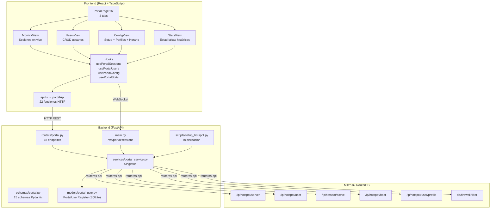
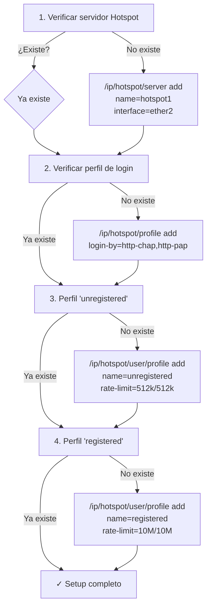
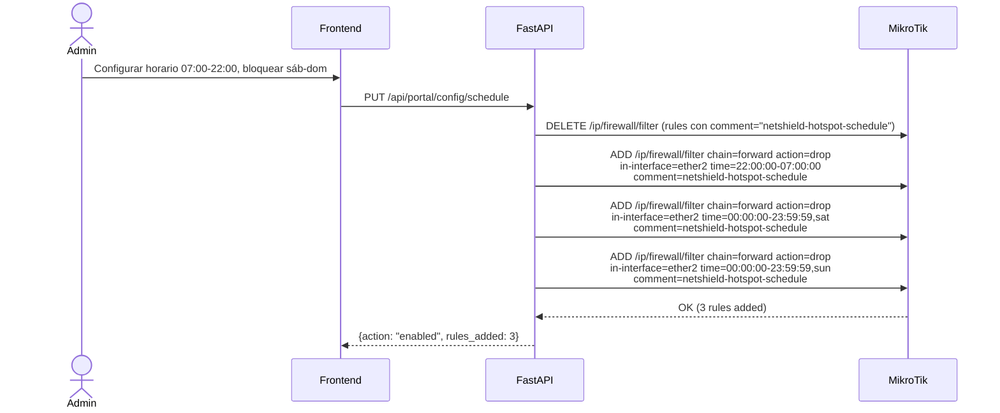
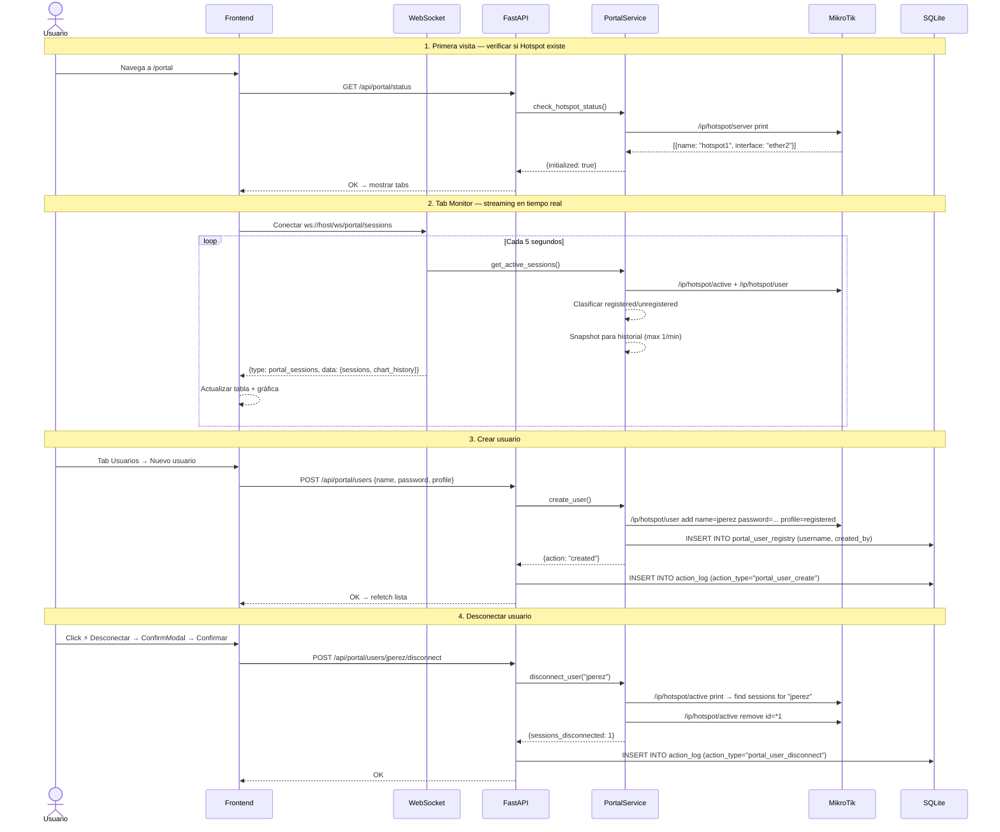

# Portal Cautivo — Documentación Funcional

## Descripción General

El módulo **Portal Cautivo** gestiona el **Hotspot nativo de MikroTik** desde el dashboard. Permite monitorear sesiones en tiempo real, administrar usuarios con CRUD completo, configurar perfiles de velocidad, y programar horarios de acceso — todo sin necesidad de WinBox.

> [!IMPORTANT]
> El Portal Cautivo requiere que el servidor Hotspot de MikroTik esté inicializado. Si no existe, el dashboard muestra un botón de **Inicializar Hotspot** que ejecuta el setup automáticamente.

---

## Arquitectura General

El módulo se compone de **4 capas**:

| Capa | Archivos | Responsabilidad |
|---|---|---|
| **Frontend** | `components/portal/` (14 archivos) | UI con 4 tabs: Monitor, Usuarios, Configuración, Estadísticas |
| **Hooks** | `hooks/usePortal*.ts` (4 archivos) | Data fetching con TanStack Query + WebSocket |
| **Router** | `routers/portal.py` | 18 endpoints REST bajo `/api/portal` |
| **Servicio** | `services/portal_service.py` | Singleton que delega a MikroTikService. 1054 líneas |



---

## Backend

### Endpoints REST

Prefijo: `/api/portal`

| Método | Ruta | Descripción | Schema |
|---|---|---|---|
| **Setup** | | | |
| `POST` | `/setup` | Inicializar Hotspot | — |
| `GET` | `/status` | Verificar si existe Hotspot | — |
| **Sesiones** | | | |
| `GET` | `/sessions/active` | Sesiones activas en vivo | — |
| `GET` | `/sessions/history` | Historial de sesiones pasadas | `SessionHistoryParams` |
| `GET` | `/sessions/chart` | Datos para gráfica tiempo real | — |
| **Estadísticas** | | | |
| `GET` | `/stats/realtime` | Métricas en tiempo real | — |
| `GET` | `/stats/summary` | Estadísticas históricas agregadas | — |
| **Usuarios** | | | |
| `GET` | `/users` | Listar usuarios (filtrable) | — |
| `POST` | `/users` | Crear usuario | `PortalUserCreate` |
| `PUT` | `/users/{username}` | Actualizar usuario | `PortalUserUpdate` |
| `DELETE` | `/users/{username}` | Eliminar usuario | — |
| `POST` | `/users/{username}/disconnect` | Desconectar sesión activa | — |
| `POST` | `/users/bulk` | Crear usuarios masivamente | `PortalUserBulk` |
| **Perfiles** | | | |
| `GET` | `/profiles` | Listar perfiles de velocidad | — |
| `POST` | `/profiles` | Crear perfil | `PortalProfileCreate` |
| `PUT` | `/profiles/{name}` | Actualizar perfil | `PortalProfileUpdate` |
| **Configuración** | | | |
| `GET` | `/config` | Config actual del Hotspot | — |
| `PUT` | `/config/unregistered-speed` | Cambiar velocidad no registrados | `UnregisteredSpeedUpdate` |
| `GET` | `/config/schedule` | Leer horario actual | — |
| `PUT` | `/config/schedule` | Configurar horario de acceso | `ScheduleConfig` |

> [!NOTE]
> Todas las acciones destructivas (`DELETE`, `disconnect`, cambio de velocidad, horario) se registran en `ActionLog` para auditoría.

### Schemas Pydantic

Archivo: `schemas/portal.py` (283 líneas, 15 modelos)

**Principales:**

```python
# ── Usuario ─────────────
class PortalUserCreate:
    name: str           # max 64 chars
    password: str       # max 64 chars
    profile: str = "registered"
    mac_address: str    # MAC binding (opcional)
    limit_uptime: str   # ej: "8h" — resets diario
    limit_bytes_total: str  # ej: "5G" — límite lifetime
    comment: str

class PortalUserUpdate:
    profile: str | None
    password: str | None
    mac_address: str | None
    limit_uptime: str | None
    limit_bytes_total: str | None
    disabled: bool | None
    comment: str | None

class PortalUserBulk:
    users: list[PortalUserCreate]   # min 1 usuario

# ── Perfil de velocidad ─────────
class PortalProfileCreate:
    name: str
    rate_limit_up: str    # ej: "10M"
    rate_limit_down: str  # ej: "10M"
    session_timeout: str  # ej: "8h"
    idle_timeout: str = "30m"

# ── Horario ─────────
class ScheduleConfig:
    enabled: bool
    allowed_hours: AllowedHours      # {hour_from: "07:00", hour_to: "22:00"}
    blocked_days: list[str]          # ["saturday", "sunday"]
    scope: "all" | "unregistered"    # a quién aplica la restricción
```

### Servicio — `PortalService`

Archivo: `services/portal_service.py` (1054 líneas)

**Patrón Singleton** que delega todas las llamadas API a `MikroTikService._api_call()`. No crea una segunda conexión al router.

| Método | API RouterOS | Descripción |
|---|---|---|
| `check_hotspot_status()` | `/ip/hotspot/server` | ¿Existe el servidor Hotspot? |
| `get_active_sessions()` | `/ip/hotspot/active` + `/ip/hotspot/user` | Sesiones vivas + clasificación registered/unregistered |
| `get_session_history()` | `/ip/hotspot/host` | Historial de conexiones |
| `get_realtime_stats()` | vía `get_active_sessions()` | Agrega: total, registrados, BW, hora pico |
| `get_summary_stats()` | `/ip/hotspot/host` + `/ip/hotspot/user` | Top users por datos/tiempo, heatmap, únicos |
| `get_users()` | `/ip/hotspot/user` + `/ip/hotspot/host` | Lista enriquecida con last_seen + metadata local |
| `create_user()` | `/ip/hotspot/user` add | Crea en MikroTik + guarda en `PortalUserRegistry` |
| `update_user()` | `/ip/hotspot/user` set | Busca por `.id` + actualiza campos |
| `delete_user()` | `/ip/hotspot/user` remove | Elimina de MikroTik + `PortalUserRegistry` |
| `disconnect_user()` | `/ip/hotspot/active` remove | Busca sesiones del usuario y las elimina |
| `bulk_create_users()` | `/ip/hotspot/user` add (×N) | Ciclo secuencial con reporte de éxito/fallo |
| `get_profiles()` | `/ip/hotspot/user/profile` | Lista perfiles con rate-limit parseado |
| `create_profile()` | `/ip/hotspot/user/profile` add | Crea con formato `up/down` |
| `update_profile()` | `/ip/hotspot/user/profile` set | Busca por `.id` + modifica |
| `update_unregistered_speed()` | vía `update_profile()` | Atajo para el perfil "unregistered" |
| `get_hotspot_config()` | `/ip/hotspot/server` + `/ip/hotspot/profile` | Config del servidor + método de login |
| `setup_schedule()` | `/ip/firewall/filter` add/remove | Reglas con time matching |
| `get_schedule()` | `/ip/firewall/filter` | Parsea reglas con comment `netshield-hotspot-schedule` |

**Guard Clause:** todos los métodos públicos (excepto `check_hotspot_status`) llaman a `_require_hotspot()` que lanza `HotspotNotInitializedError` si no existe servidor.

### Modelo SQLite — Registro Local

```python
# models/portal_user.py
class PortalUserRegistry(Base):
    __tablename__ = "portal_user_registry"
    id: int                 # PK autoincrement
    username: str           # unique, indexed
    created_at: datetime    # server_default=now()
    created_by: str         # "admin" por defecto
    notes: str | None       # observaciones opcionales
```

> La **fuente de verdad** de usuarios es `/ip/hotspot/user` en MikroTik. Esta tabla solo guarda metadata que MikroTik no almacena (quién lo creó y cuándo) para trazabilidad.

### WebSocket — Sesiones en Tiempo Real

Endpoint: `ws://host/ws/portal/sessions`

Envía cada **5 segundos** el estado de las sesiones:

```json
{
  "type": "portal_sessions",
  "data": {
    "sessions": [
      {
        "user": "jperez",
        "ip": "10.5.50.100",
        "mac": "52:54:00:AA:BB:01",
        "uptime": "1h30m",
        "bytes_in": 52428800,
        "bytes_out": 10485760,
        "status": "registered"
      }
    ],
    "chart_history": [
      {"timestamp": "14:30", "registered": 3, "unregistered": 1}
    ],
    "timestamp": "2026-04-06T14:30:00"
  }
}
```

Si el Hotspot **no está inicializado**, envía:

```json
{
  "type": "portal_error",
  "data": {
    "message": "Hotspot no inicializado. Ejecutá el setup desde Configuración → Inicializar Hotspot",
    "code": "HOTSPOT_NOT_INITIALIZED"
  }
}
```

### Script de Inicialización

Archivo: `scripts/setup_hotspot.py`

Ejecutable vía API (`POST /api/portal/setup`) o CLI (`python scripts/setup_hotspot.py`).

**Pasos que ejecuta:**



> [!TIP]
> Es **idempotente** — seguro de ejecutar múltiples veces. Solo crea lo que falta.

### Sistema de Horarios

El horario se implementa con **reglas de firewall con time matching** en MikroTik:



**Scopes:**
- `scope="all"` → bloquea todo tráfico del hotspot fuera de horario
- `scope="unregistered"` → solo bloquea usuarios no registrados

---

## Frontend

### Estructura de Componentes

```
frontend/src/
├── components/portal/
│   ├── PortalPage.tsx          ← Página principal con 4 tabs
│   ├── MonitorView.tsx         ← Tab Monitor: stat cards + tabla + gráfica
│   ├── SessionsTable.tsx       ← Tabla de sesiones activas
│   ├── SessionsChart.tsx       ← Gráfica AreaChart sesiones vs tiempo
│   ├── UsersView.tsx           ← Tab Usuarios: búsqueda + tabla + modales
│   ├── UserTable.tsx           ← Tabla CRUD de usuarios
│   ├── UserFormModal.tsx       ← Modal crear/editar usuario
│   ├── BulkImportModal.tsx     ← Modal importación masiva CSV
│   ├── ConfigView.tsx          ← Tab Config: setup + perfiles + horario
│   ├── SpeedProfiles.tsx       ← CRUD de perfiles de velocidad
│   ├── ScheduleConfig.tsx      ← Configuración de horario
│   ├── StatsView.tsx           ← Tab Estadísticas: top users + heatmap
│   └── UsageHeatmap.tsx        ← Mapa de calor día×hora
├── hooks/
│   ├── usePortalSessions.ts    ← WebSocket sesiones en vivo
│   ├── usePortalUsers.ts       ← CRUD usuarios (TanStack Query)
│   ├── usePortalConfig.ts      ← Config + perfiles + schedule
│   └── usePortalStats.ts       ← Realtime + summary stats
└── services/
    └── api.ts → portalApi      ← 22 funciones HTTP
```

### Navegación

Ruta: `/portal` — con 4 tabs internos (sin sub-rutas):

```
/portal → Tab: Monitor | Usuarios | Configuración | Estadísticas
```

### Tab 1: Monitor

| Elemento | Contenido |
|---|---|
| **4 Stat Cards** | Sesiones activas, Registrados online, No registrados, Hora pico hoy |
| **Bandwidth Row** | Ingreso total (B/s), Egreso total (B/s) |
| **SessionsChart** | `AreaChart` (Recharts) — sesiones registradas vs no registradas en el tiempo |
| **SessionsTable** | Tabla con: usuario, IP, MAC, uptime, bytes in/out, status, acciones |

**Fuente de datos:** WebSocket `/ws/portal/sessions` (push cada 5s) + API REST `/stats/realtime` como fallback.

### Tab 2: Usuarios

| Elemento | Contenido |
|---|---|
| **Barra de herramientas** | Búsqueda por nombre/MAC, filtro por perfil, botón Importar CSV, botón Nuevo usuario |
| **UserTable** | Tabla con: nombre, perfil, MAC, límites, disabled, last_seen, sesiones, acciones (editar/desconectar/eliminar) |
| **UserFormModal** | Modal para crear o editar — campos: nombre, contraseña, perfil (selector), MAC, límite tiempo, límite datos, comentario |
| **BulkImportModal** | Importación masiva desde CSV con reporte de éxito/fallo por usuario |

**Acciones del usuario en la tabla:**
- ✏️ Editar → abre `UserFormModal` en modo edición
- ⚡ Desconectar → `ConfirmModal` → `POST /users/{name}/disconnect`
- 🗑️ Eliminar → `ConfirmModal` → `DELETE /users/{name}`

### Tab 3: Configuración

| Sección | Contenido |
|---|---|
| **Setup Card** | Si Hotspot NO inicializado: card prominente con botón "Inicializar Hotspot" + `ConfirmModal` |
| **Servidor Hotspot** | Datos: nombre, interfaz, pool IP, login-by, MACs por IP, timeout inactividad |
| **SpeedProfiles** | CRUD de perfiles: nombre, velocidad up/down, session timeout, idle timeout |
| **ScheduleConfig** | Toggle habilitado/deshabilitado, rango horario (desde/hasta), días bloqueados, scope (todos/no registrados) |

### Tab 4: Estadísticas

| Sección | Contenido |
|---|---|
| **4 Stat Cards** | Usuarios únicos (hoy, semana, mes), Duración promedio de sesión |
| **BarChart** | Nuevos registros últimos 30 días |
| **Top 10 por consumo** | Tabla: usuario, bytes totales, número de sesiones |
| **Top 10 por tiempo** | Tabla: usuario, tiempo total conectado, número de sesiones |
| **UsageHeatmap** | Mapa de calor 7 días × 24 horas — intensidad de sesiones concurrentes |

### Hooks

#### `usePortalSessions()` — WebSocket

```typescript
const { sessions, chartHistory, isConnected, error } = usePortalSessions();
// sessions: PortalSession[] — sesiones activas vía WS
// chartHistory: PortalChartPoint[] — historial para gráfica
// isConnected: boolean — estado del WebSocket
// error: string | null — mensaje si hotspot no inicializado
```

Usa el hook base `useWebSocket('/ws/portal/sessions')` internamente.

#### `usePortalUsers` — CRUD

```typescript
usePortalUsers({search, profile, limit, offset})  // GET, polling 30s
useCreatePortalUser()                               // POST → invalida cache
useUpdatePortalUser()                               // PUT → invalida cache
useDeletePortalUser()                               // DELETE → invalida cache
useDisconnectPortalUser()                           // POST disconnect → invalida sesiones
useBulkCreatePortalUsers()                          // POST bulk → invalida cache
```

#### `usePortalConfig` — Configuración

```typescript
usePortalStatus()          // GET /status, polling 30s
usePortalConfig()          // GET /config, polling 60s
usePortalProfiles()        // GET /profiles, polling 30s
usePortalSchedule()        // GET /config/schedule, polling 60s
useSetupHotspot()          // POST /setup → invalida status + config + profiles
useCreatePortalProfile()   // POST /profiles → invalida profiles
useUpdatePortalProfile()   // PUT /profiles/{name} → invalida profiles
useUpdateUnregisteredSpeed() // PUT /config/unregistered-speed → invalida profiles
useUpdateSchedule()        // PUT /config/schedule → invalida schedule
```

#### `usePortalStats` — Estadísticas

```typescript
usePortalRealtimeStats(isConnected)  // GET /stats/realtime, polling 10-30s adaptivo
usePortalSummaryStats()              // GET /stats/summary, polling 60s
```

> [!TIP]
> `usePortalRealtimeStats` usa **polling adaptivo**: 10s si el WebSocket está desconectado, 30s si está conectado (el WS ya cubre sesiones activas).

---

## Flujo de Datos Completo



---

## Modo Mock

Cuando `MOCK_MIKROTIK=true`, el servicio **no contacta al router**. Retorna datos estáticos de `MockData.portal`:

| Dato Mock | Contenido |
|---|---|
| `profiles()` | 5 perfiles: default, docentes (50M), estudiantes (5M), unregistered (1M), admin (100M) |
| `users()` | 5 usuarios del hotspot con perfiles asignados |
| `active_sessions()` | 4 sesiones: 3 registradas + 1 guest sin usuario |
| `session_history()` | 6 sesiones pasadas con login/logout times |
| `realtime_stats()` | 4 activas, 3 registradas, pico = 12 |
| `summary_stats()` | 23 usuarios únicos, heatmap 24h×7d |
| `hotspot_config()` | Config del servidor hotspot1 |
| `schedule()` | Horario disabled, 7-22h, bloqueado sáb-dom |
| `setup_result()` | Resultado de inicialización: 4 pasos ok |
| `session_chart()` | 30 puntos de gráfica (últimos 60 min) |

### WebSocket Mock

`MockData.websocket.portal_session(tick)` genera datos dinámicos:
- ±1 sesión cada 15 ticks para simular entrada/salida
- Usa `Random(seed=tick)` para reproducibilidad

---

## Casos de Uso

### CU-1: Monitorear sesiones en vivo

**Actor:** Administrador de red

1. Navega a **Portal Cautivo** → tab **Monitor**
2. Ve las 4 tarjetas: sesiones activas, registrados, no registrados, hora pico
3. La tabla muestra cada sesión con usuario, IP, MAC, uptime y consumo
4. La gráfica se actualiza cada 5 segundos mostrando la evolución de sesiones

---

### CU-2: Registrar un nuevo usuario del hotspot

**Actor:** Administrador de red

1. Tab **Usuarios** → click **"Nuevo usuario"**
2. Completa: nombre = `jperez`, contraseña = `pass123`, perfil = `docentes`, comentario = `Profesor de Redes`
3. Click **"Crear"**
4. El usuario aparece en la tabla y puede conectarse al hotspot

---

### CU-3: Importar usuarios masivamente desde CSV

**Actor:** Administrador de red

1. Tab **Usuarios** → click **"Importar CSV"**
2. Selecciona un archivo CSV con formato: `nombre,contraseña,perfil`
3. Click **"Importar"** → el sistema procesa usuario por usuario
4. Muestra reporte: `8/10 creados, 2 fallidos` con detalle de errores

---

### CU-4: Desconectar un usuario sospechoso

**Actor:** Administrador de seguridad

1. Tab **Monitor** → identifica que el usuario `unknown-guest` consume ancho de banda excesivo
2. En la tabla, click ⚡ **Desconectar** → confirma en modal
3. La sesión se termina inmediatamente en MikroTik
4. El usuario deberá re-autenticarse para volver a conectarse

---

### CU-5: Configurar horario de acceso

**Actor:** Administrador de red

1. Tab **Configuración** → sección **Horario de acceso**
2. Activa el toggle → configura **07:00 a 22:00**
3. Marca **sábado** y **domingo** como días bloqueados
4. Selecciona scope = **Solo no registrados** (los docentes mantienen acceso)
5. Click **"Guardar"** → se crean reglas de firewall en MikroTik

---

### CU-6: Inicializar el Hotspot por primera vez

**Actor:** Administrador de red

1. Tab **Configuración** → ve el card "**Hotspot no inicializado**"
2. Click **"Inicializar Hotspot"** → confirma en modal de advertencia
3. El setup ejecuta 4 pasos: servidor, perfil de login, perfil unregistered (512k), perfil registered (10M)
4. Muestra resultado: `✓ Hotspot 'hotspot1' inicializado exitosamente en interfaz ether2`

---

### CU-7: Ajustar velocidad de usuarios no registrados

**Actor:** Administrador de red

1. Tab **Configuración** → sección **Perfiles de velocidad**
2. En el perfil `unregistered`, cambia velocidad de `512k/512k` a `1M/1M`
3. Click **"Guardar"** → se actualiza en MikroTik inmediatamente
4. Todos los usuarios no registrados obtienen la nueva velocidad

---

### CU-8: Analizar estadísticas de uso

**Actor:** Dirección / Administrador de red

1. Tab **Estadísticas** → ve las 4 tarjetas: usuarios hoy, esta semana, este mes, duración promedio
2. Revisa el **Top 10 por consumo** para identificar usuarios que más datos usan
3. Revisa el **Top 10 por tiempo** para ver quién más tiempo permanece conectado
4. El **Mapa de calor** muestra que el pico es martes y miércoles entre 10:00-12:00

---

## Archivos Involucrados

### Backend

| Archivo | Rol |
|---|---|
| [portal.py](file:///home/nivek/Documents/netShield2/backend/routers/portal.py) | 18 endpoints REST (600 líneas) |
| [portal_service.py](file:///home/nivek/Documents/netShield2/backend/services/portal_service.py) | Servicio singleton (1054 líneas) |
| [portal.py](file:///home/nivek/Documents/netShield2/backend/schemas/portal.py) | 15 schemas Pydantic (283 líneas) |
| [portal_user.py](file:///home/nivek/Documents/netShield2/backend/models/portal_user.py) | Modelo SQLite `PortalUserRegistry` |
| [setup_hotspot.py](file:///home/nivek/Documents/netShield2/backend/scripts/setup_hotspot.py) | Script de inicialización (202 líneas) |
| [main.py](file:///home/nivek/Documents/netShield2/backend/main.py) | WebSocket `/ws/portal/sessions` (L508-L564) |
| [mock_data.py](file:///home/nivek/Documents/netShield2/backend/services/mock_data.py) | Datos mock del portal cautivo |

### Frontend

| Archivo | Rol |
|---|---|
| [PortalPage.tsx](file:///home/nivek/Documents/netShield2/frontend/src/components/portal/PortalPage.tsx) | Página principal con 4 tabs |
| [MonitorView.tsx](file:///home/nivek/Documents/netShield2/frontend/src/components/portal/MonitorView.tsx) | Tab Monitor: stat cards + tabla + chart |
| [SessionsTable.tsx](file:///home/nivek/Documents/netShield2/frontend/src/components/portal/SessionsTable.tsx) | Tabla de sesiones activas |
| [SessionsChart.tsx](file:///home/nivek/Documents/netShield2/frontend/src/components/portal/SessionsChart.tsx) | Gráfica AreaChart sesiones vs tiempo |
| [UsersView.tsx](file:///home/nivek/Documents/netShield2/frontend/src/components/portal/UsersView.tsx) | Tab Usuarios: toolbar + tabla + modales |
| [UserTable.tsx](file:///home/nivek/Documents/netShield2/frontend/src/components/portal/UserTable.tsx) | Tabla CRUD de usuarios |
| [UserFormModal.tsx](file:///home/nivek/Documents/netShield2/frontend/src/components/portal/UserFormModal.tsx) | Modal crear/editar usuario |
| [BulkImportModal.tsx](file:///home/nivek/Documents/netShield2/frontend/src/components/portal/BulkImportModal.tsx) | Importación masiva CSV |
| [ConfigView.tsx](file:///home/nivek/Documents/netShield2/frontend/src/components/portal/ConfigView.tsx) | Tab Config: setup + perfiles + horario |
| [SpeedProfiles.tsx](file:///home/nivek/Documents/netShield2/frontend/src/components/portal/SpeedProfiles.tsx) | CRUD perfiles de velocidad |
| [ScheduleConfig.tsx](file:///home/nivek/Documents/netShield2/frontend/src/components/portal/ScheduleConfig.tsx) | Config de horario de acceso |
| [StatsView.tsx](file:///home/nivek/Documents/netShield2/frontend/src/components/portal/StatsView.tsx) | Tab Estadísticas: top users + heatmap |
| [UsageHeatmap.tsx](file:///home/nivek/Documents/netShield2/frontend/src/components/portal/UsageHeatmap.tsx) | Mapa de calor día×hora |
| [usePortalSessions.ts](file:///home/nivek/Documents/netShield2/frontend/src/hooks/usePortalSessions.ts) | WebSocket sesiones en vivo |
| [usePortalUsers.ts](file:///home/nivek/Documents/netShield2/frontend/src/hooks/usePortalUsers.ts) | 6 hooks CRUD usuarios |
| [usePortalConfig.ts](file:///home/nivek/Documents/netShield2/frontend/src/hooks/usePortalConfig.ts) | 9 hooks config + perfiles + schedule |
| [usePortalStats.ts](file:///home/nivek/Documents/netShield2/frontend/src/hooks/usePortalStats.ts) | 2 hooks estadísticas (adaptivo) |
| [api.ts](file:///home/nivek/Documents/netShield2/frontend/src/services/api.ts) → `portalApi` | 22 funciones HTTP |
