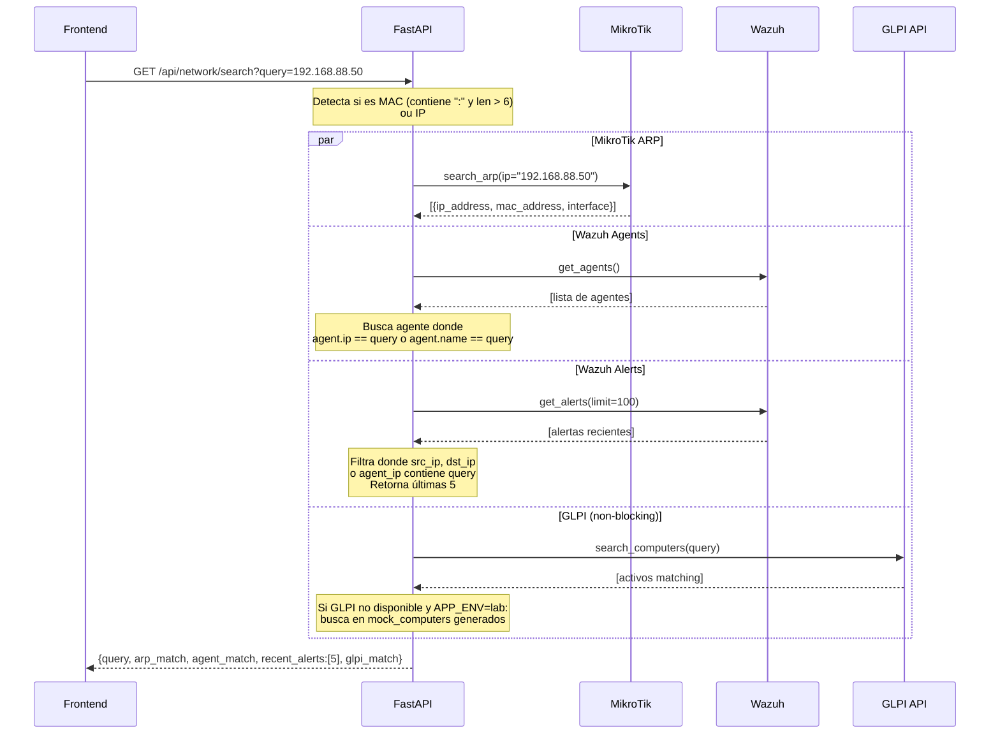
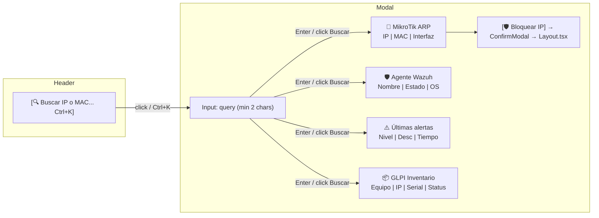
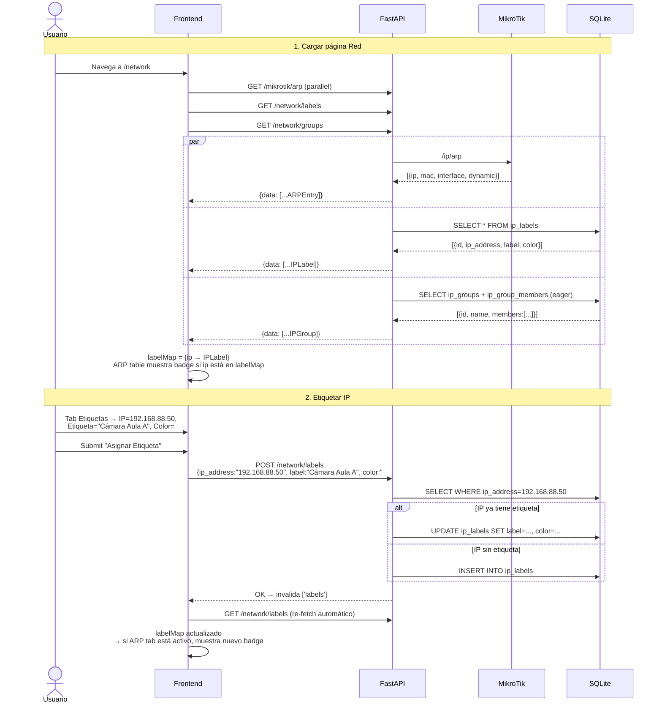

# Red — Gestión de Red, IPs y Búsqueda Unificada

## Descripción General

El ítem **"Red"** en la barra lateral (grupo Infraestructura, ruta `/network`) es el panel centralizado de gestión de la red local. Combina datos en tiempo real de **MikroTik** (tabla ARP) con datos propios en **SQLite** (etiquetas y grupos de IP) y expone además la **búsqueda unificada cross-system** que consume el `GlobalSearch` del header.

La página está organizada en **4 tabs**:

| Tab | Contenido | Fuente de datos |
|---|---|---|
| **Tabla ARP** | Todos los dispositivos detectados en la red | MikroTik `/ip/arp` |
| **Etiquetas** | Nombres semánticos asignados a IPs | SQLite `ip_labels` |
| **Grupos** | Colecciones de IPs con criterios | SQLite `ip_groups` + `ip_group_members` |
| **VLANs** | Panel VLAN embebido (`VlanPanel`) | MikroTik + WebSocket |

> [!IMPORTANT]
> El tab **VLANs** embebe directamente el componente `VlanPanel` — toda su funcionalidad está documentada en `docs/function/vlan.md`. Este documento cubre exclusivamente los tabs ARP, Etiquetas y Grupos, más la búsqueda unificada.

---

## Arquitectura General

```mermaid
graph TB
    subgraph Header["Header (Layout.tsx)"]
        GS["GlobalSearch.tsx<br/>Ctrl+K shortcut<br/>Modal de búsqueda"]
        NS["useNetworkSearch.ts<br/>Hook imperativo<br/>(no TanStack Query)"]
    end

    subgraph Frontend["Frontend — NetworkPage.tsx (464 líneas)"]
        NP["NetworkPage.tsx<br/>4 tabs: ARP + Labels + Groups + VLANs"]
        ARP_TAB["ARPTable (inline)<br/>MikroTik ARP + etiqueta overlaid"]
        LBL_TAB["LabelsPanel (inline)<br/>CRUD etiquetas"]
        GRP_TAB["GroupsPanel (inline)<br/>CRUD grupos + miembros"]
        VL_TAB["VlanPanel (import)<br/>→ vlan.md"]
    end

    subgraph APIs["api.ts"]
        NAPI["networkApi<br/>Labels CRUD<br/>Groups CRUD<br/>Search"]
        MAPI["mikrotikApi<br/>getArp()"]
    end

    subgraph Backend["Backend (FastAPI)"]
        NR["routers/network.py<br/>10 endpoints<br/>/api/network"]
        MR["routers/mikrotik.py<br/>GET /arp<br/>GET /arp/search"]
        DB[("SQLite<br/>ip_labels<br/>ip_groups<br/>ip_group_members")]
    end

    subgraph External["Fuentes Externas"]
        MT["MikroTik RouterOS<br/>/ip/arp"]
        WZ["Wazuh API<br/>Agents + Alerts"]
        GLPI["GLPI API<br/>Asset inventory"]
    end

    GS --> NS --> NAPI
    NP --> ARP_TAB & LBL_TAB & GRP_TAB & VL_TAB
    ARP_TAB --> MAPI
    LBL_TAB & GRP_TAB --> NAPI
    NAPI --> NR
    MAPI --> MR
    NR --> DB
    NR -->|"search"| MT & WZ & GLPI
    MR --> MT

    style External fill:#1e293b,stroke:#475569
    style Header fill:#0f172a,stroke:#334155
```



---

## Backend

### Endpoints REST

Prefijo: `/api/network`

| Método | Ruta | Descripción | Almacenamiento |
|---|---|---|---|
| **Etiquetas (Labels)** | | | |
| `POST` | `/labels` | Crear o actualizar etiqueta en una IP | SQLite (upsert) |
| `GET` | `/labels` | Listar todas las etiquetas | SQLite |
| `DELETE` | `/labels/{label_id}` | Eliminar etiqueta por ID | SQLite |
| **Grupos (Groups)** | | | |
| `POST` | `/groups` | Crear nuevo grupo de IPs | SQLite |
| `GET` | `/groups` | Listar grupos con sus miembros (eager load) | SQLite |
| `POST` | `/groups/{group_id}/members` | Agregar IP a grupo | SQLite |
| `DELETE` | `/groups/{group_id}/members/{ip}` | Quitar IP de grupo | SQLite |
| `DELETE` | `/groups/{group_id}` | Eliminar grupo (cascade members) | SQLite |
| **Búsqueda** | | | |
| `GET` | `/search?query=` | Búsqueda cross-system por IP o MAC | MikroTik + Wazuh + GLPI |

> [!NOTE]
> El endpoint `POST /labels` hace **upsert**: si ya existe una etiqueta para esa IP, la actualiza en lugar de crear un duplicado. Solo existe una etiqueta por IP.

### Schemas Pydantic

Archivo: `schemas/network.py` (79 líneas)

**Requests:**

```python
class IPLabelCreate(BaseModel):
    ip_address: str
    label: str
    description: str | None = None
    color: str = "#6366f1"    # hex color
    criteria: str | None = None  # JSON string con criterios custom

class IPGroupCreate(BaseModel):
    name: str
    description: str | None = None
    color: str = "#8b5cf6"
    criteria: str | None = None  # JSON de membresía automática
                                  # ej: {"min_connections": 50, "ip_range": "192.168.88.0/24"}

class IPGroupMemberAdd(BaseModel):
    ip_address: str
    reason: str = "manual"
```

**Responses:**

```python
class IPLabelResponse(BaseModel):
    id: int
    ip_address: str
    label: str
    description: str | None
    color: str
    criteria: str | None
    created_by: str
    created_at: datetime
    updated_at: datetime

class IPGroupResponse(BaseModel):
    id: int
    name: str
    description: str | None
    color: str
    criteria: str | None
    created_by: str
    created_at: datetime
    updated_at: datetime
    members: list[IPGroupMemberResponse]  # eager loaded

class IPGroupMemberResponse(BaseModel):
    id: int
    ip_address: str
    added_reason: str
    added_at: datetime
```

### Modelos SQLite

**`IPLabel`** — `ip_labels`

```python
class IPLabel(Base):
    __tablename__ = "ip_labels"
    id: int                 # PK autoincrement
    ip_address: str         # indexed — solo una etiqueta por IP (upsert)
    label: str              # nombre semántico: "Servidor Web", "Cámara Sala A"
    description: str | None # descripción opcional
    color: str              # hex color: "#6366f1"
    criteria: str | None    # JSON para criterios de clasificación custom
    created_by: str         # default "system"
    created_at: datetime
    updated_at: datetime    # onupdate automático
```

**`IPGroup`** + **`IPGroupMember`** — `ip_groups` + `ip_group_members`

```python
class IPGroup(Base):
    __tablename__ = "ip_groups"
    id: int
    name: str               # unique — ej: "Servidores Críticos", "Alta Sospecha"
    description: str | None
    color: str              # hex color para identificación visual
    criteria: str | None    # JSON: {"min_connections_per_min": 50,
                            #        "min_alert_level": 10,
                            #        "ip_range": "192.168.88.0/24"}
    created_by: str
    created_at: datetime
    updated_at: datetime
    members: list[IPGroupMember]  # cascade delete-orphan

class IPGroupMember(Base):
    __tablename__ = "ip_group_members"
    id: int
    group_id: int           # FK → ip_groups (CASCADE DELETE)
    ip_address: str         # indexed
    added_reason: str       # "manual" | texto descriptivo
    added_at: datetime
```

### Búsqueda Unificada — `GET /network/search`

El endpoint más complejo del módulo. Busca en paralelo en 3 fuentes externas, todas tolerantes a fallos individuales:



**Resultado:**
```python
{
    "query": "192.168.88.50",
    "arp_match": {"ip_address": "192.168.88.50", "mac_address": "AA:BB:CC:DD:EE:FF",
                  "interface": "bridge"},
    "agent_match": {"id": "003", "name": "PC-SALA-01", "status": "active",
                    "os_name": "Windows", "os_version": "10"},
    "recent_alerts": [
        {"rule_level": 12, "rule_description": "SQL injection attempt", "timestamp": "..."}
    ],
    "glpi_match": {"name": "PC-SALA-01", "ip": "192.168.88.50", "serial": "SN-123",
                   "status": "activo", "location": "Aula 3"}
}
```

> [!TIP]
> Cada fuente de búsqueda falla silenciosamente con un `logger.warning` si el servicio no está disponible. El resultado puede estar parcialmente poblado — el frontend renderiza solo las secciones con datos.

---

## Frontend

Ruta: `/network` — `NetworkPage.tsx` (464 líneas, **4 sub-componentes inline en el mismo archivo**).

### Estructura

```
frontend/src/
├── components/network/
│   └── NetworkPage.tsx          ← 4 tabs + 3 sub-componentes inline
├── components/common/
│   └── GlobalSearch.tsx         ← Modal búsqueda cross-system (Ctrl+K)
├── hooks/
│   └── useNetworkSearch.ts      ← Hook imperativo para búsqueda
└── services/
    └── api.ts                   → networkApi + mikrotikApi
```

> [!NOTE]
> A diferencia de otros módulos, los sub-componentes (`ARPTable`, `LabelsPanel`, `GroupsPanel`) **no son archivos separados** — están definidos como funciones dentro del mismo `NetworkPage.tsx`. Las queries también son **inline** (no hay `useNetworkHooks.ts`).

### Layout

```
┌─────────────────────────────────────────────────────────────────┐
│  🌐 Red & IPs                                                   │
│  Gestión de dispositivos, etiquetas y grupos de IP              │
├─────────────────────────────────────────────────────────────────┤
│  [Tabla ARP] [Etiquetas] [Grupos] [VLANs]   ← Tab selector     │
├─────────────────────────────────────────────────────────────────┤
│                                                                 │
│  TAB ACTIVO: contenido dinámico (ver secciones abajo)          │
│                                                                 │
└─────────────────────────────────────────────────────────────────┘
```

### Tab: Tabla ARP

**Fuente:** `GET /api/mikrotik/arp` — polling `refetchInterval: 15_000`

**Enriquecimiento con etiquetas:**
```typescript
// Crea un mapa IP → etiqueta para O(1) lookup
const labelMap = Object.fromEntries(labels.map(l => [l.ip_address, l]));

// Por cada entrada ARP, busca si tiene etiqueta asignada
const label = labelMap[entry.ip_address]; // IPLabel | undefined
```

La tabla muestra automáticamente el badge de etiqueta (con su color) si existe:

```
┌──────────────────────────────────────────────────────────────────┐
│  Dispositivos en Red (N)              [🔍 Buscar IP o MAC...]   │
├─────────────────┬──────────────────┬───────────┬────────┬───────┤
│  IP             │  MAC             │  Interfaz │  Tipo  │ Etiq. │
├─────────────────┼──────────────────┼───────────┼────────┼───────┤
│  192.168.88.1   │  D4:CA:6D:...   │  bridge   │ Estátic│  🔵  │
│  192.168.88.50  │  AA:BB:CC:...   │  bridge   │ Dinám  │[Srv W]│ ← badge coloreado
│  192.168.88.100 │  11:22:33:...   │  ether1   │ Dinám  │  —    │
└─────────────────┴──────────────────┴───────────┴────────┴───────┘
```

- **Tipo Dinámico:** badge azul `badge-info`
- **Tipo Estático:** badge verde `badge-success`
- **Filtro:** por IP o MAC (client-side), sin request al servidor

### Tab: Etiquetas

**Fuente:** `GET /api/network/labels` — sin polling (on demand)

**Layout:** grid 1+2 (form izquierda, lista derecha)

```
┌─────────────────┬──────────────────────────────────────────────┐
│ 🏷️ Nueva Etiq. │  Etiquetas (N)                               │
│                 │                                              │
│ IP: [_________] │  ● 192.168.88.1    [🔵 Router]    [🗑️]     │
│ Etiq: [_______] │    Gateway principal de la red               │
│ Desc: [_______] │                                              │
│ Color: [■]      │  ● 192.168.88.50   [🟣 Srv Web]   [🗑️]     │
│                 │    Servidor Apache                            │
│ [+ Asignar]     │                                              │
└─────────────────┴──────────────────────────────────────────────┘
```

**Comportamiento del botón "Asignar Etiqueta":**
- Requerido: `ip` Y `label`
- `POST /labels` → si la IP ya tiene etiqueta, la **actualiza** (upsert)
- `onSuccess`: invalida `['labels']` + limpia form

**Eliminar:** 🗑️ → `DELETE /labels/{id}` → invalida `['labels']`

### Tab: Grupos

**Fuente:** `GET /api/network/groups` — sin polling (on demand, eager load members)

**Layout:** grid 1+2 (form izquierda, cards derecha)

```
┌──────────────────┬─────────────────────────────────────────────┐
│ 📁 Nuevo Grupo   │  Grupos (N)                                 │
│                  │                                             │
│ Nombre: [______] │  ● 🔴 Alta Sospecha       [3 IPs]  [🗑️]   │
│ Desc: [________] │    IPs con alertas críticas repetidas        │
│ Criterios JSON:  │    192.168.88.45  192.168.88.23  10.0.0.5   │
│ [______________] │                                             │
│ Color: [■]       │  ● 🟢 Servidores Críticos  [5 IPs]  [🗑️]   │
│                  │    Infraestructura core                      │
│ [+ Crear Grupo]  │    192.168.88.1  192.168.88.10  ...         │
└──────────────────┴─────────────────────────────────────────────┘
```

**Criterios JSON (campo opcional):**
```json
{"min_connections_per_min": 50, "min_alert_level": 10, "ip_range": "192.168.88.0/24"}
```
> [!NOTE]
> El campo `criteria` se guarda como texto JSON en SQLite. En la versión actual es solo **metadato documental** — no hay motor de evaluación automática de membresía que lo aplique. La membresía se agrega manualmente vía `POST /groups/{id}/members`.

**Botón "Crear Grupo":** requiere solo `name` no vacío

**Eliminar grupo:** cascade automático sobre todos sus `IPGroupMember` (SQLAlchemy `delete-orphan`)

### GlobalSearch — Búsqueda Cross-System

Accesible desde cualquier página a través del botón en el header o el shortcut **`Ctrl+K`**.



**Flujo detallado:**
1. Usuario escribe IP (`192.168.88.50`) o MAC (`AA:BB:CC:DD:EE:FF`)
2. Press `Enter` o click "Buscar" → `search(query)` (mínimo 2 chars)
3. `useNetworkSearch` llama `networkApi.search(query)` → `GET /api/network/search?query=...`
4. Backend busca en paralelo: ARP + Wazuh agents + Wazuh alerts (últimas 5) + GLPI
5. Modal muestra resultados en secciones:
   - **MikroTik ARP:** IP, MAC, interfaz (si hay match)
   - **Agente Wazuh:** nombre, estado (badge verde/rojo), OS (si hay match)
   - **Últimas alertas:** nivel con badge crítico/alto/medio + descripción + tiempo relativo
   - **GLPI Inventario:** nombre equipo, IP, serial, estado GLPI, ubicación
6. Si hay `arp_match` y el padre pasa `onBlockIP`: aparece botón **"🛡️ Bloquear IP"** → llama `onBlockIP(ip)` → `Layout.tsx` abre `ConfirmModal` global → bloquea IP en `Blacklist_Automatica`
7. `Escape` o click fuera cierra el modal y limpia el resultado

**`useNetworkSearch.ts` — Hook imperativo** (no TanStack Query):
```typescript
// Hook stateful con useState manual (no useQuery)
// porque la búsqueda es on-demand, no polling
const { search, result, isLoading, error, clear } = useNetworkSearch();

// Uso:
await search("192.168.88.50");
// result: NetworkSearchResult | null
// error: string | null
// isLoading: boolean
```

---

## Flujo de Datos — Tab ARP + Etiquetas



---

## Queries y Mutaciones

| Query Key | Endpoint | Polling | Dónde se usa |
|---|---|---|---|
| `['arp-table']` | `GET /mikrotik/arp` | 15s | ARPTable (tab ARP) |
| `['labels']` | `GET /network/labels` | No | LabelsPanel + ARPTable |
| `['groups']` | `GET /network/groups` | No | GroupsPanel |

| Mutation | Endpoint | onSuccess (invalida) |
|---|---|---|
| Labels `createMutation` | `POST /labels` | `['labels']` |
| Labels `deleteMutation` | `DELETE /labels/{id}` | `['labels']` |
| Groups `createMutation` | `POST /groups` | `['groups']` |
| Groups `deleteMutation` | `DELETE /groups/{id}` | `['groups']` |

---

## Modo Mock

Cuando `MOCK_MIKROTIK=true`:
- `mikrotikApi.getArp()` → `MockData.mikrotik.arp_table()` — 10-15 entradas ARP simuladas con MACs y IPs ficticias

Los endpoints de labels y grupos leen/escriben **directamente en SQLite** (persisten entre reinicios) — no tienen modo mock porque son datos propios del sistema, no de MikroTik.

La búsqueda (`/network/search`) funciona en modo mock:
- ARP: usa `MockData.mikrotik.arp_table()`
- Wazuh: usa mock de agentes y alertas
- GLPI: si no disponible y `APP_ENV=lab`, busca entre 20 `mock_computers` generados

---

## Casos de Uso

### CU-1: Ver todos los dispositivos en la red

**Actor:** Administrador de red

1. Navega a **Red** desde la barra lateral
2. Tab **Tabla ARP** muestra todos los dispositivos detectados por MikroTik con su IP, MAC e interfaz
3. Identifica 3 dispositivos sin etiqueta y 2 con badge "Cámara" y "Servidor"
4. La tabla se refresca automáticamente cada 15 segundos

---

### CU-2: Etiquetar una IP para identificarla rápidamente

**Actor:** Administrador de red

1. En tab **Etiquetas**: IP=`192.168.88.200`, Etiqueta=`"NVR - Cámaras CCTV"`, Color verde
2. Click **"Asignar Etiqueta"** → row guardada en SQLite
3. Vuelve al tab **Tabla ARP**: la IP `192.168.88.200` ahora muestra el badge verde `NVR - Cámaras CCTV`
4. La etiqueta también aparece en los resultados de búsqueda global

---

### CU-3: Crear grupo de IPs sospechosas

**Actor:** Administrador de seguridad

1. En tab **Grupos**: nombre=`"Alta Sospecha"`, descripción=`"IPs con alertas críticas"`, color rojo
2. Criterios JSON: `{"min_alert_level": 10}` (documentativo)
3. Click **"Crear Grupo"** → grupo creado con 0 miembros
4. El grupo aparece en la lista con badge `0 IPs`

---

### CU-4: Agregar IPs a un grupo

**Actor:** Administrador de seguridad

1. Desde la consola o API directamente: `POST /api/network/groups/1/members` con `{ip_address: "10.5.5.100", reason: "Wazuh alert #123"}`
2. El grupo "Alta Sospecha" ahora muestra el chip `10.5.5.100` en su card
3. *(Nota: la UI actual no tiene botón "Agregar miembro" — se hace vía API directa o desde otros módulos)*

---

### CU-5: Buscar un dispositivo en toda la red

**Actor:** Técnico de soporte

1. Presiona **Ctrl+K** desde cualquier página del dashboard
2. Escribe `PC-AULA-03` o `192.168.88.55`
3. El modal muestra simultáneamente:
   - **ARP:** MAC `AA:BB:CC:...` en interfaz `bridge`
   - **Wazuh:** agente activo, Windows 10
   - **Alertas:** 2 alertas de nivel 8 recientes
   - **GLPI:** equipo `PC-AULA-03`, serial `SN-450`, location `Aula 3`
4. Obtiene el contexto completo del equipo sin navegar entre módulos

---

### CU-6: Bloquear IP sospechosa desde la búsqueda

**Actor:** Administrador de seguridad

1. Ctrl+K → busca `185.220.101.45`
2. Resultado ARP confirma que la IP tiene actividad en la red
3. Click **"🛡️ Bloquear IP"** → `ConfirmModal` global: "Esta IP será añadida a Blacklist_Automatica en MikroTik por 24 horas"
4. Confirma → IP bloqueada sin necesidad de navegar al módulo Firewall o Configuración

---

### CU-7: Filtrar tabla ARP por MAC

**Actor:** Técnico de soporte

1. Recibe reporte: "El equipo con MAC `D4:CA:6D:AB:12:34` no tiene acceso"
2. Tab **Tabla ARP** → escribe `D4:CA:6D` en el buscador
3. Filtro client-side muestra solo las entradas que coinciden
4. Identifica la IP asignada `192.168.88.75` → puede buscarla en Wazuh, GLPI o bloquearla

---

## Archivos Involucrados

### Backend

| Archivo | Rol |
|---|---|
| [network.py](file:///home/nivek/Documents/netShield2/backend/routers/network.py) | 10 endpoints: labels CRUD + groups CRUD + búsqueda unificada (332 líneas) |
| [network.py](file:///home/nivek/Documents/netShield2/backend/schemas/network.py) | 5 schemas Pydantic: Create y Response para Labels, Groups, Members (79 líneas) |
| [ip_label.py](file:///home/nivek/Documents/netShield2/backend/models/ip_label.py) | Modelo SQLite `IPLabel` — un label por IP (upsert) |
| [ip_group.py](file:///home/nivek/Documents/netShield2/backend/models/ip_group.py) | Modelos SQLite `IPGroup` + `IPGroupMember` — relación 1:N con cascade delete |
| [mikrotik.py](file:///home/nivek/Documents/netShield2/backend/routers/mikrotik.py) | `GET /arp` y `GET /arp/search` — usados por la tabla ARP y la búsqueda |

### Frontend

| Archivo | Rol |
|---|---|
| [NetworkPage.tsx](file:///home/nivek/Documents/netShield2/frontend/src/components/network/NetworkPage.tsx) | Página completa: 4 tabs + ARPTable + LabelsPanel + GroupsPanel inline (464 líneas) |
| [GlobalSearch.tsx](file:///home/nivek/Documents/netShield2/frontend/src/components/common/GlobalSearch.tsx) | Modal de búsqueda cross-system accesible en todo el app (Ctrl+K) |
| [useNetworkSearch.ts](file:///home/nivek/Documents/netShield2/frontend/src/hooks/useNetworkSearch.ts) | Hook imperativo (useState manual) para búsqueda on-demand |
| [api.ts](file:///home/nivek/Documents/netShield2/frontend/src/services/api.ts) → `networkApi` | `getLabels`, `createLabel`, `deleteLabel`, `getGroups`, `createGroup`, `addGroupMember`, `removeGroupMember`, `deleteGroup`, `search` |
| [api.ts](file:///home/nivek/Documents/netShield2/frontend/src/services/api.ts) → `mikrotikApi` | `getArp()` — tabla ARP con polling |
| [types.ts](file:///home/nivek/Documents/netShield2/frontend/src/types.ts) | `IPLabel`, `IPGroup`, `IPGroupMember`, `ARPEntry`, `NetworkSearchResult` |
