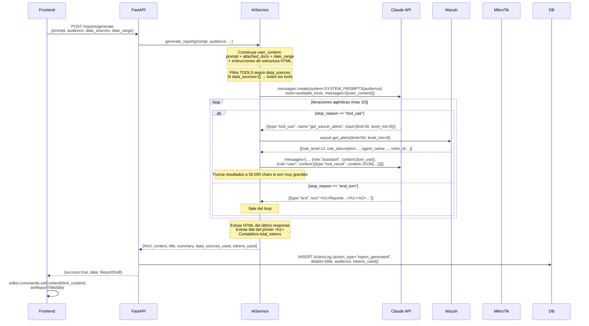
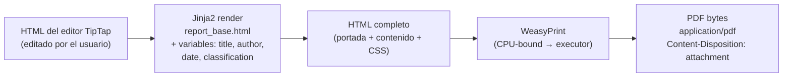
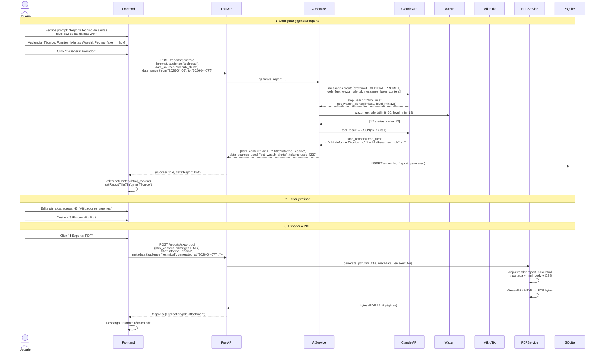

# Reportes IA — Generación de Reportes de Seguridad con Claude

## Descripción General

El ítem **"Reportes"** en la barra lateral (grupo Herramientas, ruta `/reports`) permite generar reportes de seguridad inteligentes usando **Claude AI** de Anthropic. El flujo completo es:

1. El usuario describe el reporte en lenguaje natural (prompt)
2. Claude consume automáticamente datos en vivo de Wazuh y MikroTik via **function calling**
3. El resultado HTML se carga en un **editor TipTap** editable
4. El usuario edita el borrador y lo exporta como **PDF profesional** via WeasyPrint

> [!IMPORTANT]
> Esta funcionalidad requiere una `ANTHROPIC_API_KEY` válida configurada en `backend/.env`. Sin ella, el sistema retorna un error de configuración. En modo `MOCK_ANTHROPIC=true`, retorna un reporte simulado desde `MockData.ai.mock_report()`.

---

## Arquitectura General

```mermaid
graph TB
    subgraph Frontend["Frontend — ReportsPage.tsx (461 líneas)"]
        FORM["Panel Configuración (1/3 col)\nPrompt + Audiencia + Fuentes\n+ Rango fechas + Documentos"]
        EDITOR["Editor TipTap (2/3 col)\nHTML editable + Toolbar\n+ Botón Exportar PDF"]
        MUT1["useMutation: generateMutation\nPOST /reports/generate"]
        MUT2["useMutation: exportMutation\nPOST /reports/export-pdf"]
    end

    subgraph Backend["Backend (FastAPI)"]
        RR["routers/reports.py\n3 endpoints"]
        AI["services/ai_service.py\nAIService\nClaude SDK + function calling\nLoop agéntico ≤10 iteraciones"]
        PDF["services/pdf_service.py\nPDFService\nWeasyPrint + Jinja2"]
        TMPL["templates/report_base.html\nPortada + CSS profesional\nA4, paginación, badges"]
        DB["ActionLog (SQLite)\naction_type='report_generated'\ntokens_used, audience"]
    end

    subgraph Claude["Claude Sonnet API"]
        CL["claude-sonnet-4-20250514\nmax_tokens: 8192\nstop_reason: tool_use | end_turn"]
        TOOLS["4 Tools disponibles:\nget_wazuh_alerts\nget_mikrotik_connections\nget_firewall_rules\nget_arp_table"]
    end

    subgraph DataSources["Fuentes de Datos en Vivo"]
        WZ["Wazuh API\nAlertas + niveles MITRE"]
        MT["MikroTik RouterOS\nConexiones + Firewall + ARP"]
    end

    FORM --> MUT1 --> RR
    EDITOR --> MUT2 --> RR
    RR --> AI & PDF
    AI <-->|"SDK Anthropic"| CL
    CL -->|"tool_use"| TOOLS
    TOOLS --> AI
    AI --> WZ & MT
    PDF --> TMPL
    RR --> DB

    style Claude fill:#1e293b,stroke:#6366f1
    style DataSources fill:#0f2d1e,stroke:#22c55e
```



---

## Backend

### Endpoints REST

Prefijo: `/api/reports`

| Método | Ruta | Descripción | Retorno |
|---|---|---|---|
| `POST` | `/generate` | Generar borrador IA (function calling) | `ReportDraft` (HTML + title + tokens) |
| `POST` | `/export-pdf` | Exportar HTML → PDF via WeasyPrint | `bytes` (application/pdf, descarga directa) |
| `GET` | `/history` | Historial de reportes desde `ActionLog` | Lista de logs con `details` JSON |

### Schemas Pydantic

Archivo: `schemas/reports.py` (43 líneas)

```python
class DateRange(BaseModel):
    from_date: str   # ISO8601 — ej: "2026-04-01"
    to_date: str     # ISO8601 — ej: "2026-04-07"

class ReportGenerateRequest(BaseModel):
    prompt: str                          # Descripción en lenguaje natural (requerido)
    audience: str = "technical"          # "executive" | "technical" | "operational"
    attached_documents: list[str] = []   # Texto plano de archivos subidos (max 10.000 chars c/u)
    data_sources: list[str] = []         # Filtro de tools: ["wazuh_alerts", "arp_table", ...]
    date_range: DateRange | None = None  # Rango temporal para contextualizar el reporte

class ReportDraft(BaseModel):            # Respuesta de /generate
    html_content: str                    # HTML listo para TipTap
    title: str                           # Extraído del primer <h1> en el HTML
    summary: str                         # Primeros 200 chars del prompt
    data_sources_used: list[str]         # Tools que Claude efectivamente llamó
    tokens_used: int = 0

class ReportExportRequest(BaseModel):    # Request de /export-pdf
    html_content: str                    # HTML actual del editor TipTap
    title: str = "NetShield Security Report"
    metadata: dict = {}                  # audience, generated_at, classification, etc.
```

---

## Servicio de IA — `AIService`

### 4 Tools Disponibles para Claude

```python
TOOLS = [
    {
        "name": "get_wazuh_alerts",
        "description": "Fetch recent security alerts from Wazuh SIEM.",
        "input_schema": {
            "properties": {
                "limit": {"type": "integer", "default": 50},
                "level_min": {"type": "integer"}   # Filtro mínimo de severidad (1-15)
            }
        }
    },
    {
        "name": "get_mikrotik_connections",
        "description": "Fetch active network connections from MikroTik router.",
        "input_schema": {"properties": {}}  # Sin parámetros
    },
    {
        "name": "get_firewall_rules",
        "description": "Fetch current firewall filter rules from MikroTik.",
        "input_schema": {"properties": {}}
    },
    {
        "name": "get_arp_table",
        "description": "Fetch the ARP table from MikroTik router.",
        "input_schema": {"properties": {}}
    }
]
```

### System Prompts por Audiencia

| Audiencia | ID | Características del prompt |
|---|---|---|
| **Ejecutivo** | `executive` | Sin jerga técnica, impacto de negocio, bullet points, ratings Crítico/Alto/Medio/Bajo con contexto empresarial, tendencias no eventos individuales |
| **Técnico** | `technical` (default) | IPs exactas, puertos, protocolos, IDs de reglas Wazuh, técnicas MITRE ATT&CK, correlación cross-source, tablas de datos crudos |
| **Operacional** | `operational` | Pasos accionables, procedural, checklists de remediación, balance técnico/claridad, organizado por prioridad |

Todos terminan con: *"Output as clean, well-formatted HTML."*

### Loop Agéntico — Flujo de Function Calling



**Detalles técnicos del loop:**
- Modelo: `claude-sonnet-4-20250514`, `max_tokens: 8192`
- Límite de seguridad: **10 iteraciones** para evitar loops infinitos
- Resultados de tools truncados a **50.000 caracteres** para no exceder la ventana de contexto
- `data_sources_used` acumula los nombres de tools que Claude efectivamente llamó (deduplicados en el return)
- `total_tokens` suma `input_tokens + output_tokens` de cada iteración del loop

### Filtrado de Tools por `data_sources`

```python
source_to_tool = {
    "wazuh_alerts":          "get_wazuh_alerts",
    "mikrotik_connections":  "get_mikrotik_connections",
    "firewall_rules":        "get_firewall_rules",
    "arp_table":             "get_arp_table",
}
# Si data_sources está vacío → Claude tiene todos los 4 tools disponibles
# Si data_sources=["wazuh_alerts"] → solo get_wazuh_alerts disponible
```

---

## Servicio PDF — `PDFService`

### Cadena de Transformación



**Ejecución en executor:**
```python
# WeasyPrint es CPU-bound → se ejecuta en thread pool
loop = asyncio.get_event_loop()
pdf_bytes = await loop.run_in_executor(
    None,
    pdf_service.generate_pdf,    # función síncrona
    request.html_content,
    request.title,
    request.metadata,
)
```

### Plantilla `report_base.html`

| Sección | Contenido |
|---|---|
| **@page CSS** | Tamaño A4, márgenes 2cm × 2.5cm, número de página en footer, clasificación en header-right |
| **Portada (cover)** | Logo "🛡 NetShield" con gradiente, título grande, autor, fecha, badge de clasificación |
| **Estilos de contenido** | `h1` con subrayado morado, `h2` con barra lateral, `h3` simple, párrafos justificados |
| **Tablas** | Header morado, filas alternas gris claro, 9pt monospace en celdas |
| **Badges de severidad** | `.badge-critical/.badge-high/.badge-medium/.badge-low` — colores semánticos |
| **Info boxes** | `.info-box.warning/.danger/.info/.success` — con borde izquierdo de color |
| **Metric cards** | `.metric-grid` + `.metric-card` — valor grande en purpura, label gris uppercase |

Variables Jinja2 interpoladas:

```html
{{ title }}          <!-- Título del reporte -->
{{ author }}         <!-- default: "NetShield Dashboard" -->
{{ date }}           <!-- default: datetime.now() formateado -->
{{ classification }} <!-- default: "INTERNAL" — aparece en header de cada página -->
{{ footer_text }}    <!-- default: "Generated by NetShield Dashboard" -->
{{ content | safe }} <!-- HTML del cuerpo del reporte (sin escape) -->
```

---

## Frontend

Ruta: `/reports` — página única, **2 columnas** (configuración 1/3 + editor 2/3).

### Estructura

```
frontend/src/
├── components/reports/
│   └── ReportsPage.tsx     ← Componente único (461 líneas)
│                              EditorToolbar (inline, 100 líneas)
└── services/
    └── api.ts              → reportsApi.generate() + reportsApi.exportPdf()
```

### Layout

```
┌─────────────────────────────────────────────────────────────────┐
│  📄 Reportes con IA                                             │
│  Genera reportes de seguridad inteligentes con Claude AI        │
├───────────────────┬─────────────────────────────────────────────┤
│  CONFIGURACIÓN    │  [Título del reporte                      ] │
│  (1/3 col)        ├─────────────────────────────────────────────┤
│                   │  [B] [I] [U] [S] | [H1] [H2] | [≡] [#]    │
│  Descripción      │  [◀] [▶] | [←] [↔]                        │
│  [textarea──────] │  ┌─────────────────────────────────────────┐│
│                   │  │                                         ││
│  Audiencia        │  │  El borrador del reporte aparecerá      ││
│  ○ Ejecutivo      │  │  aquí después de generarlo con IA...    ││
│  ● Técnico        │  │                                         ││
│  ○ Operacional    │  │  (HTML editable con TipTap)             ││
│                   │  │                                         ││
│  Fuentes de Datos │  └─────────────────────────────────────────┘│
│  ☑ Alertas Wazuh  │                                             │
│  ☑ Conexiones MT  │  N tokens utilizados    [⬇ Exportar PDF]   │
│  ☐ Reglas FW      │                                             │
│  ☐ Tabla ARP      │                                             │
│                   │                                             │
│  Rango de Fechas  │                                             │
│  [Desde] [Hasta]  │                                             │
│                   │                                             │
│  Documentos       │                                             │
│  [⬆ Subir doc]   │                                             │
│  2 doc adjuntos   │                                             │
│                   │                                             │
│  [✨ Generar]     │                                             │
└───────────────────┴─────────────────────────────────────────────┘
```

### Panel de Configuración (1/3 col)

#### 1. Descripción del Reporte (Prompt)
- `textarea` de altura mínima 112px
- Texto de ejemplo: *"Reporte ejecutivo de las alertas críticas de las últimas 24 horas..."*
- **Requerido** — el botón "Generar" queda deshabilitado si está vacío

#### 2. Audiencia (Radio buttons)
| ID | Label | Descripción visible |
|---|---|---|
| `executive` | Ejecutivo | Lenguaje claro, impacto de negocio |
| `technical` | Técnico (default) | Detalle completo, IOCs, MITRE ATT&CK |
| `operational` | Operacional | Pasos accionables, checklists |

La selección determina qué `system_prompt` se envía a Claude.

#### 3. Fuentes de Datos (Checkboxes)
| ID | Label | Default |
|---|---|---|
| `wazuh_alerts` | 🔔 Alertas Wazuh | ☑ |
| `mikrotik_connections` | 🔗 Conexiones MikroTik | ☑ |
| `firewall_rules` | 🛡️ Reglas de Firewall | ☐ |
| `arp_table` | 📋 Tabla ARP | ☐ |

Determina qué tools se habilitan en la llamada a Claude. Si ninguna está seleccionada, Claude tiene todos disponibles.

#### 4. Rango de Fechas (Opcional)
- 2 inputs `type="date"`: Desde / Hasta
- Si ambos están completos: se envía `date_range: {from_date, to_date}` al backend
- Claude lo usa como contexto en el prompt ("Date range: 2026-04-01 to 2026-04-07")
- **No filtra datos realmente** — es contexto textual para que Claude oriente el análisis

#### 5. Documentos de Contexto (Opcional)
- Input `type="file"` múltiple, acepta `.txt .pdf .md`
- Lee el archivo como texto plano con `file.text()`, truncado a **10.000 chars** por archivo
- Se envían como `attached_documents: string[]` (texto embebido en el mensaje del usuario)
- Claude los recibe como "Attached reference documents — Document 1, Document 2, ..."

#### 6. Botón "✨ Generar Borrador"
- Deshabilitado si `prompt` vacío o `generateMutation.isPending`
- Durante generación: muestra spinner + "Generando con IA..."
- Si error: muestra mensaje en rojo debajo del botón

### Panel Editor TipTap (2/3 col)

#### Input de Título
- Input de texto editable, `font-bold`, placeholder "Título del reporte"
- Se auto-rellena con el `<h1>` extraído del HTML generado por Claude
- El usuario puede modificarlo antes de exportar

#### Editor TipTap
Extensiones configuradas:
```typescript
extensions: [
    StarterKit,           // Bold, Italic, Headings, Lists, Code, Blockquote, Undo/Redo
    Underline,            // Subrayado
    TextAlign.configure({ types: ['heading', 'paragraph'] }),  // Alineación
    Highlight,            // Resaltado (marcador amarillo)
]
```

El HTML generado por Claude se inyecta con:
```typescript
editor?.commands.setContent(resp.data.html_content);
```

#### Toolbar (`EditorToolbar`)

| Grupo | Botones |
|---|---|
| Formato texto | **Bold**, *Italic*, __Underline__, ==Highlight== |
| Headings | H1, H2 |
| Listas | Bullet list (≡), Ordered list (#) |
| Alineación | Izquierda (←), Centro (↔) |
| Historia | Deshacer (↩), Rehacer (↪) |

Separadores visuales (`div w-px h-6`) dividen los grupos.

#### Exportar PDF
```typescript
// Captura el HTML actual del editor
const html = editor?.getHTML() || '';

// llama exportPdf → devuelve Blob
const blob = await reportsApi.exportPdf(html, reportTitle, {
    audience,
    generated_at: new Date().toISOString(),
});

// Descarga en el browser
const url = URL.createObjectURL(blob);
const a = document.createElement('a');
a.href = url;
a.download = `${reportTitle || 'NetShield_Report'}.pdf`;
a.click();
URL.revokeObjectURL(url);
```

> [!TIP]
> El PDF exporta el **estado actual del editor**, no el borrador original de Claude. Si el usuario editó el contenido, el PDF refleja esas ediciones.

### Queries y Mutations

```typescript
// Mutation: generar borrador (llamada larga — Claude puede tomar 10-30s)
useMutation({
    mutationFn: () => reportsApi.generate({ prompt, audience, ... }),
    onSuccess: (resp) => {
        editor?.commands.setContent(resp.data.html_content);  // llena editor
        setReportTitle(resp.data.title);                       // llena título
    },
})

// Mutation: exportar PDF (CPU-bound en backend, puede tomar 5-15s)
useMutation({
    mutationFn: () => reportsApi.exportPdf(html, title, metadata),
    onSuccess: (blob) => { /* descargar archivo */ },
})
```

> [!NOTE]
> No hay `useQuery` en esta página — todo es on-demand. El historial de reportes (`GET /history`) no tiene panel de UI visible actualmente; existe el endpoint pero no hay componente que lo consuma.

---

## Flujo Completo End-to-End



---

## Modo Mock

Cuando `MOCK_ANTHROPIC=true` en `.env`:

```python
if self._settings.should_mock_anthropic:
    from services.mock_data import MockData
    return MockData.ai.mock_report(prompt=prompt, audience=audience)
```

Retorna un `ReportDraft` con:
- `html_content`: HTML pre-generado con estructura completa (Executive Summary, Findings, Recommendations, tablas con datos ficticios)
- `title`: "Mock Security Report — {audience}"
- `tokens_used: 0`
- `data_sources_used: ["mock"]`

El PDF export **no** tiene modo mock — WeasyPrint siempre genera el PDF real a partir del HTML del editor (sea mock o real).

---

## Casos de Uso

### CU-1: Reporte ejecutivo de incidentes de la semana

**Actor:** CISO / Dirección

1. Prompt: `"Reporte ejecutivo semanal de incidentes de seguridad con impacto en el negocio y recomendaciones prioritarias"`
2. Audiencia: **Ejecutivo**, Fuentes: **Alertas Wazuh**, Fechas: semana anterior
3. Click "Generar" — Claude busca alertas filtradas por severidad, las resume en lenguaje no técnico
4. El reporte generado incluye ratings Crítico/Alto/Medio con contexto empresarial
5. El CISO ajusta el título, agrega un párrafo de conclusión
6. Exporta como PDF y lo comparte en la reunión de directorio

---

### CU-2: Análisis técnico de un incidente específico

**Actor:** Analista SOC

1. Prompt: `"Analizar el incidente de acceso no autorizado detectado hoy. Incluir IOCs, IPs involucradas, técnicas MITRE y remediation steps"`
2. Audiencia: **Técnico**, Fuentes: **Alertas Wazuh + Reglas Firewall + Tabla ARP**, sin rango de fechas
3. Claude llama a los 3 tools y correlaciona: detecta la IP atacante en el ARP table, busca reglas de firewall relacionadas, lista alertas críticas
4. El reporte incluye la IP exacta, Wazuh rule IDs, MITRE ATT&CK T1190, comandos de remediación sugeridos
5. El analista agrega contexto adicional y exporta para el ticket de incidente

---

### CU-3: Reporte operacional con checklist de remediación

**Actor:** Administrador de IT

1. Prompt: `"Listado de acciones pendientes para mejorar la postura de seguridad esta semana. Incluir checklists"`
2. Audiencia: **Operacional**, Fuentes: **Conexiones MikroTik + Reglas Firewall**
3. Claude revisa las conexiones activas y reglas, genera un plan de trabajo con pasos numerados
4. El administrador completa el checklist en el editor marcando ítems con Strikethrough
5. Exporta como PDF y lo entrega como acta de trabajo

---

### CU-4: Reporte contextualizado con documentos adjuntos

**Actor:** Consultor de seguridad

1. Sube un archivo `politica_seguridad.txt` (texto de la política interna de seguridad)
2. Prompt: `"Evaluar el cumplimiento de las prácticas de seguridad actuales respecto a la política adjunta"`
3. Claude recibe el documento como contexto + datos en vivo de Wazuh
4. Genera un análisis de gaps entre la política y la situación actual, con hallazgos y brechas identificadas
5. Exporta PDF con la comparativa → sirve como informe de auditoría interna

---

### CU-5: Reporte rápido de estado de la red

**Actor:** Administrador de red

1. Prompt: `"Estado general de la red: dispositivos conectados, conexiones activas, reglas de firewall"`
2. Audiencia: **Técnico**, Fuentes: **Conexiones MikroTik + Tabla ARP + Reglas Firewall**
3. Claude llama a los 3 tools y genera un snapshot de la red en ese momento
4. El reporte incluye tabla de dispositivos ARP, conexiones activas y reglas vigentes
5. Útil como informe de estado diario para auditoría o cambio de turno

---

### CU-6: Reporte de alertas críticas post-incidente

**Actor:** Analista de seguridad

1. Configura rango de fechas exacto del incidente + Fuentes: solo **Alertas Wazuh**
2. Prompt: `"Resumen forense de las alertas del incidente del 5 de abril, nivel mínimo 10"`
3. Claude llama `get_wazuh_alerts({limit:100, level_min:10})`, obtiene todas las alertas del período
4. Genera timeline del incidente, agentes afectados, técnicas MITRE detectadas
5. El analista exporta el PDF como evidencia para el reporte post-mortem

---

## Archivos Involucrados

### Backend

| Archivo | Rol |
|---|---|
| [reports.py](file:///home/nivek/Documents/netShield2/backend/routers/reports.py) | 3 endpoints: `/generate`, `/export-pdf`, `/history` (148 líneas) |
| [reports.py](file:///home/nivek/Documents/netShield2/backend/schemas/reports.py) | `ReportGenerateRequest`, `ReportDraft`, `ReportExportRequest`, `DateRange` (43 líneas) |
| [ai_service.py](file:///home/nivek/Documents/netShield2/backend/services/ai_service.py) | `AIService`: Claude SDK, `TOOLS`, `SYSTEM_PROMPTS`, loop agéntico ≤10 iteraciones (305 líneas) |
| [pdf_service.py](file:///home/nivek/Documents/netShield2/backend/services/pdf_service.py) | `PDFService`: WeasyPrint + Jinja2, ejecución en executor (83 líneas) |
| [report_base.html](file:///home/nivek/Documents/netShield2/backend/templates/report_base.html) | Plantilla Jinja2: portada, CSS A4 profesional, badges, metric cards, tablas (275 líneas) |
| [action_log.py](file:///home/nivek/Documents/netShield2/backend/models/action_log.py) | `ActionLog` — registra `report_generated` con tokens y audiencia |

### Frontend

| Archivo | Rol |
|---|---|
| [ReportsPage.tsx](file:///home/nivek/Documents/netShield2/frontend/src/components/reports/ReportsPage.tsx) | Página completa: panel config + editor TipTap + toolbar inline `EditorToolbar` (461 líneas) |
| [api.ts](file:///home/nivek/Documents/netShield2/frontend/src/services/api.ts) → `reportsApi` | `generate(params)` → POST /generate; `exportPdf(html, title, meta)` → POST /export-pdf → Blob |
