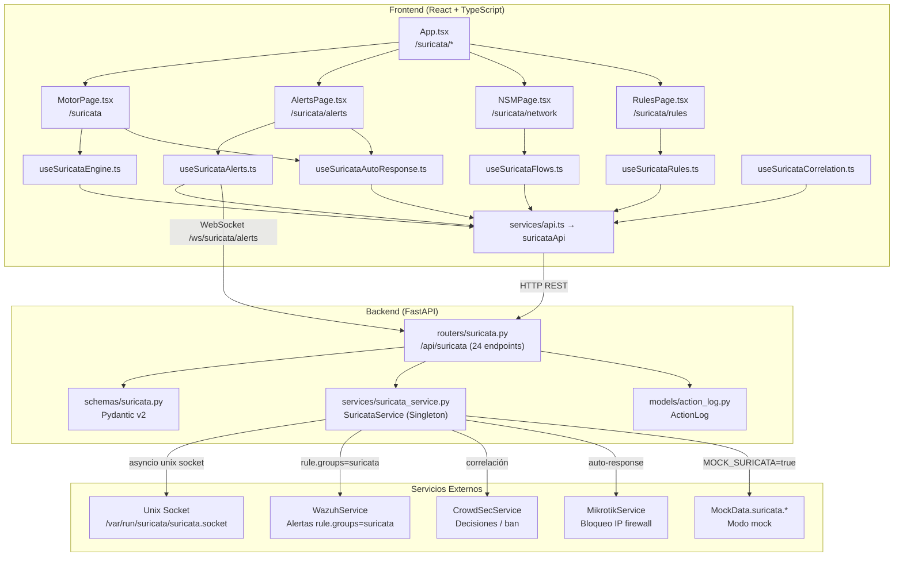
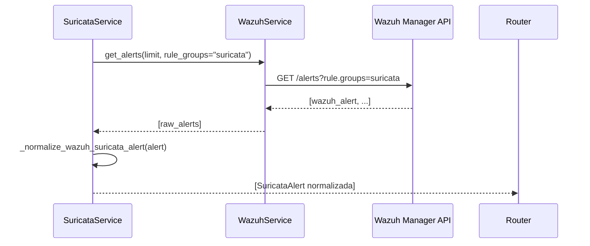
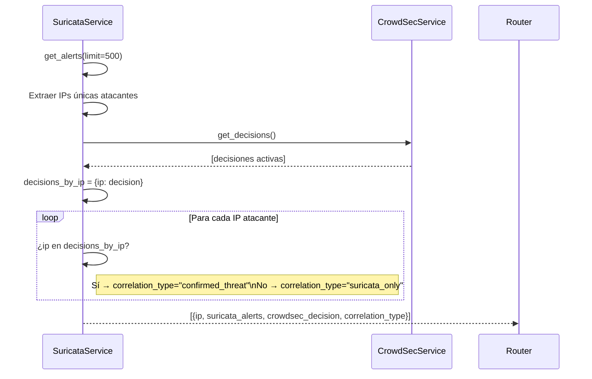
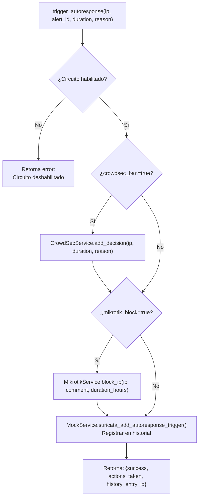
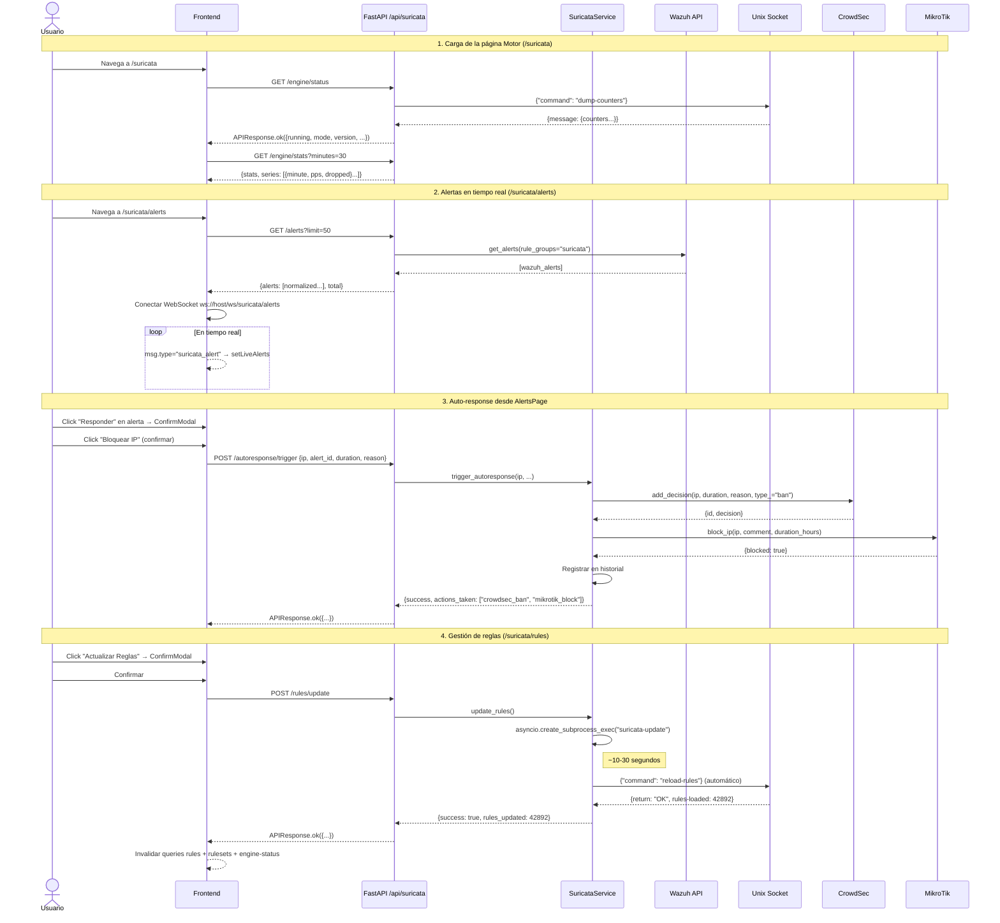

# Módulo Suricata IDS/IPS/NSM — Documentación Funcional

## Descripción General

El módulo Suricata integra el motor de análisis de tráfico de red **Suricata** al dashboard NetShield. Soporta tres modos de operación:

| Modo | Descripción |
|---|---|
| **IDS** (pasivo) | Detecta amenazas y genera alertas sin bloquear tráfico. Modo por defecto. |
| **IPS** (activo) | Intercepta y descarta paquetes maliciosos en tiempo real (`action: drop`). |
| **NSM** (forense) | Network Security Monitoring — captura metadatos de flujos, DNS, HTTP y TLS para análisis forense sin alertas. |

El flujo de datos real es:
```
Tráfico de red → Suricata (eve.json) → Agente Wazuh → Wazuh Manager → NetShield API
```

En modo mock (`MOCK_SURICATA=true`), todas las llamadas retornan datos estáticos de `MockData.suricata.*` sin contactar ningún servicio externo.

---

## Arquitectura General



---

## Backend

### 1. Servicio — `SuricataService`

**Archivo:** `backend/services/suricata_service.py`

#### 1.1 Patrón Singleton

```python
class SuricataService:
    _instance: SuricataService | None = None

    def __new__(cls) -> SuricataService:
        if cls._instance is None:
            cls._instance = super().__new__(cls)
            cls._instance._initialized = False
        return cls._instance
```

El servicio existe como **una única instancia** en todo el proceso FastAPI. Cualquier llamada a `SuricataService()` o a `get_suricata_service()` retorna siempre el mismo objeto. Esto garantiza que la conexión al socket y las configuraciones internas sean compartidas.

#### 1.2 Mock Guard

Cada método público tiene un **mock guard** al inicio:

```python
async def get_engine_stats(self) -> dict:
    if self._settings.should_mock_suricata:
        from services.mock_data import MockData
        return MockData.suricata.engine_stats()
    result = await self._socket_command({"command": "dump-counters"})
    return self._parse_engine_stats(result)
```

`should_mock_suricata` es `True` cuando `MOCK_SURICATA=true` **o** `MOCK_ALL=true` en el `.env`. En ese caso, el servicio retorna datos estáticos y **nunca** ejecuta llamadas reales.

#### 1.3 Comunicación por Unix Socket

```python
@retry(
    stop=stop_after_attempt(3),
    wait=wait_exponential(multiplier=1, min=1, max=10),
    retry=retry_if_exception_type((ConnectionRefusedError, OSError)),
    reraise=True,
)
async def _socket_command(self, command: dict) -> dict:
    socket_path = self._settings.suricata_socket
    reader, writer = await asyncio.open_unix_connection(socket_path)
    payload = json.dumps(command) + "\n"
    writer.write(payload.encode())
    await writer.drain()
    response_bytes = await asyncio.wait_for(reader.read(4096), timeout=5.0)
    writer.close()
    return json.loads(response_bytes.decode().strip())
```

- Usa **`asyncio.open_unix_connection`** para comunicarse con Suricata a través del socket Unix en `/var/run/suricata/suricata.socket` (configurable en `.env → SURICATA_SOCKET`).
- El protocolo es JSON: se envía `{"command": "..."}` terminado en `\n`, Suricata responde con un JSON.
- Tiene **retry automático** con `tenacity`: 3 intentos con backoff exponencial (1s → 2s → 4s, máximo 10s). Solo reintenta en errores de conexión (`ConnectionRefusedError`, `OSError`).
- Timeout de lectura: **5 segundos**. Lee hasta **4 KB** de respuesta.

---

### 2. Grupos de Métodos del Servicio

#### 2.1 Motor (Engine Control)

Métodos que controlan el motor Suricata via socket:

| Método | Comando Socket | Qué hace |
|---|---|---|
| `get_engine_stats()` | `dump-counters` | Lee métricas del motor: paquetes capturados, drops, alertas totales, flujos activos, bytes procesados, reglas cargadas. Normaliza con `_parse_engine_stats()`. |
| `get_engine_mode()` | `running-mode` | Retorna el modo de operación actual: `ids`, `ips` o `nsm`. |
| `get_engine_stats_series(minutes)` | `dump-counters` (snapshot) | En modo real: repite el snapshot actual para construir una serie temporal básica. En mock: genera serie con variación aleatoria para gráficos. |
| `reload_rules()` | `reload-rules` | **Hot reload** de reglas: Suricata lee las nuevas firmas en memoria sin detener la captura. Retorna cuántas reglas se cargaron y cuántas fallaron. |

**`_parse_engine_stats(raw)`** — Normaliza la respuesta cruda del socket:

```python
def _parse_engine_stats(self, raw: dict) -> dict:
    counters = raw.get("message", {})
    return {
        "running": True,
        "mode": "ids",
        "version": raw.get("version", "unknown"),
        "uptime_seconds": counters.get("uptime", 0),
        "packets_captured": counters.get("capture.kernel_packets", 0),
        "packets_decoded": counters.get("decoder.pkts", 0),
        "packets_dropped": counters.get("capture.kernel_drops", 0),
        "alerts_total": counters.get("detect.alert", 0),
        "flows_active": counters.get("flow.active", 0),
        "bytes_processed": counters.get("decoder.bytes", 0),
        "rules_loaded": counters.get("rules.loaded", 0),
        "rules_failed": counters.get("rules.failed", 0),
    }
```

Mapea los nombres internos de Suricata (`capture.kernel_packets`, `detect.alert`, etc.) a nombres amigables para el frontend.

---

#### 2.2 Alertas IDS/IPS (via Wazuh)

Las alertas **no se leen directamente del socket**. Suricata escribe `eve.json` → el agente Wazuh lo procesa → NetShield las consulta por la API de Wazuh con `rule.groups=suricata`.



**`_normalize_wazuh_suricata_alert(wazuh_alert)`** — Extrae los campos del bloque `data.suricata` del evento Wazuh:

```python
def _normalize_wazuh_suricata_alert(self, wazuh_alert: dict) -> dict:
    data = wazuh_alert.get("data", {}).get("suricata", {})
    return {
        "id":            wazuh_alert.get("id"),
        "timestamp":     wazuh_alert.get("timestamp"),
        "signature_id":  data["alert"]["signature_id"],
        "signature":     data["alert"]["signature"],
        "category":      data["alert"]["category"],
        "severity":      data["alert"]["severity"],   # 1=Crítica, 2=Mayor, 3=Menor
        "protocol":      data.get("proto"),
        "src_ip":        data.get("src_ip"),
        "src_port":      data.get("src_port"),
        "dst_ip":        data.get("dest_ip"),
        "dst_port":      data.get("dest_port"),
        "action":        data["alert"]["action"],      # "alert" | "drop" | "pass"
        "flow_id":       str(data.get("flow_id")),
        "app_proto":     data.get("app_proto"),
        "mitre_technique": wazuh_alert["rule"]["mitre"]["id"][0],
        "mitre_name":      wazuh_alert["rule"]["mitre"]["technique"][0],
        "wazuh_alert_id":  wazuh_alert.get("id"),
        "crowdsec_decision_id": None,
        "geo": None,
    }
```

El campo `action` distingue IDS (`"alert"`) de IPS (`"drop"`). Esto alimenta los gráficos de timeline separados por modo.

**Métodos auxiliares de alertas:**

| Método | Qué hace |
|---|---|
| `get_alerts(limit, offset, src_ip, dst_ip, category, severity)` | Lista con filtros opcionales. |
| `get_alert_detail(alert_id)` | Busca una alerta específica por ID dentro de los últimos 200. |
| `get_alerts_timeline(minutes)` | Serie temporal: agrupa alertas por minuto en buckets de `minutes` tamaño. Separa `count_ids` (action=alert) y `count_ips` (action=drop). |
| `get_top_signatures(limit)` | Cuenta hits por `signature_id`, ordena descendente, retorna los `limit` primeros. |
| `get_categories()` | Distribución de alertas por categoría con colores asignados para el donut chart. |

**`_group_alerts_by_minute`** — crea buckets de tiempo:

```python
def _group_alerts_by_minute(self, alerts, minutes):
    now = datetime.now(timezone.utc)
    buckets = {}
    for i in range(minutes):
        t = now - timedelta(minutes=minutes - i)
        key = t.strftime("%Y-%m-%dT%H:%M:00")
        buckets[key] = {"minute": key, "count_ids": 0, "count_ips": 0}
    for alert in alerts:
        ts = alert["timestamp"][:16] + ":00"
        if ts in buckets:
            if alert["action"] == "drop":
                buckets[ts]["count_ips"] += 1
            else:
                buckets[ts]["count_ids"] += 1
    return list(buckets.values())
```

Primero inicializa todos los minutos a 0. Luego itera las alertas y las clasifica. El frontend usa este array para dibujar el gráfico de área IDS vs IPS.

---

#### 2.3 Flujos NSM (Network Security Monitoring)

Los flujos son eventos `eve.json` de tipos `flow`, `dns`, `http`, `tls` procesados por Wazuh con reglas de grupo `suricata_flow`, `suricata_dns`, etc.

**`_fetch_wazuh_eve_events(event_type, limit)`** — Consulta genérica a Wazuh:

```python
async def _fetch_wazuh_eve_events(self, event_type: str, limit: int = 100) -> list[dict]:
    wazuh = WazuhService()
    return await wazuh.get_alerts(limit=limit, rule_groups=f"suricata_{event_type}")
```

Métodos de flujos:

| Método | event_type | Datos que provee |
|---|---|---|
| `get_flows(...)` | `flow` | Flujos completos: src/dst IP:port, protocolo, app_proto, estado (new/established/closed), bytes up/down, si tiene alerta asociada. |
| `get_flows_stats()` | — | Agrega los flujos: total, activos, top protocolos con conteo y bytes. |
| `get_dns_queries(limit, suspicious_only)` | `dns` | Consultas DNS capturadas: query, tipo (A, AAAA, MX), respuesta, flag `is_suspicious`. |
| `get_http_transactions(limit, suspicious_only)` | `http` | Transacciones HTTP: método, host, URL, status code, bytes de respuesta, flag `is_suspicious`. |
| `get_tls_handshakes(limit, suspicious_only)` | `tls` | Handshakes TLS: SNI, versión, JA3 fingerprint, flag `is_suspicious`. |

**`_aggregate_flows(flows)`** — Calcula estadísticas:

```python
def _aggregate_flows(self, flows):
    proto_counts = {}
    for f in flows:
        p = f.get("protocol", "other")
        proto_counts[p] = proto_counts.get(p, {"proto": p, "count": 0, "bytes": 0})
        proto_counts[p]["count"] += 1
        proto_counts[p]["bytes"] += f.get("bytes_toserver", 0) + f.get("bytes_toclient", 0)
    return {
        "total_flows": len(flows),
        "active_flows": sum(1 for f in flows if f.get("state") == "established"),
        "top_protocols": sorted(proto_counts.values(), key=lambda x: x["count"], reverse=True),
        ...
    }
```

---

#### 2.4 Gestión de Reglas

Las reglas (firmas) de Suricata se gestionan a través del socket para toggles individuales y mediante `suricata-update` (proceso externo) para actualizaciones masivas.

| Método | Cómo opera (modo real) |
|---|---|
| `get_rules(limit, offset, enabled, ruleset, category)` | Envía `{"command": "ruleset-stats"}` al socket. Retorna lista de reglas con sus estadísticas de hits. |
| `get_rule_detail(sid)` | Carga todas las reglas (limit=10000) y busca el SID. |
| `get_rulesets()` | Retorna metadatos de rulesets disponibles. En real: hardcodeado `emerging-threats-open`. |
| `toggle_rule(sid, enabled)` | Envía `enable-rule` o `disable-rule` al socket con el SID. Suricata aplica el cambio en el próximo ciclo. |
| `update_rules()` | Lanza `suricata-update` como **subprocess asíncrono** con `asyncio.create_subprocess_exec()`. Timeout: 120 segundos. Si tiene éxito, llama automáticamente a `reload_rules()`. |

```python
async def update_rules(self) -> dict:
    proc = await asyncio.create_subprocess_exec(
        "suricata-update",
        stdout=asyncio.subprocess.PIPE,
        stderr=asyncio.subprocess.PIPE,
    )
    stdout, stderr = await asyncio.wait_for(proc.communicate(), timeout=120)
    success = proc.returncode == 0
    if success:
        await self.reload_rules()   # Hot-reload automático
    return {
        "success": success,
        "message": stdout.decode()[-500:] if success else stderr.decode()[-500:],
    }
```

---

#### 2.5 Correlación Cross-Service

**`get_correlation_crowdsec()`** — Detecta amenazas confirmadas por múltiples fuentes:



Campo `correlation_type`:
- `"confirmed_threat"` → La IP tiene alertas Suricata **Y** decisión activa en CrowdSec. Alta confianza.
- `"suricata_only"` → Solo detectado por Suricata, aún no en CrowdSec.

**`get_correlation_wazuh()`** — Correlación temporal entre alertas de red (Suricata) y alertas de host (Wazuh) dentro de ±5 minutos. Actualmente retorna lista vacía en modo real (pendiente de implementar).

---

#### 2.6 Circuito de Auto-Response

Es el mecanismo que, ante una alerta Suricata, puede **bloquear automáticamente** una IP en CrowdSec y en MikroTik.



**Campos de configuración:**

| Campo | Tipo | Descripción |
|---|---|---|
| `enabled` | `bool` | Activa/desactiva el circuito completo. |
| `auto_trigger` | `bool` | Si `True`: el circuito se activa automáticamente sin confirmación humana. **PELIGROSO** — deshabilitado por defecto. |
| `suricata_threshold` | `int` (1-100) | Mínimo de alertas de una IP para sugerir la activación. |
| `wazuh_level_required` | `int` (1-15) | Nivel mínimo de alerta Wazuh correlacionada requerida para la activación automática. |
| `actions.crowdsec_ban` | `bool` | Si debe agregar un ban en CrowdSec. |
| `actions.mikrotik_block` | `bool` | Si debe bloquear en MikroTik Blacklist_Automatica. |
| `actions.default_duration` | `str` | Duración por defecto del bloqueo (ej: `"24h"`, `"7d"`). |

**`_parse_duration_hours(duration)`** — convierte `"24h"` → `24` o `"7d"` → `168`.

---

#### 2.7 Contexto de IP

**`get_ip_context(ip)`** — Retorna un resumen de la actividad de una IP específica en Suricata:

```python
async def get_ip_context(self, ip: str) -> dict:
    alerts = await self.get_alerts(src_ip=ip, limit=10)
    if not alerts:
        alerts = await self.get_alerts(dst_ip=ip, limit=10)  # Buscar también como destino
    flows = await self.get_flows(src_ip=ip, limit=10)
    return {
        "ip": ip,
        "alerts_count": len(alerts),
        "recent_alerts": alerts[:5],
        "flows_count": len(flows),
        "top_signatures": list({a["signature"] for a in alerts[:3]}),
        "last_seen": alerts[0]["timestamp"] if alerts else None,
    }
```

Busca primero como IP de origen. Si no hay alertas, busca como destino. Usado por el módulo GeoIP para enriquecer el contexto de una IP.

---

### 3. Endpoints REST — `routers/suricata.py`

**Prefijo:** `/api/suricata` | **Total:** 24 endpoints

#### 3.1 Engine (4 endpoints)

| Método | Ruta | Descripción | ActionLog |
|---|---|---|---|
| `GET` | `/engine/status` | Estado actual del motor: running, modo, versión, uptime, métricas clave. | — |
| `GET` | `/engine/stats?minutes=30` | Métricas instantáneas + serie temporal para gráficos. `minutes`: 5-120. | — |
| `GET` | `/engine/mode` | Solo el modo de operación (ids/ips/nsm). | — |
| `POST` | `/engine/reload-rules` | Recarga reglas en caliente. Requiere confirmación en UI. | ✅ `suricata_reload_rules` |

#### 3.2 Alerts (5 endpoints)

| Método | Ruta | Descripción |
|---|---|---|
| `GET` | `/alerts` | Lista de alertas con filtros: `limit`, `offset`, `src_ip`, `dst_ip`, `category`, `severity` (1-4). |
| `GET` | `/alerts/timeline?minutes=120` | Serie temporal de alertas por minuto (IDS vs IPS). `minutes`: 10-1440. |
| `GET` | `/alerts/top-signatures?limit=10` | Top N firmas por hits. `limit`: 1-50. |
| `GET` | `/alerts/categories` | Distribución por categoría con colores para donut chart. |
| `GET` | `/alerts/{alert_id}` | Detalle completo de una alerta específica. 404 si no existe. |

#### 3.3 Flows NSM (5 endpoints)

| Método | Ruta | Descripción |
|---|---|---|
| `GET` | `/flows` | Flujos con filtros: `src_ip`, `proto` (TCP/UDP/ICMP), `app_proto`, `has_alert`. |
| `GET` | `/flows/stats` | Estadísticas agregadas: total, activos, top protocolos. |
| `GET` | `/flows/dns?suspicious_only=false` | Consultas DNS capturadas. |
| `GET` | `/flows/http?suspicious_only=false` | Transacciones HTTP. |
| `GET` | `/flows/tls?suspicious_only=false` | Handshakes TLS con JA3 fingerprint. |

#### 3.4 Rules (5 endpoints)

| Método | Ruta | Descripción | ActionLog |
|---|---|---|---|
| `GET` | `/rules` | Lista de reglas con filtros: `enabled`, `ruleset`, `category`. | — |
| `GET` | `/rules/rulesets` | Rulesets disponibles con conteo de reglas activas/total. | — |
| `GET` | `/rules/{sid}` | Detalle de una regla por SID: texto crudo + estadísticas de hits. | — |
| `PUT` | `/rules/{sid}/toggle` | Habilitar/deshabilitar una regla. Body: `{"enabled": bool}`. | ✅ `suricata_rule_toggle` |
| `POST` | `/rules/update` | Ejecutar `suricata-update` + hot-reload automático. | ✅ `suricata_update_rules` |

#### 3.5 Correlation (2 endpoints)

| Método | Ruta | Descripción |
|---|---|---|
| `GET` | `/correlation/crowdsec` | IPs con alertas Suricata que tienen decisión activa en CrowdSec. |
| `GET` | `/correlation/wazuh` | Correlación temporal Suricata ↔ Wazuh (±5 minutos). |

#### 3.6 Auto-Response (3 endpoints)

| Método | Ruta | Descripción | ActionLog |
|---|---|---|---|
| `POST` | `/autoresponse/trigger` | Activar circuito para una IP. Body: `AutoResponseTriggerRequest`. | ✅ `suricata_autoresponse_trigger` |
| `GET` | `/autoresponse/config` | Configuración actual + últimas 5 activaciones del historial. | — |
| `PUT` | `/autoresponse/config` | Actualizar configuración del circuito. Body: `AutoResponseConfigUpdate`. | ✅ `suricata_autoresponse_config_update` |

---

### 4. Schemas Pydantic — `schemas/suricata.py`

#### `AutoResponseTriggerRequest`

Valida el request de activación del circuito:

| Campo | Tipo | Validación |
|---|---|---|
| `ip` | `str` | IP válida IPv4 o IPv6 (`ipaddress.ip_address`). Strip de espacios. |
| `trigger_alert_id` | `str` | ID de la alerta que disparó el trigger. Requerido. |
| `duration` | `str` | Formato `Nh` o `Nd` (ej: `24h`, `7d`). Máximo 90 días (`2160h`). Default: `"24h"`. |
| `reason` | `str` | Texto libre, máximo 500 chars. Default: `""`. |

#### `AutoResponseConfigUpdate`

Todos los campos son opcionales (solo se actualiza lo que se envía):

| Campo | Tipo | Rango |
|---|---|---|
| `enabled` | `bool \| None` | — |
| `auto_trigger` | `bool \| None` | — |
| `suricata_threshold` | `int \| None` | 1-100 |
| `wazuh_level_required` | `int \| None` | 1-15 |
| `crowdsec_ban` | `bool \| None` | — |
| `mikrotik_block` | `bool \| None` | — |
| `default_duration` | `str \| None` | Formato `Nh` o `Nd` |

#### `RuleToggleRequest`

```python
class RuleToggleRequest(BaseModel):
    enabled: bool
```

#### `AlertFilterParams`

| Campo | Tipo | Rango | Validación extra |
|---|---|---|---|
| `limit` | `int` | 1-500 | — |
| `offset` | `int` | ≥0 | — |
| `src_ip` | `str \| None` | — | IP válida IPv4/IPv6 |
| `dst_ip` | `str \| None` | — | IP válida IPv4/IPv6 |
| `category` | `str \| None` | — | — |
| `severity` | `int \| None` | 1-4 | — |

#### `FlowFilterParams`

| Campo | Tipo | Validación |
|---|---|---|
| `proto` | `Literal["TCP","UDP","ICMP"] \| None` | Solo protocolos válidos |
| `src_ip` | `str \| None` | IP válida |
| `app_proto` | `str \| None` | — |
| `has_alert` | `bool \| None` | — |

#### `RuleFilterParams`

| Campo | Tipo | Validación |
|---|---|---|
| `enabled` | `bool \| None` | — |
| `ruleset` | `str \| None` | Máximo 100 chars |
| `category` | `str \| None` | Máximo 100 chars |

---

## Frontend

### 5. Estructura de Archivos

```
frontend/src/
├── components/suricata/
│   ├── MotorPage.tsx       ← Vista principal del motor (/suricata)
│   ├── AlertsPage.tsx      ← Alertas IDS/IPS con live feed (/suricata/alerts)
│   ├── NSMPage.tsx         ← NSM: Flujos, DNS, HTTP, TLS (/suricata/network)
│   └── RulesPage.tsx       ← Gestión de reglas/firmas (/suricata/rules)
├── hooks/
│   ├── useSuricataEngine.ts        ← Estado del motor + reload
│   ├── useSuricataAlerts.ts        ← Alertas + WebSocket live feed
│   ├── useSuricataFlows.ts         ← Flujos NSM + DNS + HTTP + TLS
│   ├── useSuricataRules.ts         ← Gestión de reglas
│   ├── useSuricataAutoResponse.ts  ← Circuito de auto-respuesta
│   └── useSuricataCorrelation.ts   ← Correlación cross-service
└── services/
    └── api.ts → suricataApi        ← Cliente HTTP centralizado
```

### 6. Navegación y Rutas

Las 4 páginas del módulo tienen rutas propias en `App.tsx`:

```
/suricata           → SuricataMotorPage    (estado del motor)
/suricata/alerts    → SuricataAlertsPage   (alertas IDS/IPS)
/suricata/network   → SuricataNSMPage      (flujos NSM)
/suricata/rules     → SuricataRulesPage    (gestión de reglas)
```

---

### 7. Página: Motor (`MotorPage.tsx`)

**Ruta:** `/suricata`

**Hooks utilizados:**
- `useSuricataEngine(30)` — estado y métricas
- `useSuricataAlerts()` — categorías para donut chart
- `useSuricataAutoResponse()` — panel del circuito

**Layout:**

```
┌─ Header: modo badge + versión + uptime + botón Recargar Reglas ──────────────────┐
├─ Banner de estado: ✅ Motor activo / ❌ Detenido — N reglas cargadas            ─┤
├─ KPI Row (4 cards) ──────────────────────────────────────────────────────────────┤
│  Paquetes capturados | Alertas totales | Flujos activos | Datos procesados        │
├─ Charts (2/3 + 1/3) ─────────────────────────────────────────────────────────────┤
│  AreaChart tráfico motor (paquetes/s + dropped) │ PieChart categorías de alertas │
├─ AutoResponsePanel ──────────────────────────────────────────────────────────────┤
│  Config: umbral, nivel Wazuh, acciones, duración │ Historial reciente             │
└──────────────────────────────────────────────────────────────────────────────────┘
```

**`ModeBadge`** — Componente visual que indica el modo del motor:

| Modo | Color | Texto |
|---|---|---|
| `ids` | Azul | `IDS — Pasivo` |
| `ips` | Ámbar | `IPS — Activo` |
| `nsm` | Violeta | `NSM — Forense` |

**`AutoResponsePanel`** — Subcomponente embebido:
- Muestra config actual (umbral, nivel Wazuh, acciones, duración).
- Botón "Habilitar / Deshabilitar Circuito" con `ConfirmModal`.
- Advertencia visible si `auto_trigger=true`.
- Las últimas 3 activaciones del historial (IP, razón, acciones tomadas, hora).

**Reload Rules** — tiene `ConfirmModal` previo. Tras completarse muestra un **toast** en esquina inferior derecha por 3 segundos.

---

### 8. Página: Alertas (`AlertsPage.tsx`)

**Ruta:** `/suricata/alerts`

**Hooks utilizados:**
- `useSuricataAlerts()` — alertas + timeline + firmas + categorías + WebSocket live
- `useSuricataAutoResponse()` — para triggear respuesta desde la tabla

**Layout:**

```
┌─ Header: total de alertas + botón Filtros ─────────────────────────────────────┐
├─ Panel de filtros (condicional): src_ip, categoría, severidad ──────────────────┤
├─ Live Feed: tarjetas horizontales con alertas del WebSocket (últimas 5) ────────┤
├─ Timeline: AreaChart 2h — IDS (ámbar) vs IPS (rojo) por minuto ────────────────┤
├─ Grid 3/4 + 1/4:                                                                │
│  Tabla de alertas (Hora, Sev, Firma, Src IP, Dst IP:Port, Acción, Proto, Cat)  │
│  │  Sidebar: Top Firmas con barra de progreso proporcional                      │
└──────────────────────────────────────────────────────────────────────────────────┘
```

**Live Feed (WebSocket):**

El hook `useSuricataAlerts` abre un WebSocket a `ws://host/ws/suricata/alerts`:

```typescript
ws.onmessage = (event) => {
    const msg = JSON.parse(event.data);
    if (msg.type === "suricata_alert" && msg.data) {
        setLiveAlerts(prev => [msg.data, ...prev].slice(0, 20)); // max 20
        if (++tickRef.current % 5 === 0) {
            // Cada 5 alertas live, invalida la query REST para actualizar contadores
            queryClient.invalidateQueries({ queryKey: ["suricata", "alerts"] });
        }
    }
};
```

- Buffer máximo de **20 alertas en vivo**.
- La invalidación REST ocurre cada 5 alertas para no sobrecargar.

**`AlertRow`** — Fila de tabla:
- Hover muestra botón "Responder" (Shield icon).
- Click → abre `ConfirmModal` que llama `trigger_autoresponse`.
- Si el circuito está deshabilitado, el modal lo advierte y el botón no ejecuta.

**Badges de severidad:**

| Severity | Label | Clase |
|---|---|---|
| 1 | Crítica | `text-red-400 bg-red-500/10` |
| 2 | Mayor | `text-amber-400 bg-amber-500/10` |
| 3 | Menor | `text-blue-400 bg-blue-500/10` |

**Badges de acción:**

| Action | Label | Clase |
|---|---|---|
| `alert` | Alerta | `text-blue-300 bg-blue-500/10` |
| `drop` | Bloqueado | `text-red-300 bg-red-500/10` |
| `pass` | Permitido | `text-emerald-300 bg-emerald-500/10` |

---

### 9. Página: NSM — Red (`NSMPage.tsx`)

**Ruta:** `/suricata/network`

**Hook:** `useSuricataFlows()`

**Layout:**

```
┌─ Header: "Red NSM" + descripción ─────────────────────────────────────────────┐
├─ Stats row: Total flujos │ TCP │ UDP │ ICMP (top 3 protocolos) ───────────────┤
├─ Panel con tabs: [Flujos] [DNS] [HTTP] [TLS] ──────────────────────────────────┤
│  Contenido varía según tab activo                                               │
└────────────────────────────────────────────────────────────────────────────────┘
```

**Tab Flujos (`FlowsTable`):**

Columnas: Hora, Proto, App Proto, Src IP, Dst IP:Port, Estado, Bytes ↑, Bytes ↓, Alerta

- Estado coloreado: `established` → verde, `new` → azul, resto → gris.
- Ícono de alerta (⚠️) si `has_alert=true`.
- `fmtBytes()` formatea bytes a KB/MB legibles.

**Tab DNS (`DnsTable`):**

- Toggle "Solo sospechosos" para filtrar client-side.
- Filas sospechosas tienen fondo `bg-red-500/5`.
- Columnas: Hora, Src IP, Query, Tipo (A/AAAA/MX), Respuesta, Estado sospechoso.

**Tab HTTP (`HttpTable`):**

- Status code coloreado: ≥400 → rojo, ≥300 → ámbar, resto → verde.
- Columnas: Hora, Src IP, Host, URL, Método, Status, Bytes, Estado.

**Tab TLS (`TlsTable`):**

- JA3 truncado a 12 chars con `title` completo en tooltip.
- Columnas: Hora, Src IP, Dst IP, SNI, Versión, JA3, Estado.

**`TableSkeleton`** — Componente de carga: grilla de divs animados `animate-pulse` que respeta el número exacto de filas y columnas de cada tabla.

---

### 10. Página: Reglas (`RulesPage.tsx`)

**Ruta:** `/suricata/rules`

**Hook:** `useSuricataRules()`

**Layout:**

```
┌─ Header: "Reglas Suricata" + botón Actualizar Reglas ──────────────────────────┐
├─ Banner resultado de update (éxito/error) ──────────────────────────────────────┤
├─ Grid de Ruleset Cards (nombre, descripción, progreso habilitadas/total) ───────┤
├─ Filtros: búsqueda libre + dropdown Todas/Activas/Inactivas + dropdown Ruleset ─┤
└─ Tabla de reglas: SID │ Estado │ Ruleset │ Regla (truncada) │ Categoría │ Hits │ Toggle
```

**`RulesetCard`:**
- Barra de progreso proporcional habilitadas/total.
- Badge Activo/Inactivo.
- Fecha de última actualización y versión.

**`RuleRow`:**
- Toggle visual: `ToggleRight` (verde) si activa, `ToggleLeft` (gris) si inactiva.
- Click abre `ConfirmModal` antes de ejecutar el toggle (acción con impacto en detección).
- Hits totales resaltados en ámbar si > 0.
- El texto de la regla se trunca a 80 chars quitando el prefijo `alert`.

**Búsqueda client-side** sobre el array de reglas ya cargado (SID, texto, categoría).

**Actualización de reglas** (`update_rules`) requiere `ConfirmModal` que muestra:
- Operación: `suricata-update + hot-reload`
- Duración estimada: ~10-30 segundos
- Impacto: Ninguno durante la captura

---

### 11. Custom Hooks

#### `useSuricataEngine(statMinutes)`

Intervalos de polling:
- Status: cada **10 segundos**
- Stats + series: cada **5 segundos**

```typescript
return {
    engineStatus,   // Datos del motor (running, mode, version, uptime, ...)
    stats,          // Snapshot de métricas
    series,         // Array [{minute, packets_per_sec, alerts_per_min, dropped}]
    reloadRules,    // mutationFn → POST /engine/reload-rules
    isReloading,
    isHealthy,      // engineStatus.running === true (para status dot del sidebar)
};
```

Tras `reloadRules` exitoso: invalida `engine-status` y `rules`.

---

#### `useSuricataAlerts(initialFilters)`

Intervalos de polling:
- Alertas: cada **15 segundos**
- Timeline: cada **30 segundos**
- Top firmas: cada **30 segundos**
- Categorías: cada **60 segundos**

Gestiona filtros localmente con `useState`. `updateFilters(patch)` resetea el offset a 0 automáticamente.

```typescript
return {
    alerts,         // Array de alertas normalizadas
    total,          // Conteo total
    timeline,       // [{minute, count_ids, count_ips}]
    signatures,     // [{sid, signature, category, hits, last_hit}]
    categories,     // [{category, count, color}]
    liveAlerts,     // Alertas recibidas por WebSocket (max 20)
    filters,
    updateFilters,
    clearFilters,
};
```

---

#### `useSuricataFlows(initialFilters)`

Intervalos de polling (todos los sub-queries): cada **20 segundos**
Stats: cada **30 segundos**

```typescript
return {
    flows,          // Lista de flujos
    totalFlows,
    flowsStats,     // {total_flows, active_flows, top_protocols}
    dns,            // Consultas DNS
    http,           // Transacciones HTTP
    tls,            // Handshakes TLS
    filters,
    updateFilters,
};
```

---

#### `useSuricataRules(initialFilters)`

Los rulesets tienen `staleTime: 60_000` (no se refrescan tan frecuentemente).

```typescript
return {
    rules,          // Lista de reglas
    totalRules,
    rulesets,       // Rulesets disponibles
    toggleRule,     // mutationFn → PUT /rules/{sid}/toggle
    isToggling,
    updateRules,    // mutationFn → POST /rules/update
    isUpdating,
    updateResult,
    filters,
    updateFilters,
};
```

Tras `toggleRule`: invalida `rules`.
Tras `updateRules`: invalida `rules`, `rulesets` y `engine-status`.

---

#### `useSuricataAutoResponse()`

```typescript
return {
    config,             // Configuración del circuito
    recentHistory,      // Últimas 5 activaciones
    updateConfig,       // mutationFn → PUT /autoresponse/config
    isUpdating,
    trigger,            // mutationFn → POST /autoresponse/trigger
    isTriggering,
    triggerResult,
    isCircuitEnabled,   // config.enabled
    isAutoTriggerOn,    // config.auto_trigger
};
```

> **Regla crítica:** `trigger` solo se llama **después de que el usuario confirma** en `ConfirmModal`. El auto-trigger sin confirmación está deshabilitado por defecto.

---

#### `useSuricataCorrelation()`

Polling: cada **30 segundos** para ambos queries.

```typescript
return {
    crowdSecCorrelations,   // IPs con alertas Suricata + decisión CrowdSec
    totalCrowdSec,
    wazuhCorrelations,
    totalWazuh,
    confirmedThreats,       // Filtro: solo correlation_type="confirmed_threat"
};
```

---

## Flujo de Datos Completo



---

## Modo Mock

Cuando `MOCK_SURICATA=true` en `.env`, el servicio retorna datos estáticos sin contactar ningún sistema externo:

| Método mock | Datos que genera |
|---|---|
| `MockData.suricata.engine_stats()` | Motor IDS corriendo, v7.0.8, uptime ~2 días, ~50k paquetes, 1247 alertas, 238 flujos activos. |
| `MockData.suricata.engine_stats_series(minutes)` | Serie temporal de `minutes` puntos con jitter aleatorio en paquetes/s y drops. |
| `MockData.suricata.alerts(...)` | 25 alertas con firmas reales de Emerging Threats (ET SCAN, ET EXPLOIT, ET POLICY, etc.), severidades 1-3, IPs ficticias. |
| `MockData.suricata.alerts_timeline(minutes)` | Buckets por minuto con `count_ids` ~ 0-8 y `count_ips` ~ 0-3. |
| `MockData.suricata.top_signatures(limit)` | Top firmas ordenadas con hits realistas (ej: "ET SCAN Nmap" con 127 hits). |
| `MockData.suricata.categories()` | 5 categorías: "Attempted Information Leak", "Potential Corporate Privacy Violation", etc. |
| `MockData.suricata.flows(...)` | Flujos TCP/UDP/ICMP con app_proto (http, dns, tls, ssh), estados y bytes. |
| `MockData.suricata.flows_stats()` | Stats agregadas proporcionales a los flows mock. |
| `MockData.suricata.dns_queries(...)` | Consultas DNS reales + 2-3 dominios sospechosos marcados. |
| `MockData.suricata.http_transactions(...)` | Transacciones con User-Agents, paths y algunos status 4xx. |
| `MockData.suricata.tls_handshakes(...)` | Handshakes con SNIs reales + JA3 fingerprints ficticios, 1-2 sospechosos. |
| `MockData.suricata.rules(...)` | 100+ reglas de emerging-threats-open y local, con hits y estado habilitado/deshabilitado. |
| `MockData.suricata.correlation_crowdsec()` | 4 IPs: 2 `confirmed_threat`, 2 `suricata_only`. |
| `MockData.suricata.ip_context(ip)` | Contexto simulado con alertas y flujos para la IP. |
| `MockService.suricata_get_autoresponse_config()` | Circuito deshabilitado, umbral=5, acciones CrowdSec+MikroTik, duración 24h. |
| `MockService._ensure_suricata_autoresponse_history()` | 3 activaciones recientes con IPs y razones. |

---

## Casos de Uso

### CU-1: Monitorear el estado del motor Suricata

**Actor:** Administrador de seguridad

1. Navega a `/suricata` → página Motor.
2. El banner muestra: ✅ Motor activo · 8.741 reglas cargadas · 0 fallos.
3. Las KPIs se actualizan cada 10 segundos automáticamente.
4. El gráfico de área muestra paquetes/seg y packets dropped en los últimos 30 minutos.
5. El donut chart muestra la distribución de alertas por categoría.

---

### CU-2: Detectar un escaneo de puertos en tiempo real

**Actor:** Administrador de seguridad

1. En `/suricata/alerts`, la barra de Live Feed muestra una alerta nueva con firma "ET SCAN Nmap Scripting Engine".
2. Severidad: Mayor (2), Acción: Alerta (IDS), Proto: TCP.
3. Src IP: `185.220.101.45`, Dst IP:Port: `192.168.1.1:22`.
4. El gráfico timeline muestra un spike en `count_ids` en el minuto actual.
5. La firma aparece en el sidebar "Top Firmas" con 23 hits.

---

### CU-3: Bloquear una IP atacante con auto-response

**Actor:** Administrador de seguridad

1. En la tabla de alertas, la fila de la alerta tiene el botón "Responder" (visible al hacer hover).
2. Click → `ConfirmModal` muestra: IP Atacante, Firma, Severidad, estado del circuito.
3. Si el circuito está habilitado, click "Bloquear IP".
4. El circuito ejecuta en paralelo:
   - CrowdSec ban por 24h
   - MikroTik Blacklist_Automatica por 24h
5. Se registra en el historial de auto-response.
6. El panel de Router muestra: `actions_taken: ["crowdsec_ban", "mikrotik_block"]`.

---

### CU-4: Analizar tráfico DNS sospechoso

**Actor:** Analista forense

1. Navega a `/suricata/network` → tab **DNS**.
2. Activa "Solo sospechosos" → la lista se reduce a 3 consultas marcadas en rojo.
3. Identifica la query `update.malware-c2.ru` tipo A desde `192.168.10.45`.
4. Cruza con `/suricata/alerts?src_ip=192.168.10.45` para ver alertas del host.

---

### CU-5: Actualizar el ruleset de firmas

**Actor:** Administrador de seguridad

1. Navega a `/suricata/rules`.
2. Observa que el ruleset `emerging-threats-open` tiene versión de 3 días.
3. Click "Actualizar Reglas" → `ConfirmModal`: "suricata-update + hot-reload, ~10-30 segundos, sin impacto en captura".
4. Click "Actualizar" → el botón muestra spinner "Actualizando...".
5. Tras ~15 segundos, banner verde: "suricata-update completado: 42.892 reglas".
6. Las queries de reglas y estado del motor se invalidan y refrescan automáticamente.

---

### CU-6: Confirmar una amenaza con correlación multi-fuente

**Actor:** Analista SOC

1. En el sidebar del motor, `useSuricataCorrelation` muestra 2 "confirmed threats".
2. Las IPs de `correlation/crowdsec` tienen `correlation_type="confirmed_threat"`:
   - `185.220.101.45`: 8 alertas Suricata + ban CrowdSec activo (escenario: `http-crawl`).
   - `91.108.4.21`: 3 alertas Suricata + ban CrowdSec activo.
3. Ambas ya están bloqueadas en CrowdSec; puede agregar bloqueo MikroTik adicional si es necesario.

---

### CU-7: Deshabilitar una regla problemática (falsos positivos)

**Actor:** Administrador de seguridad

1. En `/suricata/rules`, filtra por "Activas" y busca "ICMP Destination Unreachable".
2. La regla SID 2100402 tiene 847 hits totales generando ruido.
3. Click en el toggle → `ConfirmModal`: "La regla SID 2100402 dejará de generar alertas. El cambio se aplica en el próximo ciclo de detección."
4. Confirma → el toggle cambia a gris (Inactiva).

---

## Archivos Involucrados

### Backend

| Archivo | Rol |
|---|---|
| `routers/suricata.py` | 24 endpoints REST — motor, alertas, flows, reglas, correlación, auto-response |
| `services/suricata_service.py` | SuricataService singleton — 7 grupos de métodos, socket async, retry tenacity |
| `schemas/suricata.py` | 6 schemas Pydantic v2 — validación de IPs, duraciones, rangos numéricos |
| `services/mock_data.py` | `MockData.suricata.*` — datos mock para todos los grupos |
| `services/mock_service.py` | `MockService.suricata_*` — config y historial de auto-response |
| `services/wazuh_service.py` | Fuente de alertas e-vents en modo real (`rule_groups=suricata`) |
| `services/crowdsec_service.py` | Destino de bans en auto-response + fuente de correlación |
| `services/mikrotik_service.py` | Destino de bloqueos en auto-response |
| `models/action_log.py` | Registro de acciones destructivas (4 acciones) |
| `config.py` | `should_mock_suricata`, `suricata_socket` |

### Frontend

| Archivo | Rol |
|---|---|
| `components/suricata/MotorPage.tsx` | Vista del motor + KPIs + gráficos + AutoResponsePanel |
| `components/suricata/AlertsPage.tsx` | Alertas IDS/IPS + Live Feed WebSocket + timeline + tabla |
| `components/suricata/NSMPage.tsx` | NSM con tabs: Flujos, DNS, HTTP, TLS |
| `components/suricata/RulesPage.tsx` | Gestión de reglas con ruleset cards + toggle individual + update |
| `hooks/useSuricataEngine.ts` | TanStack Query: status (10s) + stats (5s) + mutation reload |
| `hooks/useSuricataAlerts.ts` | TanStack Query + WebSocket live feed (max 20 alertas) |
| `hooks/useSuricataFlows.ts` | TanStack Query: flows + stats + dns + http + tls (20-30s) |
| `hooks/useSuricataRules.ts` | TanStack Query: rules + rulesets + toggle + update mutations |
| `hooks/useSuricataAutoResponse.ts` | TanStack Query: config + historial + trigger + updateConfig |
| `hooks/useSuricataCorrelation.ts` | TanStack Query: crowdsec + wazuh correlations (30s) |
| `services/api.ts → suricataApi` | 24+ funciones HTTP centralizadas |
| `types.ts` | `SuricataAlert`, `NetworkFlow`, `DnsQuery`, `HttpTransaction`, `TlsHandshake`, `SuricataRule`, `SuricataRuleset`, `AutoResponseConfig` |
| `App.tsx` | 4 rutas: `/suricata`, `/suricata/alerts`, `/suricata/network`, `/suricata/rules` |
