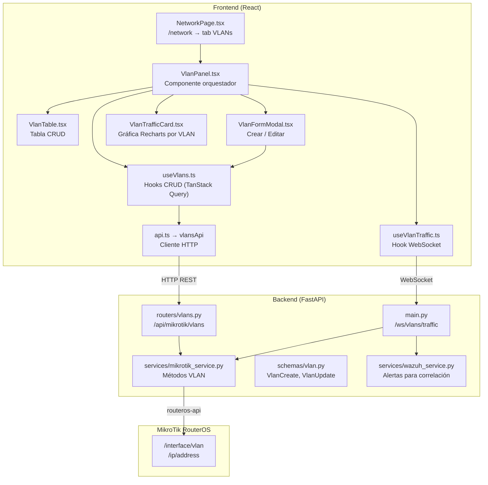
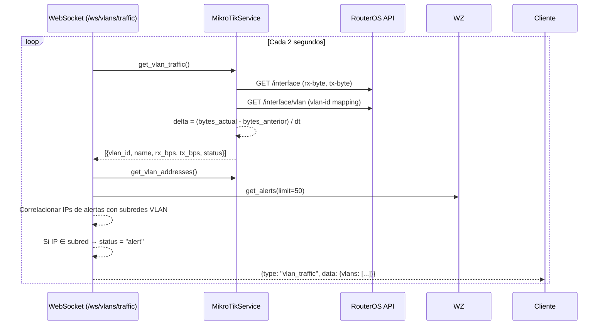
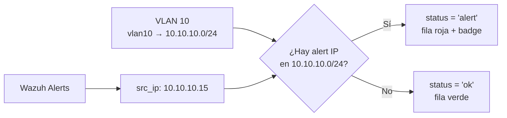
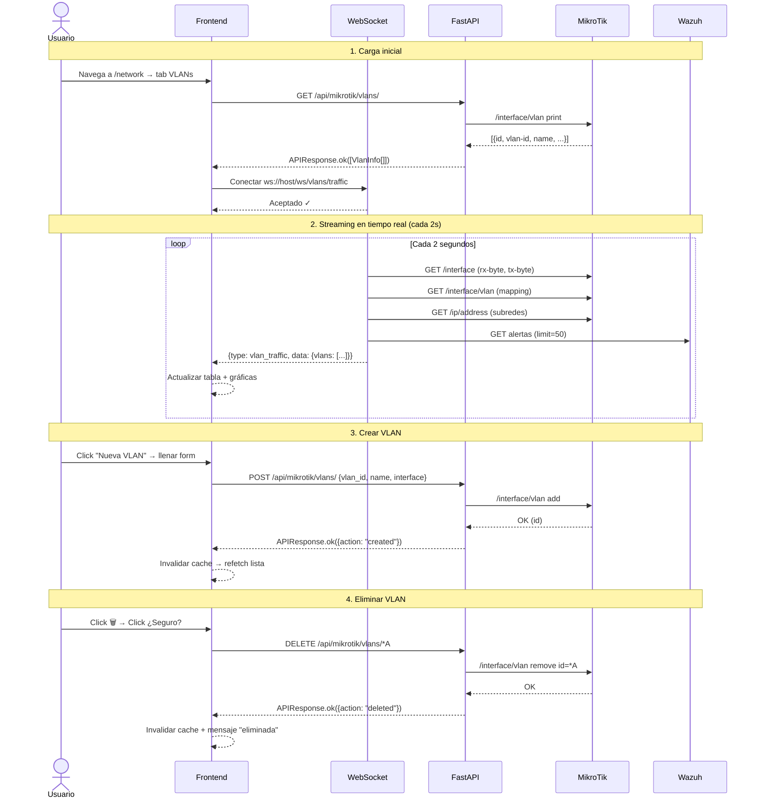

# Módulo VLAN — Documentación Funcional

## Descripción General

El módulo VLAN permite **gestionar y monitorear VLANs del MikroTik CHR** directamente desde el dashboard. Soporta CRUD completo (crear, leer, editar, eliminar), monitoreo de tráfico en tiempo real vía WebSocket, y correlación de alertas de seguridad por subred.

---

## Arquitectura del Módulo



---

## Backend

### Endpoints REST

Prefijo: `/api/mikrotik/vlans`

| Método | Ruta | Descripción | Schema de entrada |
|---|---|---|---|
| `GET` | `/` | Listar todas las VLANs | — |
| `POST` | `/` | Crear una nueva VLAN | `VlanCreate` |
| `PUT` | `/{vlan_id}` | Editar nombre/comentario | `VlanUpdate` |
| `DELETE` | `/{vlan_id}` | Eliminar una VLAN | — |
| `GET` | `/traffic/all` | Tráfico actual de todas las VLANs | — |
| `GET` | `/{vlan_id}/traffic` | Tráfico de una VLAN específica | — |
| `GET` | `/{vlan_id}/alerts` | Alertas Wazuh correlacionadas a la subred de la VLAN | — |

> **Nota**: El `vlan_id` en PUT/DELETE es el **ID interno de RouterOS** (ej: `*A`), no el número de VLAN (10, 20, etc.).

### Schemas Pydantic

```python
# schemas/vlan.py

class VlanCreate:
    vlan_id: int     # 1-4094
    name: str        # Nombre de la interfaz
    interface: str   # Interfaz padre (ej: "bridge")
    comment: str     # Opcional

class VlanUpdate:
    name: str | None     # Nuevo nombre (opcional)
    comment: str | None  # Nuevo comentario (opcional)
```

### Servicio MikroTik — Métodos VLAN

Archivo: `services/mikrotik_service.py`

| Método | API RouterOS | Mock fallback | Descripción |
|---|---|---|---|
| `get_vlans()` | `/interface/vlan` print | `MockData.mikrotik.vlans()` | Lista interfaces VLAN |
| `create_vlan()` | `/interface/vlan` add | Retorna `{mock: True}` | Crea VLAN en RouterOS |
| `update_vlan()` | `/interface/vlan` set | Retorna `{mock: True}` | Modifica nombre/comentario |
| `delete_vlan()` | `/interface/vlan` remove | Retorna `{mock: True}` | Elimina interfaz VLAN |
| `get_vlan_traffic()` | `/interface` print + delta | `MockData.mikrotik.vlan_traffic()` | Calcula bps por delta de contadores |
| `get_vlan_addresses()` | `/ip/address` print | `MockData.mikrotik.vlan_addresses()` | IPs asignadas a interfaces VLAN |

#### Cálculo de tráfico (modo real)

El tráfico no se lee directamente — se **calcula por delta**:



### WebSocket de Tráfico VLAN

Endpoint: `ws://host/ws/vlans/traffic`

Envía cada **2 segundos** un mensaje con la estructura:

```json
{
  "type": "vlan_traffic",
  "data": {
    "timestamp": "2026-04-06T20:30:00",
    "vlans": [
      {
        "vlan_id": 10,
        "name": "vlan10",
        "rx_bps": 4200000,
        "tx_bps": 1800000,
        "status": "ok"
      }
    ]
  }
}
```

**Campo `status`**: puede ser `"ok"` o `"alert"`. Se marca `"alert"` cuando alguna IP de las alertas activas de Wazuh (campos `src_ip`, `dst_ip`, `agent_ip`) cae dentro de la subred asignada a la VLAN.

#### Correlación VLAN ↔ Alertas



---

## Frontend

### Estructura de Componentes

```
frontend/src/
├── components/vlans/
│   ├── VlanPanel.tsx        ← Componente orquestador (header + tabla + charts + modal)
│   ├── VlanTable.tsx        ← Tabla de VLANs con acciones editar/eliminar
│   ├── VlanFormModal.tsx    ← Modal para crear o editar VLAN
│   └── VlanTrafficCard.tsx  ← Gráfica AreaChart (Recharts) por VLAN
├── hooks/
│   ├── useVlans.ts          ← Hooks CRUD (TanStack Query)
│   └── useVlanTraffic.ts    ← Hook WebSocket de tráfico en tiempo real
└── services/
    └── api.ts → vlansApi    ← Llamadas HTTP al backend
```

### Navegación

La pestaña VLAN vive dentro de la página **Red & IPs** (`/network`):

```
/network → Tab: Tabla ARP | Etiquetas | Grupos | VLANs
                                                  ↑
                                            VlanPanel.tsx
```

> La ruta legacy `/vlans` redirige automáticamente a `/network`.

### VlanPanel — Componente principal

Renderiza 3 secciones:

1. **Header** con indicador de conexión WebSocket (●  En vivo / ● Desconectado) y botón "Nueva VLAN"
2. **VlanTable** — tabla con todas las VLANs y sus datos en tiempo real
3. **VlanTrafficCard** — una gráfica por cada VLAN con historial de tráfico

### VlanTable — Tabla CRUD

Columnas de la tabla:

| Columna | Dato | Formato |
|---|---|---|
| VLAN ID | Número 1-4094 | `monospace`, bold |
| Nombre | Nombre de interfaz | Texto |
| Interfaz | Interfaz padre (bridge) | `monospace`, gris |
| Estado | running / stopped / alert | Badge con color |
| Tráfico Actual | ↓ RX / ↑ TX | `monospace`, formateado a Kbps/Mbps |
| Acciones | Editar ✏️ / Eliminar 🗑️ | Botones con confirmación |

**Comportamiento del estado visual:**

| Status | Fondo de fila | Badge |
|---|---|---|
| `running` | Verde sutil (`bg-success/[0.04]`) | `badge-success` → "running" |
| `stopped` | Sin color | `badge-low` → "stopped" |
| `alert` | Rojo sutil (`bg-danger/[0.08]`) | `badge-danger` → "alert" |

**Eliminación con doble confirmación:**
1. Primer clic → botón cambia a rojo con texto "¿Seguro?"
2. Segundo clic → ejecuta eliminación
3. Auto-reset después de 3 segundos si no se confirma

### VlanFormModal — Crear / Editar

Campos del formulario:

| Campo | Crear | Editar | Validación |
|---|---|---|---|
| VLAN ID | ✏️ Editable | 🔒 Bloqueado | `1-4094`, requerido |
| Nombre | ✏️ Editable | ✏️ Editable | min 1 char, requerido |
| Interfaz base | ✏️ Selector dinámico | 🔒 Bloqueado | Carga de `/api/mikrotik/interfaces` |
| Comentario | ✏️ Libre | ✏️ Libre | Opcional |

> El selector de interfaz carga dinámicamente las interfaces disponibles del MikroTik al abrir el modal.

### VlanTrafficCard — Gráficas en Tiempo Real

Una tarjeta por VLAN con:

- **Header**: indicador de estado (● verde / ● rojo pulsante), nombre, VLAN ID, tasas actuales ↓/↑
- **Chart**: `AreaChart` de Recharts con dos series (RX verde, TX violeta punteado)
- **Colapsable**: estado persistido en `localStorage` por VLAN ID
- **Modo alerta**: borde rojo, glow rojo, badge "ALERT"

Buffer de datos: **60 muestras** (≈ 2 minutos a 2s/tick).

### Hooks

#### `useVlans()` — CRUD via TanStack Query

```typescript
useVlans()          // GET /vlans, polling cada 10s
useCreateVlan()     // POST /vlans → invalida cache
useUpdateVlan()     // PUT /vlans/:id → invalida cache
useDeleteVlan()     // DELETE /vlans/:id → invalida cache
```

#### `useVlanTraffic(maxHistory)` — WebSocket

```typescript
const { isConnected, trafficByVlan, latestTraffic } = useVlanTraffic(60);

// isConnected: boolean — estado del WebSocket
// trafficByVlan: Record<number, VlanTrafficData[]> — historial por VLAN ID
// latestTraffic: VlanTrafficData[] — último snapshot de todas las VLANs
```

- Reconexión automática con **backoff exponencial** (1s, 2s, 4s... max 30s)
- Buffer circular de `maxHistory` muestras por VLAN

### Tipos TypeScript

```typescript
interface VlanInfo {
  id: string;          // RouterOS internal ID (*A, *B, etc.)
  vlan_id: number;     // 1-4094
  name: string;
  interface: string;   // Interfaz padre
  running: boolean;
  disabled: boolean;
  mtu: number;
  mac_address: string;
  comment: string;
}

interface VlanTrafficData {
  vlan_id: number;
  name: string;
  rx_bps: number;
  tx_bps: number;
  status: 'ok' | 'alert';
}

interface VlanTrafficWSMessage {
  type: 'vlan_traffic';
  data: {
    timestamp: string;
    vlans: VlanTrafficData[];
  };
}
```

---

## Flujo de Datos Completo



---

## Modo Mock

Cuando `MOCK_MIKROTIK=true` (o `MOCK_ALL=true`), el backend **no contacta al router**. Retorna datos estáticos definidos en `mock_data.py`:

| Dato Mock | Contenido |
|---|---|
| `MockData.mikrotik.vlans()` | 4 VLANs: 10 (Docentes), 20 (Estudiantes), 30 (Servidores), 99 (Cuarentena) |
| `MockData.mikrotik.vlan_traffic()` | Tráfico base con bps fijos. VLAN 99 = 0 bps |
| `MockData.mikrotik.vlan_addresses()` | Subredes: 10.10.10.0/24, 10.10.20.0/24, 10.10.30.0/24, 10.99.99.0/24 |
| `MockData.websocket.vlan_traffic_tick(tick)` | Tráfico con ±12% jitter por tick. VLAN 99 siempre 0 |

---

## Casos de Uso

### CU-1: Ver estado de VLANs del router

**Actor:** Administrador de red

1. Navega a **Red & IPs** → tab **VLANs**
2. Ve la tabla con todas las VLANs: ID, nombre, interfaz, estado (running/stopped), tráfico actual
3. Las gráficas de tráfico se actualizan cada 2 segundos automáticamente

---

### CU-2: Crear una VLAN para un nuevo segmento

**Actor:** Administrador de red

1. Click en **"Nueva VLAN"**
2. Completa: VLAN ID = `40`, Nombre = `vlan-invitados`, Interfaz = `bridge`, Comentario = `Red de invitados`
3. Click **"Crear VLAN"**
4. La VLAN aparece en la tabla y empieza a mostrar tráfico

---

### CU-3: Detectar actividad sospechosa en una VLAN

**Actor:** Administrador de seguridad

1. En la tabla, la VLAN 10 cambia a estado **ALERT** (fila roja, badge pulsante)
2. Esto significa que Wazuh detectó alertas con IPs dentro de `10.10.10.0/24`
3. La tarjeta de tráfico de esa VLAN muestra borde rojo y glow
4. Puede consultar `GET /api/mikrotik/vlans/10/alerts` para ver las alertas específicas

---

### CU-4: Renombrar una VLAN existente

**Actor:** Administrador de red

1. En la tabla, click en ✏️ de la VLAN 20
2. Se abre el modal con datos pre-cargados (VLAN ID y interfaz bloqueados)
3. Cambia el nombre de `vlan20` a `vlan-alumnos`
4. Click **"Guardar Cambios"** → tabla se actualiza

---

### CU-5: Eliminar una VLAN en desuso

**Actor:** Administrador de red

1. En la tabla, click en 🗑️ de la VLAN 99
2. El botón cambia a rojo: **"¿Seguro?"**
3. Click de confirmación dentro de 3 segundos
4. VLAN eliminada del router → desaparece de la tabla y gráficas

---

## Archivos Involucrados

### Backend

| Archivo | Rol |
|---|---|
| `routers/vlans.py` | 7 endpoints REST |
| `services/mikrotik_service.py` | 6 métodos VLAN (L419-L600) |
| `schemas/vlan.py` | 4 schemas Pydantic |
| `services/mock_data.py` | Datos mock (L157-L193) |
| `main.py` | WebSocket `/ws/vlans/traffic` (L314-L388) |

### Frontend

| Archivo | Rol |
|---|---|
| `components/vlans/VlanPanel.tsx` | Orquestador principal |
| `components/vlans/VlanTable.tsx` | Tabla con CRUD y tráfico |
| `components/vlans/VlanFormModal.tsx` | Formulario crear/editar |
| `components/vlans/VlanTrafficCard.tsx` | Gráfica AreaChart por VLAN |
| `hooks/useVlans.ts` | 4 hooks TanStack Query |
| `hooks/useVlanTraffic.ts` | Hook WebSocket con buffer |
| `services/api.ts` → `vlansApi` | 7 funciones HTTP |
| `types.ts` | `VlanInfo`, `VlanTrafficData`, `VlanTrafficWSMessage` |
| `components/network/NetworkPage.tsx` | Página padre (tab VLANs) |
| `App.tsx` | Ruta `/vlans` → redirect a `/network` |
