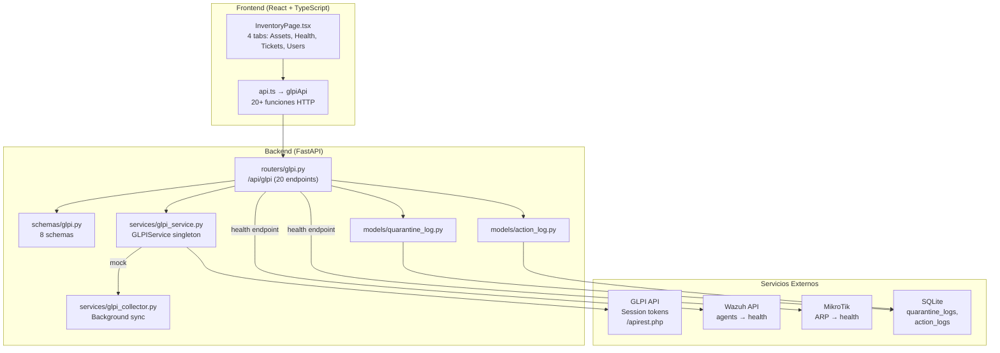
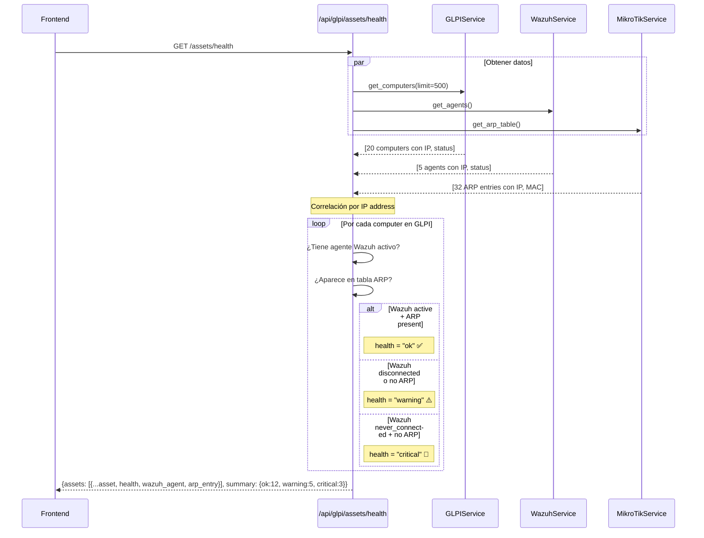
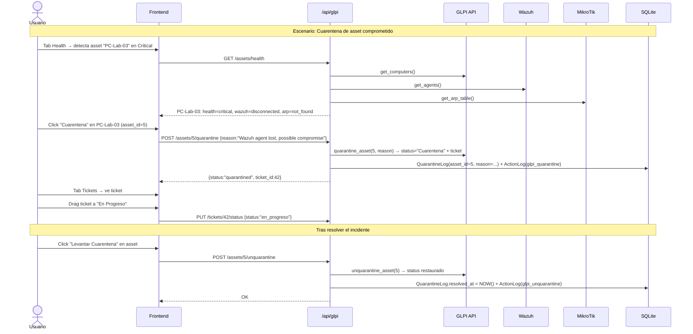

# Módulo GLPI Inventario — Documentación Funcional

## Descripción General

El módulo GLPI integra la **gestión de activos IT (ITSM)** del sistema GLPI con el dashboard de seguridad. Proporciona inventario de computadoras, correlación de salud cross-service (GLPI + Wazuh + MikroTik), sistema de tickets tipo Kanban, cuarentena de activos, y detalle técnico completo via GLPI Collector. Es el módulo con más endpoints (20+) y mayor complejidad cross-service.

| Modo | Condición | Comportamiento |
|---|---|---|
| **Mock** (default) | `MOCK_GLPI=true` o `MOCK_ALL=true` | Retorna assets ficticios. CRUD simulado. Health con agentes mock. |
| **Real** | `MOCK_GLPI=false` | Conecta a GLPI API real con session tokens. |

---

## Arquitectura General



---

## Backend

### 1. Servicio — `GLPIService` (singleton)

**Archivo:** `backend/services/glpi_service.py`

**Patrón:** Singleton con `get_glpi_service()`. Gestiona session tokens de GLPI y tiene mock guard en cada método.

**Métodos principales:**

| Método | Descripción |
|---|---|
| `is_available()` | Verifica conectividad con GLPI API. |
| `get_computers(search, location, status, limit, offset)` | Lista computadoras con filtros. |
| `get_computer(asset_id)` | Detalle de una computadora. |
| `search_computers(query)` | Búsqueda full-text por nombre, IP, serial. |
| `get_asset_stats()` | Conteo por estado para gráfico de torta. |
| `get_assets_health(wazuh_agents, arp_table)` | **Cross-service:** correlaciona GLPI assets con agentes Wazuh y ARP de MikroTik. Calcula health: `ok`, `warning`, `critical`. |
| `get_computers_by_location(location_id)` | Filtro por ubicación. |
| `get_asset_network_context(asset_id, arp_table)` | Contexto de red de un asset (MAC, interfaz, VLAN). |
| `create_computer(data)` | Crear asset en GLPI. |
| `update_computer(asset_id, data)` | Actualizar asset. |
| `quarantine_asset(asset_id, reason)` | Cambiar status a cuarentena + crear ticket. |
| `unquarantine_asset(asset_id)` | Levantar cuarentena. |
| `get_tickets(priority, status, limit, offset)` | Listar tickets con filtros. |
| `create_ticket(data)` | Crear ticket de incidencia. |
| `update_ticket_status(ticket_id, status)` | Actualizar estado (drag-and-drop Kanban). |
| `get_users(search, limit)` | Listar usuarios GLPI. |
| `get_user_assets(user_id)` | Assets asignados a un usuario. |
| `get_locations()` | Ubicaciones físicas (aulas, labs). |

### 2. GLPI Collector — `services/glpi_collector.py`

**Background sync** que mantiene un cache JSON local de assets GLPI, con detalle técnico parseado:
- Identificación, ubicación, estado, red, hardware, discos, software
- Audit logs, tickets, relaciones
- Método `get_full_detail(asset_id)` lee del cache
- Se sincroniza periódicamente en background

---

### 3. Endpoints REST — `routers/glpi.py`

**Prefijo:** `/api/glpi` | **Total:** 20 endpoints

#### Disponibilidad

| Método | Ruta | Descripción |
|---|---|---|
| `GET` | `/status` | Verificar si GLPI está disponible o en modo mock. |

#### Assets / Computadoras

| Método | Ruta | Descripción | ActionLog |
|---|---|---|---|
| `GET` | `/assets` | Listar assets con filtros (search, location, status, limit, offset). | — |
| `GET` | `/assets/stats` | Conteo por estado (pie chart). | — |
| `GET` | `/assets/search?q=X` | Búsqueda full-text (min 2 chars). | — |
| `GET` | `/assets/health` | **Cross-service:** salud de assets (GLPI + Wazuh agents + MikroTik ARP). | — |
| `GET` | `/assets/by-location/{location_id}` | Assets por ubicación física. | — |
| `GET` | `/assets/{asset_id}` | Detalle técnico de un asset. | — |
| `GET` | `/assets/{asset_id}/full-detail` | *Collector cache:* detalle completo parseado. | — |
| `GET` | `/assets/{asset_id}/network-context` | Contexto de red: MAC, interfaz, VLAN (GLPI + MikroTik). | — |
| `POST` | `/assets` | Crear nuevo asset en inventario. | `glpi_asset_created` |
| `PUT` | `/assets/{asset_id}` | Actualizar datos de un asset. | `glpi_asset_updated` |
| `POST` | `/assets/{asset_id}/quarantine` | Cuarentena: cambia status + crea ticket + QuarantineLog + ActionLog. | `glpi_quarantine` |
| `POST` | `/assets/{asset_id}/unquarantine` | Levantar cuarentena: restaura status + resuelve QuarantineLog. | `glpi_unquarantine` |

#### Tickets

| Método | Ruta | Descripción | ActionLog |
|---|---|---|---|
| `GET` | `/tickets` | Listar tickets con filtros. Retorna array + `kanban` agrupado por estado. | — |
| `POST` | `/tickets` | Crear ticket de incidencia. | `glpi_ticket_created` |
| `PUT` | `/tickets/{ticket_id}/status` | Actualizar estado (drag-and-drop Kanban). | `glpi_ticket_status_updated` |
| `POST` | `/tickets/network-maintenance` | **Cross-service:** crear ticket automático por error de interfaz MikroTik + datos de GLPI. | `glpi_maintenance_ticket` |

#### Usuarios y Ubicaciones

| Método | Ruta | Descripción |
|---|---|---|
| `GET` | `/users` | Listar usuarios GLPI (con búsqueda opcional). |
| `GET` | `/users/{user_id}/assets` | Assets asignados a un usuario. |
| `GET` | `/locations` | Ubicaciones físicas. |

---

### 4. Esquema de Health Correlation



---

### 5. Schemas Pydantic — `schemas/glpi.py`

| Schema | Campos principales | Uso |
|---|---|---|
| `GlpiAvailability` | `available`, `message`, `url` | Respuesta de `/status` |
| `GlpiAssetCreate` | `name`, `serial`, `os`, `location_id`, `status` | Crear asset |
| `GlpiAssetUpdate` | Todos opcionales: `name`, `serial`, `status`, `location_id` | Actualizar asset |
| `GlpiQuarantineRequest` | `reason`, `wazuh_alert_id?`, `mikrotik_block_id?` | Cuarentena con ref cruzada |
| `GlpiTicketCreate` | `title`, `description`, `priority` (1-5), `asset_id?` | Crear ticket |
| `GlpiTicketStatusUpdate` | `status: str` (pendiente/en_progreso/resuelto) | Kanban drag-and-drop |
| `NetworkMaintenanceRequest` | `interface_name`, `error_type`, `error_count`, `asset_id?` | Ticket automático por error de red |

---

## Frontend

### 6. Estructura de Archivos

```
frontend/src/
├── components/inventory/
│   └── InventoryPage.tsx    ← Página completa con 4 tabs (500+ líneas)
└── services/
    └── api.ts → glpiApi     ← 20+ funciones HTTP
```

### 7. Navegación y Rutas

```
/inventario → InventoryPage (4 tabs: Assets, Health, Tickets, Users)
```

Ubicación en sidebar: grupo **"Seguridad"**, ícono `Package`.

---

### 8. Página Tabs

| Tab | Componente/Sección | Descripción |
|---|---|---|
| `assets` (default) | Tabla de activos | Lista paginada con filtros, badge de estado, detalle expandible. |
| `health` | Dashboard de salud | Cards OK/Warning/Critical + tabla correlacionada. |
| `tickets` | Kanban de tickets | 3 columnas: Pendiente, En Progreso, Resuelto. Drag-and-drop. |
| `users` | Mapeo usuario-assets | Lista de usuarios GLPI con sus equipos asignados. |

---

## Flujo de Datos Completo



---

## Modo Mock

| Dato Mock | Contenido |
|---|---|
| `MockData.glpi.computers()` | ~20 computadoras: PCs de labs, servidores, laptops. Con IPs 10.10.10-30.x, seriales SN-xxxxx |
| `MockData.glpi.tickets()` | ~8 tickets: mix de prioridades 1-5, estados pendiente/en_progreso/resuelto |
| `MockData.glpi.users()` | ~10 usuarios GLPI con asignaciones de assets |
| `MockData.glpi.locations()` | 4 ubicaciones: Aula 101, Lab CiberSec, Sala Servidores, Dirección |
| Health calculation | Cruza mock computers con `MockData.wazuh.agents()` y `MockData.mikrotik.arp_table()` |

---

## Casos de Uso

### CU-1: Revisar inventario completo de activos

**Actor:** Administrador IT

1. Navega a **Inventario → Assets**
2. Ve tabla con 20 activos: nombre, serial, OS, status, ubicación
3. Filtra por ubicación "Lab CiberSec" → 5 equipos
4. Click en un asset para ver detalle técnico completo

---

### CU-2: Detectar y cuarentenar activo comprometido

**Actor:** Analista de seguridad

1. Tab **Health** → dashboard muestra 3 assets en `Critical`
2. `PC-Lab-03`: sin agente Wazuh activo, no aparece en ARP
3. Click **"Cuarentena"** → motivo: "Posible compromiso"
4. Se crea ticket automático en GLPI + registro en `quarantine_logs`
5. Asset cambia a status "Cuarentena" con badge `badge-danger`

---

### CU-3: Gestionar tickets en Kanban

**Actor:** Soporte IT

1. Tab **Tickets** → 3 columnas Kanban
2. Ve 4 tickets en "Pendiente", 2 en "En Progreso"
3. Drag ticket #42 de "Pendiente" a "En Progreso"
4. → `PUT /tickets/42/status {status:"en_progreso"}`
5. Al resolver, drag a "Resuelto"

---

### CU-4: Crear ticket automático por error de red

**Actor:** Sistema (automático)

1. Dashboard detecta errores de interfaz en MikroTik
2. → `POST /tickets/network-maintenance`
3. Backend consulta detalle de interfaz a MikroTik
4. Crea ticket con título `[NetShield] Error de red: ether1 — 150 CRC`
5. Prioridad auto-calculada: >100 errores = priority 4 (alta)

---

## Archivos Involucrados

### Backend

| Archivo | Rol |
|---|---|
| [glpi.py](file:///home/nivek/Documents/netShield2/backend/routers/glpi.py) | 20 endpoints REST (530 líneas) |
| [glpi.py](file:///home/nivek/Documents/netShield2/backend/schemas/glpi.py) | 8 schemas Pydantic |
| [glpi_service.py](file:///home/nivek/Documents/netShield2/backend/services/glpi_service.py) | Servicio singleton con 18+ métodos |
| [glpi_collector.py](file:///home/nivek/Documents/netShield2/backend/services/glpi_collector.py) | Background sync con cache JSON |
| [quarantine_log.py](file:///home/nivek/Documents/netShield2/backend/models/quarantine_log.py) | Modelo `QuarantineLog` |
| [action_log.py](file:///home/nivek/Documents/netShield2/backend/models/action_log.py) | Registro de auditoría |
| [mock_data.py](file:///home/nivek/Documents/netShield2/backend/services/mock_data.py) | `MockData.glpi.*` |

### Frontend

| Archivo | Rol |
|---|---|
| [InventoryPage.tsx](file:///home/nivek/Documents/netShield2/frontend/src/components/inventory/InventoryPage.tsx) | 4 tabs: Assets, Health, Tickets, Users (500+ líneas) |
| [api.ts](file:///home/nivek/Documents/netShield2/frontend/src/services/api.ts) → `glpiApi` | 20+ funciones HTTP |
| [types.ts](file:///home/nivek/Documents/netShield2/frontend/src/types.ts) | `GlpiAsset`, `GlpiTicket`, `GlpiUser`, `GlpiLocation`, `AssetHealth` |
