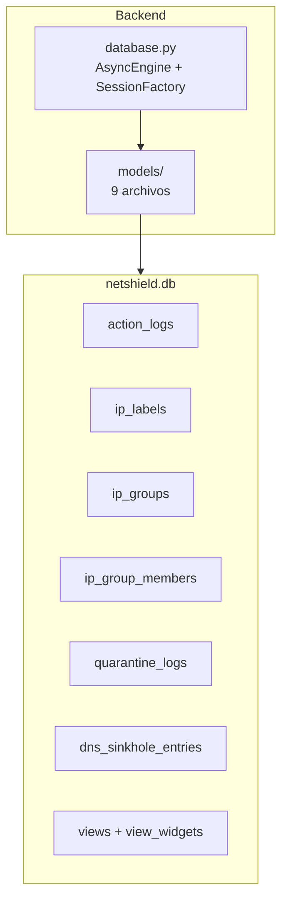
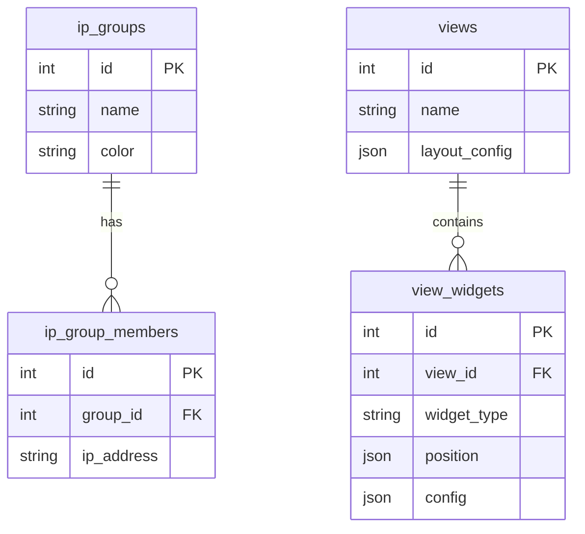

# Módulo Base de Datos — Documentación Funcional

## Descripción General

NetShield utiliza **SQLite** (via `aiosqlite` + **SQLAlchemy Async**) como capa de persistencia local. La base de datos almacena **metadatos internos** del dashboard (etiquetas, grupos, logs de auditoría, cuarentenas) — **NO** es fuente de verdad para datos de servicios externos (MikroTik, Wazuh, GLPI, CrowdSec). Cada servicio externo mantiene su propia base de datos.

---

## Arquitectura



---

## Configuración — `database.py`

```python
engine = create_async_engine("sqlite+aiosqlite:///./netshield.db")
async_session = sessionmaker(engine, class_=AsyncSession)

async def get_db() -> AsyncGenerator[AsyncSession, None]:
    async with async_session() as session:
        yield session
        await session.commit()  # Auto-commit
```

**Auto-commit:** Cada request que usa `Depends(get_db)` hace commit automático al cerrar la sesión. Los routers usan `db.flush()` para persistir antes de retornar.

---

## Modelos — 7 Tablas

### 1. `action_logs` — Auditoría de acciones

| Columna | Tipo | Descripción |
|---|---|---|
| `id` | Integer PK | Auto-incremental |
| `action_type` | String | Tipo: block, unblock, security_block, geo_block, quarantine, etc. |
| `target_ip` | String nullable | IP afectada (si aplica) |
| `details` | Text | JSON con detalles específicos de la acción |
| `comment` | String | Comentario descriptivo |
| `performed_by` | String | Usuario que ejecutó (default: "admin") |
| `created_at` | DateTime | Timestamp UTC auto-generado |

**Registrado por:** mikrotik.py (block/unblock), security.py (4 acciones), crowdsec.py (7 acciones), glpi.py (6 acciones), phishing.py (3 acciones), portal.py (5 acciones).

### 2. `ip_labels` — Etiquetas de IP

| Columna | Tipo | Constraint |
|---|---|---|
| `id` | Integer PK | |
| `ip_address` | String | **UNIQUE** — una etiqueta por IP (upsert) |
| `label` | String | Texto visible (ej: "Servidor Web") |
| `description` | String nullable | Descripción opcional |
| `color` | String | Color hex (ej: "#6366f1") |
| `criteria` | String nullable | Criterios JSON opcionales |
| `created_at` | DateTime | |

### 3. `ip_groups` — Grupos de IP

| Columna | Tipo |
|---|---|
| `id` | Integer PK |
| `name` | String |
| `description` | String nullable |
| `color` | String |
| `criteria` | String nullable |
| `created_at` | DateTime |
| `members` | Relationship → ip_group_members (cascade delete) |

### 4. `ip_group_members` — Miembros de grupo

| Columna | Tipo |
|---|---|
| `id` | Integer PK |
| `group_id` | Integer FK → ip_groups.id |
| `ip_address` | String |
| `added_reason` | String nullable |
| `added_at` | DateTime |

### 5. `quarantine_logs` — Cuarentena de activos

| Columna | Tipo |
|---|---|
| `id` | Integer PK |
| `asset_id_glpi` | Integer |
| `reason` | String |
| `wazuh_alert_id` | String nullable |
| `mikrotik_block_id` | String nullable |
| `created_at` | DateTime |
| `resolved_at` | DateTime nullable — NULL mientras en cuarentena |

### 6. `dns_sinkhole_entries` — Phishing sinkhole

| Columna | Tipo |
|---|---|
| `id` | Integer PK |
| `domain` | String UNIQUE |
| `redirect_ip` | String (default: 10.99.99.1) |
| `source` | String (manual/auto/wazuh) |
| `created_at` | DateTime |

### 7. `views` + `view_widgets` — Vistas personalizadas

| Tabla | Columnas clave |
|---|---|
| `views` | id, name, description, layout_config (JSON), created_at, updated_at |
| `view_widgets` | id, view_id (FK), widget_type, position (JSON), config (JSON) |

---

## Relaciones



---

## Patrón de Uso

1. **Routers** inyectan `db: AsyncSession = Depends(get_db)`
2. **`db.add(entry)`** para INSERT
3. **`db.flush()`** para persistir antes de retornar
4. **`db.commit()`** automático al cerrarse la sesión
5. **Queries** usan `select()` + `scalars()` pattern de SQLAlchemy 2.0

---

## Archivos Involucrados

| Archivo | Rol |
|---|---|
| [database.py](file:///home/nivek/Documents/netShield2/backend/database.py) | Engine, session factory, `get_db()` |
| [action_log.py](file:///home/nivek/Documents/netShield2/backend/models/action_log.py) | Modelo ActionLog |
| [ip_label.py](file:///home/nivek/Documents/netShield2/backend/models/ip_label.py) | Modelo IPLabel |
| [ip_group.py](file:///home/nivek/Documents/netShield2/backend/models/ip_group.py) | IPGroup + IPGroupMember |
| [quarantine_log.py](file:///home/nivek/Documents/netShield2/backend/models/quarantine_log.py) | QuarantineLog |
| [view.py](file:///home/nivek/Documents/netShield2/backend/models/view.py) | View + ViewWidget |
