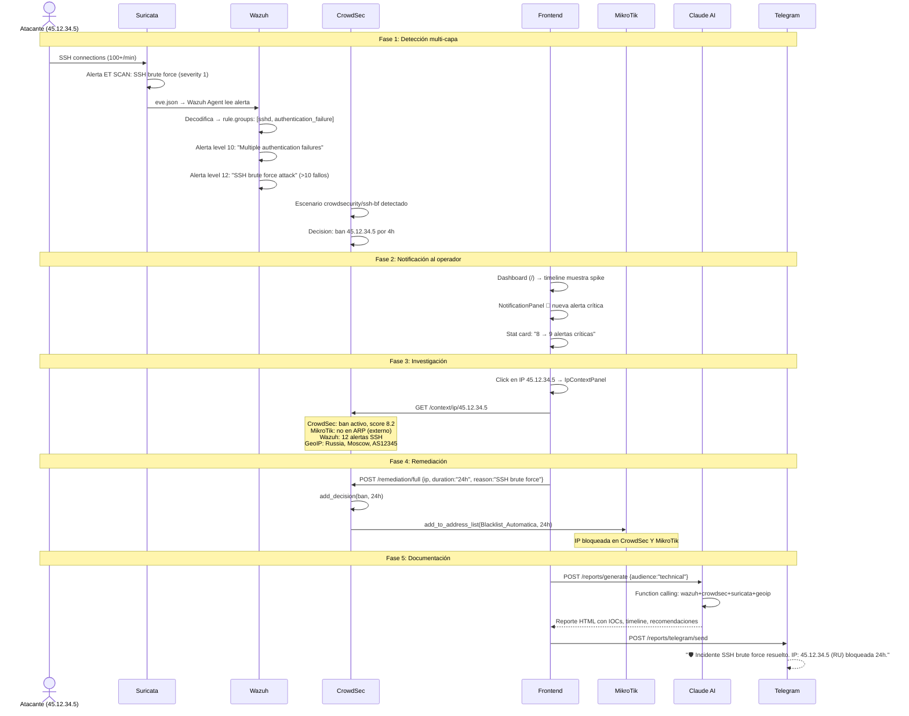

# Casos de Uso Globales — Documentación Funcional V2

## Descripción General

Este documento presenta los **casos de uso cross-module** del sistema NetShield Dashboard. Cada caso de uso describe un escenario completo que involucra múltiples módulos trabajando en conjunto. Para casos de uso específicos de cada módulo individual, ver la documentación correspondiente.

> [!NOTE]
> Los casos de uso están organizados por **escenario operacional**, no por módulo técnico. Cada uno describe el flujo completo desde la detección hasta la resolución.

---

## CU-GLOBAL-01: Respuesta a Incidente de Brute Force SSH

### Escenario
Un atacante externo ejecuta un ataque de fuerza bruta SSH contra un servidor de la red. El incidente es detectado por múltiples capas de seguridad (Wazuh + CrowdSec + Suricata) y remedidado via MikroTik.

### Módulos involucrados
`Wazuh` → `CrowdSec` → `Suricata` → `Firewall` → `GeoIP` → `Reportes IA`

### Flujo detallado



### Resultado
- IP bloqueada en 2 sistemas
- Alerta documentada en ActionLog
- Reporte técnico generado y enviado a Telegram
- Team de seguridad notificado

---

## CU-GLOBAL-02: Detección y Mitigación de Phishing

### Escenario
Un usuario de la red accede a un sitio de phishing detectado por Wazuh. NetShield extrae el dominio y lo bloquea via DNS Sinkhole en MikroTik.

### Módulos involucrados
`Wazuh` → `Phishing` → `MikroTik (DNS Sinkhole)` → `GLPI`

### Flujo

1. **Detección:** Wazuh alerta `rule.groups: phishing` — usuario visitó `evil-bank.com`
2. **Dashboard:** `/phishing` muestra nueva alerta con dominio extraído
3. **Acción:** Click "Sinkhole" → `POST /api/phishing/sinkhole {domain:"evil-bank.com"}`
4. **MikroTik:** DNS estático: `evil-bank.com` → `10.99.99.1` (página advertencia)
5. **GLPI:** Crear ticket: "Phishing detection: evil-bank.com — afectó PC-Lab-03"
6. **Resultado:** Ningún dispositivo en la red puede acceder a ese dominio

---

## CU-GLOBAL-03: Cuarentena de Host Comprometido

### Escenario
Un equipo del laboratorio muestra señales de compromiso: agente Wazuh desconectado, alertas de malware, excesivo tráfico lateral. El analista ejecuta cuarentena coordinada.

### Módulos involucrados
`Wazuh` → `GLPI (Health)` → `CrowdSec` → `Firewall (Security)` → `GLPI (Quarantine)`

### Flujo

1. **Detección:** GLPI Health dashboard → `PC-Lab-03` status `critical`
   - Wazuh agent 003: `disconnected`
   - ARP: no presente (equipo apagado o desconectado)
2. **Investigación:** Últimas alertas de agent 003: "Malware detected", "Policy violation"
3. **Acción Wazuh:** `POST /api/cli/wazuh-agent {agent_id:"003", action:"restart"}`
   - Si el agente recupera: monitorear
   - Si sigue offline: escalar
4. **Cuarentena GLPI:** `POST /api/glpi/assets/5/quarantine {reason:"Malware detection + agent offline"}`
   - Status GLPI → "Cuarentena"
   - Ticket auto-generado con detalles
   - QuarantineLog registrado
5. **Bloqueo IP:** `POST /api/security/block-ip` con IP del equipo
6. **Verificación:** GLPI Health re-calcula → equipo en status "quarantined"

---

## CU-GLOBAL-04: Sincronización CrowdSec ↔ MikroTik

### Escenario
CrowdSec tiene 15 bans activos pero MikroTik `Blacklist_Automatica` solo tiene 12 entradas. 3 IPs detectadas por la comunidad CrowdSec no están bloqueadas a nivel de red.

### Módulos involucrados
`CrowdSec` → `MikroTik (Firewall)` → `ActionLog`

### Flujo

1. **Detección:** `SyncStatusBanner` en CrowdSec muestra "3 IPs desincronizadas"
2. **Revisión:** Operador ve las 3 IPs: `203.0.113.5`, `198.51.100.42`, `192.0.2.17`
3. **Context check:** Para cada IP, revisa IpContextPanel → todas tienen scores > 7
4. **Sincronización:** Click "Sincronizar" → `ConfirmModal` muestra las 3 IPs
5. **Ejecución:** `POST /api/crowdsec/sync/apply {add_to_mikrotik: ["203.0.113.5", "198.51.100.42", "192.0.2.17"]}`
6. **Resultado:** 3 IPs agregadas a `Blacklist_Automatica` con timeout 24h
7. **Verificación:** `SyncStatusBanner` desaparece (sincronizado)

---

## CU-GLOBAL-05: Monitoreo de VLANs y Anomalía de Tráfico

### Escenario
El tráfico de VLAN 20 (Estudiantes) se dispara anormalmente, generando alertas correlacionadas de Wazuh.

### Módulos involucrados
`VLANs (WebSocket)` → `Wazuh` → `Red & IPs` → `Firewall`

### Flujo

1. **Detección:** WebSocket `/ws/vlan-traffic` muestra VLAN 20 en status `alert`
   - Traffic card: RX = 45 Mbps (normal: 5 Mbps)
2. **Correlación:** Badge de alertas en VLAN 20 muestra "3 alertas"
   - Endpoint `GET /api/vlans/10020/alerts` cruza `10.10.20.0/24` con alertas Wazuh
3. **Investigación:** Buscar IPs de VLAN 20 en ARP:
   - `10.10.20.15`: MAC `02:42:AC:11:00:2F`, sin etiqueta
   - Buscar en GlobalSearch: no tiene agente Wazuh (shadow device)
4. **Etiquetado:** Crear label "Sospechoso" para `10.10.20.15` (color rojo)
5. **Bloqueo:** Bloquear `10.10.20.15` en firewall: `POST /api/mikrotik/firewall/block`
6. **Resultado:** Tráfico VLAN 20 vuelve a normal. IP bloqueada.

---

## CU-GLOBAL-06: Generación de Reporte para Auditoría

### Escenario
Directivo solicita reporte mensual de seguridad para auditoría externa. El informe debe cubrir todos los módulos.

### Módulos involucrados
`Reportes IA (Claude)` → todos los servicios via `function calling`

### Flujo

1. **Selección:** `/reports` → audiencia "Ejecutivo", alcance "Completo"
2. **Generación:** Claude ejecuta 8 tools en hasta 10 iteraciones:
   - `get_wazuh_summary` → 156 alertas, 8 críticas, 5 agentes
   - `get_crowdsec_intelligence` → 15 bans, top 3 países
   - `get_suricata_status` → motor IDS running, 15M packets
   - `get_glpi_inventory` → 20 assets, 3 en cuarentena
   - `get_geoip_intelligence` → Rusia 23%, China 18%
   - `get_phishing_status` → 12 dominios sinkholed
   - `get_mikrotik_status` → 32 interfaces, 0 errores
   - `get_network_overview` → 8 VLANs, tráfico normal
3. **Resultado:** HTML con KPIs, gráficos, tendencias, recomendaciones
4. **Edición:** TipTap editor → ajustar formato, agregar contexto manual
5. **Exportación:** PDF via WeasyPrint → descarga `reporte_2026-04.pdf`
6. **Distribución:** Enviar a Telegram para el equipo + email al directivo

---

## CU-GLOBAL-07: Onboarding de Nuevo Dispositivo en la Red

### Escenario
Se instala una nueva PC en el laboratorio de ciberseguridad. El proceso requiere registro en múltiples sistemas.

### Módulos involucrados
`Red & IPs (ARP)` → `Portal Cautivo` → `GLPI` → `Wazuh`

### Flujo

1. **Detección automática:** PC se conecta → aparece en ARP table con tipo "Dinámico"
2. **Portal Cautivo:** Si hay Hotspot activo, el usuario se autentica
3. **Etiquetado:** Administrador asigna label "PC-Lab-Nuevo" en tab Etiquetas
4. **Grupo:** Agrega IP al grupo "Laboratorio CiberSec"
5. **GLPI:** `POST /api/glpi/assets` registra el equipo con nombre, serial, ubicación
6. **Wazuh:** Instalar agente → aparece en dashboard con status "active"
7. **Verificación:** GLPI Health muestra nuevo asset en status "ok" (agente activo + ARP presente)

---

## CU-GLOBAL-08: Geo-Blocking Proactivo

### Escenario
El analista detecta que el 80% de los ataques provienen de 2 países. Decide implementar geo-blocking proactivo.

### Módulos involucrados
`GeoIP` → `CrowdSec (Inteligencia)` → `Configuración (Security)` → `Firewall`

### Flujo

1. **Análisis:** CrowdSec Inteligencia → `TopCountriesWidget` muestra:
   - Rusia: 23 ataques (45%)
   - China: 15 ataques (30%)
2. **Sugerencias:** GeoIP Suggestions → tarjetas de recomendación con rangos CIDR
3. **Decisión:** Click "Bloquear" en tarjeta de Rusia
4. **Ejecución:** `POST /api/security/geo-block {country_code:"RU", ip_ranges:["203.0.113.0/24", "198.51.100.0/24"], duration_hours:48}`
5. **Resultado:** Rangos agregados a `Geo_Block` address-list con timeout 48h
6. **Monitoreo:** Decisiones CrowdSec de origen RU dejan de crecer
7. **Reporte:** Informar resultado via Telegram

---

## CU-GLOBAL-09: Dashboard Personalizado para NOC

### Escenario
El centro de operaciones de red (NOC) necesita un dashboard específico con widgets de infraestructura, diferente al dashboard de seguridad default.

### Módulos involucrados
`Vistas & Widgets` → todos los servicios (via hooks de widgets)

### Flujo

1. **Crear vista:** `/views/new` → nombre "NOC Monitor"
2. **Seleccionar widgets:**
   - `bandwidth_monitor` (Visual) — tráfico por interfaz
   - `interface_errors` (Technical) — errores de interfaces
   - `arp_table_mini` (Technical) — dispositivos en red
   - `network_health` (Hybrid) — salud general de red
   - `vlan_security` (Hybrid) — estado de VLANs
   - `service_health` (Hybrid) — servicios online
3. **Layout:** Drag-and-drop para organizar en grid 2×3
4. **Guardar:** `POST /api/views` con widgets y posiciones
5. **Marcar default:** Click ⭐ → esta vista se muestra al equipo NOC
6. **Resultado:** Dashboard específico con polling individual por widget

---

## CU-GLOBAL-10: Ticket de Mantenimiento Automático

### Escenario
MikroTik reporta errores CRC en una interfaz ethernet. NetShield crea automáticamente un ticket en GLPI con detalles técnicos.

### Módulos involucrados
`MikroTik (Interfaces)` → `GLPI (Tickets)` → `ActionLog`

### Flujo

1. **Detección:** `/system` → interfaz `ether3` muestra 150 errores CRC
2. **Acción automática:** `POST /api/glpi/tickets/network-maintenance`
   ```json
   {
     "interface_name": "ether3",
     "error_type": "CRC",
     "error_count": 150,
     "asset_id": 7
   }
   ```
3. **Backend:**
   - Consulta detalles de `ether3` a MikroTik: tipo, MAC, estado
   - Crea ticket con prioridad 4 (alta, >100 errores):
     - Título: `[NetShield] Error de red: ether3 — 150 CRC`
     - Descripción: detalles técnicos auto-generados
4. **GLPI:** Ticket aparece en Kanban "Pendiente"
5. **ActionLog:** `glpi_maintenance_ticket` registrado

---

## CU-GLOBAL-11: Active Response via CLI

### Escenario
Un agente Wazuh deja de responder y el administrador necesita reiniciarlo remotamente.

### Módulos involucrados
`CLI` → `Wazuh` → `System Health`

### Flujo

1. **Detección:** `/system` → agente 004 (Win-PC) status "disconnected"
2. **Verificación:** CLI → `POST /api/cli/wazuh-agent {agent_id:"004", action:"status"}`
   - Respuesta: status disconnected, last_keep_alive hace 15 min
3. **Acción:** CLI → `POST /api/cli/wazuh-agent {agent_id:"004", action:"restart"}`
   - Wazuh Manager envía active response al agente
4. **Verificación:** Esperar 30s → agents summary polling detecta agent 004 como "active"
5. **Complemento:** CLI MikroTik → `/ip/arp/print` para verificar que la IP del agente sigue en la red

---

## CU-GLOBAL-12: Whitelist de Infraestructura Interna

### Escenario
CrowdSec detecta actividad desde IPs internas (gateway, DNS) como sospechosa. El analista necesita whitelistear la infraestructura para evitar falsos positivos.

### Módulos involucrados
`CrowdSec (Whitelist)` → `Red & IPs (Labels)`

### Flujo

1. **Detección:** CrowdSec muestra decisión sobre `10.10.10.1` (gateway interno)
2. **Análisis:** IpContextPanel → IP privada, en ARP, no es amenaza
3. **Whitelist:** Tab Configuración → WhitelistManager → agregar `10.10.10.1` con razón "Gateway interno"
4. **Labeling:** Red & IPs → Etiquetas → confirmar label "Gateway" para esta IP
5. **Resultado:** CrowdSec no volverá a bloquear esta IP

---

## Matriz de Cobertura

| Caso de Uso | WZ | CS | SU | MT | GL | GI | PH | RP | VW | CLI | PT |
|---|---|---|---|---|---|---|---|---|---|---|---|
| CU-01: Brute Force SSH | ✅ | ✅ | ✅ | ✅ | — | ✅ | — | ✅ | — | — | — |
| CU-02: Phishing | ✅ | — | — | ✅ | ✅ | — | ✅ | — | — | — | — |
| CU-03: Host Comprometido | ✅ | ✅ | — | ✅ | ✅ | — | — | — | — | ✅ | — |
| CU-04: Sync CS↔MT | — | ✅ | — | ✅ | — | — | — | — | — | — | — |
| CU-05: Anomalía VLAN | ✅ | — | — | ✅ | — | — | — | — | — | — | — |
| CU-06: Reporte Auditoría | ✅ | ✅ | ✅ | ✅ | ✅ | ✅ | ✅ | ✅ | — | — | — |
| CU-07: Onboarding Device | — | — | — | ✅ | ✅ | — | — | — | — | — | ✅ |
| CU-08: Geo-Blocking | — | ✅ | — | ✅ | — | ✅ | — | — | — | — | — |
| CU-09: Dashboard NOC | — | — | — | — | — | — | — | — | ✅ | — | — |
| CU-10: Ticket Automático | — | — | — | ✅ | ✅ | — | — | — | — | — | — |
| CU-11: Active Response | ✅ | — | — | — | — | — | — | — | — | ✅ | — |
| CU-12: Whitelist | — | ✅ | — | — | — | — | — | — | — | — | — |

**Leyenda:** WZ=Wazuh, CS=CrowdSec, SU=Suricata, MT=MikroTik, GL=GLPI, GI=GeoIP, PH=Phishing, RP=Reportes, VW=Vistas/Widgets, CLI=CLI Remoto, PT=Portal Cautivo
