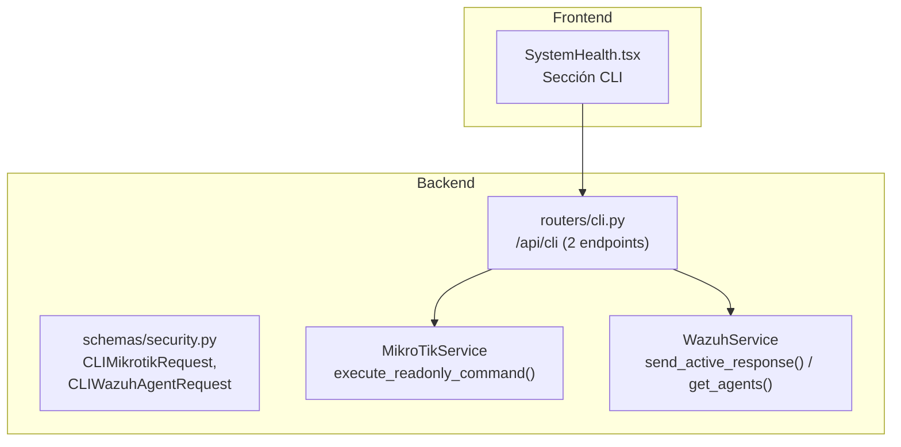

# Módulo CLI Remoto — Documentación Funcional

## Descripción General

El módulo CLI permite ejecutar **comandos remotos** de forma controlada contra MikroTik RouterOS y agentes Wazuh. Implementa seguridad estricta: los comandos MikroTik están limitados a una **whitelist de paths read-only**, y las acciones Wazuh están restringidas a `restart` y `status`.

| Modo | Condición | Comportamiento |
|---|---|---|
| **Mock** | `MOCK_MIKROTIK=true` / `MOCK_WAZUH=true` | Retorna datos mock. Comandos simulados. |
| **Real** | Mocks false | Ejecución real contra RouterOS API y Wazuh Manager. |

---

## Arquitectura General



---

## Backend

### Endpoints REST — `routers/cli.py`

**Prefijo:** `/api/cli` | **Total:** 2 endpoints

| Método | Ruta | Descripción | Seguridad |
|---|---|---|---|
| `POST` | `/mikrotik` | Ejecutar comando read-only en MikroTik. | Whitelist de paths. Comandos no autorizados → BLOQUEADOS con `ValueError`. |
| `POST` | `/wazuh-agent` | Ejecutar acción en agente Wazuh. | Solo `restart` y `status` permitidos. |

### MikroTik — Whitelist de Comandos

```python
# Solo rutas de lectura permitidas
ALLOWED_PATHS = [
    "/interface/print",
    "/ip/address/print",
    "/ip/arp/print",
    "/ip/firewall/filter/print",
    "/ip/route/print",
    "/system/resource/print",
    "/system/identity/print",
    # ... más paths read-only
]

async def execute_readonly_command(self, command: str):
    if command not in ALLOWED_PATHS:
        raise ValueError(f"Command '{command}' is not in the allowed whitelist")
    return await self._api_call(command)
```

**Respuesta:**
```json
{
  "success": true,
  "data": {
    "command": "/ip/address/print",
    "output": [{"address": "10.10.10.1/24", "interface": "bridge"}],
    "count": 3
  }
}
```

### Wazuh — Acciones Permitidas

| Acción | Descripción | Implementación |
|---|---|---|
| `restart` | Reiniciar agente Wazuh | `send_active_response(command="restart-wazuh0")` |
| `status` | Obtener info del agente | `get_agents()` → filter by ID |

---

## Frontend

### Componente: `SystemHealth.tsx` — Sección CLI

Embebido en la página `/system`, sección inferior:

```
┌─ CLI Remoto ─────────────────────────────────────────────────────────────────── ┐
│  ┌── MikroTik CLI ─────────────────┐  ┌── Wazuh Agent Actions ────────────┐  │
│  │  Comando: [/ip/address/print ▾] │  │  Agent ID: [003 ▾]               │  │
│  │  [▶ Ejecutar]                   │  │  Acción: [restart ▾ / status ▾]  │  │
│  │                                  │  │  [▶ Ejecutar]                    │  │
│  │  Salida:                        │  │                                    │  │
│  │  ┌──────────────────────────┐   │  │  Resultado:                       │  │
│  │  │ {address: "10.10.10.1"} │   │  │  Agent 003: active, Ubuntu 22.04 │  │
│  │  │ {address: "10.10.20.1"} │   │  │                                    │  │
│  │  └──────────────────────────┘   │  └────────────────────────────────────┘  │
│  └──────────────────────────────────┘                                          │
└──────────────────────────────────────────────────────────────────────────────── ┘
```

---

## Casos de Uso

### CU-1: Verificar tabla de ruteo MikroTik
**Actor:** Técnico de redes
1. `/system` → CLI → selecciona `/ip/route/print`
2. Click "Ejecutar" → ve tabla de ruteo completa
3. Identifica ruta faltante para VLAN 30

### CU-2: Reiniciar agente Wazuh offline
**Actor:** Administrador de seguridad
1. CLI → Wazuh Agent Actions → Agent 004
2. Action: `restart` → Click "Ejecutar"
3. Agente se reinicia vía active response

---

## Archivos Involucrados

| Archivo | Rol |
|---|---|
| [cli.py](file:///home/nivek/Documents/netShield2/backend/routers/cli.py) | 2 endpoints REST (114 líneas) |
| [security.py](file:///home/nivek/Documents/netShield2/backend/schemas/security.py) | `CLIMikrotikRequest`, `CLIWazuhAgentRequest` |
| [mikrotik_service.py](file:///home/nivek/Documents/netShield2/backend/services/mikrotik_service.py) | `execute_readonly_command()` |
| [wazuh_service.py](file:///home/nivek/Documents/netShield2/backend/services/wazuh_service.py) | `send_active_response()`, `get_agents()` |
| [SystemHealth.tsx](file:///home/nivek/Documents/netShield2/frontend/src/components/system/SystemHealth.tsx) | UI del CLI remoto |
