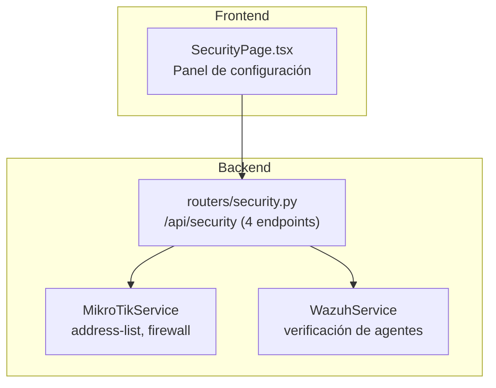

# Módulo Configuración de Seguridad — Documentación Funcional

## Descripción General

El módulo de Configuración de Seguridad es el **panel de operaciones** cross-service del dashboard. Provee 3 herramientas operativas: **bloqueo manual de IPs** (address-list), **geo-blocking** (por país con rangos CIDR), y **cuarentena de agentes** Wazuh. Todas las acciones requieren confirmación via `ConfirmModal` y se registran en `ActionLog`.

| Modo | Condición | Comportamiento |
|---|---|---|
| **Mock** | `MOCK_MIKROTIK=true` o `MOCK_ALL=true` | Acciones simuladas contra MockService. |
| **Real** | `MOCK_MIKROTIK=false` | Operaciones reales contra RouterOS address-lists y firewall. |

---

## Arquitectura General



---

## Backend

### Endpoints REST — `routers/security.py`

**Prefijo:** `/api/security` | **Total:** 4 endpoints

| Método | Ruta | Descripción | Servicios involucrados | ActionLog |
|---|---|---|---|---|
| `POST` | `/block-ip` | Bloquear IP vía address-list `Blacklist_Automatica` con timeout en horas. | MikroTik | `security_block` |
| `POST` | `/auto-block` | Auto-bloqueo por alerta crítica. Timeout fijo 24h. | MikroTik | `auto_block` |
| `POST` | `/quarantine` | Cuarentena de agente: verificar en Wazuh + mover a VLAN 99. | MikroTik + Wazuh | `quarantine` |
| `POST` | `/geo-block` | Bloquear rangos CIDR por país en address-list `Geo_Block`. | MikroTik | `geo_block` |

> [!NOTE]
> Estos endpoints están documentados en detalle en [firewall.md](file:///home/nivek/Documents/netShield2/docs/functionv2/firewall.md) — la sección "Endpoints REST — routers/security.py".

---

## Frontend

### Página: `SecurityPage.tsx`

**Ruta:** `/seguridad`

**3 Secciones:**

```
┌─ Configuración de Seguridad ────────────────────────────────────────────────── ┐
│  ┌── Bloqueo Manual de IP ─────────┐  ┌── Geo-Blocking ──────────────────┐  │
│  │  IP: [_______________]          │  │  País: [__] Código ISO           │  │
│  │  Motivo: [_______________]      │  │  Rangos CIDR:                    │  │
│  │  Duración (horas): [24]         │  │  [203.0.113.0/24              ]  │  │
│  │  Origen: [manual ▾]            │  │  Duración (horas): [48]          │  │
│  │  [🚫 Bloquear IP]              │  │  [🌍 Bloquear País]             │  │
│  └─────────────────────────────────┘  └──────────────────────────────────┘  │
│  ┌── Cuarentena de Agente ────────────────────────────────────────────────┐  │
│  │  Agent ID: [003]  VLAN Cuarentena: [99]                                │  │
│  │  [⚠️ Cuarentenar Agente]                                              │  │
│  └────────────────────────────────────────────────────────────────────────┘  │
└──────────────────────────────────────────────────────────────────────────────┘
```

Todos los botones abren `ConfirmModal` antes de ejecutar.

---

## Archivos Involucrados

| Archivo | Rol |
|---|---|
| [security.py](file:///home/nivek/Documents/netShield2/backend/routers/security.py) | 4 endpoints (271 líneas) |
| [security.py](file:///home/nivek/Documents/netShield2/backend/schemas/security.py) | `SecurityBlockIPRequest`, `QuarantineRequest`, `GeoBlockRequest` |
| [SecurityPage.tsx](file:///home/nivek/Documents/netShield2/frontend/src/components/security/SecurityPage.tsx) | Panel UI |
| [api.ts](file:///home/nivek/Documents/netShield2/frontend/src/services/api.ts) → `securityApi` | 4 funciones HTTP |
