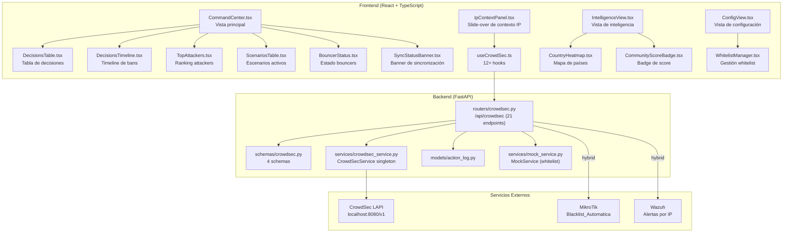
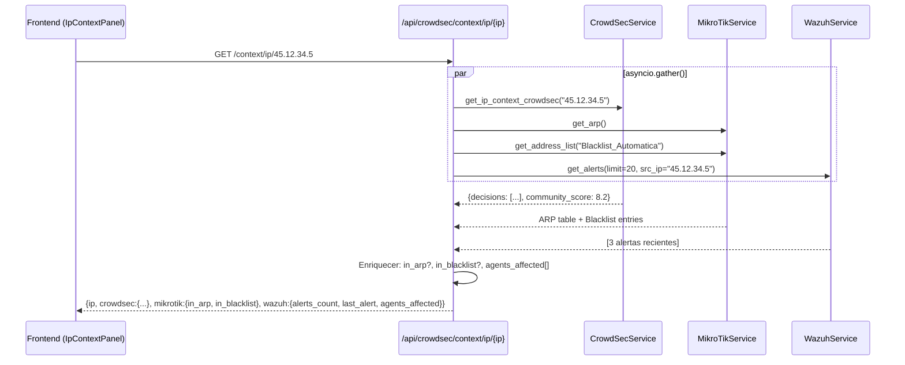
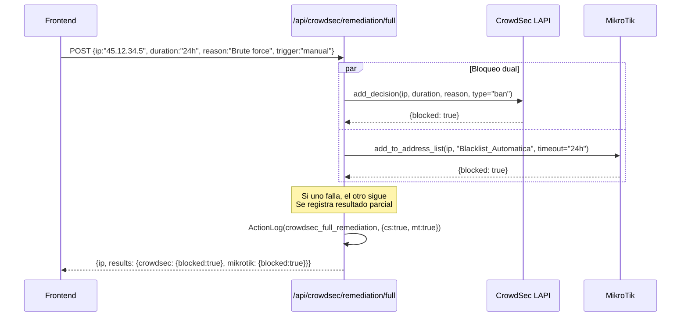
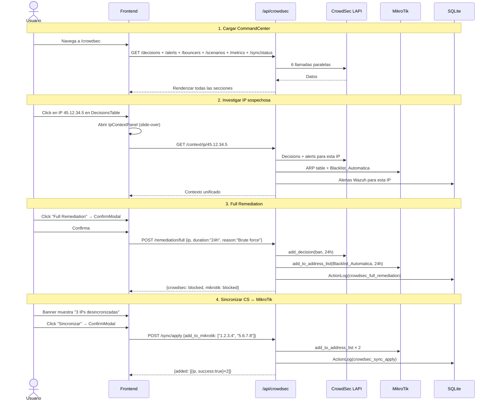

# Módulo CrowdSec — Documentación Funcional

## Descripción General

El módulo CrowdSec es el **sistema de inteligencia colaborativa de amenazas** del dashboard. Integra la Local API (LAPI) de CrowdSec para gestionar decisiones (bans/captchas), alertas de escenarios, infraestructura (bouncers/machines), whitelist local, y proporciona remediación híbrida cross-service (CrowdSec + MikroTik + Wazuh). Es el módulo con mayor cantidad de endpoints (21) y la arquitectura cross-service más compleja.

| Modo | Condición | Comportamiento |
|---|---|---|
| **Mock** (default) | `MOCK_CROWDSEC=true` o `MOCK_ALL=true` | Retorna datos mock con 8 decisiones, 12 alertas, 3 bouncers, 4 scenarios. |
| **Real** | `MOCK_CROWDSEC=false` | Conecta a CrowdSec LAPI con API key. Retry con `tenacity`. |

---

## Arquitectura General



---

## Backend

### 1. Servicio — `CrowdSecService` (singleton)

**Archivo:** `backend/services/crowdsec_service.py`

**Patrón:** Singleton con `get_crowdsec_service()`. Usa `tenacity` para retry con backoff exponencial (1-10s, 3 intentos).

**Métodos principales:**

| Grupo | Método | LAPI Endpoint |
|---|---|---|
| **Decisions** | `get_decisions(ip?, scenario?, type_?)` | `GET /v1/decisions` |
| | `get_decisions_stream(startup?)` | `GET /v1/decisions/stream` |
| | `add_decision(ip, duration, reason, type_)` | `POST /v1/decisions` |
| | `delete_decision(decision_id)` | `DELETE /v1/decisions/{id}` |
| | `delete_decisions_by_ip(ip)` | `DELETE /v1/decisions?ip={ip}` |
| **Alerts** | `get_alerts(limit, scenario?, ip?)` | `GET /v1/alerts` |
| | `get_alert_detail(alert_id)` | `GET /v1/alerts/{id}` |
| **Infra** | `get_bouncers()` | `GET /v1/bouncers` |
| | `get_machines()` | `GET /v1/machines` |
| | `get_scenarios()` | Aggregated from alerts |
| | `get_metrics()` | Computed metrics |
| | `get_hub_status()` | Hub collections/parsers |
| **Hybrid** | `get_ip_context_crowdsec(ip)` | Decisions + alerts for IP |
| | `get_sync_status(mikrotik_ips)` | Delta CrowdSec vs MikroTik |

---

### 2. Endpoints REST — `routers/crowdsec.py`

**Prefijo:** `/api/crowdsec` | **Total:** 21 endpoints

#### Decisiones (6)

| Método | Ruta | Descripción | ActionLog |
|---|---|---|---|
| `GET` | `/decisions` | Listar bans/captchas activos con filtros. | — |
| `GET` | `/decisions/stream` | Stream incremental para sincronización. | — |
| `POST` | `/decisions/manual` | Crear ban/captcha manual. ConfirmModal requerido. | `crowdsec_manual_decision` |
| `DELETE` | `/decisions/{decision_id}` | Eliminar decisión por ID. | `crowdsec_delete_decision` |
| `DELETE` | `/decisions/ip/{ip}` | Eliminar TODAS las decisiones de una IP. | `crowdsec_unblock_ip` |

#### Alertas (2)

| Método | Ruta | Descripción |
|---|---|---|
| `GET` | `/alerts` | Listar alertas con filtros (limit, scenario, ip). |
| `GET` | `/alerts/{alert_id}` | Detalle completo de una alerta con eventos. |

#### Infraestructura (5)

| Método | Ruta | Descripción |
|---|---|---|
| `GET` | `/bouncers` | Bouncers registrados en LAPI. |
| `GET` | `/machines` | Agentes CrowdSec registrados. |
| `GET` | `/scenarios` | Estadísticas agregadas de escenarios. |
| `GET` | `/metrics` | Métricas computadas: total decisions, top countries, top scenario. |
| `GET` | `/hub` | Colecciones y parsers instalados del Hub. |

#### Whitelist (3) — Base de datos local

| Método | Ruta | Descripción | ActionLog |
|---|---|---|---|
| `GET` | `/whitelist` | Listar IPs/CIDRs whitelisted (MockService en memoria). | — |
| `POST` | `/whitelist` | Agregar IP a whitelist local. | `crowdsec_whitelist_add` |
| `DELETE` | `/whitelist/{whitelist_id}` | Eliminar de whitelist local. | `crowdsec_whitelist_remove` |

#### Híbridos (5) — Cross-service

| Método | Ruta | Descripción | Servicios | ActionLog |
|---|---|---|---|---|
| `GET` | `/context/ip/{ip}` | Contexto unificado de IP: CrowdSec decisions + MikroTik ARP/blacklist + Wazuh alerts. | CS + MT + WZ | — |
| `POST` | `/remediation/full` | Bloquear IP simultáneamente en CrowdSec (ban) Y MikroTik (address-list). | CS + MT | `crowdsec_full_remediation` |
| `GET` | `/sync/status` | Comparar CrowdSec bans vs MikroTik Blacklist_Automatica. Detectar desincronización. | CS + MT | — |
| `POST` | `/sync/apply` | Sincronizar: push IPs de CrowdSec a MikroTik y/o limpiar MikroTik-only. | CS + MT | `crowdsec_sync_apply` |

---

### 3. Endpoint Hybrid: IP Context (`/context/ip/{ip}`)



### 4. Endpoint Hybrid: Full Remediation



---

### 5. Schemas Pydantic — `schemas/crowdsec.py`

| Schema | Campos | Uso |
|---|---|---|
| `ManualDecisionRequest` | `ip`, `duration` (ej: "24h"), `reason`, `type` ("ban"\|"captcha") | Crear decisión manual |
| `WhitelistRequest` | `ip`, `reason` | Agregar a whitelist local |
| `FullRemediationRequest` | `ip`, `duration`, `reason`, `trigger` ("manual"\|"auto"\|"alert") | Remediación dual CS+MT |
| `SyncApplyRequest` | `add_to_mikrotik: list[str]`, `remove_from_mikrotik: list[str]` | Sincronizar IPs |

---

## Frontend

### 6. Estructura de Archivos

```
frontend/src/
├── components/crowdsec/
│   ├── CommandCenter.tsx        ← Layout principal con tabs (7.6 KB)
│   ├── DecisionsTable.tsx       ← Tabla de bans/captchas (8.1 KB)
│   ├── DecisionsTimeline.tsx    ← Timeline visual de decisiones (3 KB)
│   ├── TopAttackers.tsx         ← Ranking de atacantes (3.3 KB)
│   ├── ScenariosTable.tsx       ← Tabla de escenarios (2.3 KB)
│   ├── BouncerStatus.tsx        ← Status cards de bouncers (2.5 KB)
│   ├── IpContextPanel.tsx       ← Slide-over: contexto unificado de IP (11.4 KB)
│   ├── WhitelistManager.tsx     ← CRUD de whitelist local (5 KB)
│   ├── SyncStatusBanner.tsx     ← Banner de sincronización CS↔MT (3.2 KB)
│   ├── IntelligenceView.tsx     ← Vista de inteligencia (4.4 KB)
│   ├── ConfigView.tsx           ← Vista de configuración (6.1 KB)
│   ├── CountryHeatmap.tsx       ← Mapa de países atacantes (2.3 KB)
│   └── CommunityScoreBadge.tsx  ← Badge circle de community score (2.1 KB)
├── hooks/
│   └── useCrowdSec.ts           ← 12+ hooks
└── services/
    └── api.ts → crowdsecApi     ← 21 funciones HTTP
```

### 7. Navegación y Rutas

```
/crowdsec → CrowdSec CommandCenter (3 tabs: Operaciones, Inteligencia, Configuración)
```

Ubicación en sidebar: grupo **"Seguridad"**, ícono `ShieldAlert`.

---

### 8. Página: `CommandCenter.tsx` — 3 Tabs

| Tab | Vista | Componentes |
|---|---|---|
| **Operaciones** (default) | Centro de mando | DecisionsTable, DecisionsTimeline, TopAttackers, ScenariosTable, BouncerStatus, SyncStatusBanner |
| **Inteligencia** | Visualización analítica | IntelligenceView (CountryHeatmap, CommunityScoreBadge, métricas globales) |
| **Configuración** | Gestión | ConfigView (WhitelistManager, bouncers/machines management, hub status) |

---

### 9. Componente: `IpContextPanel` (slide-over)

Componente reutilizable que se abre como drawer lateral al hacer click en cualquier IP en la tabla de decisiones o alertas. Consulta `/context/ip/{ip}` y muestra:

```
┌─ Contexto IP: 45.12.34.5 ────────────────────────── [✕ Cerrar] ─┐
│                                                                    │
│  ┌── CrowdSec ──────────────────────────────────────────────────┐ │
│  │  Score: ████████░░ 8.2/10                                     │ │
│  │  Decisiones activas: 2 (ban)                                  │ │
│  │  Escenario: crowdsecurity/ssh-bf                              │ │
│  │  Duración: 24h, expira en 18h                                 │ │
│  └──────────────────────────────────────────────────────────────┘ │
│                                                                    │
│  ┌── MikroTik ──────────────────────────────────────────────────┐ │
│  │  En ARP: ❌ No                                                │ │
│  │  En Blacklist: ✅ Sí (Blacklist_Automatica)                   │ │
│  │  Reglas firewall: 0                                           │ │
│  └──────────────────────────────────────────────────────────────┘ │
│                                                                    │
│  ┌── Wazuh ─────────────────────────────────────────────────────┐ │
│  │  Alertas recientes: 3                                         │ │
│  │  Última: SSH brute force (level 10) — hace 2 horas           │ │
│  │  Agentes afectados: Ubuntu-PC, Debian-Server                 │ │
│  └──────────────────────────────────────────────────────────────┘ │
│                                                                    │
│  [🚫 Full Remediation]  [📋 Add to Whitelist]                    │
└──────────────────────────────────────────────────────────────────┘
```

---

## Flujo de Datos Completo



---

## Modo Mock

| Dato Mock | Contenido |
|---|---|
| `MockData.crowdsec.decisions()` | 8 decisiones: 6 bans + 2 captchas, escenarios SSH-bf, HTTP-crawl, port-scan. IPs: 45.x, 185.x, 203.x |
| `MockData.crowdsec.alerts()` | 12 alertas con escenarios, timestamps, events. |
| `MockData.crowdsec.bouncers()` | 3 bouncers: cs-firewall-bouncer, cs-custom-bouncer, netshield-bouncer |
| `MockData.crowdsec.machines()` | 2 máquinas con versión y last_push |
| `MockData.crowdsec.scenarios()` | 4 escenarios con hit count y descripción |
| `MockData.crowdsec.metrics()` | Métricas pre-calculadas: total bans, top countries (RU, CN, BR), top scenario |
| `MockData.crowdsec.ip_context(ip)` | Contexto mock para cualquier IP |
| `MockData.crowdsec.sync_status()` | 3 IPs en CrowdSec no sincronizadas con MikroTik |
| `MockService.crowdsec_*_whitelist()` | CRUD en memoria para whitelist |

---

## Casos de Uso

### CU-1: Monitorear decisiones activas

**Actor:** Analista de seguridad

1. Navega a **CrowdSec** → tab Operaciones
2. `DecisionsTable` muestra 8 bans activos con IP, escenario, duración, score
3. Filtra por escenario `ssh-bf` → 3 bans
4. Observa `SyncStatusBanner`: "3 IPs en CrowdSec no están en MikroTik"

---

### CU-2: Investigar IP con contexto cross-service

**Actor:** Analista de seguridad

1. Click en IP `45.12.34.5` en la tabla de decisiones
2. Se abre `IpContextPanel` como drawer lateral
3. Ve: CrowdSec score 8.2, ban activo, escenario SSH-bf, 3 alertas Wazuh, no en ARP
4. Decide ejecutar **Full Remediation**

---

### CU-3: Ejecutar Full Remediation

**Actor:** Administrador de seguridad

1. Desde `IpContextPanel`, click **"Full Remediation"**
2. `ConfirmModal` muestra: "Bloquear 45.12.34.5 en CrowdSec Y MikroTik por 24h"
3. Confirma → `POST /remediation/full`
4. IP bloqueada en ambos sistemas simultáneamente
5. Si un sistema falla, el otro continúa (resultados parciales)

---

### CU-4: Sincronizar CrowdSec ↔ MikroTik

**Actor:** Administrador de seguridad

1. `SyncStatusBanner` muestra 3 IPs desincronizadas
2. Click "Sincronizar" → `ConfirmModal` lista las IPs a agregar/eliminar
3. Confirma → `POST /sync/apply`
4. Las IPs se agregan a `Blacklist_Automatica` en MikroTik
5. Banner desaparece (estado sincronizado)

---

### CU-5: Gestionar whitelist

**Actor:** Administrador de seguridad

1. Tab **Configuración** → `WhitelistManager`
2. Agrega IP `10.10.10.1` (Gateway) con razón "Infraestructura interna"
3. La IP no será bloqueada aunque CrowdSec detecte actividad
4. Puede eliminar entradas de whitelist cuando ya no apliquen

---

## Archivos Involucrados

### Backend

| Archivo | Rol |
|---|---|
| [crowdsec.py](file:///home/nivek/Documents/netShield2/backend/routers/crowdsec.py) | 21 endpoints REST (574 líneas) |
| [crowdsec.py](file:///home/nivek/Documents/netShield2/backend/schemas/crowdsec.py) | 4 schemas: ManualDecisionRequest, WhitelistRequest, FullRemediationRequest, SyncApplyRequest |
| [crowdsec_service.py](file:///home/nivek/Documents/netShield2/backend/services/crowdsec_service.py) | Singleton con 14+ métodos, retry con tenacity |
| [mock_service.py](file:///home/nivek/Documents/netShield2/backend/services/mock_service.py) | `crowdsec_get/add/delete_whitelist()` (CRUD en memoria) |
| [mock_data.py](file:///home/nivek/Documents/netShield2/backend/services/mock_data.py) | `MockData.crowdsec.*` (8 generadores) |
| [action_log.py](file:///home/nivek/Documents/netShield2/backend/models/action_log.py) | Registro de auditoría |

### Frontend

| Archivo | Rol |
|---|---|
| [CommandCenter.tsx](file:///home/nivek/Documents/netShield2/frontend/src/components/crowdsec/CommandCenter.tsx) | Layout principal 3 tabs (7.6 KB) |
| [DecisionsTable.tsx](file:///home/nivek/Documents/netShield2/frontend/src/components/crowdsec/DecisionsTable.tsx) | Tabla de bans/captchas con filtros (8.1 KB) |
| [IpContextPanel.tsx](file:///home/nivek/Documents/netShield2/frontend/src/components/crowdsec/IpContextPanel.tsx) | Slide-over de contexto cross-service (11.4 KB) |
| [WhitelistManager.tsx](file:///home/nivek/Documents/netShield2/frontend/src/components/crowdsec/WhitelistManager.tsx) | CRUD whitelist local (5 KB) |
| [SyncStatusBanner.tsx](file:///home/nivek/Documents/netShield2/frontend/src/components/crowdsec/SyncStatusBanner.tsx) | Banner de sincronización CS↔MT (3.2 KB) |
| [TopAttackers.tsx](file:///home/nivek/Documents/netShield2/frontend/src/components/crowdsec/TopAttackers.tsx) | Ranking atacantes (3.3 KB) |
| [ScenariosTable.tsx](file:///home/nivek/Documents/netShield2/frontend/src/components/crowdsec/ScenariosTable.tsx) | Tabla escenarios (2.3 KB) |
| [BouncerStatus.tsx](file:///home/nivek/Documents/netShield2/frontend/src/components/crowdsec/BouncerStatus.tsx) | Status bouncers (2.5 KB) |
| [IntelligenceView.tsx](file:///home/nivek/Documents/netShield2/frontend/src/components/crowdsec/IntelligenceView.tsx) | Vista inteligencia (4.4 KB) |
| [ConfigView.tsx](file:///home/nivek/Documents/netShield2/frontend/src/components/crowdsec/ConfigView.tsx) | Vista configuración (6.1 KB) |
| [CountryHeatmap.tsx](file:///home/nivek/Documents/netShield2/frontend/src/components/crowdsec/CountryHeatmap.tsx) | Mapa países (2.3 KB) |
| [CommunityScoreBadge.tsx](file:///home/nivek/Documents/netShield2/frontend/src/components/crowdsec/CommunityScoreBadge.tsx) | Badge score circular (2.1 KB) |
| [DecisionsTimeline.tsx](file:///home/nivek/Documents/netShield2/frontend/src/components/crowdsec/DecisionsTimeline.tsx) | Timeline visual (3 KB) |
| [useCrowdSec.ts](file:///home/nivek/Documents/netShield2/frontend/src/hooks/useCrowdSec.ts) | 12+ hooks TanStack Query |
| [api.ts](file:///home/nivek/Documents/netShield2/frontend/src/services/api.ts) → `crowdsecApi` | 21 funciones HTTP |
