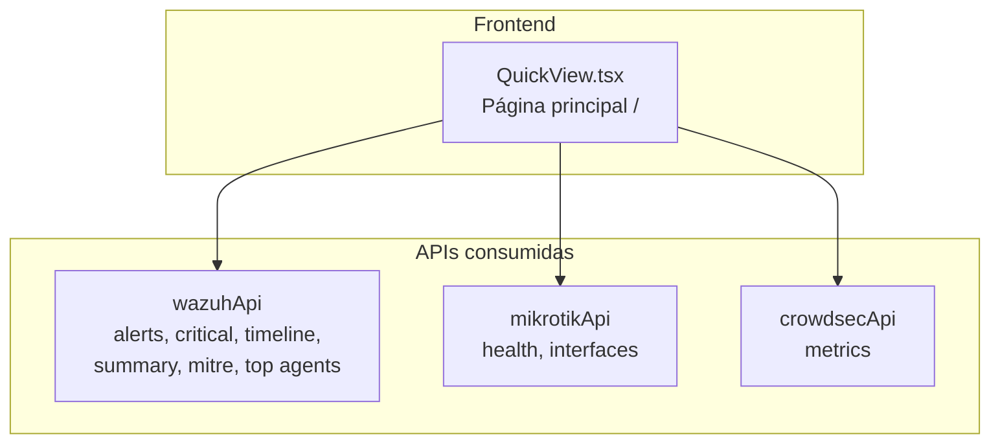

# Dashboard Principal (QuickView) — Documentación Funcional

## Descripción General

El Dashboard Principal es la **página de inicio** del sistema (`/`). Componente `QuickView.tsx` — proporciona una visión consolidada del estado de seguridad consumiendo datos de Wazuh (alertas, agentes, MITRE), MikroTik (health, tráfico) y CrowdSec (decisiones activas). Es **read-only** — no ejecuta acciones destructivas.

---

## Arquitectura



---

## Frontend

### Página: `QuickView.tsx`

**Ruta:** `/` | **Sidebar:** grupo "Seguridad", ícono `ShieldAlert`, label "Seguridad"

**Layout:**

```
┌─ NetShield Security Overview ────────────────────────────────────────────────── ┐
│  ┌── Stat Cards (4) ────────────────────────────────────────────────────────┐ │
│  │ [🔔 Alertas: 156] [🔴 Críticas: 8] [👥 Agentes: 5 active] [📊 Top: T1110] │
│  └──────────────────────────────────────────────────────────────────────────┘ │
│                                                                                │
│  ┌── Timeline de Alertas (Recharts BarChart, 60 min) ──────────────────────┐ │
│  │  █ █ ██ █ █ ████ █ █ █ █ █ █ █ █ █ █ █ ███ █ █ █ █ █ █ █ █ █ █ █    │ │
│  └──────────────────────────────────────────────────────────────────────────┘ │
│                                                                                │
│  ┌── Alertas Críticas (tabla) ────────┐  ┌── MITRE ATT&CK Summary ────────┐ │
│  │ Time  │ Agent  │ Description  │ Lvl│  │ T1110 Brute Force     █████████ │ │
│  │ 14:30 │ Ubuntu │ SSH brute    │ 12 │  │ T1046 Net Discovery   ██████    │ │
│  │ 14:28 │ Win-PC │ Malware det  │ 14 │  │ T1003 Cred Dump       ████      │ │
│  └────────────────────────────────────┘  └─────────────────────────────────┘ │
│                                                                                │
│  ┌── Top Agentes ─────────────────────┐  ┌── Service Status ──────────────┐ │
│  │ Ubuntu-PC     ████████████  25     │  │ MikroTik  ● Online             │ │
│  │ Win-PC        ████████      18     │  │ Wazuh     ● Online             │ │
│  │ Debian-Server ██████        12     │  │ CrowdSec  ● 8 bans             │ │
│  └────────────────────────────────────┘  └─────────────────────────────────┘ │
└──────────────────────────────────────────────────────────────────────────────── ┘
```

### Datos cargados

| Query Key | API | Polling | Uso |
|---|---|---|---|
| `['wazuh', 'alerts', 'critical']` | `wazuhApi.getCriticalAlerts()` | 15s | Tabla alertas críticas |
| `['wazuh', 'alerts', 'timeline']` | `wazuhApi.getAlertsTimeline()` | 15s | Gráfico de barras |
| `['wazuh', 'agents', 'summary']` | `wazuhApi.getAgentsSummary()` | 30s | Stat card agentes |
| `['wazuh', 'agents', 'top']` | `wazuhApi.getTopAgents()` | 30s | Ranking agentes |
| `['wazuh', 'mitre', 'summary']` | `wazuhApi.getMitreSummary()` | 30s | Tabla MITRE |
| `['wazuh', 'alerts', 'last-critical']` | `wazuhApi.getLastCritical()` | 15s | Stat card última crítica |
| `['mikrotik', 'health']` | `mikrotikApi.getHealth()` | 30s | Status card |
| `['crowdsec', 'metrics']` | `crowdsecApi.getMetrics()` | 30s | Stat card CrowdSec |

---

## Casos de Uso

### CU-1: Vista rápida del estado de seguridad
**Actor:** Cualquier usuario del dashboard
1. Abre el dashboard → ve inmediatamente stat cards
2. 156 alertas, 8 críticas, 5 agentes activos
3. Timeline muestra patrón de alertas últimos 60 min
4. Identifica pico reciente → navega a `/crowdsec` o `/suricata/alerts`

---

## Archivos Involucrados

| Archivo | Rol |
|---|---|
| [QuickView.tsx](file:///home/nivek/Documents/netShield2/frontend/src/components/security/QuickView.tsx) | Página principal, read-only |
| [api.ts](file:///home/nivek/Documents/netShield2/frontend/src/services/api.ts) | `wazuhApi`, `mikrotikApi`, `crowdsecApi` |
