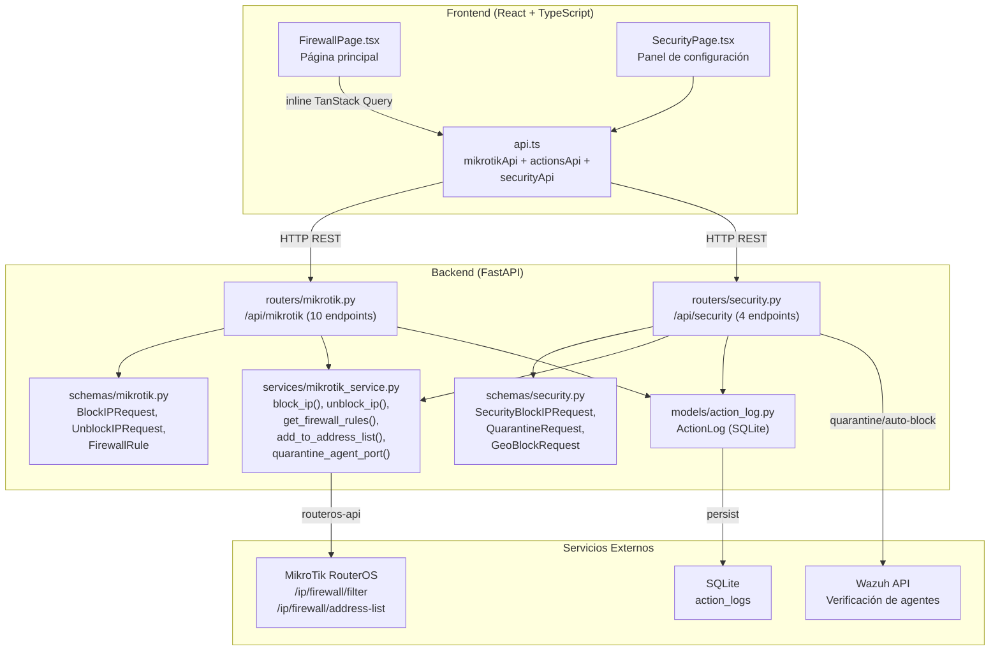
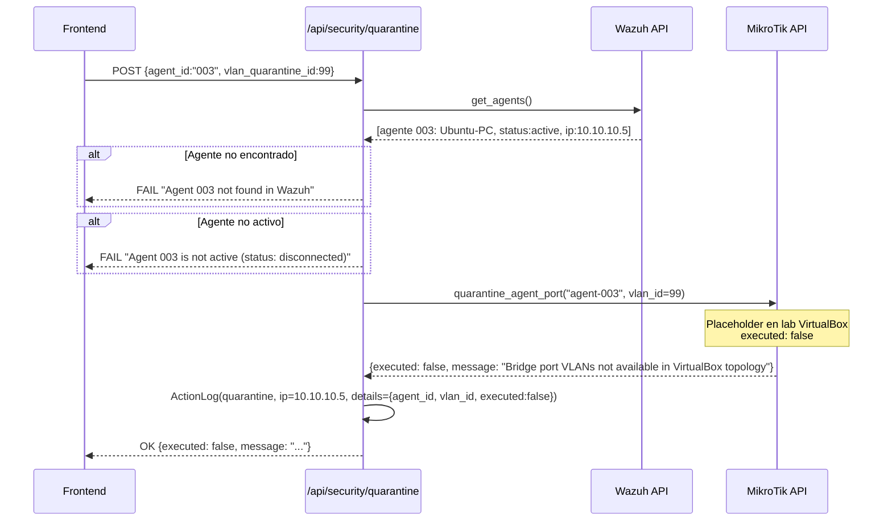
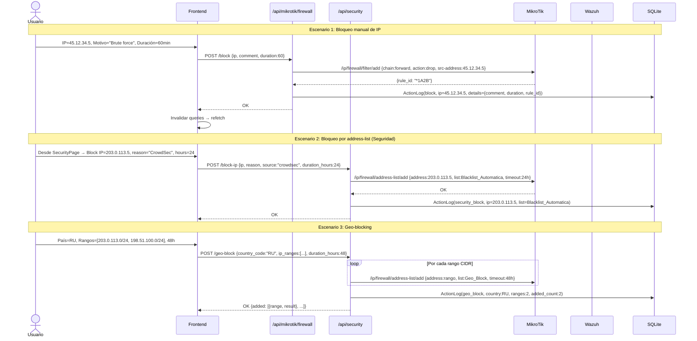

# Módulo Firewall — Documentación Funcional

## Descripción General

El módulo Firewall gestiona las **reglas de filtrado de MikroTik RouterOS** y proporciona capacidades de **bloqueo/desbloqueo de IPs** con trazabilidad completa. Expone dos routers: `mikrotik.py` para operaciones directas de firewall (`/ip/firewall/filter`) y `security.py` para operaciones de seguridad cross-service que involucran address-lists, cuarentena y geo-blocking.

| Modo | Condición | Comportamiento |
|---|---|---|
| **Mock** (default) | `MOCK_MIKROTIK=true` o `MOCK_ALL=true` | Retorna reglas ficticias. Block/unblock simulados. |
| **Real** | `MOCK_MIKROTIK=false` | Opera contra RouterOS vía `routeros-api`. CRUD real de reglas y address-lists. |

---

## Arquitectura General



---

## Backend

### 1. Servicio — `MikroTikService` (métodos Firewall)

**Archivo:** `backend/services/mikrotik_service.py`

#### Métodos de Firewall

| Método | API RouterOS | Descripción |
|---|---|---|
| `get_firewall_rules()` | `/ip/firewall/filter/print` | Lista todas las reglas de filtrado con chain, action, addresses, bytes/packets. |
| `block_ip(ip, comment)` | `/ip/firewall/filter/add` | Crea regla `chain=forward action=drop src-address={ip}`. Retorna `rule_id`. |
| `unblock_ip(ip)` | `/ip/firewall/filter/remove` | Busca reglas drop con `src-address={ip}` y las elimina. Retorna lista de IDs removidos. |
| `add_to_address_list(ip, list_name, timeout, comment)` | `/ip/firewall/address-list/add` | Agrega IP/CIDR a una address-list con timeout y comentario. |
| `quarantine_agent_port(port_name, vlan_id)` | `/interface/bridge/port/set` | **Placeholder:** intenta mover puerto bridge a VLAN de cuarentena. Lab VirtualBox retorna `executed: false`. |
| `get_address_list(list_name)` | `/ip/firewall/address-list/print` | Lista entradas de una address-list específica. |
| `remove_from_address_list(entry_id)` | `/ip/firewall/address-list/remove` | Elimina una entrada de address-list por ID interno. |

---

### 2. Endpoints REST — `routers/mikrotik.py` (Firewall)

**Prefijo:** `/api/mikrotik` | **Endpoints de firewall:** 3

| Método | Ruta | Descripción | ActionLog | 
|---|---|---|---|
| `GET` | `/firewall/rules` | Lista todas las reglas de filtrado. Polling 10s en frontend. | — |
| `POST` | `/firewall/block` | Bloquear IP con regla drop en chain forward. | `action_type="block"`, `target_ip`, detalles: comment, duration, rule_id |
| `DELETE` | `/firewall/block` | Desbloquear IP eliminando reglas drop coincidentes. | `action_type="unblock"`, `target_ip`, detalles: rules_removed[] |

### 3. Endpoints REST — `routers/security.py` (Seguridad avanzada)

**Prefijo:** `/api/security` | **Total:** 4 endpoints

| Método | Ruta | Descripción | Servicios | ActionLog |
|---|---|---|---|---|
| `POST` | `/block-ip` | Bloquear IP vía address-list `Blacklist_Automatica` con timeout en horas. | MikroTik | `security_block` |
| `POST` | `/auto-block` | Auto-bloqueo por alerta crítica (level ≥ 12). Timeout fijo 24h. | MikroTik + Wazuh | `auto_block` |
| `POST` | `/quarantine` | Cuarentena de agente Wazuh → mover puerto a VLAN cuarentena. | MikroTik + Wazuh | `quarantine` |
| `POST` | `/geo-block` | Bloquear rangos IP por país en address-list `Geo_Block`. | MikroTik | `geo_block` |

> [!NOTE]  
> **Diferencia clave:** `/api/mikrotik/firewall/block` crea una regla de filtrado `drop` directamente. `/api/security/block-ip` usa **address-lists** (`Blacklist_Automatica`) con timeout automático. Ambos registran en `ActionLog` pero con `action_type` distintos.

#### Flujo de cuarentena detallado



---

### 4. Schemas Pydantic

#### `schemas/mikrotik.py` — Firewall

| Schema | Campos | Descripción |
|---|---|---|
| `FirewallRule` | `id` (.id alias), `chain`, `action`, `src_address`, `dst_address`, `protocol`, `disabled`, `comment`, `bytes`, `packets` | Regla de filtrado. `populate_by_name=True` para alias ROS. |
| `BlockIPRequest` | `ip: str`, `comment: str = "Blocked via NetShield Dashboard"`, `duration: int \| None = None` | Bloqueo directo. Duration en minutos, None = permanente. |
| `UnblockIPRequest` | `ip: str` | Desbloqueo por IP. |

#### `schemas/security.py` — Seguridad avanzada

| Schema | Campos | Descripción |
|---|---|---|
| `SecurityBlockIPRequest` | `ip`, `reason`, `source` (enum: manual/auto/crowdsec), `duration_hours: int = 24` | Bloqueo vía address-list con origen y duración en horas. |
| `QuarantineRequest` | `agent_id: str`, `vlan_quarantine_id: int = 99` | Cuarentena de agente Wazuh. |
| `GeoBlockRequest` | `country_code: str`, `ip_ranges: list[str]`, `duration_hours: int = 24` | Bloqueo geográfico con rangos CIDR manuales (lab mode). |

---

## Frontend

### 5. Estructura de Archivos

```
frontend/src/
├── components/firewall/
│   └── FirewallPage.tsx         ← Página principal (313 líneas)
├── components/security/
│   └── SecurityPage.tsx         ← Panel de configuración de seguridad
└── services/
    └── api.ts → mikrotikApi    ← getFirewallRules, blockIP, unblockIP
               → actionsApi     ← getHistory
               → securityApi    ← blockIP, autoBlock, quarantine, geoBlock
```

### 6. Navegación y Rutas

```
/firewall  → FirewallPage
/seguridad → SecurityPage (documentado en configuracion.md)
```

Ubicación en sidebar: grupo **"Seguridad"**, ícono `Shield`.

---

### 7. Página: `FirewallPage.tsx`

**Ruta:** `/firewall`

**Hooks utilizados:** Ningún hook dedicado — usa **inline TanStack Query** directamente en el componente.

```typescript
// Queries inline — sin hook dedicado
const { data: rulesResp } = useQuery({
    queryKey: ['firewall-rules'],
    queryFn: mikrotikApi.getFirewallRules,
    refetchInterval: 10000,
});

const { data: historyResp } = useQuery({
    queryKey: ['action-history'],
    queryFn: () => actionsApi.getHistory(30),
    refetchInterval: 15000,
});

// Mutations inline
const blockMutation = useMutation({ mutationFn: () => mikrotikApi.blockIP(...) });
const unblockMutation = useMutation({ mutationFn: (ip) => mikrotikApi.unblockIP(ip) });
```

> [!NOTE]
> Este módulo **no tiene hooks dedicados** como otros (useVlans, useCrowdsec). Las queries y mutations están definidas inline en el componente. Es deuda técnica menor pero funcional.

**Layout:**

```
┌─ Header: 🛡️ Firewall ──────────────────────────────────────────────────────────┐
│  Administración de reglas de firewall y bloqueo de IPs                         │
├───────────────────────────────────────────────────────────────────────────────── ┤
│  ┌── Bloquear IP ────────┐  ┌── Reglas Activas (12) ──────── [🔍 Buscar] ──┐  │
│  │  IP: [192.168.88.xx ] │  │ Chain │ Acción │ Origen │ Destino │ Proto │... │  │
│  │  Motivo: [Actividad.] │  │ forw  │  drop  │ 45.x.x │  *      │ any   │ 🔓│  │
│  │  Duración: [60 min  ] │  │ forw  │ accept │  *      │  *      │ tcp   │   │  │
│  │  [🚫 Bloquear IP    ] │  │ input │  drop  │ 10.x.x │  *      │ any   │ 🔓│  │
│  │  ✅ IP bloqueada ok   │  └──────────────────────────────────────────────┘  │
│  └───────────────────────┘                                                     │
├─ Historial de Acciones ──────────────────────────────────────────────────────── ┤
│  │ Acción │ IP         │ Comentario        │ Realizado por │ Fecha           │ │
│  │ block  │ 45.12.34.5 │ Brute force SSH   │ admin         │ 15/04/2026 14:3 │ │
│  │ unblock│ 10.10.10.8 │ Unblocked via dash│ admin         │ 15/04/2026 13:0 │ │
│  │ geo_bl │ —          │ Geo-block: RU     │ system        │ 14/04/2026 09:0 │ │
└──────────────────────────────────────────────────────────────────────────────── ┘
```

**Sección 1: Formulario "Bloquear IP"** (1/3 del ancho en desktop)
- Input IP (required)
- Input Motivo (opcional, default: `"Blocked via NetShield Dashboard"`)
- Input Duración en minutos (opcional, vacío = permanente)
- Botón `btn-danger` "Bloquear IP"
- Feedback: `text-success` en éxito, `text-danger` en error

**Sección 2: Tabla "Reglas Activas"** (2/3 del ancho)
- Columnas: Chain, Acción, Origen, Destino, Proto, Comentario, Tráfico (KB), Acciones
- Búsqueda en tiempo real por IP, comentario o chain
- Badges de acción: `drop` → `badge-danger`, `accept` → `badge-success`, otros → `badge-info`
- Reglas deshabilitadas → `opacity-40`
- Botón desbloquear (🔓) solo visible si: `action=drop` AND `chain=forward` AND `src_address` existe
- Height máximo 384px con scroll

**Sección 3: Historial de Acciones** (ancho completo)
- Columnas: Acción, IP, Comentario, Realizado por, Fecha
- Badges: `block` → `badge-danger`, `unblock` → `badge-success`, otros → `badge-info`
- Fecha formateada con `toLocaleString('es-AR')`
- Muestra últimas 30 acciones, polling cada 15s
- Height máximo 256px con scroll

---

### 8. Comportamiento de Mutaciones

#### Bloquear IP

```
1. Usuario ingresa IP + motivo + duración opcional
2. Click "Bloquear IP"
3. POST /api/mikrotik/firewall/block { ip, comment, duration }
4. Backend: crea regla drop en chain=forward + ActionLog(block)
5. onSuccess: invalidar ['firewall-rules'] + ['action-history']
6. Reset formulario
7. Tabla actualiza mostrando nueva regla + historial actualiza
```

#### Desbloquear IP

```
1. En tabla, click 🔓 en regla drop
2. DELETE /api/mikrotik/firewall/block { ip: rule.src_address }
3. Backend: elimina reglas drop con src-address={ip} + ActionLog(unblock)
4. onSuccess: invalidar ['firewall-rules'] + ['action-history']
5. Tabla actualiza sin la regla + historial muestra "unblock"
```

---

## Flujo de Datos Completo



---

## Modo Mock

Cuando `MOCK_MIKROTIK=true`:

| Dato Mock | Contenido |
|---|---|
| `MockData.mikrotik.firewall_rules()` | ~12 reglas: mix de accept, drop, forward, input. 3 reglas drop con src_address para simular bloqueos. |
| `MockData.mikrotik.block_ip(ip)` | Simula éxito con `rule_id: "*MOCK"`. Agrega a lista interna del MockService. |
| `MockData.mikrotik.unblock_ip(ip)` | Simula éxito con `rules_removed: ["*MOCK"]`. |
| `MockData.actions.history()` | ~8 entradas de historial: block, unblock, geo_block, security_block, quarantine. |

---

## Casos de Uso

### CU-1: Bloquear IP atacante desde el dashboard

**Actor:** Administrador de seguridad

1. Recibe alerta de brute-force SSH desde IP `45.12.34.5`
2. Navega a **Seguridad → Firewall**
3. En formulario "Bloquear IP": IP=`45.12.34.5`, Motivo=`"Brute force SSH"`, Duración=`60` min
4. Click **"Bloquear IP"** → `POST /api/mikrotik/firewall/block`
5. Tabla muestra nueva regla drop, badge `danger`
6. Historial registra la acción con timestamp y usuario

---

### CU-2: Desbloquear IP tras resolución de incidente

**Actor:** Administrador de seguridad

1. En tabla de reglas, identifica regla drop para IP `10.10.10.8`
2. Click 🔓 → `DELETE /api/mikrotik/firewall/block`
3. Backend elimina regla y registra `unblock` en ActionLog
4. IP ya no está bloqueada en la tabla

---

### CU-3: Buscar regla específica

**Actor:** Técnico de redes

1. 12+ reglas activas con scroll
2. Escribe `45.12` en el campo de búsqueda
3. La tabla filtra en tiempo real mostrando solo reglas con esa IP en origen o destino

---

### CU-4: Geo-bloquear país sospechoso

**Actor:** Administrador de seguridad

1. Navega a **Configuración → Seguridad** (SecurityPage)
2. Selecciona país `RU`, ingresa rangos `203.0.113.0/24`
3. Confirma vía `ConfirmModal`
4. `POST /api/security/geo-block` agrega rangos a address-list `Geo_Block` con timeout 48h
5. ActionLog registra `geo_block` con detalle de rangos y país

---

### CU-5: Cuarentena de host comprometido

**Actor:** Analista de seguridad

1. Desde panel GLPI o Wazuh, identifica agente `003` (Ubuntu-PC) comprometido
2. Navega a Configuración → Seguridad y selecciona "Cuarentena"
3. `POST /api/security/quarantine` → verifica agente activo en Wazuh
4. **Lab:** retorna `executed: false` (topología VirtualBox sin bridge ports)
5. ActionLog registra intento con detalles del agente
6. **Producción:** movería el puerto bridge a VLAN 99

---

## Archivos Involucrados

### Backend

| Archivo | Rol |
|---|---|
| [mikrotik.py](file:///home/nivek/Documents/netShield2/backend/routers/mikrotik.py) | 3 endpoints firewall: rules, block, unblock (227 líneas) |
| [security.py](file:///home/nivek/Documents/netShield2/backend/routers/security.py) | 4 endpoints seguridad: block-ip, auto-block, quarantine, geo-block (271 líneas) |
| [mikrotik.py](file:///home/nivek/Documents/netShield2/backend/schemas/mikrotik.py) | `FirewallRule`, `BlockIPRequest`, `UnblockIPRequest` (101 líneas) |
| [security.py](file:///home/nivek/Documents/netShield2/backend/schemas/security.py) | `SecurityBlockIPRequest`, `QuarantineRequest`, `GeoBlockRequest` |
| [mikrotik_service.py](file:///home/nivek/Documents/netShield2/backend/services/mikrotik_service.py) | `get_firewall_rules()`, `block_ip()`, `unblock_ip()`, `add_to_address_list()`, `quarantine_agent_port()` |
| [action_log.py](file:///home/nivek/Documents/netShield2/backend/models/action_log.py) | Modelo SQLAlchemy para registros de auditoría |

### Frontend

| Archivo | Rol |
|---|---|
| [FirewallPage.tsx](file:///home/nivek/Documents/netShield2/frontend/src/components/firewall/FirewallPage.tsx) | Página completa: formulario bloqueo + tabla reglas + historial (313 líneas) |
| [api.ts](file:///home/nivek/Documents/netShield2/frontend/src/services/api.ts) → `mikrotikApi` | `getFirewallRules()`, `blockIP()`, `unblockIP()` |
| [api.ts](file:///home/nivek/Documents/netShield2/frontend/src/services/api.ts) → `actionsApi` | `getHistory(limit)` |
| [api.ts](file:///home/nivek/Documents/netShield2/frontend/src/services/api.ts) → `securityApi` | `blockIP()`, `autoBlock()`, `quarantine()`, `geoBlock()` |
| [types.ts](file:///home/nivek/Documents/netShield2/frontend/src/types.ts) | `FirewallRule`, `ActionLogEntry`, `BlockIPRequest`, etc. |
