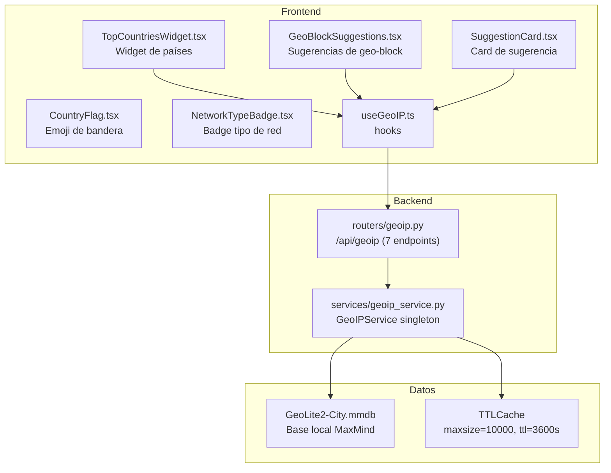

# Módulo GeoLite2 / GeoIP — Documentación Funcional

## Descripción General

El módulo GeoIP proporciona **inteligencia geográfica** para direcciones IP del dashboard. Utiliza la base de datos local **MaxMind GeoLite2** (`.mmdb`) con caché TTL, genera **sugerencias de geo-blocking**, y enriquece datos de otros módulos (CrowdSec, Wazuh, Firewall) con información de país, ciudad y tipo de red.

| Modo | Condición | Comportamiento |
|---|---|---|
| **Mock** (default) | `MOCK_GEOIP=true` o `MOCK_ALL=true` | Retorna datos ficticios con países pre-definidos. No requiere `.mmdb`. |
| **Real** | `MOCK_GEOIP=false` | Consulta `GeoLite2-City.mmdb` local con `geoip2` + TTLCache. |

---

## Arquitectura General



---

## Backend

### 1. Servicio — `GeoIPService` (singleton)

**Archivo:** `backend/services/geoip_service.py`

**Caché:** `cachetools.TTLCache(maxsize=10000, ttl=3600)` — 10K IPs en memoria por 1 hora.

**Métodos principales:**

| Método | Descripción |
|---|---|
| `lookup(ip)` | Consulta GeoLite2: país, ciudad, lat/lon, ASN, org. Usa caché. |
| `bulk_lookup(ips)` | Lookup masivo con dedup. Retorna `{ip: geo_data}`. |
| `get_network_type(ip)` | Heurística: private, public, reserved, multicast, loopback. |
| `get_top_countries(ips)` | Agrega lookups por país con frecuencia. |
| `get_geo_block_suggestions(decisions, alerts)` | Analiza decisiones CrowdSec + alertas Wazuh → sugiere países a bloquear. |
| `is_database_available()` | Verifica que `.mmdb` esté presente y sea legible. |

### 2. Heurística de Tipo de Red

```python
def get_network_type(ip: str) -> str:
    addr = ipaddress.ip_address(ip)
    if addr.is_private:    return "private"
    if addr.is_loopback:   return "loopback"
    if addr.is_multicast:  return "multicast"
    if addr.is_reserved:   return "reserved"
    return "public"
```

---

### 3. Endpoints REST — `routers/geoip.py`

**Prefijo:** `/api/geoip` | **Total:** 7 endpoints

| Método | Ruta | Descripción |
|---|---|---|
| `GET` | `/lookup/{ip}` | Lookup individual: país, ciudad, lat/lon, ASN, network_type. |
| `POST` | `/bulk-lookup` | Lookup masivo con lista de IPs. |
| `GET` | `/top-countries` | Top países de IPs atacantes (cruza CrowdSec + Wazuh). |
| `GET` | `/suggestions` | Sugerencias de geo-blocking basadas en inteligencia actual. |
| `GET` | `/database/status` | Estado de la base `.mmdb` (disponible, fecha, versión). |
| `GET` | `/network-type/{ip}` | Tipo de red de una IP (private/public/etc). |
| `GET` | `/enrich/{ip}` | Lookup + network_type + flag emoji en una sola llamada. |

---

## Frontend

### 4. Estructura de Archivos

```
frontend/src/components/geoip/
├── TopCountriesWidget.tsx     ← Widget de top países atacantes (6.8 KB)
├── GeoBlockSuggestions.tsx    ← Lista de sugerencias de geo-block (2.7 KB)
├── SuggestionCard.tsx         ← Card individual con confirmación (7.1 KB)
├── CountryFlag.tsx            ← Emoji de bandera por código ISO (1.3 KB)
└── NetworkTypeBadge.tsx       ← Badge de tipo de red con color (2.1 KB)
```

### 5. Navegación

GeoIP no tiene ruta propia — sus componentes se embeben en:
- **CrowdSec** → `CountryHeatmap` usa datos de `/top-countries`
- **Configuración** → `GeoBlockSuggestions` muestra sugerencias
- **IpContextPanel** → enriquece IPs con geo data

---

## Modo Mock

| Dato Mock | Contenido |
|---|---|
| `MockData.geoip.lookup(ip)` | 5 países pre-definidos: RU, CN, BR, DE, US según rango de IP |
| `MockData.geoip.top_countries()` | Top 5: Rusia (23%), China (18%), Brasil (12%), Alemania (8%), US (5%) |
| `MockData.geoip.suggestions()` | 3 sugerencias: bloquear RU (alto riesgo), CN (medio), BR (bajo) |

---

## Casos de Uso

### CU-1: Enriquecer IP con datos geográficos

**Actor:** Analista de seguridad
1. Desde `IpContextPanel`, ve IP `45.12.34.5`
2. API enriquece: país=Russia, ciudad=Moscow, ASN=AS12345, tipo=public
3. Badge de bandera 🇷🇺 + `NetworkTypeBadge` "public"

### CU-2: Revisar sugerencias de geo-blocking

**Actor:** Administrador de seguridad
1. **Configuración** → sección GeoIP Suggestions
2. Ve 3 tarjetas: RU (23 ataques), CN (15 ataques), BR (8 ataques)
3. Click "Bloquear" en RU → `POST /api/security/geo-block`

### CU-3: Visualizar distribución geográfica de atacantes

**Actor:** Analista de seguridad
1. **CrowdSec → Inteligencia** → `TopCountriesWidget`
2. Gráfico de barras muestra distribución por país
3. Click en país → filtra decisiones CrowdSec por ese origen

---

## Archivos Involucrados

### Backend

| Archivo | Rol |
|---|---|
| [geoip.py](file:///home/nivek/Documents/netShield2/backend/routers/geoip.py) | 7 endpoints REST (9.1 KB) |
| [geoip_service.py](file:///home/nivek/Documents/netShield2/backend/services/geoip_service.py) | Singleton con TTLCache + MaxMind reader |
| [mock_data.py](file:///home/nivek/Documents/netShield2/backend/services/mock_data.py) | `MockData.geoip.*` |

### Frontend

| Archivo | Rol |
|---|---|
| [TopCountriesWidget.tsx](file:///home/nivek/Documents/netShield2/frontend/src/components/geoip/TopCountriesWidget.tsx) | Widget países (6.8 KB) |
| [GeoBlockSuggestions.tsx](file:///home/nivek/Documents/netShield2/frontend/src/components/geoip/GeoBlockSuggestions.tsx) | Sugerencias (2.7 KB) |
| [SuggestionCard.tsx](file:///home/nivek/Documents/netShield2/frontend/src/components/geoip/SuggestionCard.tsx) | Card sugerencia (7.1 KB) |
| [CountryFlag.tsx](file:///home/nivek/Documents/netShield2/frontend/src/components/geoip/CountryFlag.tsx) | Bandera emoji (1.3 KB) |
| [NetworkTypeBadge.tsx](file:///home/nivek/Documents/netShield2/frontend/src/components/geoip/NetworkTypeBadge.tsx) | Badge red (2.1 KB) |
| [api.ts](file:///home/nivek/Documents/netShield2/frontend/src/services/api.ts) → `geoipApi` | 7 funciones HTTP |
