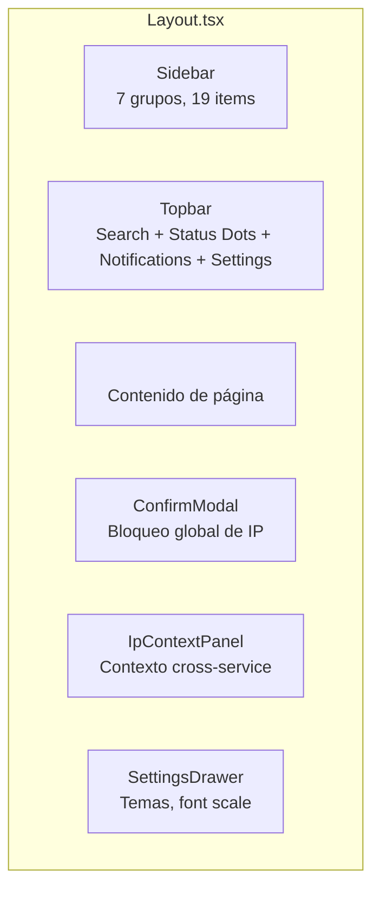

# Layout & Navegación — Documentación Funcional

## Descripción General

El componente `Layout.tsx` es el **shell de la aplicación**: sidebar de navegación con 7 grupos, topbar con búsqueda global y 5 status dots de servicios, y elementos globales (ConfirmModal, IpContextPanel, SettingsDrawer). Todo el contenido de las páginas se renderiza via `<Outlet />` dentro del layout.

---

## Arquitectura



---

## Sidebar — 7 Grupos de Navegación

| Grupo | Items | Ícono | Ruta |
|---|---|---|---|
| **Seguridad** | Seguridad | `ShieldAlert` | `/` |
| | Configuración | `Settings` | `/security/config` |
| **Infraestructura** | Red | `Network` | `/network` |
| | Firewall | `Flame` | `/firewall` |
| | Portal Cautivo | `Wifi` | `/portal` |
| **Herramientas** | Phishing | `Fish` | `/phishing` |
| | Sistema | `Monitor` | `/system` |
| | Reportes | `FileText` | `/reports` |
| **CrowdSec** | Centro de Mando | `ShieldCheck` | `/crowdsec` |
| | Inteligencia | `Globe` | `/crowdsec/intelligence` |
| | Configuración | `Settings2` | `/crowdsec/config` |
| **Suricata** | Motor IDS/IPS | `Radar` | `/suricata` |
| | Alertas | `AlertTriangle` | `/suricata/alerts` |
| | Red NSM | `Eye` | `/suricata/network` |
| | Reglas | `BookOpen` | `/suricata/rules` |
| **Inventario** | GLPI | `Package` | `/inventory` |
| **Mis Vistas** | Vistas personalizadas | `LayoutDashboard` | `/views` |

**Total:** 17 items usados de 20 máx. **3 slots libres** para futuras expansiones.

---

## Topbar

```
┌─ [☰] ─── [🔍 Buscar IP, MAC, dispositivo... _________________] ─── Status ─── ┐
│                                                                                   │
│  ● MikroTik  ● Wazuh  ● CrowdSec  ● Suricata  ● GLPI  [MOCK] [🔔] [⚙️]       │
└───────────────────────────────────────────────────────────────────────────────── ──┘
```

### 5 Status Dots

| Servicio | Estado | Hook | Polling |
|---|---|---|---|
| MikroTik | `useMikrotikHealth()` | Version, uptime | 30s |
| Wazuh | `useWazuhHealth()` | Manager status | 30s |
| CrowdSec | `useCrowdSecHealth()` | Active decisions | 30s |
| Suricata | `useSuricataEngine()` | Motor running | 30s |
| GLPI | Inline `useQuery` | GLPI available | 30s |

**Semáforo:**
- 🟢 `active` — servicio online, datos recibidos
- 🟡 `pending` — cargando
- 🔴 `disconnected` — error o no disponible

### GlobalSearch

Componente `<GlobalSearch>` en la topbar:
- Input con autocompletado
- Busca en `GET /api/network/search?query=X`
- Resultados: ARP match, Wazuh agent, alertas recientes, GLPI asset
- Acciones disponibles: "Block IP" (abre ConfirmModal) y "Show Context" (abre IpContextPanel)

### MockModeBadge

Badge `[MOCK]` visible cuando `MOCK_ALL=true`. Se oculta en modo real.

### NotificationPanel

Icono 🔔 con dropdown de alertas recientes. Permite block IP o show context.

### SettingsDrawer

Icono ⚙️ abre drawer lateral con:
- **6 temas** definidos en `config/themes.ts`:
  - `midnight` (default), `ocean`, `forest`, `sunset`, `arctic`, `cyberpunk`
- **Font scale**: small, medium (default), large
- **Gestionado por:** `hooks/useTheme.ts` con persistencia en `localStorage`

---

## Elementos Globales

### ConfirmModal

Modal de confirmación para acciones destructivas. Se activa desde:
- GlobalSearch → "Block IP"
- NotificationPanel → "Block IP"
- CrowdSec → Full Remediation
- Cualquier acción de borrado

### IpContextPanel

Slide-over de contexto cross-service (`/api/crowdsec/context/ip/{ip}`). Se activa desde:
- GlobalSearch → "Show Context"
- NotificationPanel → "Show Context"
- DecisionsTable → click en IP

---

## Rutas — `App.tsx`

21 rutas totales + 1 legacy redirect + 1 fallback:

```typescript
// Security
/                       → QuickView
/security/config        → ConfigView

// Infrastructure
/network                → NetworkPage
/firewall               → FirewallPage
/portal                 → PortalPage

// Tools
/phishing               → PhishingPanel
/system                 → SystemHealth
/reports                → ReportsPage

// Inventory
/inventory              → InventoryPage

// CrowdSec  
/crowdsec               → CrowdSecCommandCenter
/crowdsec/intelligence  → CrowdSecIntelligence
/crowdsec/config        → CrowdSecConfig

// Suricata
/suricata               → SuricataMotorPage
/suricata/alerts        → SuricataAlertsPage
/suricata/network       → SuricataNSMPage
/suricata/rules         → SuricataRulesPage

// Custom Views
/views                  → ViewsListPage
/views/new              → ViewBuilderPage
/views/:id              → ViewDetailPage
/views/:id/edit         → ViewBuilderPage

// Legacy + Fallback
/vlans                  → Navigate to /network (redirect)
*                       → Navigate to / (fallback)
```

---

## QueryClient Global

```typescript
const queryClient = new QueryClient({
  defaultOptions: {
    queries: {
      refetchOnWindowFocus: false,  // No refetch al cambiar de tab/ventana
      retry: 2,                      // 2 reintentos ante error
      staleTime: 5_000,             // 5s de cache antes de considerar stale
    },
  },
});
```

---

## Archivos Involucrados

| Archivo | Rol |
|---|---|
| [Layout.tsx](file:///home/nivek/Documents/netShield2/frontend/src/components/Layout.tsx) | Shell: sidebar + topbar + globals (328 líneas) |
| [App.tsx](file:///home/nivek/Documents/netShield2/frontend/src/App.tsx) | 21 rutas + QueryClientProvider (109 líneas) |
| [GlobalSearch.tsx](file:///home/nivek/Documents/netShield2/frontend/src/components/common/GlobalSearch.tsx) | Búsqueda unificada |
| [ConfirmModal.tsx](file:///home/nivek/Documents/netShield2/frontend/src/components/common/ConfirmModal.tsx) | Modal confirmación |
| [MockModeBadge.tsx](file:///home/nivek/Documents/netShield2/frontend/src/components/common/MockModeBadge.tsx) | Badge modo mock |
| [NotificationPanel.tsx](file:///home/nivek/Documents/netShield2/frontend/src/components/security/NotificationPanel.tsx) | Panel de notificaciones |
| [SettingsDrawer.tsx](file:///home/nivek/Documents/netShield2/frontend/src/components/common/SettingsDrawer.tsx) | Drawer de configuración |
| [IpContextPanel.tsx](file:///home/nivek/Documents/netShield2/frontend/src/components/crowdsec/IpContextPanel.tsx) | Contexto cross-service |
| [themes.ts](file:///home/nivek/Documents/netShield2/frontend/src/config/themes.ts) | 6 temas definidos |
| [useTheme.ts](file:///home/nivek/Documents/netShield2/frontend/src/hooks/useTheme.ts) | Gestión de temas |
| [index.css](file:///home/nivek/Documents/netShield2/frontend/src/index.css) | Design system + `@theme` tokens (121 KB) |
