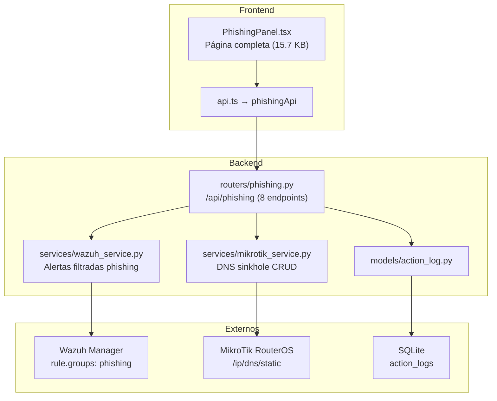
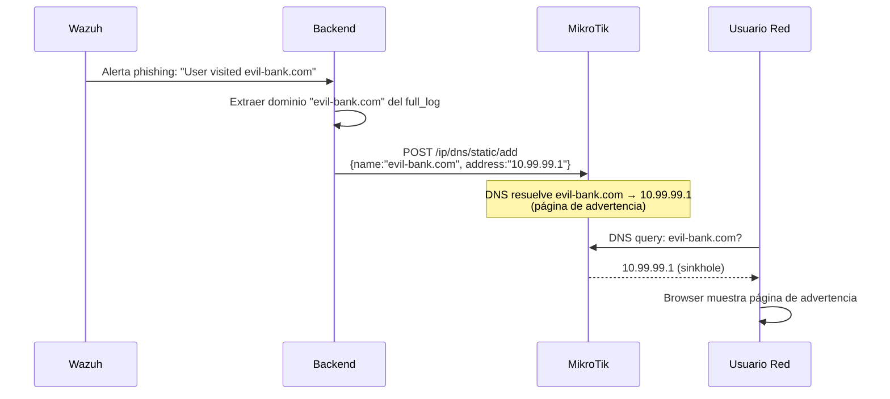

# Módulo Anti-Phishing — Documentación Funcional

## Descripción General

El módulo Anti-Phishing detecta y bloquea **sitios de phishing** identificados por Wazuh, implementando remediación automática via **DNS Sinkhole** en MikroTik RouterOS. Filtra alertas Wazuh con `rule.groups` que contengan "phishing", extrae dominios maliciosos, y permite agregarlos al DNS estático de MikroTik para redirigir a una página de advertencia.

| Modo | Condición | Comportamiento |
|---|---|---|
| **Mock** (default) | `MOCK_MIKROTIK=true` \| `MOCK_WAZUH=true` \| `MOCK_ALL=true` | Alertas phishing mock + sinkhole entries ficticias. |
| **Real** | `MOCK_MIKROTIK=false` + `MOCK_WAZUH=false` | Alertas reales de Wazuh filtradas + DNS estático real en MikroTik. |

---

## Arquitectura General



---

## Backend

### 1. Endpoints REST — `routers/phishing.py`

**Prefijo:** `/api/phishing` | **Total:** 8 endpoints

| Método | Ruta | Descripción | ActionLog |
|---|---|---|---|
| `GET` | `/alerts` | Alertas Wazuh filtradas por phishing. Extrae dominios del `full_log`. | — |
| `GET` | `/alerts/summary` | Resumen: total alertas, dominios únicos, top dominios, timeline. | — |
| `GET` | `/sinkhole` | Listar entradas DNS sinkhole activas en MikroTik. | — |
| `POST` | `/sinkhole` | Agregar dominio al DNS sinkhole (redirige a IP de advertencia). | `phishing_sinkhole_add` |
| `DELETE` | `/sinkhole/{entry_id}` | Eliminar entrada del sinkhole por ID de RouterOS. | `phishing_sinkhole_remove` |
| `POST` | `/sinkhole/bulk` | Agregar múltiples dominios al sinkhole de una vez. | `phishing_sinkhole_bulk` |
| `GET` | `/stats` | Estadísticas: total bloqueados, últimas 24h, tendencia. | — |
| `GET` | `/domains/extract` | Extraer dominios de las alertas recientes (utility endpoint). | — |

### 2. Flujo DNS Sinkhole



---

## Frontend

### 3. Página: `PhishingPanel.tsx`

**Ruta:** `/phishing` | **Componente único:** 15.7 KB

**Layout:**

```
┌─ Anti-Phishing ──────────────────────────────────────────────────────────────── ┐
│  ┌── Stats Cards ────────────────────────────────────────────────────────────┐ │
│  │  [Total bloqueados: 12]  [Últimas 24h: 3]  [Dominios únicos: 8]         │ │
│  └──────────────────────────────────────────────────────────────────────────┘ │
│  ┌── Alertas Phishing ──────────────────────────────────────────────────────┐ │
│  │  Timestamp │ Dominio         │ Agente    │ Level │ Acción               │ │
│  │  14:30     │ evil-bank.com   │ Ubuntu-PC │ 10    │ [Sinkhole ▶]         │ │
│  │  14:25     │ fake-login.net  │ Win-PC    │ 8     │ [Sinkhole ▶]         │ │
│  └──────────────────────────────────────────────────────────────────────────┘ │
│  ┌── DNS Sinkhole Activo ───────────────────────────────────────────────────┐ │
│  │  Dominio         │ Redirige a   │ Comentario      │ Acción              │ │
│  │  evil-bank.com   │ 10.99.99.1   │ NetShield auto  │ [🗑️ Eliminar]      │ │
│  │  phish-page.org  │ 10.99.99.1   │ Manual          │ [🗑️ Eliminar]      │ │
│  └──────────────────────────────────────────────────────────────────────────┘ │
└──────────────────────────────────────────────────────────────────────────────── ┘
```

---

## Modo Mock

| Dato Mock | Contenido |
|---|---|
| `MockData.phishing.alerts()` | ~8 alertas con dominios: evil-bank.com, fake-login.net, etc. |
| `MockData.mikrotik.dns_sinkhole()` | 4 entradas sinkhole activas |

---

## Casos de Uso

### CU-1: Detectar y bloquear sitio de phishing

**Actor:** Analista de seguridad
1. Tabla muestra alerta: "User visited evil-bank.com" desde Ubuntu-PC
2. Click **"Sinkhole"** → `POST /api/phishing/sinkhole {domain:"evil-bank.com"}`
3. MikroTik agrega DNS estático: evil-bank.com → 10.99.99.1
4. Usuarios que intenten acceder verán página de advertencia

### CU-2: Bulk sinkhole de dominios nuevos

**Actor:** Administrador de seguridad
1. 5 nuevas alertas muestran dominios nunca vistos
2. Click "Bloquear todos" → `POST /api/phishing/sinkhole/bulk`
3. 5 dominios agregados al DNS sinkhole de una vez
4. ActionLog registra la operación bulk

---

## Archivos Involucrados

### Backend

| Archivo | Rol |
|---|---|
| [phishing.py](file:///home/nivek/Documents/netShield2/backend/routers/phishing.py) | 8 endpoints REST (17.2 KB) |
| [mikrotik_service.py](file:///home/nivek/Documents/netShield2/backend/services/mikrotik_service.py) | DNS sinkhole CRUD (`/ip/dns/static`) |
| [wazuh_service.py](file:///home/nivek/Documents/netShield2/backend/services/wazuh_service.py) | Alertas filtradas por phishing |
| [mock_data.py](file:///home/nivek/Documents/netShield2/backend/services/mock_data.py) | `MockData.phishing.*` |

### Frontend

| Archivo | Rol |
|---|---|
| [PhishingPanel.tsx](file:///home/nivek/Documents/netShield2/frontend/src/components/phishing/PhishingPanel.tsx) | Página completa: stats, alertas, sinkhole (15.7 KB) |
| [api.ts](file:///home/nivek/Documents/netShield2/frontend/src/services/api.ts) → `phishingApi` | 8 funciones HTTP |
