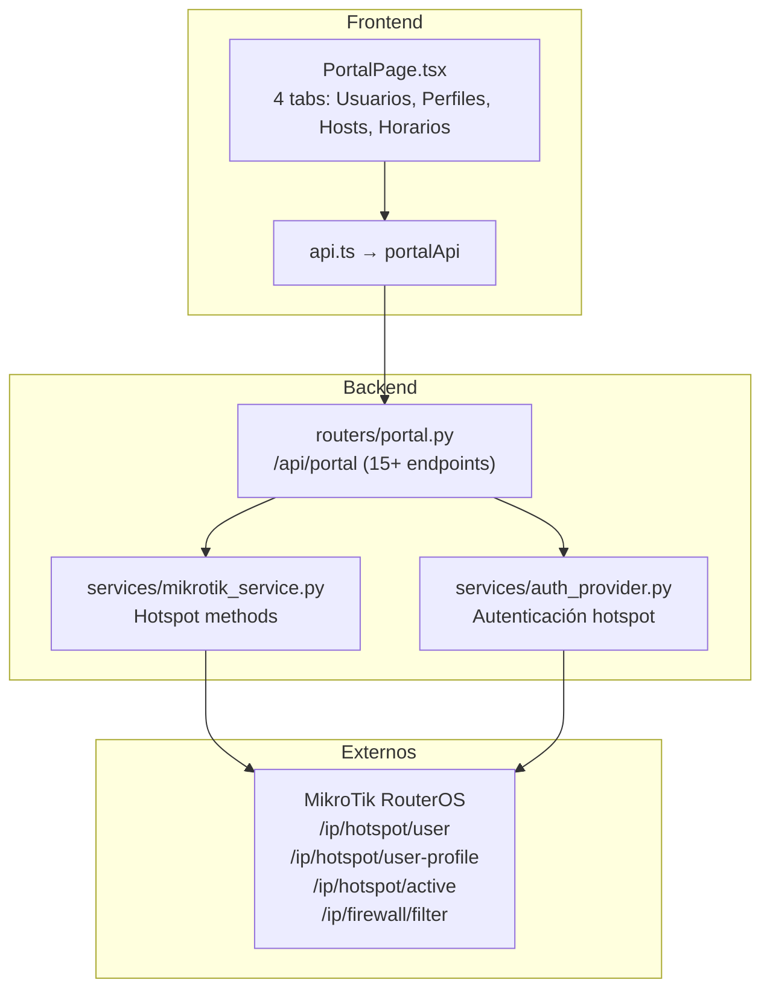

# Módulo Portal Cautivo — Documentación Funcional

## Descripción General

El módulo Portal Cautivo gestiona el **Hotspot de MikroTik RouterOS** (portal cautivo para control de acceso a internet). Permite administrar **usuarios hotspot**, **perfiles de velocidad**, **hosts activos**, y políticas de acceso basadas en horario via reglas de firewall.

| Modo | Condición | Comportamiento |
|---|---|---|
| **Mock** (default) | `MOCK_MIKROTIK=true` o `MOCK_ALL=true` | Usuarios, perfiles y hosts ficticios. CRUD simulado. |
| **Real** | `MOCK_MIKROTIK=false` | CRUD real contra RouterOS Hotspot API. |

---

## Arquitectura General

---

## Backend

### 1. Endpoints REST — `routers/portal.py`

**Prefijo:** `/api/portal` | **Total:** 15+ endpoints

#### Usuarios Hotspot

| Método | Ruta | Descripción | ActionLog |
|---|---|---|---|
| `GET` | `/users` | Listar usuarios hotspot. | — |
| `POST` | `/users` | Crear usuario con nombre, password, profile. | `hotspot_user_created` |
| `PUT` | `/users/{user_id}` | Actualizar usuario (password, profile, comment). | `hotspot_user_updated` |
| `DELETE` | `/users/{user_id}` | Eliminar usuario. | `hotspot_user_deleted` |
| `POST` | `/users/bulk` | Crear múltiples usuarios de una vez. | `hotspot_bulk_create` |

#### Perfiles de Velocidad

| Método | Ruta | Descripción |
|---|---|---|
| `GET` | `/profiles` | Listar perfiles (rate-limit, session-timeout, shared-users). |
| `POST` | `/profiles` | Crear perfil con límites de velocidad y tiempo. |
| `PUT` | `/profiles/{profile_id}` | Actualizar perfil. |
| `DELETE` | `/profiles/{profile_id}` | Eliminar perfil. |

#### Hosts Activos

| Método | Ruta | Descripción |
|---|---|---|
| `GET` | `/active` | Listar hosts activos con IP, MAC, uptime, bytes transferidos. |
| `DELETE` | `/active/{host_id}` | Desconectar host activo (kick). |

#### Horarios (Scheduling)

| Método | Ruta | Descripción |
|---|---|---|
| `GET` | `/schedules` | Listar reglas de horario (firewall rules con time restrictions). |
| `POST` | `/schedules` | Crear regla de horario (ej: bloquear internet de 22:00 a 06:00). |
| `DELETE` | `/schedules/{schedule_id}` | Eliminar regla de horario. |

---

## Frontend

### 2. Página: `PortalPage.tsx`

**Ruta:** `/portal` | **4 tabs:**

| Tab | Componente/Sección | Descripción |
|---|---|---|
| **Usuarios** (default) | Tabla CRUD | Lista, crear, editar, eliminar usuarios hotspot. Bulk create. |
| **Perfiles** | Tabla CRUD + formulario | Gestión de perfiles de velocidad con rate-limit. |
| **Activos** | Tabla read-only + kick | Hosts conectados en tiempo real con botón desconectar. |
| **Horarios** | Tabla + formulario | Reglas de firewall con restricciones horarias. |

---

## Modo Mock

| Dato Mock | Contenido |
|---|---|
| `MockData.portal.users()` | ~10 usuarios: alumno1-5, docente1-3, admin, invitado |
| `MockData.portal.profiles()` | 3 perfiles: Básico (2M/1M), Premium (10M/5M), Admin (sin límite) |
| `MockData.portal.active_hosts()` | ~5 hosts conectados con uptime y bytes |

---

## Casos de Uso

### CU-1: Crear usuarios para nueva clase
**Actor:** Administrador
1. Tab Usuarios → Bulk Create con 20 usuarios "alumno-XX"
2. Asigna perfil "Básico" (2Mbps)
3. Los usuarios pueden conectarse al portal cautivo

### CU-2: Configurar horario de acceso
**Actor:** Administrador
1. Tab Horarios → Nueva regla: bloquear de 22:00 a 06:00 para perfil "Básico"
2. MikroTik crea regla de firewall con time restriction
3. Fuera de horario, los alumnos no pueden navegar

### CU-3: Desconectar host sospechoso
**Actor:** Técnico de redes
1. Tab Activos → identifica host con excesivo uso de ancho de banda
2. Click "Kick" → `DELETE /api/portal/active/{id}`
3. Host desconectado; debe re-autenticarse

---

## Archivos Involucrados

### Backend

| Archivo | Rol |
|---|---|
| [portal.py](file:///home/nivek/Documents/netShield2/backend/routers/portal.py) | 15+ endpoints Hotspot (22.2 KB) |
| [mikrotik_service.py](file:///home/nivek/Documents/netShield2/backend/services/mikrotik_service.py) | Métodos hotspot CRUD |
| [auth_provider.py](file:///home/nivek/Documents/netShield2/backend/services/auth_provider.py) | Autenticación hotspot |

### Frontend

| Archivo | Rol |
|---|---|
| [PortalPage.tsx](file:///home/nivek/Documents/netShield2/frontend/src/components/portal/PortalPage.tsx) | 4 tabs (500+ líneas) |
| [api.ts](file:///home/nivek/Documents/netShield2/frontend/src/services/api.ts) → `portalApi` | 15+ funciones HTTP |
