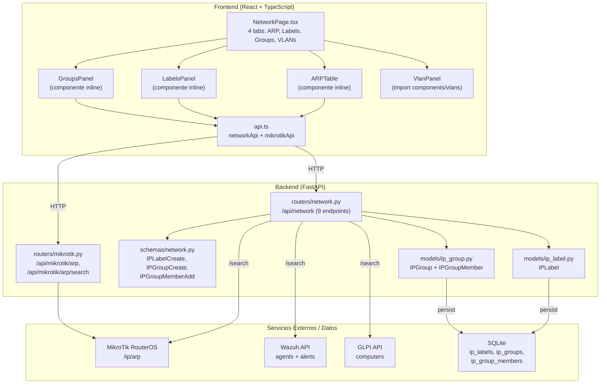
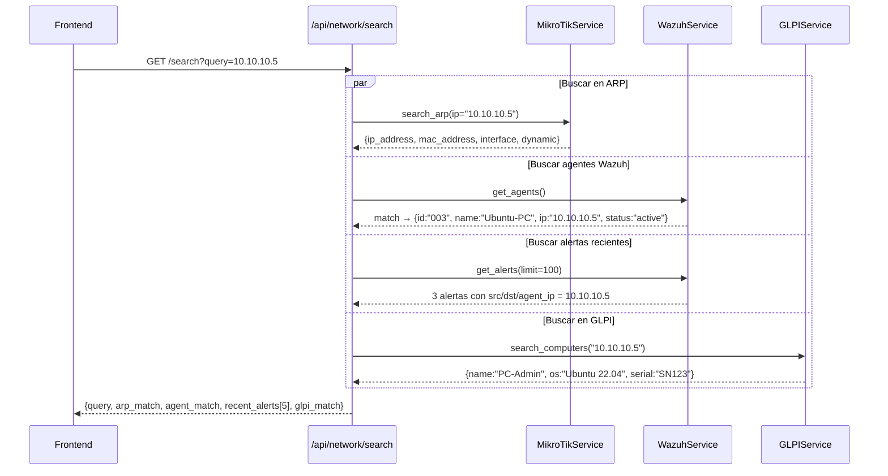
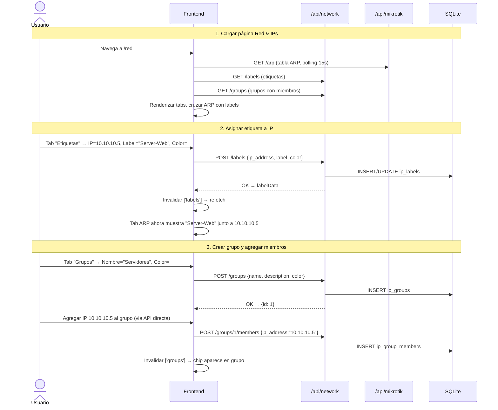

# Módulo Red & IPs — Documentación Funcional

## Descripción General

El módulo Red & IPs es el **hub central de gestión de red** del dashboard. Integra la tabla ARP de MikroTik con un sistema local de **etiquetas IP** y **grupos de IP** almacenado en SQLite, y ofrece una **búsqueda unificada** (GlobalSearch) que cruza datos de MikroTik, Wazuh y GLPI en una sola consulta. Además, embebe el módulo VLANs como cuarta pestaña.

| Modo | Condición | Comportamiento |
|---|---|---|
| **Mock** (default) | `MOCK_MIKROTIK=true` o `MOCK_ALL=true` | ARP table y search retornan datos ficticios. Labels/Groups son reales (SQLite local). |
| **Real** | `MOCK_MIKROTIK=false` | ARP table desde RouterOS. Search cruza APIs reales de MikroTik, Wazuh y GLPI. |

---

## Arquitectura General



---

## Backend

### 1. Endpoints REST — `routers/network.py`

**Prefijo:** `/api/network` | **Total:** 9 endpoints

#### Labels (Etiquetas de IP)

| Método | Ruta | Descripción | Persistencia |
|---|---|---|---|
| `POST` | `/labels` | Crear o actualizar etiqueta para una IP. Si ya existe label para esa IP, la actualiza (upsert). | SQLite `ip_labels` |
| `GET` | `/labels` | Listar todas las etiquetas, ordenadas por fecha descendente. | SQLite |
| `DELETE` | `/labels/{label_id}` | Eliminar etiqueta por ID. | SQLite |

#### Groups (Grupos de IP)

| Método | Ruta | Descripción | Persistencia |
|---|---|---|---|
| `POST` | `/groups` | Crear grupo con nombre, descripción, color y criterios JSON opcionales. | SQLite `ip_groups` |
| `GET` | `/groups` | Listar todos los grupos con sus miembros (eager loading con `selectinload`). | SQLite |
| `POST` | `/groups/{group_id}/members` | Agregar IP a un grupo. Verifica que el grupo exista antes. | SQLite `ip_group_members` |
| `DELETE` | `/groups/{group_id}/members/{ip_address}` | Eliminar IP de un grupo. | SQLite |
| `DELETE` | `/groups/{group_id}` | Eliminar grupo y todos sus miembros (cascade). | SQLite |

#### Búsqueda Unificada (GlobalSearch)

| Método | Ruta | Descripción | Fuentes |
|---|---|---|---|
| `GET` | `/search?query={ip_or_mac}` | Buscar IP o MAC en ARP, Wazuh agents/alerts, y GLPI. | MikroTik + Wazuh + GLPI |

### 2. Endpoints ARP — `routers/mikrotik.py`

| Método | Ruta | Descripción |
|---|---|---|
| `GET` | `/api/mikrotik/arp` | Tabla ARP completa (`/ip/arp/print`). |
| `GET` | `/api/mikrotik/arp/search?ip=X&mac=Y` | Buscar en ARP por IP o MAC. Al menos un parámetro requerido. |

---

### 3. Búsqueda Unificada — Detalle del endpoint `/search`



**Respuesta de ejemplo:**

```json
{
  "success": true,
  "data": {
    "query": "10.10.10.5",
    "arp_match": {
      "ip_address": "10.10.10.5",
      "mac_address": "02:42:AC:11:00:05",
      "interface": "bridge",
      "dynamic": true
    },
    "agent_match": {
      "id": "003",
      "name": "Ubuntu-PC",
      "ip": "10.10.10.5",
      "status": "active",
      "os_name": "Ubuntu",
      "os_version": "22.04"
    },
    "recent_alerts": [
      {
        "rule_level": 10,
        "rule_description": "SSH brute force attempt",
        "src_ip": "10.10.10.5",
        "timestamp": "2026-04-15T14:30:00"
      }
    ],
    "glpi_match": {
      "name": "PC-Admin",
      "serial": "SN-12345",
      "ip": "10.10.10.5"
    }
  }
}
```

**Detección MAC vs IP:** Si el query contiene `:` y tiene más de 6 caracteres, se trata como MAC address.

**GLPI en modo lab:** Si GLPI no está disponible (`is_available()` retorna `false`) y estamos en modo lab/development, busca en mock computers.

---

### 4. Schemas Pydantic — `schemas/network.py`

#### `IPLabelCreate`

| Campo | Tipo | Descripción |
|---|---|---|
| `ip_address` | `str` | IP a etiquetar |
| `label` | `str` | Texto de la etiqueta (ej: "Servidor Web") |
| `description` | `str \| None` | Descripción opcional |
| `color` | `str` | Color hex (ej: `#6366f1`) |
| `criteria` | `str \| None` | Criterios JSON opcionales |

#### `IPGroupCreate`

| Campo | Tipo | Descripción |
|---|---|---|
| `name` | `str` | Nombre del grupo |
| `description` | `str \| None` | Descripción |
| `color` | `str` | Color hex |
| `criteria` | `str \| None` | Criterios JSON para autoagrupación |

#### `IPGroupMemberAdd`

| Campo | Tipo | Descripción |
|---|---|---|
| `ip_address` | `str` | IP a agregar al grupo |
| `reason` | `str \| None` | Motivo de inclusión |

---

### 5. Modelos SQLAlchemy

#### `IPLabel` — `models/ip_label.py`

| Columna | Tipo | Descripción |
|---|---|---|
| `id` | `Integer PK` | ID autoincremental |
| `ip_address` | `String` | Unique — una etiqueta por IP |
| `label` | `String` | Texto visible |
| `description` | `String nullable` | Descripción |
| `color` | `String` | Color hex |
| `criteria` | `String nullable` | Criterios JSON |
| `created_at` | `DateTime` | Timestamp de creación |

#### `IPGroup` — `models/ip_group.py`

| Columna | Tipo | Descripción |
|---|---|---|
| `id` | `Integer PK` | ID autoincremental |
| `name` | `String` | Nombre del grupo |
| `description` | `String nullable` | Descripción |
| `color` | `String` | Color hex |
| `criteria` | `String nullable` | Criterios JSON |
| `created_at` | `DateTime` | Timestamp |
| `members` | `relationship` | → `IPGroupMember[]` (cascade delete) |

#### `IPGroupMember`

| Columna | Tipo | Descripción |
|---|---|---|
| `id` | `Integer PK` | ID autoincremental |
| `group_id` | `Integer FK` | Referencia a `IPGroup.id` |
| `ip_address` | `String` | IP miembro |
| `added_reason` | `String nullable` | Motivo de inclusión |
| `added_at` | `DateTime` | Timestamp |

---

## Frontend

### 6. Estructura de Archivos

```
frontend/src/
├── components/network/
│   └── NetworkPage.tsx      ← Página con 4 tabs + 3 componentes inline (463 líneas)
├── components/vlans/
│   └── VlanPanel.tsx         ← Embebido como tab "VLANs"
└── services/
    └── api.ts → networkApi  ← CRUD labels/groups + search
               → mikrotikApi ← getArp, searchArp
```

### 7. Navegación y Rutas

```
/red → NetworkPage (4 tabs: Tabla ARP | Etiquetas | Grupos | VLANs)
```

Ubicación en sidebar: grupo **"Red e IPs"**, ícono `Network`.

---

### 8. Página: `NetworkPage.tsx`

**Ruta:** `/red`

**Hooks utilizados:** Inline TanStack Query (sin hooks dedicados).

```typescript
const { data: arpResp } = useQuery({ queryKey: ['arp-table'], queryFn: mikrotikApi.getArp, refetchInterval: 15000 });
const { data: labelsResp } = useQuery({ queryKey: ['labels'], queryFn: networkApi.getLabels });
const { data: groupsResp } = useQuery({ queryKey: ['groups'], queryFn: networkApi.getGroups });
```

**Tabs:**

| Tab | Componente | Descripción |
|---|---|---|
| `ips` (default) | `ARPTable` | Tabla ARP con etiquetas inline. Polling 15s. Filtro por IP/MAC. |
| `labels` | `LabelsPanel` | CRUD de etiquetas IP. Formulario 1/3 + lista 2/3. |
| `groups` | `GroupsPanel` | CRUD de grupos IP. Formulario 1/3 + lista 2/3. |
| `vlans` | `VlanPanel` (importado) | Embebe el módulo VLANs completo. |

**Layout global:**

```
┌─ Header: 🌐 Red & IPs ──────────────────────────────────────────────────────────┐
│  Gestión de dispositivos, etiquetas y grupos de IP                              │
├─ [ Tabla ARP ] [ Etiquetas ] [ Grupos ] [ VLANs ] ──────────────────────────────┤
│                                                                                  │
│  ┌── Tab Content ────────────────────────────────────────────────────────────┐   │
│  │   (contenido variable según tab seleccionado)                              │   │
│  └────────────────────────────────────────────────────────────────────────────┘   │
└──────────────────────────────────────────────────────────────────────────────── ──┘
```

---

### 9. Tab: Tabla ARP

```
┌─ Dispositivos en Red (32) ──────────────────────────────── [🔍 Buscar IP/MAC] ─┐
│  IP           │ MAC               │ Interfaz │ Tipo      │ Etiqueta            │
│  10.10.10.1   │ 02:42:AC:11:00:01 │ bridge   │ Estático  │ ● Gateway           │
│  10.10.10.5   │ 02:42:AC:11:00:05 │ bridge   │ Dinámico  │ ● Server-Web        │
│  10.10.10.8   │ 02:42:AC:11:00:08 │ bridge   │ Dinámico  │ —                   │
└────────────────────────────────────────────────────────────────────────────────── ┘
```

**Características:**
- Cruza ARP entries con labels locales via `labelMap[ip_address]`
- Badge `Dinámico` → `badge-info`, `Estático` → `badge-success`
- Etiquetas con color custom: `background: ${color}20, color: ${color}, border: 1px solid ${color}40`
- Filtro local por IP o MAC (case-insensitive para MAC)

---

### 10. Tab: Etiquetas

```
┌── Nueva Etiqueta ─────────┐  ┌── Etiquetas (5) ──────────────────────────────┐
│  IP: [192.168.88.10     ] │  │  10.10.10.1  ● Gateway           Puerta de   │
│  Etiqueta: [Servidor Web] │  │                                    enlace     │
│  Descripción: [opcional ] │  │  10.10.10.5  ● Server-Web        Nginx proxy │
│  Color: [■ #6366f1      ] │  │                                               │
│  [+ Asignar Etiqueta    ] │  │  10.10.20.3  ● PC-Docente        Lab CiberS  │
└───────────────────────────┘  └───────────────────────────────────────────────┘
```

**Comportamiento upsert:** Si se asigna etiqueta a una IP que ya tiene una, la existente se actualiza (no duplica).

---

### 11. Tab: Grupos

```
┌── Nuevo Grupo ────────────┐  ┌── Grupos (3) ──────────────────────────────── ┐
│  Nombre: [Servidores     ] │  │  ● Servidores Críticos        [3 IPs] [🗑️] │
│  Descripción: [opcl     ] │  │    Servidores de producción                   │
│  Criterios: [JSON optnl ] │  │    10.10.10.1  10.10.10.5  10.10.30.2       │
│  Color: [■ #8b5cf6      ] │  │                                               │
│  [+ Crear Grupo         ] │  │  ● Dispositivos IoT           [0 IPs] [🗑️] │
└───────────────────────────┘  └───────────────────────────────────────────────┘
```

**Miembros:** Se muestran como chips monoespaciados con fondo `bg-surface-800/50`. Se agregan via endpoint separado `POST /groups/{id}/members`.

---

## Flujo de Datos Completo



---

## Modo Mock

| Dato Mock | Contenido |
|---|---|
| `MockData.mikrotik.arp_table()` | ~8 entradas ARP: IPs 10.10.10.x y 10.10.20.x con MACs `02:42:AC:...` |
| Labels y Groups | **No son mock** — siempre usan SQLite real. Vacíos hasta que el usuario cree datos. |
| `MockData.wazuh.agents()` | 5 agentes ficticiospara búsqueda unificada |
| `MockData.glpi.computers()` | ~10 computadoras ficticias con IPs |

---

## Casos de Uso

### CU-1: Identificar dispositivos desconocidos en la red

**Actor:** Técnico de redes

1. Navega a **Red & IPs → Tabla ARP**
2. Ve 32 dispositivos listados, la mayoría sin etiqueta
3. Filtra por subred `10.10.20` para aislar VLAN Estudiantes
4. Identifica 3 IPs sin etiqueta con tráfico activo
5. Procede a etiquetar cada una para futuro seguimiento

---

### CU-2: Etiquetar servidor crítico

**Actor:** Administrador de red

1. Tab **"Etiquetas"** → IP=`10.10.10.1`, Label=`"Gateway"`, Color=verde
2. Click **"Asignar Etiqueta"**
3. En tab ARP, la fila de `10.10.10.1` ahora muestra badge verde "Gateway"
4. Si repite con misma IP pero otro texto, se actualiza la etiqueta existente (upsert)

---

### CU-3: Agrupar servidores de producción

**Actor:** Administrador de red

1. Tab **"Grupos"** → Nombre=`"Servidores Críticos"`, Descripción=`"Infraestructura core"`
2. Click **"Crear Grupo"** → aparece en la lista
3. Agrega miembros: `10.10.10.1`, `10.10.10.5`, `10.10.30.2`
4. Los chips de IP aparecen dentro del card del grupo
5. El grupo puede usarse futuramente para políticas de firewall o reportes

---

### CU-4: Búsqueda unificada de IP sospechosa

**Actor:** Analista de seguridad

1. Desde cualquier módulo, necesita contexto completo sobre `10.10.10.5`
2. Usa el endpoint `GET /api/network/search?query=10.10.10.5`
3. Recibe: entrada ARP (MAC, interfaz), agente Wazuh (nombre, OS, status), últimas 5 alertas, y asset GLPI
4. Con esta información consolidada, puede tomar decisión de bloqueo o cuarentena

---

### CU-5: Eliminar grupo obsoleto

**Actor:** Administrador de red

1. Tab **"Grupos"** → identifica grupo `"Test-v1"` sin uso
2. Click 🗑️ → elimina grupo y todos sus miembros (cascade)
3. La lista se actualiza automáticamente

---

## Archivos Involucrados

### Backend

| Archivo | Rol |
|---|---|
| [network.py](file:///home/nivek/Documents/netShield2/backend/routers/network.py) | 9 endpoints: 3 labels, 5 groups, 1 search (332 líneas) |
| [mikrotik.py](file:///home/nivek/Documents/netShield2/backend/routers/mikrotik.py) | Endpoints ARP: `/arp`, `/arp/search` |
| [network.py](file:///home/nivek/Documents/netShield2/backend/schemas/network.py) | `IPLabelCreate`, `IPLabelResponse`, `IPGroupCreate`, `IPGroupResponse`, `IPGroupMemberAdd` |
| [ip_label.py](file:///home/nivek/Documents/netShield2/backend/models/ip_label.py) | Modelo `IPLabel` (SQLAlchemy) |
| [ip_group.py](file:///home/nivek/Documents/netShield2/backend/models/ip_group.py) | Modelos `IPGroup` + `IPGroupMember` (SQLAlchemy, relación 1:N) |
| [mikrotik_service.py](file:///home/nivek/Documents/netShield2/backend/services/mikrotik_service.py) | `get_arp_table()`, `search_arp()` |
| [wazuh_service.py](file:///home/nivek/Documents/netShield2/backend/services/wazuh_service.py) | `get_agents()`, `get_alerts()` para búsqueda unificada |
| [glpi_service.py](file:///home/nivek/Documents/netShield2/backend/services/glpi_service.py) | `search_computers()`, `is_available()` para búsqueda unificada |

### Frontend

| Archivo | Rol |
|---|---|
| [NetworkPage.tsx](file:///home/nivek/Documents/netShield2/frontend/src/components/network/NetworkPage.tsx) | Página con 4 tabs + 3 componentes inline: ARPTable, LabelsPanel, GroupsPanel (463 líneas) |
| [VlanPanel.tsx](file:///home/nivek/Documents/netShield2/frontend/src/components/vlans/VlanPanel.tsx) | Tab VLANs embebido |
| [api.ts](file:///home/nivek/Documents/netShield2/frontend/src/services/api.ts) → `networkApi` | `getLabels()`, `createLabel()`, `deleteLabel()`, `getGroups()`, `createGroup()`, `deleteGroup()`, `addGroupMember()`, `removeGroupMember()`, `search()` |
| [api.ts](file:///home/nivek/Documents/netShield2/frontend/src/services/api.ts) → `mikrotikApi` | `getArp()`, `searchArp()` |
| [types.ts](file:///home/nivek/Documents/netShield2/frontend/src/types.ts) | `IPLabel`, `IPGroup`, `IPGroupMember`, `NetworkSearchResult` |
