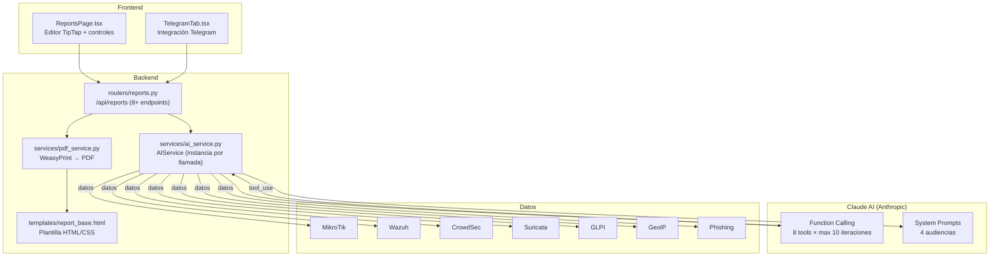
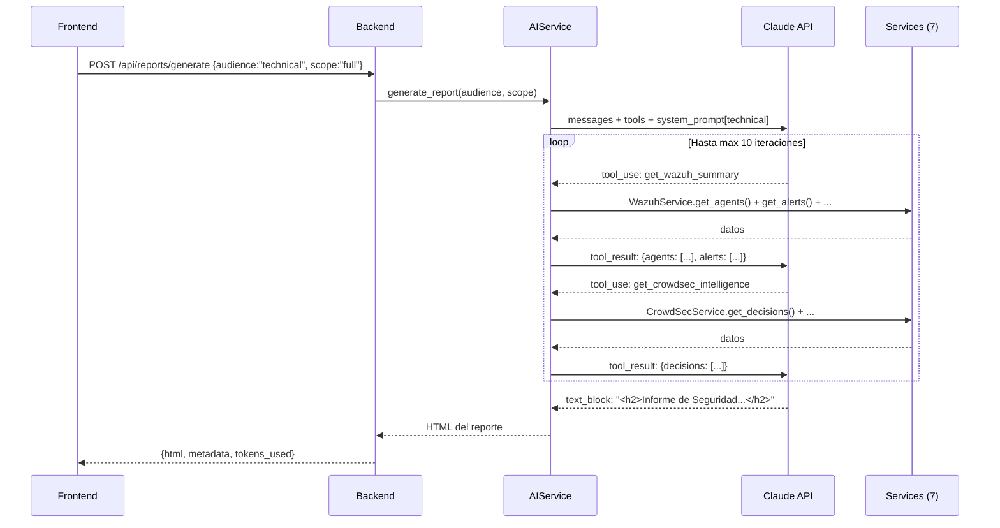

# Módulo Reportes IA — Documentación Funcional

## Descripción General

El módulo de Reportes IA genera **informes de seguridad automatizados** usando **Claude AI** (Anthropic) con **function calling**. El flujo es: recolectar datos de seguridad via tools → Claude genera análisis → el usuario edita con **TipTap** → exportar a **PDF** via **WeasyPrint**. Incluye 4 audiencias (ejecutivo, técnico, operacional, telegram), 8 herramientas de datos, y un sistema de **Telegram** para envío automatizado.

| Modo | Condición | Comportamiento |
|---|---|---|
| **Mock** (default) | `MOCK_ALL=true` | Tools retornan datos mock de cada servicio. Claude genera reporte real con datos ficticios. |
| **Real** | Todos mocks = false | Tools consultan servicios reales. Requiere `ANTHROPIC_API_KEY`. |

---

## Arquitectura General



---

## Backend

### 1. Servicio — `AIService` (instancia por llamada)

**Archivo:** `backend/services/ai_service.py` (17 KB)

**NO es singleton** — se crea una instancia nueva por cada generación de reporte.

**Modelo:** `claude-sonnet-4-20250514` | **Max tokens:** 8192 | **Max iteraciones:** 10

#### 8 Tools de Function Calling

| Tool | Fuente | Datos retornados |
|---|---|---|
| `get_wazuh_summary` | WazuhService | Agentes, alertas recientes, críticas, MITRE summary |
| `get_mikrotik_status` | MikroTikService | Interfaces, tráfico, ARP, health, firewall rules |
| `get_crowdsec_intelligence` | CrowdSecService | Decisiones, alertas, métricas, top countries |
| `get_suricata_status` | SuricataService | Motor status, stats, alertas, categorías |
| `get_glpi_inventory` | GLPIService | Assets, health, tickets |
| `get_geoip_intelligence` | GeoIPService | Top countries, suggestions |
| `get_phishing_status` | PhishingService | Alertas, sinkhole entries, stats |
| `get_network_overview` | Multiple | ARP, labels, groups, VLAN traffic |

#### 4 System Prompts por Audiencia

| Audiencia | Estilo | Foco | Longitud |
|---|---|---|---|
| `executive` | Alto nivel, métricas clave, riesgos business | KPIs, tendencias, recomendaciones estratégicas | Conciso |
| `technical` | Detallado, IPs, reglas, configs específicas | IOCs, firewall rules, signatures, CVEs | Extenso |
| `operational` | Pasos accionables, prioridades claras | Todo list, SLAs, escalation paths | Medio |
| `telegram` | Ultra-conciso, emojis, markdown | Resumen rápido para notificación | Muy corto |

#### Flujo de Function Calling



---

### 2. Endpoints REST — `routers/reports.py`

**Prefijo:** `/api/reports` | **Total:** 8+ endpoints

| Método | Ruta | Descripción |
|---|---|---|
| `POST` | `/generate` | Generar reporte con Claude AI. Body: audience, scope, custom_prompt. |
| `POST` | `/pdf` | Convertir HTML a PDF con WeasyPrint. |
| `GET` | `/templates` | Listar templates de reporte disponibles. |
| `GET` | `/history` | Historial de reportes generados. |
| `POST` | `/telegram/send` | Enviar reporte a canal Telegram. |
| `GET` | `/telegram/status` | Estado del bot Telegram. |
| `GET` | `/telegram/config` | Configuración de envío automático. |
| `PUT` | `/telegram/config` | Actualizar configuración Telegram. |

---

### 3. Generación PDF

```
HTML (TipTap) → report_base.html (template) → WeasyPrint (CPU-bound, run_in_executor) → PDF bytes
```

La plantilla `templates/report_base.html` define estilos CSS para la versión impresa: headers, tablas, colores de severidad, logos.

---

## Frontend

### 4. Estructura de Archivos

```
frontend/src/components/reports/
├── ReportsPage.tsx      ← Editor TipTap + controles de generación (500+ líneas)
└── TelegramTab.tsx      ← Bot status, configs, envío (300+ líneas)
```

### 5. Navegación

```
/reportes → ReportsPage (2 tabs: Generador, Telegram)
```

### 6. Editor TipTap

El editor TipTap v3 permite:
- **Visualizar** el HTML generado por Claude
- **Editar** texto, tablas, listas del reporte antes de exportar
- **Exportar a PDF** con un click

---

## Modo Mock

| Dato Mock | Contenido |
|---|---|
| Tools mock | Cada tool retorna `MockData.{service}.*` correspondiente |
| Claude | Genera reporte real con los datos mock (requiere `ANTHROPIC_API_KEY` siempre) |

---

## Casos de Uso

### CU-1: Generar reporte ejecutivo

**Actor:** Director de IT
1. **Reportes → Generador** → Audiencia: "Ejecutivo", Alcance: "Completo"
2. Claude consulta 7 servicios via function calling
3. Genera HTML con KPIs, tendencias, recomendaciones
4. Editor TipTap muestra el resultado editable
5. Click "Exportar PDF" → descarga inmediata

### CU-2: Enviar resumen a Telegram

**Actor:** Administrador de seguridad
1. Tab **Telegram** → genera reporte con audiencia "Telegram"
2. Claude produce resumen ultra-conciso con emojis
3. Click "Enviar a Telegram" → `POST /api/reports/telegram/send`
4. El canal de seguridad recibe la notificación

---

## Archivos Involucrados

### Backend

| Archivo | Rol |
|---|---|
| [reports.py](file:///home/nivek/Documents/netShield2/backend/routers/reports.py) | 8+ endpoints REST (17.7 KB) |
| [ai_service.py](file:///home/nivek/Documents/netShield2/backend/services/ai_service.py) | Function calling loop con Claude (17 KB) |
| [pdf_service.py](file:///home/nivek/Documents/netShield2/backend/services/pdf_service.py) | WeasyPrint → PDF (2 KB) |
| [report_base.html](file:///home/nivek/Documents/netShield2/backend/templates/report_base.html) | Plantilla HTML/CSS para PDF |

### Frontend

| Archivo | Rol |
|---|---|
| [ReportsPage.tsx](file:///home/nivek/Documents/netShield2/frontend/src/components/reports/ReportsPage.tsx) | Editor TipTap + controles |
| [TelegramTab.tsx](file:///home/nivek/Documents/netShield2/frontend/src/components/reports/TelegramTab.tsx) | Integración Telegram |
| [api.ts](file:///home/nivek/Documents/netShield2/frontend/src/services/api.ts) → `reportsApi` | 8+ funciones HTTP |
