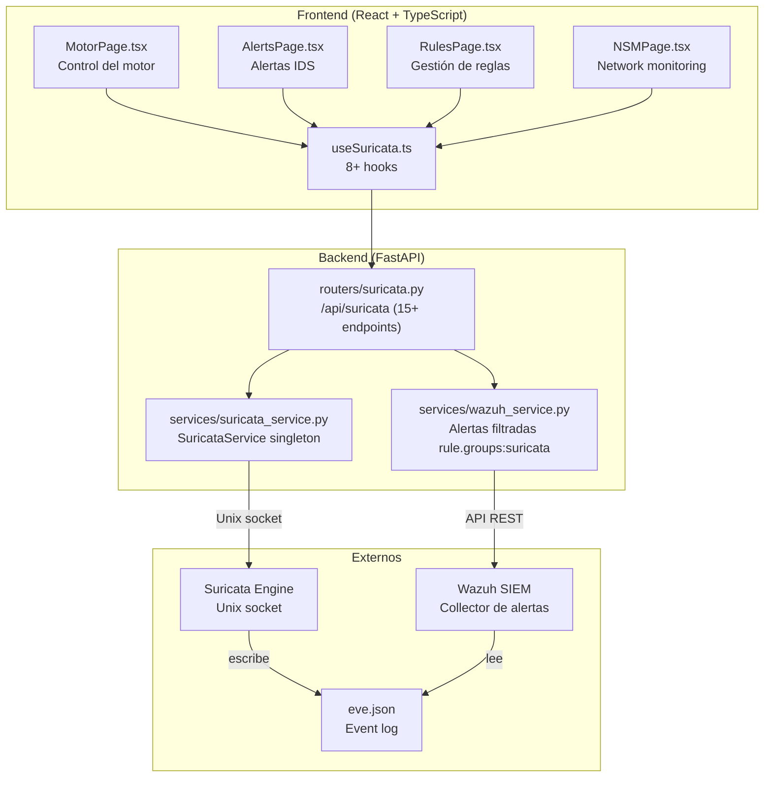
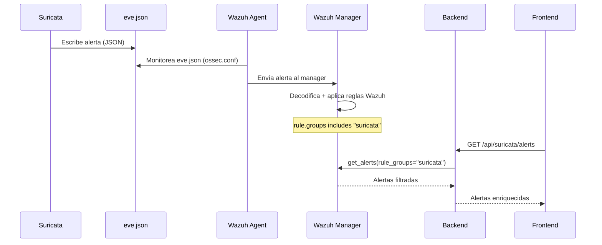

# Módulo Suricata IDS/IPS/NSM — Documentación Funcional

## Descripción General

El módulo Suricata integra el motor **IDS/IPS/NSM** (Intrusion Detection/Prevention + Network Security Monitoring) con el dashboard. Comunica con Suricata vía **Unix socket** para control del motor, consume alertas filtradas de **Wazuh** (que actúa como SIEM collector), y ofrece 4 páginas especializadas: Motor (control), Alertas (visualización), Reglas (gestión), y NSM (network monitoring).

| Modo | Condición | Comportamiento |
|---|---|---|
| **Mock** (default) | `MOCK_SURICATA=true` o `MOCK_ALL=true` | Motor siempre "running". Alertas y stats generadas via MockData. |
| **Real** | `MOCK_SURICATA=false` | Unix socket a `/var/run/suricata/suricata-command.socket`. Alertas reales via Wazuh. |

---

## Arquitectura General



---

## Backend

### 1. Servicio — `SuricataService` (singleton)

**Archivo:** `backend/services/suricata_service.py`

Comunicación con Suricata via Unix socket. Las llamadas son síncronas y se ejecutan en `asyncio.to_thread()`.

**Métodos principales:**

| Método | Socket Command | Descripción |
|---|---|---|
| `get_status()` | `uptime` / `running-mode` | Estado del motor: running, uptime, mode (IDS/IPS). |
| `get_stats()` | `dump-counters` | Estadísticas: packets captured/decoded/dropped, flows, alerts count. |
| `get_version()` | `version` | Versión de Suricata. |
| `reload_rules()` | `reload-rules` | Recarga reglas sin reiniciar el motor. |
| `get_rule_files()` | Lee `/etc/suricata/rules/` | Lista archivos .rules con conteo de reglas por archivo. |
| `get_rule_content(filename)` | Lee archivo | Contenido de un archivo de reglas. |
| `get_iface_stats()` | `iface-stat` | Estadísticas por interfaz de captura. |
| `get_eve_alerts(limit)` | Lee `eve.json` | Últimas alertas del event log local (fallback si Wazuh no disponible). |

### 2. Flujo de Alertas: Suricata → Wazuh → Backend



---

### 3. Endpoints REST — `routers/suricata.py`

**Prefijo:** `/api/suricata` | **Total:** 15+ endpoints

#### Motor

| Método | Ruta | Descripción |
|---|---|---|
| `GET` | `/status` | Estado del motor (running/stopped, uptime, mode). |
| `GET` | `/stats` | Estadísticas del motor (packets, flows, drops). |
| `GET` | `/version` | Versión instalada de Suricata. |
| `POST` | `/reload-rules` | Recargar reglas sin reiniciar. |

#### Alertas (via Wazuh)

| Método | Ruta | Descripción |
|---|---|---|
| `GET` | `/alerts` | Alertas Suricata filtradas de Wazuh (rule_groups="suricata"). |
| `GET` | `/alerts/critical` | Alertas severity ≥ 1 (Suricata severity, no Wazuh level). |
| `GET` | `/alerts/timeline` | Alertas agrupadas por minuto (últimos 60 min). |
| `GET` | `/alerts/categories` | Alertas agrupadas por categoría (ET trojan, ET policy, etc). |
| `GET` | `/alerts/top-sources` | Top IPs atacantes por frecuencia. |
| `GET` | `/alerts/top-signatures` | Top signatures por hits. |

#### Reglas

| Método | Ruta | Descripción |
|---|---|---|
| `GET` | `/rules/files` | Archivos .rules con conteo de reglas. |
| `GET` | `/rules/files/{filename}` | Contenido de un archivo de reglas. |

#### NSM (Network Security Monitoring)

| Método | Ruta | Descripción |
|---|---|---|
| `GET` | `/nsm/interfaces` | Estadísticas por interfaz de captura (pps, drops). |
| `GET` | `/nsm/protocols` | Distribución de protocolos detectados. |
| `GET` | `/nsm/flows` | Resumen de flows activos y completados. |

---

## Frontend

### 4. Estructura de Archivos

```
frontend/src/
├── components/suricata/
│   ├── MotorPage.tsx     ← Control del motor: status, stats, version, reload (18.7 KB)
│   ├── AlertsPage.tsx    ← Tabla alertas + timeline + categorías + top sources (16.4 KB)
│   ├── RulesPage.tsx     ← Archivos de reglas + visor de contenido (12.1 KB)
│   └── NSMPage.tsx       ← Network monitoring: interfaces, protocols, flows (15.3 KB)
├── hooks/
│   └── useSuricata.ts    ← 8+ hooks TanStack Query
└── services/
    └── api.ts → suricataApi ← 15+ funciones HTTP
```

### 5. Navegación y Rutas

```
/suricata         → MotorPage (status + stats)
/suricata/alertas → AlertsPage (alertas IDS)
/suricata/reglas  → RulesPage (gestión de reglas)
/suricata/nsm     → NSMPage (network monitoring)
```

Ubicación en sidebar: grupo **"Detección"**, ícono `Shield`, con 4 sub-items.

---

### 6. Páginas

#### MotorPage

| Sección | Contenido |
|---|---|
| Status Card | Estado (running/stopped), uptime, modo (IDS/IPS), versión |
| Estadísticas | Packets captured, decoded, dropped, drop rate %. Gráficos. |
| Reload Button | `POST /reload-rules` con feedback de éxito/error |

#### AlertsPage

| Sección | Contenido |
|---|---|
| Tabla de alertas | Timestamp, severity badge, signature, source IP, dest IP, protocol, category |
| Timeline | Gráfico de alertas por minuto (últimos 60 min) |
| Categorías | Desglose por tipo: ET Policy, ET Trojan, ET Scan, etc. |
| Top Sources | Ranking de IPs atacantes |

#### RulesPage

| Sección | Contenido |
|---|---|
| Lista de archivos | Archivos .rules con # de reglas por archivo |
| Visor de contenido | Contenido raw del archivo seleccionado (read-only) |

#### NSMPage

| Sección | Contenido |
|---|---|
| Interfaces | Estadísticas por interfaz: pps, drops, errors |
| Protocolos | Distribución: HTTP, DNS, TLS, SSH, etc. |
| Flows | Activos, completados, rate |

---

## Modo Mock

| Dato Mock | Contenido |
|---|---|
| `MockData.suricata.status()` | Motor running, uptime 7 días, mode IDS |
| `MockData.suricata.stats()` | 15M packets captured, 0.02% drop rate |
| `MockData.suricata.alerts()` | ~20 alertas con signatures ET (trojan, scan, policy) |
| `MockData.suricata.rules_files()` | 5 archivos: emerging-trojan, emerging-scan, etc. |
| `MockData.suricata.nsm.*()` | 3 interfaces, 8 protocolos, 500 flows |

---

## Casos de Uso

### CU-1: Monitorear estado del motor

**Actor:** Administrador de seguridad
1. Navega a **Suricata → Motor**
2. Ve status "running", uptime "7d 14h", modo "IDS"
3. Stats: 15M paquetes capturados, 0.02% drop rate

### CU-2: Analizar alertas de intrusión

**Actor:** Analista de seguridad
1. Navega a **Suricata → Alertas**
2. Timeline muestra pico hace 20 minutos
3. Filtra alertas de ese período → 5 alerts "ET SCAN"
4. Identifica IP atacante 185.x.x.x en Top Sources

### CU-3: Recargar reglas actualizadas

**Actor:** Administrador de seguridad
1. **Motor** → click "Reload Rules"
2. Suricata recarga rules sin reiniciar (0 downtime)
3. Feedback: "Rules reloaded successfully"

---

## Archivos Involucrados

### Backend

| Archivo | Rol |
|---|---|
| [suricata.py](file:///home/nivek/Documents/netShield2/backend/routers/suricata.py) | 15+ endpoints REST (495 líneas) |
| [suricata_service.py](file:///home/nivek/Documents/netShield2/backend/services/suricata_service.py) | Singleton con Unix socket + to_thread |
| [wazuh_service.py](file:///home/nivek/Documents/netShield2/backend/services/wazuh_service.py) | Alertas filtradas por rule_groups="suricata" |
| [mock_data.py](file:///home/nivek/Documents/netShield2/backend/services/mock_data.py) | `MockData.suricata.*` |

### Frontend

| Archivo | Rol |
|---|---|
| [MotorPage.tsx](file:///home/nivek/Documents/netShield2/frontend/src/components/suricata/MotorPage.tsx) | Control del motor (18.7 KB) |
| [AlertsPage.tsx](file:///home/nivek/Documents/netShield2/frontend/src/components/suricata/AlertsPage.tsx) | Alertas IDS (16.4 KB) |
| [RulesPage.tsx](file:///home/nivek/Documents/netShield2/frontend/src/components/suricata/RulesPage.tsx) | Gestión de reglas (12.1 KB) |
| [NSMPage.tsx](file:///home/nivek/Documents/netShield2/frontend/src/components/suricata/NSMPage.tsx) | Network monitoring (15.3 KB) |
| [useSuricata.ts](file:///home/nivek/Documents/netShield2/frontend/src/hooks/useSuricata.ts) | 8+ hooks |
| [api.ts](file:///home/nivek/Documents/netShield2/frontend/src/services/api.ts) → `suricataApi` | 15+ funciones HTTP |
