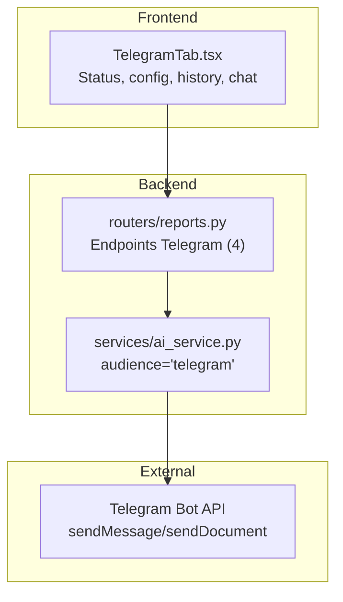
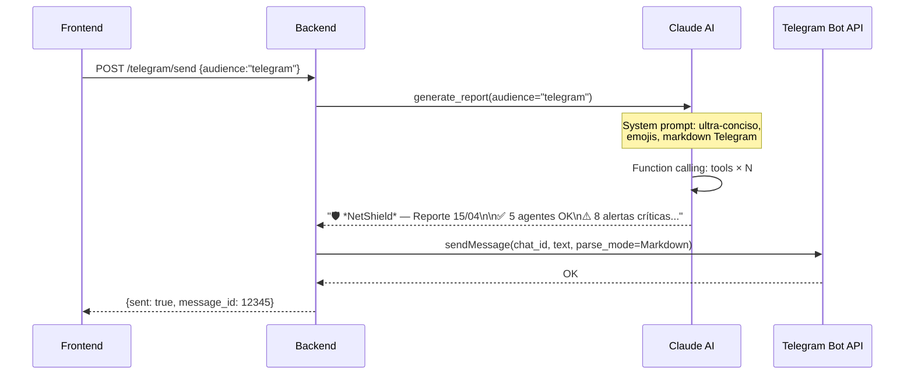

# Módulo Telegram — Documentación Funcional

## Descripción General

El módulo Telegram proporciona integración **bidireccional** con un bot de Telegram para envío de reportes de seguridad, notificaciones automáticas, e interacción via chat. Se construye sobre el módulo de Reportes IA, usando la audiencia `telegram` de Claude para generar resúmenes ultra-concisos.

| Modo | Condición | Comportamiento |
|---|---|---|
| **Mock** (default) | `MOCK_TELEGRAM=true` o `MOCK_ALL=true` | Bot status simulado. Envíos ficticios. |
| **Real** | `MOCK_TELEGRAM=false` | Requiere `TELEGRAM_BOT_TOKEN` y `TELEGRAM_CHAT_ID`. |

---

## Arquitectura General



---

## Backend

### Endpoints REST — parte de `routers/reports.py`

| Método | Ruta | Descripción |
|---|---|---|
| `POST` | `/api/reports/telegram/send` | Enviar reporte generado al canal Telegram. |
| `GET` | `/api/reports/telegram/status` | Estado del bot: online/offline, último envío, chat_id configurado. |
| `GET` | `/api/reports/telegram/config` | Configuración actual: chat_id, horarios automáticos, audiencia default. |
| `PUT` | `/api/reports/telegram/config` | Actualizar configuración de envío automático. |

### Flujo de Envío



---

## Frontend

### Componente: `TelegramTab.tsx`

Embebido en `/reports` como segunda tab:

```
┌─ Telegram ───────────────────────────────────────────────────────────────────── ┐
│  ┌── Bot Status ──────────┐  ┌── Configuración ───────────────────────────┐  │
│  │  Estado: ● Online      │  │  Chat ID: [-100123456789]                  │  │
│  │  Último envío: 14:30   │  │  Audiencia: [telegram ▾]                   │  │
│  │  Chat: Security Ops    │  │  Auto-envío: [Diario 08:00 ▾]              │  │
│  └────────────────────────┘  │  [💾 Guardar Config]                       │  │
│                               └────────────────────────────────────────────┘  │
│  ┌── Enviar Reporte ──────────────────────────────────────────────────────┐  │
│  │  [📤 Enviar Reporte Ahora]                                             │  │
│  │  ✅ Enviado: message_id 12345 (hace 2 minutos)                        │  │
│  └────────────────────────────────────────────────────────────────────────┘  │
│  ┌── Historial de Envíos ─────────────────────────────────────────────────┐  │
│  │  Fecha       │ Tipo     │ Audiencia  │ Estado │ Message ID             │  │
│  │  15/04 14:30 │ Manual   │ telegram   │ ✅     │ 12345                  │  │
│  │  14/04 08:00 │ Auto     │ telegram   │ ✅     │ 12340                  │  │
│  └────────────────────────────────────────────────────────────────────────┘  │
└──────────────────────────────────────────────────────────────────────────────── ┘
```

---

## Modo Mock

| Dato Mock | Contenido |
|---|---|
| Bot status | `{online: true, last_send: "2026-04-15T14:30:00", chat_title: "NetShield Security"}` |
| Envío | Simula éxito con message_id ficticio |

---

## Casos de Uso

### CU-1: Enviar resumen diario a Telegram
**Actor:** Administrador de seguridad
1. **Reportes → Telegram** → Click "Enviar Reporte Ahora"
2. Claude genera resumen ultra-conciso con emojis
3. Bot envía al canal configurado
4. Equipo de seguridad recibe la notificación

### CU-2: Configurar envío automático
**Actor:** Administrador
1. Config → Auto-envío: "Diario 08:00"
2. Guardar → backend programa envío recurrente
3. Cada mañana, el canal recibe resumen de seguridad

---

## Archivos Involucrados

| Archivo | Rol |
|---|---|
| [reports.py](file:///home/nivek/Documents/netShield2/backend/routers/reports.py) | 4 endpoints Telegram (parte de reports.py, 17.7 KB) |
| [ai_service.py](file:///home/nivek/Documents/netShield2/backend/services/ai_service.py) | `SYSTEM_PROMPTS["telegram"]` — ultra-conciso |
| [TelegramTab.tsx](file:///home/nivek/Documents/netShield2/frontend/src/components/reports/TelegramTab.tsx) | UI Telegram (300+ líneas) |
| [api.ts](file:///home/nivek/Documents/netShield2/frontend/src/services/api.ts) → `reportsApi` | `sendTelegram()`, `getTelegramStatus()`, `getTelegramConfig()`, `updateTelegramConfig()` |
