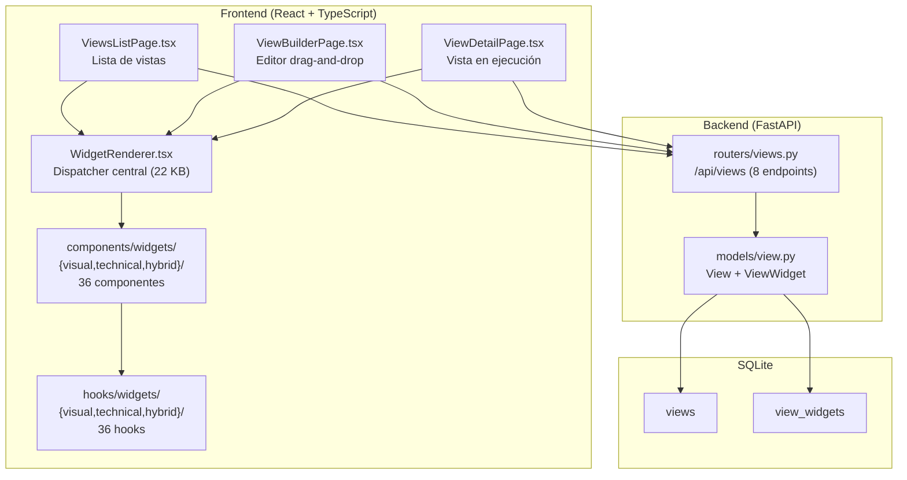
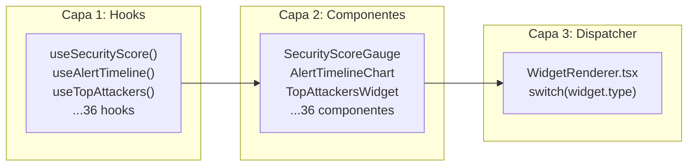
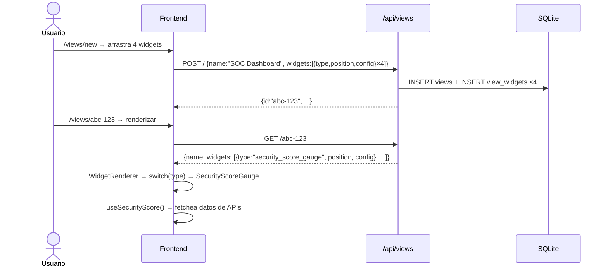

# Módulo Vistas Personalizadas & Widgets — Documentación Funcional

## Descripción General

El módulo de Vistas Personalizadas permite a los usuarios crear **dashboards customizados** arrastrando widgets de un catálogo de **36 widgets** organizados en 3 categorías (Visual, Technical, Hybrid). Usa drag-and-drop (`@dnd-kit`), un sistema de 3 capas (Hook → Componente → WidgetRenderer), y persistencia en SQLite via API REST.

---

## Arquitectura General



---

## Backend

### Endpoints REST — `routers/views.py`

**Prefijo:** `/api/views` | **Total:** 8 endpoints

| Método | Ruta | Descripción |
|---|---|---|
| `GET` | `/` | Listar todas las vistas con sus widgets. |
| `POST` | `/` | Crear vista nueva con widgets configurados. |
| `GET` | `/{view_id}` | Detalle de una vista con todos sus widgets. |
| `PUT` | `/{view_id}` | Actualizar vista (nombre, layout, widgets). |
| `DELETE` | `/{view_id}` | Eliminar vista y sus widgets (cascade). |
| `POST` | `/{view_id}/default` | Marcar como vista default. |
| `GET` | `/widgets/catalog` | **Catálogo completo de 36 widgets** con metadata. |
| `GET` | `/default` | Obtener la vista marcada como default (si existe). |

### Catálogo de Widgets — Endpoint `/widgets/catalog`

Retorna array de widgets disponibles con metadata:

```json
[
  {
    "type": "security_score_gauge",
    "name": "Security Score",
    "category": "visual",
    "description": "Gauge circular de puntuación de seguridad",
    "min_width": 1,
    "min_height": 1,
    "default_width": 1,
    "default_height": 1,
    "icon": "ShieldCheck",
    "preview": "gauge_preview"
  }
]
```

---

## Sistema de 3 Capas



### Agregar un widget nuevo — 5 pasos

1. **Hook** en `hooks/widgets/{category}/index.ts`
2. **Componente** en `components/widgets/{category}/MiWidget.tsx`
3. **Export** en `components/widgets/{category}/index.ts`
4. **Case** en `WidgetRenderer.tsx` (switch por `widget.type`)
5. **Catálogo** en `routers/views.py` → `GET /api/views/widgets/catalog`

---

## Catálogo de 36 Widgets

### Visual (10)

| Widget | Type | Hook | Datos |
|---|---|---|---|
| Security Score Gauge | `security_score_gauge` | `useSecurityScore()` | Score calculado de múltiples fuentes |
| Alert Timeline Chart | `alert_timeline_chart` | `useAlertTimeline()` | Alertas/minuto últimos 60 min |
| MITRE Heatmap | `mitre_heatmap` | `useMitreHeatmap()` | Técnicas MITRE detectadas |
| Threat World Map | `threat_world_map` | `useThreatWorldMap()` | Mapa de orígenes de ataques |
| Traffic Sparkline | `traffic_sparkline` | `useTrafficSparkline()` | Mini-gráfico de tráfico |
| Decision Donut | `decision_donut` | `useDecisionDonut()` | CrowdSec: ban vs captcha |
| Agent Status Grid | `agent_status_grid` | `useAgentStatusGrid()` | Grid de agentes Wazuh |
| Protocol Distribution | `protocol_distribution` | `useProtocolDistribution()` | Suricata: protocolos |
| Asset Health Pie | `asset_health_pie` | `useAssetHealthPie()` | GLPI: ok/warning/critical |
| Bandwidth Monitor | `bandwidth_monitor` | `useBandwidthMonitor()` | Tráfico por interfaz |

### Technical (12)

| Widget | Type | Hook |
|---|---|---|
| Active Decisions | `active_decisions` | `useActiveDecisions()` |
| Firewall Rules Summary | `firewall_rules_summary` | `useFirewallRulesSummary()` |
| Recent Alerts Table | `recent_alerts_table` | `useRecentAlertsTable()` |
| Top Attackers | `top_attackers` | `useTopAttackers()` |
| Suricata Engine Status | `suricata_engine_status` | `useSuricataEngineStatus()` |
| DNS Sinkhole Status | `dns_sinkhole_status` | `useDnsSinkholeStatus()` |
| ARP Table Mini | `arp_table_mini` | `useArpTableMini()` |
| Wazuh Agent Detail | `wazuh_agent_detail` | `useWazuhAgentDetail()` |
| CrowdSec Scenarios | `crowdsec_scenarios` | `useCrowdSecScenarios()` |
| Interface Errors | `interface_errors` | `useInterfaceErrors()` |
| Critical Alerts Feed | `critical_alerts_feed` | `useCriticalAlertsFeed()` |
| Geo Block Status | `geo_block_status` | `useGeoBlockStatus()` |

### Hybrid (14)

| Widget | Type | Hook |
|---|---|---|
| Security Overview | `security_overview` | `useSecurityOverview()` |
| Network Health | `network_health` | `useNetworkHealth()` |
| Threat Intelligence | `threat_intelligence` | `useThreatIntelligence()` |
| Incident Timeline | `incident_timeline` | `useIncidentTimeline()` |
| Compliance Status | `compliance_status` | `useComplianceStatus()` |
| Active Response Log | `active_response_log` | `useActiveResponseLog()` |
| Sync Status | `sync_status` | `useSyncStatus()` |
| Quarantine Monitor | `quarantine_monitor` | `useQuarantineMonitor()` |
| Phishing Campaign | `phishing_campaign` | `usePhishingCampaign()` |
| VLAN Security | `vlan_security` | `useVlanSecurity()` |
| Service Health | `service_health` | `useServiceHealth()` |
| Ticket Queue | `ticket_queue` | `useTicketQueue()` |
| Top Threats | `top_threats` | `useTopThreats()` |
| Action History | `action_history` | `useActionHistory()` |

---

## Frontend — Páginas

### ViewsListPage (`/views`)

```
┌─ Mis Vistas ───────────────────────────────────── [+ Nueva Vista] ──────────── ┐
│  ┌── Vista Card ────────────┐  ┌── Vista Card ────────────┐                   │
│  │  📊 SOC Dashboard        │  │  📊 Network Monitor      │                   │
│  │  Dashboard principal     │  │  Monitoreo de red        │                   │
│  │  6 widgets | 15/04/26    │  │  4 widgets | 14/04/26    │                   │
│  │  [Ver] [✏️] [⭐] [🗑️] │  │  [Ver] [✏️] [🗑️]      │                   │
│  │  ★ Default               │  │                           │                   │
│  └──────────────────────────┘  └──────────────────────────┘                   │
└──────────────────────────────────────────────────────────────────────────────── ┘
```

### ViewBuilderPage (`/views/new` o `/views/:id/edit`)

- Catálogo lateral: 36 widgets en 3 tabs (Visual, Technical, Hybrid)
- Área de grid: drag-and-drop con `@dnd-kit`
- Configuración por widget: tamaño, posición, config específica
- Save: `POST /api/views` o `PUT /api/views/:id`

### ViewDetailPage (`/views/:id`)

- Renderiza todos los widgets de la vista via `WidgetRenderer`
- Cada widget ejecuta su hook y renderiza su componente
- Polling intervals individuales por widget

---

## Flujo de Datos



---

## Casos de Uso

### CU-1: Crear dashboard SOC personalizado
**Actor:** Analista de seguridad
1. `/views` → "Nueva Vista"
2. Nombre: "SOC Dashboard"
3. Arrastra: Security Score, Alert Timeline, Top Attackers, MITRE Heatmap
4. Configura posiciones con drag-and-drop
5. Guardar → vista disponible en la lista

### CU-2: Marcar vista como default
**Actor:** Administrador
1. `/views` → click ⭐ en "SOC Dashboard"
2. Esta vista podría mostrarse como inicio o en el sidebar

---

## Archivos Involucrados

### Backend

| Archivo | Rol |
|---|---|
| [views.py](file:///home/nivek/Documents/netShield2/backend/routers/views.py) | 8 endpoints REST + catálogo |
| [view.py](file:///home/nivek/Documents/netShield2/backend/models/view.py) | Modelos `View` + `ViewWidget` |

### Frontend

| Archivo | Rol |
|---|---|
| [ViewsListPage.tsx](file:///home/nivek/Documents/netShield2/frontend/src/components/views/ViewsListPage.tsx) | Lista de vistas (189 líneas) |
| [ViewBuilderPage.tsx](file:///home/nivek/Documents/netShield2/frontend/src/components/views/ViewBuilderPage.tsx) | Editor drag-and-drop |
| [ViewDetailPage.tsx](file:///home/nivek/Documents/netShield2/frontend/src/components/views/ViewDetailPage.tsx) | Vista en ejecución |
| [WidgetRenderer.tsx](file:///home/nivek/Documents/netShield2/frontend/src/components/views/WidgetRenderer.tsx) | Dispatcher central (22 KB) |
| [visual/index.ts](file:///home/nivek/Documents/netShield2/frontend/src/hooks/widgets/visual/index.ts) | 10 hooks visuales |
| [technical/index.ts](file:///home/nivek/Documents/netShield2/frontend/src/hooks/widgets/technical/index.ts) | 12 hooks técnicos |
| [hybrid/index.ts](file:///home/nivek/Documents/netShield2/frontend/src/hooks/widgets/hybrid/index.ts) | 14 hooks híbridos |
| [useCustomViews.ts](file:///home/nivek/Documents/netShield2/frontend/src/hooks/useCustomViews.ts) | CRUD hooks para vistas |
