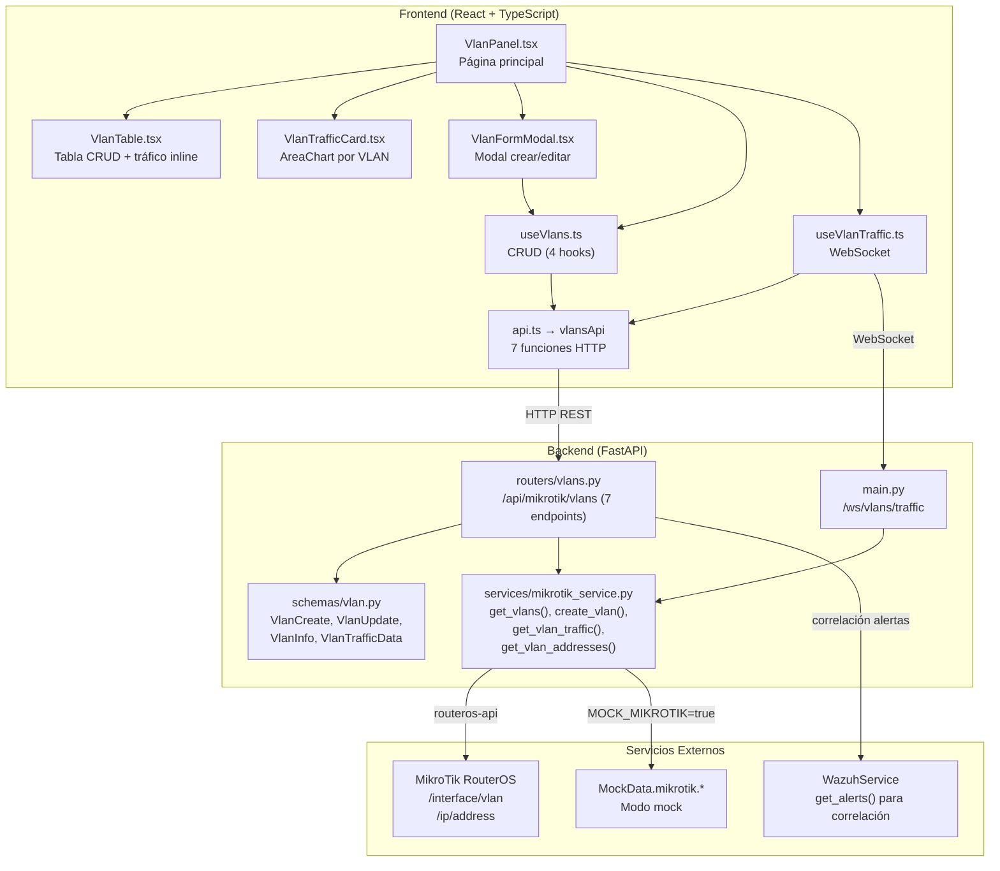
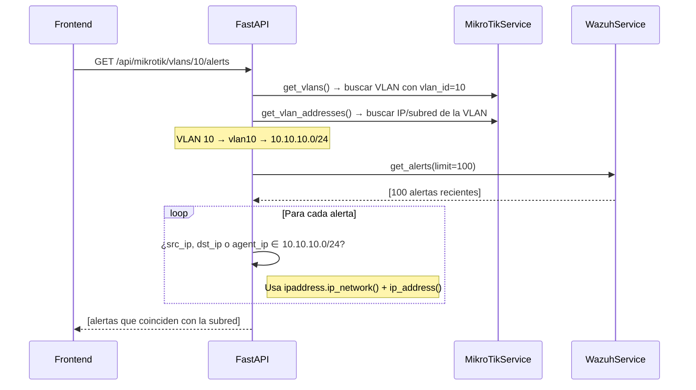
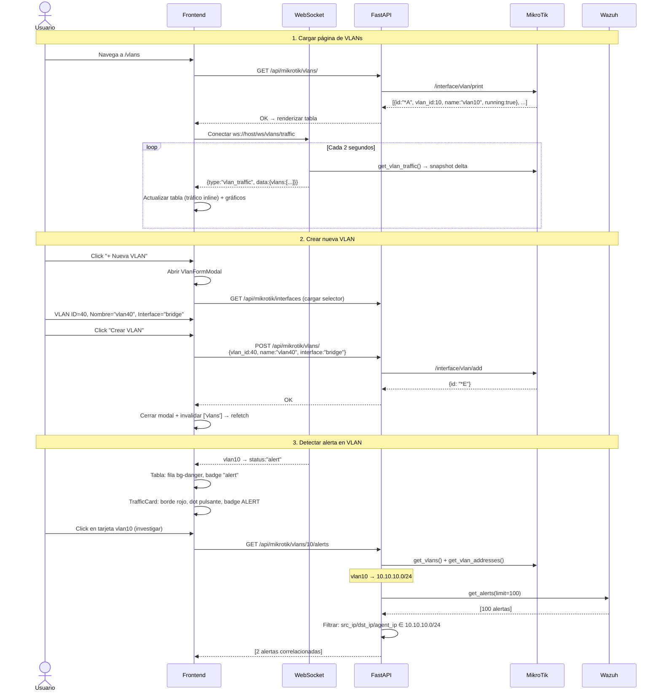

# Módulo VLANs — Documentación Funcional

## Descripción General

El módulo VLANs gestiona las **interfaces VLAN de MikroTik RouterOS** desde el dashboard. Permite listar, crear, editar y eliminar VLANs, monitorear el tráfico en tiempo real via WebSocket, y correlacionar alertas de seguridad por subred.

| Modo | Condición | Comportamiento |
|---|---|---|
| **Mock** (default) | `MOCK_MIKROTIK=true` o `MOCK_ALL=true` | Retorna 4 VLANs ficticias con tráfico simulado. No contacta MikroTik. |
| **Real** | `MOCK_MIKROTIK=false` | Opera contra RouterOS via `routeros-api`. CRUD real de interfaces VLAN. |

---

## Arquitectura General



---

## Backend

### 1. Servicio — `MikroTikService` (métodos VLAN)

**Archivo:** `backend/services/mikrotik_service.py`

Los métodos VLAN son parte del servicio singleton `MikroTikService`. Todas las llamadas a RouterOS pasan por `_api_call()`, que maneja threading, locks y reconexión.

#### Mock Guard

Cada método tiene mock guard al inicio:

```python
async def get_vlans(self) -> list[dict]:
    if self._settings.should_mock_mikrotik:
        from services.mock_data import MockData
        return MockData.mikrotik.vlans()
    return await self._api_call("/interface/vlan/print")
```

#### Métodos VLAN del servicio

| Método | API RouterOS | Descripción |
|---|---|---|
| `get_vlans()` | `/interface/vlan/print` | Lista todas las interfaces VLAN con estado, MTU, MAC, comentario. |
| `create_vlan(vlan_id, name, interface, comment)` | `/interface/vlan/add` | Crea interfaz VLAN con los parámetros dados. Retorna el ID interno de RouterOS. |
| `update_vlan(vlan_ros_id, name, comment)` | `/interface/vlan/set` | Actualiza nombre y/o comentario de una VLAN existente por su ID interno. |
| `delete_vlan(vlan_ros_id)` | `/interface/vlan/remove` | Elimina la interfaz VLAN por ID interno. |
| `get_vlan_traffic()` | Cálculo delta sobre `/interface/print` | Calcula bytes/segundo por VLAN usando dos snapshots separados por 1 segundo. |
| `get_vlan_addresses()` | `/ip/address/print` | Lista las direcciones IP asignadas a interfaces VLAN (para correlación con subredes). |

#### Cálculo de Tráfico (delta)

```python
async def get_vlan_traffic(self) -> list[dict]:
    # Snapshot 1
    interfaces_t0 = await self._api_call("/interface/print")
    await asyncio.sleep(1)
    # Snapshot 2
    interfaces_t1 = await self._api_call("/interface/print")

    # Delta = (bytes_t1 - bytes_t0) / elapsed_seconds
    for iface in vlan_interfaces:
        rx_bps = (t1.rx_byte - t0.rx_byte) / elapsed
        tx_bps = (t1.tx_byte - t0.tx_byte) / elapsed
```

El resultado incluye un campo `status` que puede ser `"ok"` o `"alert"` (determinado por el WebSocket mock basado en el tick actual).

---

### 2. Endpoints REST — `routers/vlans.py`

**Prefijo:** `/api/mikrotik/vlans` | **Total:** 7 endpoints

| Método | Ruta | Descripción | Params |
|---|---|---|---|
| `GET` | `/` | Listar todas las VLANs configuradas | — |
| `POST` | `/` | Crear nueva VLAN | Body: `VlanCreate` |
| `PUT` | `/{vlan_id}` | Actualizar nombre/comentario de VLAN | `vlan_id`: ID interno RouterOS (ej: `*A`) |
| `DELETE` | `/{vlan_id}` | Eliminar VLAN | `vlan_id`: ID interno RouterOS |
| `GET` | `/traffic/all` | Tráfico en tiempo real de todas las VLANs | — |
| `GET` | `/{vlan_id}/traffic` | Tráfico de una VLAN específica por VLAN ID numérico | `vlan_id`: int (ej: `10`) |
| `GET` | `/{vlan_id}/alerts` | Alertas Wazuh correlacionadas con la subred de la VLAN | `vlan_id`: int |

> [!NOTE]
> Los endpoints de tráfico usan `vlan_id` como entero (el número de VLAN: 10, 20, 99), mientras que CRUD usa el ID interno de RouterOS (ej: `*A`, `*B`). Son identificadores distintos.

#### Endpoint `/alerts` — Correlación VLAN ↔ Wazuh

Este endpoint es el más complejo del módulo. Correlaciona alertas de seguridad con una VLAN específica:



---

### 3. Schemas Pydantic — `schemas/vlan.py`

#### `VlanCreate`

| Campo | Tipo | Validación |
|---|---|---|
| `vlan_id` | `int` | 1-4094 (rango IEEE 802.1Q) |
| `name` | `str` | min 1 char, max 64 chars |
| `interface` | `str` | min 1 char (nombre de interfaz padre, ej: `bridge`) |
| `comment` | `str` | Default: `""` |

#### `VlanUpdate`

| Campo | Tipo | Descripción |
|---|---|---|
| `name` | `str \| None` | Nuevo nombre (opcional) |
| `comment` | `str \| None` | Nuevo comentario (opcional) |

#### `VlanInfo`

| Campo | Tipo | Descripción |
|---|---|---|
| `id` | `str` | ID interno RouterOS (ej: `*A`) |
| `vlan_id` | `int` | Número de VLAN (10, 20, 99) |
| `name` | `str` | Nombre de la interfaz |
| `interface` | `str` | Interfaz padre |
| `running` | `bool` | ¿Está activa? |
| `disabled` | `bool` | ¿Está deshabilitada? |
| `mtu` | `int` | MTU (default: 1500) |
| `mac_address` | `str` | MAC de la interfaz |
| `comment` | `str` | Comentario descriptivo |

#### `VlanTrafficData`

| Campo | Tipo | Descripción |
|---|---|---|
| `vlan_id` | `int` | Número de VLAN |
| `name` | `str` | Nombre de la interfaz |
| `rx_bps` | `float` | Bytes por segundo de recepción |
| `tx_bps` | `float` | Bytes por segundo de transmisión |
| `status` | `str` | `"ok"` \| `"alert"` |

---

### 4. WebSocket — Tráfico en Tiempo Real

**Endpoint:** `ws://host/ws/vlans/traffic`

Emite cada **2 segundos** el tráfico de todas las VLANs:

```json
{
  "type": "vlan_traffic",
  "data": {
    "vlans": [
      {"vlan_id": 10, "name": "vlan10", "rx_bps": 4200000, "tx_bps": 1800000, "status": "ok"},
      {"vlan_id": 20, "name": "vlan20", "rx_bps": 1500000, "tx_bps": 600000, "status": "ok"},
      {"vlan_id": 99, "name": "vlan99", "rx_bps": 0, "tx_bps": 0, "status": "ok"}
    ],
    "timestamp": "2026-04-13T14:30:00"
  }
}
```

En modo mock, `MockData.websocket.vlan_traffic_tick(tick)` genera tráfico con ±12% de jitter por VLAN. VLAN 99 (Cuarentena) siempre reporta 0 bps. Entre ticks 10-24 del ciclo de 40, `vlan10` entra en `status: "alert"` para simular una alerta.

---

## Frontend

### 5. Estructura de Archivos

```
frontend/src/
├── components/vlans/
│   ├── VlanPanel.tsx          ← Página principal (105 líneas)
│   ├── VlanTable.tsx          ← Tabla CRUD + tráfico inline (178 líneas)
│   ├── VlanTrafficCard.tsx    ← AreaChart por VLAN, colapsable (207 líneas)
│   └── VlanFormModal.tsx      ← Modal crear/editar (194 líneas)
├── hooks/
│   ├── useVlans.ts            ← 4 hooks: list, create, update, delete (65 líneas)
│   └── useVlanTraffic.ts      ← WebSocket con buffer de 60 muestras (77 líneas)
└── services/
    └── api.ts → vlansApi      ← 7 funciones HTTP
```

### 6. Navegación y Rutas

```
/vlans → VlanPanel (página completa, sin sub-rutas ni tabs)
```

Ubicación en sidebar: grupo **"Red e IPs"**, ícono `Layers`.

---

### 7. Página: `VlanPanel.tsx`

**Ruta:** `/vlans`

**Hooks utilizados:**
- `useVlans()` — lista de VLANs (polling cada 10s)
- `useVlanTraffic(60)` — WebSocket con historial de 60 muestras por VLAN

**Layout:**

```
┌─ Header: 🔲 VLANs ──────────────── [●/○ En vivo / Desconectado] [+ Nueva VLAN] ─┐
├─ VlanTable ───────────────────────────────────────────────────────────────────────┤
│  VLAN ID │ Nombre │ Interfaz │ Estado │ Tráfico Actual │ Acciones                │
│  10      │ vlan10 │ bridge   │ running│ ↓4.2Mbps ↑1.8M│ ✏️ 🗑️                  │
│  20      │ vlan20 │ bridge   │ running│ ↓1.5Mbps ↑0.6M│ ✏️ 🗑️                  │
│  99      │ vlan99 │ bridge   │ stopped│ —              │ ✏️ 🗑️                  │
├─ Tráfico en Tiempo Real por VLAN ─────────────────────────────────────────────────┤
│  ┌─ vlan10 ● VLAN 10 ──── ↓4.2Mbps ↑1.8Mbps ──── [Ocultar ▲] ──┐              │
│  │  [AreaChart: RX verde + TX violeta, 200px alto]                │              │
│  └────────────────────────────────────────────────────────────────┘              │
│  ┌─ vlan20 ● VLAN 20 ──── ↓1.5Mbps ↑0.6Mbps ──── [Ocultar ▲] ──┐              │
│  │  [AreaChart: RX verde + TX violeta]                            │              │
│  └────────────────────────────────────────────────────────────────┘              │
└──────────────────────────────────────────────────────────────────────────────────┘
```

---

### 8. Componente: `VlanTable`

Tabla con columnas: VLAN ID, Nombre, Interfaz, Estado, Tráfico Actual, Acciones.

**Indicadores visuales:**
- **Estado running** → badge `badge-success` con fondo `bg-success/[0.04]` en la fila
- **Estado alert** → badge `badge-danger` con fondo `bg-danger/[0.08]` en la fila
- **Estado stopped** → badge `badge-low`

**Tráfico inline:**
- `↓` en verde (`text-success`) para RX
- `↑` en violeta (`text-brand-400`) para TX
- Formateado con `formatBps()`: bps → Kbps → Mbps

**Acciones por fila:**
- ✏️ **Editar** → abre `VlanFormModal` en modo edición
- 🗑️ **Eliminar** → confirmación doble-click (primer click → botón cambia a rojo `btn-danger` con texto "¿Seguro?", auto-reset 3s)

**Status message** → toast temporal (4s) success/error en el header de la tabla.

---

### 9. Componente: `VlanTrafficCard`

**Propósito:** Gráfico de tráfico RX/TX por VLAN con historial de hasta 60 muestras (≈2 minutos).

**Características:**
- **Colapsable** con estado persistido en `localStorage` (`netshield_vlan_collapsed_{vlanId}`)
- **Header siempre visible:** dot de estado (verde/rojo pulsante) + nombre + rates actuales + botón Mostrar/Ocultar
- **Badge ALERT** visible cuando `latestStatus === "alert"`
- **Borde rojo** con sombra cuando en alerta: `border-danger/40 bg-danger/[0.06]`

**Gráfico (Recharts):**
- `AreaChart` con `ResponsiveContainer`, 200px alto
- **RX:** línea sólida verde `#22c55e` con gradiente de relleno
- **TX:** línea discontinua violeta `#818cf8` con gradiente de relleno
- Eje X: segundos (cada muestra ≈ 2s)
- Eje Y: Mbps con 1 decimal
- Tooltip oscuro glassmorphism con formato `X.XXX Mbps`

---

### 10. Componente: `VlanFormModal`

**Propósito:** Modal para crear o editar una VLAN.

**Modo creación:**
- Campos: VLAN ID (1-4094), Nombre, Interfaz (selector dinámico), Comentario
- El selector de interfaz carga las interfaces disponibles con `useQuery(['mikrotik-interfaces'])` solo cuando el modal está abierto (`enabled: isOpen`)
- Botón "Crear VLAN" deshabilitado si algún campo requerido está vacío

**Modo edición:**
- VLAN ID e Interfaz deshabilitados (no modificables)
- Nota: "El VLAN ID no se puede cambiar una vez creado"
- Solo nombre y comentario son editables
- Botón "Guardar Cambios"

**On success:** cierra modal + invalida query `['vlans']`.

---

### 11. Custom Hooks

#### `useVlans()` — Lista con polling

```typescript
useQuery({
    queryKey: ['vlans'],
    queryFn: vlansApi.getVlans,
    refetchInterval: 10000,  // Polling cada 10 segundos
});
```

#### `useCreateVlan()` — Creación

```typescript
useMutation({
    mutationFn: (data) => vlansApi.createVlan(data),
    onSuccess: () => invalidateQueries(['vlans']),
});
```

#### `useUpdateVlan()` — Actualización

```typescript
useMutation({
    mutationFn: ({ vlanId, data }) => vlansApi.updateVlan(vlanId, data),
    onSuccess: () => invalidateQueries(['vlans']),
});
```

#### `useDeleteVlan()` — Eliminación

```typescript
useMutation({
    mutationFn: (vlanId) => vlansApi.deleteVlan(vlanId),
    onSuccess: () => invalidateQueries(['vlans']),
});
```

#### `useVlanTraffic(maxHistory)` — WebSocket

```typescript
export function useVlanTraffic(maxHistory = 60) {
    // Conecta a ws://host/ws/vlans/traffic
    // Mantiene buffer circular de maxHistory muestras por VLAN ID
    // Reconexión automática con backoff exponencial: 1s → 2s → 4s → max 30s

    return {
        isConnected,          // boolean — estado del WebSocket
        trafficByVlan,        // Record<number, VlanTrafficData[]> — historial por VLAN
        latestTraffic,        // VlanTrafficData[] — último snapshot de todas las VLANs
    };
}
```

**Formato de mensaje esperado:**
```typescript
interface VlanTrafficWSMessage {
    type: "vlan_traffic";
    data: {
        vlans: VlanTrafficData[];
        timestamp: string;
    };
}
```

---

## Flujo de Datos Completo



---

## Modo Mock

Cuando `MOCK_MIKROTIK=true`:

| Dato Mock | Contenido |
|---|---|
| `MockData.mikrotik.vlans()` | 4 VLANs: 10 (Docentes, running), 20 (Estudiantes, running), 30 (Servidores, running), 99 (Cuarentena, stopped) |
| `MockData.mikrotik.vlan_traffic()` | 4 entradas: VLAN 10 ≈ 4.2 Mbps, VLAN 20 ≈ 1.5 Mbps, VLAN 30 ≈ 0.8 Mbps, VLAN 99 = 0 bps |
| `MockData.mikrotik.vlan_addresses()` | 4 subredes: 10.10.10.0/24, 10.10.20.0/24, 10.10.30.0/24, 10.99.99.0/24 |
| `MockData.websocket.vlan_traffic_tick(tick)` | Tráfico dinámico con ±12% jitter. VLAN 10 entra en alert entre ticks 10-24/40 |

---

## Casos de Uso

### CU-1: Monitorear tráfico en tiempo real de todas las VLANs

**Actor:** Técnico de redes

1. Navega a **Red e IPs → VLANs**
2. La tabla muestra 4 VLANs con tráfico inline actualizado cada 2 segundos
3. Debajo, las `VlanTrafficCard` muestran gráficos de área con historial de ~2 minutos
4. El indicador `● En vivo` confirma que el WebSocket está activo

---

### CU-2: Crear VLAN para nuevo segmento de red

**Actor:** Administrador de red

1. Click **"+ Nueva VLAN"** → se abre `VlanFormModal`
2. Ingresa: VLAN ID `40`, Nombre `vlan40`, Interfaz `bridge`, Comentario `"Lab CiberSec"`
3. Click **"Crear VLAN"**
4. La VLAN aparece en la tabla inmediatamente (refetch automático)
5. El gráfico de tráfico comienza a mostrar datos en unos segundos

---

### CU-3: Detectar y responder a alerta en una VLAN

**Actor:** Técnico de redes

1. Observa que la fila de `vlan10` cambia a fondo rojo y muestra badge **"alert"**
2. La `VlanTrafficCard` de `vlan10` muestra borde rojo y dot pulsante con badge **ALERT**
3. Navega al endpoint de alertas (futuro: click en la tarjeta para ver detalle)
4. Ve 2 alertas Wazuh de tipo brute-force desde IPs en la subred `10.10.10.0/24`
5. Procede a bloquear la IP atacante desde el módulo Firewall

---

### CU-4: Editar nombre descriptivo de una VLAN

**Actor:** Administrador de red

1. En la tabla, click ✏️ en `vlan20`
2. Se abre `VlanFormModal` en modo edición (VLAN ID e interfaz deshabilitados)
3. Cambia nombre a `"VLAN-Estudiantes-v2"`, comentario a `"Migración Q2"`
4. Click **"Guardar Cambios"**
5. La tabla se actualiza con el nuevo nombre

---

### CU-5: Eliminar VLAN obsoleta

**Actor:** Administrador de red

1. En la tabla, click 🗑️ en `vlan99 (Cuarentena)`
2. El botón cambia a rojo con texto **"¿Seguro?"** (3 segundos para confirmar)
3. Click nuevamente → se ejecuta la eliminación
4. Toast: `"VLAN vlan99 eliminada correctamente"` (4 segundos)
5. La VLAN desaparece de la tabla y del gráfico

---

## Archivos Involucrados

### Backend

| Archivo | Rol |
|---|---|
| [vlans.py](file:///home/nivek/Documents/netShield2/backend/routers/vlans.py) | 7 endpoints REST bajo `/api/mikrotik/vlans` (192 líneas) |
| [vlan.py](file:///home/nivek/Documents/netShield2/backend/schemas/vlan.py) | `VlanCreate`, `VlanUpdate`, `VlanInfo`, `VlanTrafficData` (48 líneas) |
| [mikrotik_service.py](file:///home/nivek/Documents/netShield2/backend/services/mikrotik_service.py) | `get_vlans()`, `create_vlan()`, `update_vlan()`, `delete_vlan()`, `get_vlan_traffic()`, `get_vlan_addresses()` |
| [main.py](file:///home/nivek/Documents/netShield2/backend/main.py) | WebSocket `/ws/vlans/traffic` |
| [mock_data.py](file:///home/nivek/Documents/netShield2/backend/services/mock_data.py) | `MockData.mikrotik.vlans()`, `.vlan_traffic()`, `.vlan_addresses()`, `MockData.websocket.vlan_traffic_tick()` |

### Frontend

| Archivo | Rol |
|---|---|
| [VlanPanel.tsx](file:///home/nivek/Documents/netShield2/frontend/src/components/vlans/VlanPanel.tsx) | Página principal: header + tabla + gráficos + modal (105 líneas) |
| [VlanTable.tsx](file:///home/nivek/Documents/netShield2/frontend/src/components/vlans/VlanTable.tsx) | Tabla CRUD con tráfico inline y confirmación doble-click (178 líneas) |
| [VlanTrafficCard.tsx](file:///home/nivek/Documents/netShield2/frontend/src/components/vlans/VlanTrafficCard.tsx) | AreaChart colapsable por VLAN con alerta visual (207 líneas) |
| [VlanFormModal.tsx](file:///home/nivek/Documents/netShield2/frontend/src/components/vlans/VlanFormModal.tsx) | Modal crear/editar VLAN con selector de interfaces dinámico (194 líneas) |
| [useVlans.ts](file:///home/nivek/Documents/netShield2/frontend/src/hooks/useVlans.ts) | 4 hooks: `useVlans` (polling 10s), `useCreateVlan`, `useUpdateVlan`, `useDeleteVlan` (65 líneas) |
| [useVlanTraffic.ts](file:///home/nivek/Documents/netShield2/frontend/src/hooks/useVlanTraffic.ts) | WebSocket con buffer de 60 muestras y reconexión con backoff (77 líneas) |
| [api.ts](file:///home/nivek/Documents/netShield2/frontend/src/services/api.ts) → `vlansApi` | 7 funciones HTTP: `getVlans`, `createVlan`, `updateVlan`, `deleteVlan`, `getAllTraffic`, `getVlanTraffic`, `getVlanAlerts` |
| [types.ts](file:///home/nivek/Documents/netShield2/frontend/src/types.ts) | `VlanInfo`, `VlanTrafficData`, `VlanTrafficWSMessage` |
