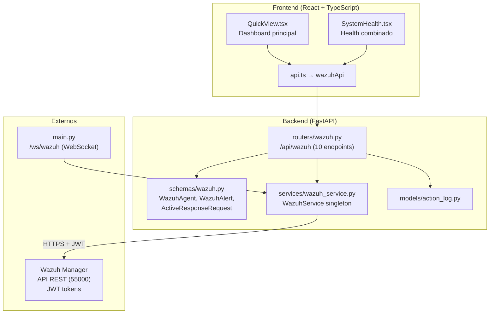
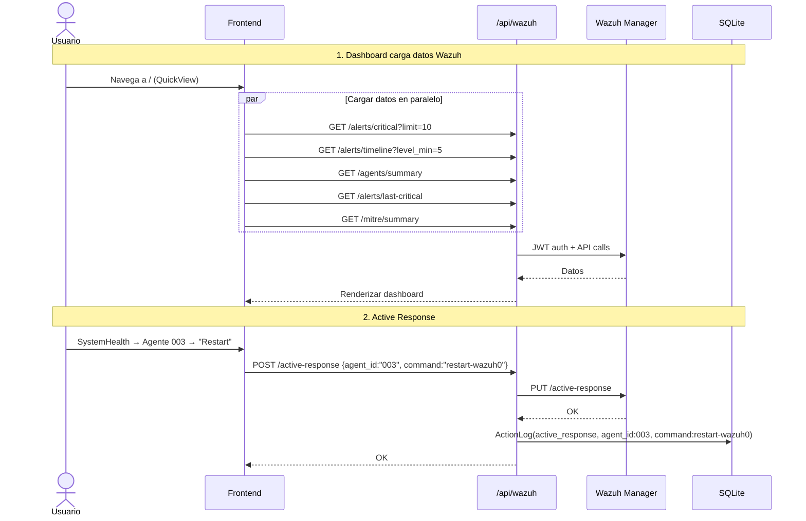

# Módulo Wazuh SIEM — Documentación Funcional

## Descripción General

El módulo Wazuh integra el **SIEM** (Security Information and Event Management) con el dashboard. Proporciona visibilidad sobre **agentes de seguridad**, **alertas en tiempo real**, **técnicas MITRE ATT&CK**, **timeline de actividad**, y **active response** para ejecución de comandos en agentes. Los datos de Wazuh también alimentan otros módulos (Suricata alertas filtradas, CrowdSec contexto IP, GLPI health, Phishing alertas, Network GlobalSearch).

| Modo | Condición | Comportamiento |
|---|---|---|
| **Mock** (default) | `MOCK_WAZUH=true` o `MOCK_ALL=true` | Retorna 5 agentes, ~30 alertas, técnicas MITRE ficticias. |
| **Real** | `MOCK_WAZUH=false` | Conecta a Wazuh Manager API (HTTPS, `verify=False` en lab). JWT auth. |

---

## Arquitectura General



---

## Backend

### 1. Servicio — `WazuhService` (singleton)

**Archivo:** `backend/services/wazuh_service.py`

**Patrón:** Singleton con `get_wazuh_service()`. Usa `httpx.AsyncClient` con `verify=False` (lab). JWT token refresh automático. Retry con `tenacity`.

**Métodos principales:**

| Método | Wazuh API Endpoint | Descripción |
|---|---|---|
| `get_agents()` | `GET /agents` | Lista todos los agentes con status, OS, IP, grupos. |
| `get_alerts(limit, level_min, offset)` | `GET /alerts` | Alertas recientes con filtros de severidad y paginación. |
| `get_alerts_by_agent(agent_id, limit, offset)` | `GET /alerts?agent_id=X` | Alertas filtradas por agente específico. |
| `get_critical_alerts(limit, offset)` | `GET /alerts` + level > 10 | Alertas críticas con MITRE ATT&CK enrichment. |
| `get_alerts_timeline(level_min)` | Computed | Conteo de alertas por minuto, últimos 60 minutos. |
| `get_last_critical_alert()` | Computed | Última alerta con level > 10 (para dashboard). |
| `get_top_agents(limit)` | Computed | Top N agentes con más alertas + MITRE technique. |
| `get_agents_summary()` | `GET /agents/summary/status` | Conteo por status: active, disconnected, never_connected. |
| `get_mitre_summary()` | Computed | Técnicas MITRE detectadas agrupadas por frecuencia. Fallback a `rule_groups`. |
| `get_health()` | `GET /manager/status` | Salud del manager: servicios, versión, cluster status. |
| `send_active_response(agent_id, command, args)` | `PUT /active-response` | Ejecutar comando en agente (ej: `firewall-drop0`, `restart-wazuh0`). |

---

### 2. Endpoints REST — `routers/wazuh.py`

**Prefijo:** `/api/wazuh` | **Total:** 10 endpoints

#### Agentes

| Método | Ruta | Descripción | Params |
|---|---|---|---|
| `GET` | `/agents` | Listar todos los agentes. | — |
| `GET` | `/agents/summary` | Conteo por status (active/disconnected/never_connected). | — |
| `GET` | `/agents/top` | Top N agentes con más alertas. | `limit` (1-100, default 10) |

#### Alertas

| Método | Ruta | Descripción | Params |
|---|---|---|---|
| `GET` | `/alerts` | Alertas recientes con filtros. | `limit` (1-500), `level_min` (1-15), `offset` |
| `GET` | `/alerts/agent/{agent_id}` | Alertas por agente específico. | `agent_id`, `limit`, `offset` |
| `GET` | `/alerts/critical` | Alertas críticas (level > 10) con MITRE ATT&CK. | `limit`, `offset` |
| `GET` | `/alerts/timeline` | Alertas por minuto (últimos 60 min). Para gráfico de spikes. | `level_min` (default 5) |
| `GET` | `/alerts/last-critical` | Última alerta crítica (para stat card del dashboard). | — |

#### MITRE & Health

| Método | Ruta | Descripción |
|---|---|---|
| `GET` | `/mitre/summary` | Técnicas MITRE detectadas con frecuencia. Fallback a rule_groups. |
| `GET` | `/health` | Status del Wazuh Manager: servicios, versión, cluster. |

#### Active Response

| Método | Ruta | Descripción | ActionLog |
|---|---|---|---|
| `POST` | `/active-response` | Ejecutar comando en agente Wazuh. | `active_response` |

---

### 3. Schemas Pydantic — `schemas/wazuh.py`

| Schema | Campos | Uso |
|---|---|---|
| `WazuhAgent` | `id`, `name`, `ip`, `status`, `os_name`, `os_version`, `manager`, `node_name`, `group[]`, `last_keep_alive`, `date_add` | Información de agente |
| `WazuhAlert` | `id`, `timestamp`, `agent_id`, `agent_name`, `agent_ip`, `rule_id`, `rule_level`, `rule_description`, `rule_groups[]`, `full_log`, `src_ip`, `dst_ip`, `location` | Alerta/evento |
| `ActiveResponseRequest` | `agent_id`, `command`, `args[]`, `alert?` | Acción sobre agente |

---

### 4. WebSocket — `/ws/wazuh`

Emite alertas nuevas en tiempo real cada **5 segundos**:

```json
{
  "type": "wazuh_alerts",
  "data": {
    "alerts": [
      {
        "rule_level": 12,
        "rule_description": "SSH brute force attack",
        "agent_name": "Ubuntu-PC",
        "src_ip": "45.12.34.5",
        "timestamp": "2026-04-15T14:30:00"
      }
    ],
    "timestamp": "2026-04-15T14:30:05"
  }
}
```

---

## Frontend

### 5. Estructura de Archivos

Wazuh no tiene carpeta `/components/wazuh/` propia — sus datos se consumen en:

```
frontend/src/
├── components/security/
│   └── QuickView.tsx           ← Dashboard principal: alertas, timeline, MITRE
├── components/system/
│   └── SystemHealth.tsx        ← Health: Wazuh manager status + MikroTik health
├── components/dashboard/
│   └── (componentes del dashboard)
├── hooks/
│   ├── useWazuhAlerts.ts       ← Alertas (polling)
│   ├── useWazuhAgents.ts       ← Agentes
│   └── useWebSocket.ts         ← Hook base para WebSocket
└── services/
    └── api.ts → wazuhApi       ← 10 funciones HTTP
```

### 6. Navegación

Wazuh no tiene ruta dedicada — se integra en:
- `/` → `QuickView`: alertas timeline, alertas críticas, stat cards, MITRE summary
- `/system` → `SystemHealth`: estado del manager, agentes summary

### 7. Integración en QuickView (Dashboard Principal)

```
┌─ NetShield Security Overview ────────────────────────────────────────────────── ┐
│  ┌── Stat Cards ─────────────────────────────────────────────────────────────┐ │
│  │  [Alertas Totales: 156]  [Críticas: 8]  [Agentes: 5/5 ✅]  [Top: SSH-bf]│ │
│  └──────────────────────────────────────────────────────────────────────────┘ │
│  ┌── Timeline de Alertas (60 min) ──────────────────────────────────────────┐ │
│  │  [BarChart: alertas por minuto, barras rojas en spikes]                   │ │
│  └──────────────────────────────────────────────────────────────────────────┘ │
│  ┌── Alertas Críticas Recientes ────────── ┌── MITRE ATT&CK ──────────────┐ │
│  │  time │ agent │ description │ level     │  │ T1110: Brute Force    █████ │ │
│  │  14:30│ Ubuntu│ SSH brute   │ 12        │  │ T1046: Net Discovery  ███   │ │
│  │  14:28│ Win-PC│ Malware det │ 14        │  │ T1003: Credential Dmp ██    │ │
│  └──────────────────────────────────────── └────────────────────────────────┘ │
└──────────────────────────────────────────────────────────────────────────────── ┘
```

---

## Flujo de Datos Completo



---

## Modo Mock

| Dato Mock | Contenido |
|---|---|
| `MockData.wazuh.agents()` | 5 agentes: 000 (Wazuh-Manager), 001 (MikroTik-CHR), 002 (Debian-Server), 003 (Ubuntu-PC), 004 (Win-PC) |
| `MockData.wazuh.alerts()` | ~30 alertas: SSH brute force, malware detection, policy violation, etc. |
| `MockData.wazuh.critical_alerts()` | 8 alertas con level ≥ 12. MITRE enrichment. |
| `MockData.wazuh.timeline()` | 60 minutos de datos con picos simulados. |
| `MockData.wazuh.top_agents()` | Ranking: Ubuntu-PC (25 alerts), Win-PC (18), Debian-Server (12). |
| `MockData.wazuh.agents_summary()` | {active: 4, disconnected: 1, never_connected: 0, total: 5} |
| `MockData.wazuh.mitre_summary()` | 5 técnicas: T1110, T1046, T1003, T1059, T1071 |
| `MockData.wazuh.health()` | Manager running, version 4.7.0, cluster disabled |

---

## Dependencias Cross-Service

Wazuh es proveedor de datos para múltiples módulos:

| Módulo consumidor | Uso de datos Wazuh |
|---|---|
| **Suricata** | `get_alerts(rule_groups="suricata")` — alertas IDS filtradas |
| **GLPI Health** | `get_agents()` — correlación agente IP ↔ asset IP |
| **CrowdSec IP Context** | `get_alerts(src_ip=X)` — alertas para contexto de IP |
| **Network GlobalSearch** | `get_agents()` + `get_alerts()` — matching por IP/nombre |
| **Phishing** | `get_alerts(rule_groups="phishing")` — detección de dominios |
| **VLANs Alerts** | `get_alerts(limit=100)` — correlación por subred |

---

## Casos de Uso

### CU-1: Monitorear postura de seguridad

**Actor:** Analista de seguridad
1. Navega al Dashboard (`/`)
2. Stat cards muestran 156 alertas, 8 críticas, 5/5 agentes activos
3. Timeline muestra pico de alertas hace 15 minutos
4. Alertas críticas: SSH brute force desde `45.12.34.5`

### CU-2: Investigar agente con problemas

**Actor:** Técnico de seguridad
1. `/system` → ve agente 004 (Win-PC) como "disconnected"
2. Consulta `GET /agents/top` → Win-PC tenía 18 alertas antes de desconectarse
3. `GET /alerts/agent/004` → últimas alertas: "Malware detection"
4. Decide reiniciar agente: `POST /active-response {agent_id:"004", command:"restart-wazuh0"}`

### CU-3: Analizar técnicas MITRE detectadas

**Actor:** Analista de seguridad
1. Dashboard → sección MITRE ATT&CK
2. `T1110 Brute Force` domina con 25 detecciones
3. Cross-reference con CrowdSec → IPs atacantes coinciden
4. Ejecuta Full Remediation en las IPs top

---

## Archivos Involucrados

### Backend

| Archivo | Rol |
|---|---|
| [wazuh.py](file:///home/nivek/Documents/netShield2/backend/routers/wazuh.py) | 10 endpoints REST (253 líneas) |
| [wazuh.py](file:///home/nivek/Documents/netShield2/backend/schemas/wazuh.py) | `WazuhAgent`, `WazuhAlert`, `ActiveResponseRequest` (51 líneas) |
| [wazuh_service.py](file:///home/nivek/Documents/netShield2/backend/services/wazuh_service.py) | Singleton con JWT auth, httpx, verify=False |
| [main.py](file:///home/nivek/Documents/netShield2/backend/main.py) | WebSocket `/ws/wazuh` |
| [mock_data.py](file:///home/nivek/Documents/netShield2/backend/services/mock_data.py) | `MockData.wazuh.*` (8 generadores) |

### Frontend

| Archivo | Rol |
|---|---|
| [QuickView.tsx](file:///home/nivek/Documents/netShield2/frontend/src/components/security/QuickView.tsx) | Dashboard: alertas, timeline, MITRE, stat cards |
| [SystemHealth.tsx](file:///home/nivek/Documents/netShield2/frontend/src/components/system/SystemHealth.tsx) | Health: manager status, agentes |
| [api.ts](file:///home/nivek/Documents/netShield2/frontend/src/services/api.ts) → `wazuhApi` | 10 funciones HTTP |
| [types.ts](file:///home/nivek/Documents/netShield2/frontend/src/types.ts) | `WazuhAgent`, `WazuhAlert`, `MitreTechnique`, `AlertsTimeline` |
