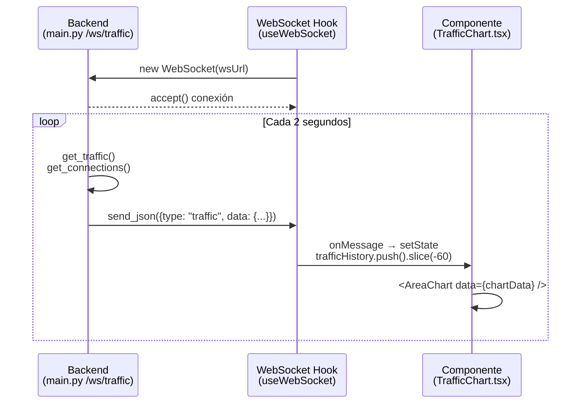

# Frontend — NetShield Dashboard

## Estructura de componentes

```
frontend/src/
├── main.tsx                           # Entry point, monta App en #root
├── App.tsx                            # QueryClientProvider + BrowserRouter + Routes (19 rutas)
├── index.css                          # Design system completo (TailwindCSS v4 + clases custom)
├── types.ts                           # Tipos TypeScript (~1600 líneas, espejo de schemas Pydantic)
│
├── services/
│   └── api.ts                         # Cliente Axios centralizado (~2000 líneas, 15+ namespaces)
│                                      # Namespaces: mikrotikApi, wazuhApi, networkApi, reportsApi,
│                                      # securityApi, vlanApi, phishingApi, portalApi, glpiApi,
│                                      # crowdsecApi, geoipApi, suricataApi, telegramApi,
│                                      # viewsApi, widgetsApi
│
├── config/
│   └── themes.ts                      # Lista de temas disponibles (colores, metadata light/dark)
│
├── lib/
│   └── countryCodeMap.ts              # Mapa {CountryName → ISO2} para banderas emoji
│
├── hooks/
│   ├── useWebSocket.ts                # Hook base: reconexión con backoff exponencial
│   ├── useTheme.ts                    # Gestión de temas: localStorage + CSS vars
│   │
│   │   # — Data hooks (38 hooks, uno por fuente de datos) —
│   ├── useWazuhSummary.ts             # Alertas + agents + MITRE summary
│   ├── useMikrotikHealth.ts           # Health del router
│   ├── useCrowdSecDecisions.ts        # Decisions CRUD + mutations
│   ├── useCrowdSecMetrics.ts          # Métricas del motor CrowdSec
│   ├── useCrowdSecAlerts.ts           # Alertas del LAPI
│   ├── useGeoIP.ts                    # Lookup individual con staleTime 1h
│   ├── useTopCountries.ts             # Top países atacantes
│   ├── useGeoBlockSuggestions.ts      # Sugerencias geo-block + apply mutation
│   ├── useSuricataEngine.ts           # Status + stats + reload mutation
│   ├── useSuricataAlerts.ts           # Alertas + timeline + top firmas + WebSocket
│   ├── useSuricataFlows.ts            # Flows + DNS + HTTP + TLS
│   ├── useSuricataRules.ts            # Rules + toggle + update mutations
│   ├── useSuricataAutoResponse.ts     # Config + history + trigger mutation
│   ├── useSuricataCorrelation.ts      # CrowdSec × Wazuh correlation
│   ├── useGlpiAssets.ts               # Assets CRUD + stats + health + quarantine
│   ├── useGlpiTickets.ts              # Tickets CRUD
│   ├── useGlpiUsers.ts               # Users lista
│   ├── useGlpiHealth.ts              # Health correlacionada
│   ├── usePortalSessions.ts           # Sessions + WebSocket
│   ├── usePortalUsers.ts              # Users CRUD + bulk import
│   ├── usePortalConfig.ts             # Config + schedule + setup
│   ├── usePortalStats.ts              # Stats históricas
│   ├── usePhishing.ts                 # Alertas + víctimas + sinkhole CRUD
│   ├── useSecurityActions.ts          # Block, quarantine, geo-block mutations
│   ├── useSecurityAlerts.ts           # WebSocket /ws/security/alerts + notificaciones
│   ├── useVlans.ts                    # VLANs CRUD
│   ├── useVlanTraffic.ts              # WebSocket /ws/vlans/traffic
│   ├── useIpContext.ts                # CTI CrowdSec + GeoIP lookup combinado
│   ├── useNetworkSearch.ts            # Búsqueda global con debounce
│   ├── useSyncStatus.ts              # Estado sync CrowdSec → MikroTik
│   ├── useCustomViews.ts             # Views CRUD
│   ├── useWidgetCatalog.ts            # Catálogo de widgets por categoría
│   ├── useTelegramStatus.ts           # Estado del bot (refetch 30s)
│   ├── useTelegramConfigs.ts          # Configs CRUD + trigger + test
│   ├── useTelegramLogs.ts             # Historial de mensajes con filtros
│   └── useQrScanner.ts               # Cámara + QR decode (estado local, sin API)
│   │
│   └── widgets/                       # Hooks de datos para widgets del catálogo
│       ├── visual/index.ts            # 7 hooks: ThreatGauge, ActivityHeatmap, NetworkPulse, etc.
│       ├── technical/index.ts         # 8 hooks: PacketInspector, FlowTable, LiveLogs, etc.
│       └── hybrid/index.ts            # 9 hooks: WorldThreatMap, ConfirmedThreats, CountryRadar, etc.
│
└── components/
    ├── Layout.tsx                      # Sidebar glassmorphic 7 grupos + topbar + GlobalSearch + Notifications
    │
    ├── common/
    │   ├── MockModeBadge.tsx           # Badge amarillo en topbar cuando hay servicios en mock
    │   ├── GlobalSearch.tsx            # Búsqueda global de IPs y hosts
    │   ├── ConfirmModal.tsx            # Modal de confirmación genérico
    │   ├── SettingsDrawer.tsx          # Panel lateral config: tema + fuente
    │   ├── ThemeCard.tsx               # Card preview de tema
    │   └── FontSizeSlider.tsx          # Slider tamaño de fuente
    │
    ├── security/
    │   ├── QuickView.tsx              # Vista principal ("/") — stats, tráfico, alertas, conexiones
    │   ├── ConfigView.tsx             # Config seguridad: blacklist, umbrales, geo-block, sinkhole
    │   ├── NotificationPanel.tsx      # Panel deslizable alertas en tiempo real multi-fuente
    │   └── LastIncidentCard.tsx       # Card del último incidente detectado
    │
    ├── dashboard/
    │   ├── DashboardPage.tsx          # Página principal legacy (reemplazada por QuickView)
    │   ├── TrafficChart.tsx           # Recharts AreaChart con datos WebSocket en vivo
    │   ├── ConnectionsTable.tsx       # Tabla filtrable de conexiones activas
    │   └── AlertsFeed.tsx             # Feed scrollable de alertas con badges severidad
    │
    ├── firewall/
    │   └── FirewallPage.tsx           # Bloqueo de IPs + tabla reglas + historial acciones
    │
    ├── network/
    │   └── NetworkPage.tsx            # Tabs: ARP / VLANs / Labels / Groups (con CRUD)
    │
    ├── vlans/
    │   ├── VlanPanel.tsx              # Panel principal con lista y estado de alerta
    │   ├── VlanTable.tsx              # Tabla CRUD de VLANs
    │   ├── VlanTrafficCard.tsx         # Card tráfico en tiempo real por VLAN (WebSocket)
    │   └── VlanFormModal.tsx           # Modal creación/edición de VLAN
    │
    ├── portal/                        # Portal Cautivo MikroTik Hotspot
    │   ├── PortalPage.tsx             # Contenedor tabbed (Monitor/Users/Profiles/Stats/Config)
    │   ├── MonitorView.tsx            # Monitoreo en tiempo real
    │   ├── SessionsTable.tsx          # Tabla sesiones activas
    │   ├── SessionsChart.tsx          # Gráfico de sesiones (Recharts LineChart)
    │   ├── StatsView.tsx              # Stats históricas
    │   ├── UsersView.tsx              # Gestión de usuarios
    │   ├── UserTable.tsx              # Tabla de usuarios con acciones inline
    │   ├── UserFormModal.tsx           # Modal creación/edición usuario
    │   ├── BulkImportModal.tsx         # Modal importación masiva (CSV/JSON)
    │   ├── SpeedProfiles.tsx           # Gestión perfiles velocidad
    │   ├── ConfigView.tsx             # Config general del hotspot
    │   ├── ScheduleConfig.tsx          # Horarios de acceso por día/hora
    │   └── UsageHeatmap.tsx            # Heatmap de uso por hora
    │
    ├── phishing/
    │   └── PhishingPanel.tsx          # Alertas, víctimas, sinkhole DNS, estadísticas
    │
    ├── system/
    │   ├── SystemHealth.tsx           # MikroTik + Wazuh + CrowdSec sync + GeoIP DB
    │   ├── RemoteCLI.tsx              # Terminal web RouterOS y Wazuh agent
    │   └── GeoIPStatus.tsx            # Estado de las bases de datos GeoLite2
    │
    ├── reports/                       # Reportes IA + Telegram
    │   ├── ReportsPage.tsx            # Tabs: Generador IA + Telegram
    │   ├── TelegramTab.tsx            # Contenedor de pestañas Telegram
    │   ├── TelegramStatusCard.tsx     # Estado del bot (online/offline)
    │   ├── TelegramConfigList.tsx      # Lista de reportes automáticos
    │   ├── TelegramConfigModal.tsx     # Modal creación/edición config
    │   ├── CronBuilder.tsx            # Selector visual de expresiones cron
    │   ├── MessagePreview.tsx          # Preview del mensaje antes de guardar
    │   ├── TelegramQuickActions.tsx    # Botones rápidos: prueba, resumen, alerta
    │   ├── TelegramHistory.tsx         # Historial de mensajes con filtros
    │   └── BotConversation.tsx         # Chat UI conversaciones inbound
    │
    ├── inventory/                     # GLPI ITSM
    │   ├── InventoryPage.tsx          # Contenedor tabbed (Assets/Tickets/Users/Health)
    │   ├── AssetsView.tsx             # Vista principal con kanban/grid/list
    │   ├── AssetDetail.tsx            # Detalle de activo + contexto red + alertas
    │   ├── AssetFormModal.tsx          # Modal creación/edición activo
    │   ├── AssetSearch.tsx            # Búsqueda de activos
    │   ├── AssetHealthTable.tsx        # Tabla salud correlacionada con Wazuh
    │   ├── HealthView.tsx             # Vista dedicada de salud
    │   ├── TicketsView.tsx            # Lista y gestión de tickets
    │   ├── TicketKanban.tsx           # Vista kanban por estado
    │   ├── TicketCard.tsx             # Card individual en kanban
    │   ├── TicketFormModal.tsx         # Modal creación/edición ticket
    │   ├── UsersView.tsx              # Lista usuarios GLPI
    │   ├── LocationMap.tsx            # Mapa de ubicaciones de activos
    │   └── QrScanner.tsx              # Scanner QR para identificar activos
    │
    ├── crowdsec/                      # Centro de Comando CrowdSec
    │   ├── CommandCenter.tsx          # Página principal: decisions, timeline, sync, top attackers
    │   ├── DecisionsTable.tsx         # Tabla decisions enriquecidas con GeoIP
    │   ├── DecisionsTimeline.tsx       # Timeline de últimas decisiones (WebSocket)
    │   ├── IntelligenceView.tsx        # Top countries, geo-block, heatmap, scenarios
    │   ├── TopAttackers.tsx           # Top IPs atacantes
    │   ├── CountryHeatmap.tsx          # Heatmap de intensidad por país
    │   ├── ScenariosTable.tsx          # Tabla de escenarios
    │   ├── IpContextPanel.tsx          # Perfil IP: GeoIP + CTI + alertas
    │   ├── CommunityScoreBadge.tsx     # Badge score reputación CrowdSec
    │   ├── BouncerStatus.tsx          # Estado de bouncers
    │   ├── SyncStatusBanner.tsx        # Banner sync CrowdSec ↔ MikroTik
    │   ├── ConfigView.tsx             # Whitelist, bouncers config
    │   └── WhitelistManager.tsx        # CRUD whitelist de IPs
    │
    ├── suricata/                      # Motor IDS/IPS/NSM
    │   ├── MotorPage.tsx              # Motor: status, métricas, categorías, auto-response
    │   ├── AlertsPage.tsx             # Alertas IDS/IPS: tabla + timeline + top firmas
    │   ├── NSMPage.tsx                # NSM: Flows / DNS / HTTP / TLS (tabs)
    │   └── RulesPage.tsx              # Gestión de reglas: toggle, filtros, update
    │
    ├── geoip/                         # Geolocalización
    │   ├── CountryFlag.tsx            # Emoji bandera dado código ISO2
    │   ├── NetworkTypeBadge.tsx        # Badge tipo de red (ISP/Hosting/Tor/etc.)
    │   ├── TopCountriesWidget.tsx      # Top países atacantes con barras
    │   ├── GeoBlockSuggestions.tsx     # Panel sugerencias geo-block
    │   └── SuggestionCard.tsx          # Card individual de sugerencia
    │
    ├── views/                         # Sistema de Vistas Personalizadas
    │   ├── ViewsListPage.tsx          # Lista de dashboards guardados
    │   ├── ViewBuilderPage.tsx         # Editor: grid + catálogo tabulado
    │   ├── ViewDetailPage.tsx          # Dashboard en vivo con widgets
    │   └── WidgetRenderer.tsx          # Dispatcher dinámico: widget.type → componente
    │
    ├── widgets/                       # Biblioteca de 24+ Widgets
    │   ├── common/index.tsx           # WidgetSkeleton, WidgetErrorState, WidgetHeader
    │   ├── visual/                    # 7 widgets visuales
    │   │   ├── ThreatGauge.tsx        # Gauge semicircular 0–100
    │   │   ├── ActivityHeatmap.tsx     # Calendario 7×24h alertas
    │   │   ├── NetworkPulse.tsx       # ECG animado tráfico SVG
    │   │   ├── AgentsThermometer.tsx   # Termómetro alertas/agentes
    │   │   ├── BlocksTimeline.tsx      # Timeline bloqueos CrowdSec 24h
    │   │   ├── EventCounter.tsx       # Contador giratorio eventos
    │   │   └── ProtocolDonut.tsx      # Donut protocolos NSM
    │   ├── technical/                 # 8 widgets técnicos
    │   │   ├── PacketInspector.tsx     # Alertas Suricata expandibles
    │   │   ├── FlowTableWidget.tsx     # Tabla flujos NSM
    │   │   ├── LiveLogs.tsx           # Terminal logs RouterOS
    │   │   ├── FirewallTree.tsx       # Árbol reglas por chain
    │   │   ├── CrowdSecRaw.tsx        # Tabla raw decisions
    │   │   ├── CorrelationTimeline.tsx # Timeline multi-fuente
    │   │   ├── CriticalAssets.tsx      # Activos GLPI críticos
    │   │   └── ActionLogWidget.tsx     # Log acciones recientes
    │   └── hybrid/                    # 9 widgets de correlación
    │       ├── WorldThreatMap.tsx      # Mapa mundial por país
    │       ├── ConfirmedThreats.tsx    # IPs multi-fuente
    │       ├── CountryRadar.tsx       # Radar países por fuente
    │       ├── IpProfiler.tsx         # Perfil IP completo
    │       ├── IncidentLifecycle.tsx   # Ciclo detección→resolución
    │       ├── DefenseLayers.tsx      # Capas defensivas visuales
    │       ├── GeoblockPredictor.tsx   # Sugerencias predictivas
    │       ├── SuricataGlpiCorrelation.tsx # Alertas × activos
    │       └── ViewReportGenerator.tsx # Reportes IA desde vista
    │
    └── utils/
        └── time.ts                    # Helpers de formateo de fechas/tiempo
```

---

## Descripción de cada componente principal

### `Layout.tsx`
Layout raíz de la aplicación. Contiene:
- **Sidebar izquierdo** (`sidebar` class): Logo NetShield, 7 grupos de navegación con iconos y submenús colapsables, indicadores de estado
- **Top bar**: Botón hamburguesa móvil, búsqueda global (`<GlobalSearch />`), indicadores de conexión MikroTik/Wazuh/CrowdSec, **`<MockModeBadge />`**, campana de notificaciones (`<NotificationPanel />`), engranaje de settings (`<SettingsDrawer />`)
- **`<Outlet />`**: Renderiza la página activa según la ruta

### `components/common/MockModeBadge.tsx`
Badge visual que aparece en el topbar cuando uno o más servicios están en modo mock. Comportamiento:
- Llama a `systemApi.getMockStatus()` via TanStack Query con `refetchInterval: 30_000`
- Si `any_mock_active = false`, no renderiza nada (componente invisible)
- Si `mock_all = true`, muestra **`MOCK ALL`** en amarillo
- Si solo algunos servicios están en mock, muestra **`MOCK: MIKROTIK · WAZUH`** etc.
- Tooltip con descripción del modo activo

### `security/QuickView.tsx`
**Vista principal** (ruta `/`). Vista unificada de seguridad:
- 4 stat cards animadas: alertas 24h, agentes activos, bloqueos activos, conexiones
- `TrafficChart` con datos del WebSocket `/ws/traffic`
- `AlertsFeed` con datos del WebSocket `/ws/alerts`
- `ConnectionsTable` con polling
- Últimas acciones del ActionLog

Usa hooks: `useWazuhSummary`, `useCrowdSecDecisions`, `useWebSocket`, `useSecurityAlerts`

### `dashboard/TrafficChart.tsx`
Gráfico de áreas apiladas con Recharts. Consume datos de `useWebSocket('/ws/traffic')`. Muestra RX (línea sólida con gradiente) y TX (línea punteada) por interfaz. Incluye tooltip custom con formato de bytes (`B/s`, `KB/s`, `MB/s`). Historial configurable (default: 60 puntos).

### `dashboard/ConnectionsTable.tsx`
Tabla con la clase CSS `data-table`. Dos filtros: input de texto (filtra por IP src/dst) y select de protocolo. Máximo 50 filas. Columnas: origen:puerto, destino:puerto, protocolo (badge), estado, bytes totales.

### `dashboard/AlertsFeed.tsx`
Lista vertical scrollable de alertas. Badge de severidad (4 niveles: crítico ≥12, alto ≥8, medio ≥4, bajo <4), regla, agente, IP, tiempo relativo. Máximo 20 alertas.

### `firewall/FirewallPage.tsx`
Tres secciones: formulario de bloqueo (IP + motivo + duración) → POST, tabla de reglas activas con buscador, historial de acciones block/unblock.

### `network/NetworkPage.tsx`
4 tabs:
- **Tabla ARP**: dispositivos con IP, MAC, interfaz, tipo, etiqueta
- **VLANs**: integra `VlanPanel` con tráfico en tiempo real
- **Etiquetas**: CRUD de etiquetas (IP + nombre + color)
- **Grupos**: CRUD de grupos con miembros

### `crowdsec/CommandCenter.tsx`
Página principal CrowdSec. Integra `DecisionsTable` (con GeoIP enrichment), `DecisionsTimeline` (WebSocket), `SyncStatusBanner`, `TopAttackers`, botones de acción rápida (sync, remediation).

### `suricata/MotorPage.tsx`
Página del motor Suricata. Muestra: modo IDS/IPS/NSM, versión, métricas de tráfico en tiempo real, distribución de categorías de alertas (donut), circuito auto-response con configuración y historial.

### `views/WidgetRenderer.tsx`
**Dispatcher dinámico de widgets** (~19KB). Switch sobre `widget.type` → renderiza el componente correspondiente con su config. Importa todos los widgets. Para agregar un widget nuevo: (1) componente, (2) hook, (3) case aquí, (4) registrar en catálogo backend.

---

## Cómo funciona el WebSocket de tráfico en tiempo real

### Flujo completo



### Hook `useWebSocket(url)`
- Abre conexión WebSocket usando el protocolo y host del navegador
- Maneja reconexión automática con backoff exponencial: `delay = min(1000 * 2^intentos, 30000ms)`
- Expone: `{ isConnected: boolean, lastMessage: WSMessage | null }`

### WebSockets disponibles
| Endpoint | Intervalo | Fuente |
|----------|-----------|--------|
| `/ws/traffic` | 2s | MikroTik tráfico por interfaz |
| `/ws/alerts` | 5s | Wazuh alertas |
| `/ws/vlans/traffic` | 2s | MikroTik + Wazuh por subred |
| `/ws/security/alerts` | 5s | Wazuh alto nivel + MikroTik interfaz down |
| `/ws/portal/sessions` | 5s | Portal Cautivo sesiones activas |
| `/ws/crowdsec/decisions` | 10s | CrowdSec nuevas/expiradas |
| `/ws/suricata/alerts` | 5s | Suricata alertas vía Wazuh |

### Proxy de Vite
En `vite.config.ts`, las rutas `/ws/*` se redirigen a `ws://localhost:8000` automáticamente. El frontend no necesita conocer la URL del backend.

---

## Cómo agregar un nuevo panel/página

### 1. Crear el componente
```tsx
// src/components/mi-panel/MiPanelPage.tsx
import { useQuery } from '@tanstack/react-query';
import { miApi } from '../../services/api';

export default function MiPanelPage() {
  const { data } = useQuery({
    queryKey: ['mi-dato'],
    queryFn: miApi.getDatos,
    refetchInterval: 10000, // polling cada 10s (opcional)
  });

  return (
    <div className="space-y-6">
      <div>
        <h1 className="text-xl font-bold text-surface-100">Mi Panel</h1>
        <p className="text-sm text-surface-500 mt-0.5">Descripción</p>
      </div>
      <div className="glass-card p-5">
        {/* contenido */}
      </div>
    </div>
  );
}
```

### 2. Agregar la ruta en `App.tsx`
```tsx
import MiPanelPage from './components/mi-panel/MiPanelPage';

// Dentro de <Route element={<Layout />}>:
<Route path="/mi-panel" element={<MiPanelPage />} />
```

### 3. Agregar el link en la sidebar (`Layout.tsx`)
```tsx
import { MiIcono } from 'lucide-react';

// En el array navItems:
{ to: '/mi-panel', icon: MiIcono, label: 'Mi Panel' },
```

---

## Cómo conectar un nuevo endpoint del backend

### 1. Agregar el tipo en `types.ts`
```typescript
export interface MiDato {
  id: string;
  nombre: string;
  valor: number;
}
```

### 2. Agregar la función en `services/api.ts`
```typescript
export const miApi = {
  getDatos: () =>
    api.get<APIResponse<MiDato[]>>('/mi-dominio/datos').then(r => r.data),

  crearDato: (nombre: string, valor: number) =>
    api.post<APIResponse<MiDato>>('/mi-dominio/datos', { nombre, valor }).then(r => r.data),
};
```

### 3. Crear el custom hook en `hooks/`
```typescript
// hooks/useMiDato.ts
import { useQuery, useMutation, useQueryClient } from '@tanstack/react-query';
import { miApi } from '../services/api';

export function useMiDato() {
  const queryClient = useQueryClient();
  
  const { data, isLoading } = useQuery({
    queryKey: ['mi-dato'],
    queryFn: miApi.getDatos,
  });

  const crear = useMutation({
    mutationFn: (params: { nombre: string; valor: number }) => 
      miApi.crearDato(params.nombre, params.valor),
    onSuccess: () => queryClient.invalidateQueries({ queryKey: ['mi-dato'] }),
  });

  return {
    datos: data?.data ?? [],
    isLoading,
    crear,
  };
}
```

### 4. Consumir el hook en el componente
```tsx
import { useMiDato } from '../../hooks/useMiDato';

function MiComponente() {
  const { datos, isLoading, crear } = useMiDato();
  // ...
}
```

---

## Convenciones de naming

### Archivos
| Tipo | Convención | Ejemplo |
|------|-----------|---------|
| Componentes React | PascalCase + `.tsx` | `DashboardPage.tsx`, `AlertsFeed.tsx` |
| Hooks | camelCase con prefijo `use` + `.ts` | `useWebSocket.ts`, `useSuricataAlerts.ts` |
| Widget hooks | En subcarpetas `hooks/widgets/{visual,technical,hybrid}/index.ts` | `hooks/widgets/visual/index.ts` |
| Servicios | camelCase + `.ts` | `api.ts` |
| Tipos | camelCase + `.ts` | `types.ts` |
| Config | camelCase + `.ts` | `themes.ts` |
| CSS | kebab-case + `.css` | `index.css` |

### Componentes
- Un componente por archivo, export default (o named export)
- Componentes internos (no exportados) pueden estar en el mismo archivo (ej: `StatCard` dentro de `DashboardPage`)
- Carpeta por dominio: `dashboard/`, `firewall/`, `security/`, `crowdsec/`, `suricata/`, `geoip/`, `inventory/`, `portal/`, `reports/`, `views/`, `widgets/`, etc.

### Hooks
- Prefijo `use` obligatorio
- Un hook por fuente de datos (`useWazuhSummary`, `useSuricataAlerts`, etc.)
- Retornan objetos con propiedades descriptivas: `{ isConnected, trafficHistory, activeConnections }`
- Se ubican en `src/hooks/`
- Widget hooks en `src/hooks/widgets/{visual,technical,hybrid}/index.ts`

### React Query keys
- Array descriptivo: `['wazuh-agents']`, `['firewall-rules']`, `['wazuh-alerts']`
- Con parámetros: `['alerts-agent', agentId]`, `['geoip-lookup', ip]`

### Clases CSS reutilizables
Definidas en `index.css`, no como componentes TailwindCSS:
- Layout: `glass-card`, `stat-card`, `sidebar`, `sidebar-link`
- Datos: `data-table`, `badge`, `badge-critical/high/medium/low/info/success/danger`
- Interacción: `btn`, `btn-primary/danger/ghost/success`, `input`
- Estado: `status-dot active/disconnected/pending`
- Animación: `animate-fade-in-up`, `stagger-1/2/3/4`, `loading-spinner`
- Editor: `tiptap-editor`, `tiptap-toolbar`

### Tokens de color (`@theme` en `index.css`)
- `brand-50` a `brand-900` — Indigo/violeta para elementos de marca
- `surface-50` a `surface-950` — Escala de grises slate para fondos y texto
- `severity-critical/high/medium/low/info` — Colores semánticos para alertas
- `success/warning/danger` — Colores de estado
